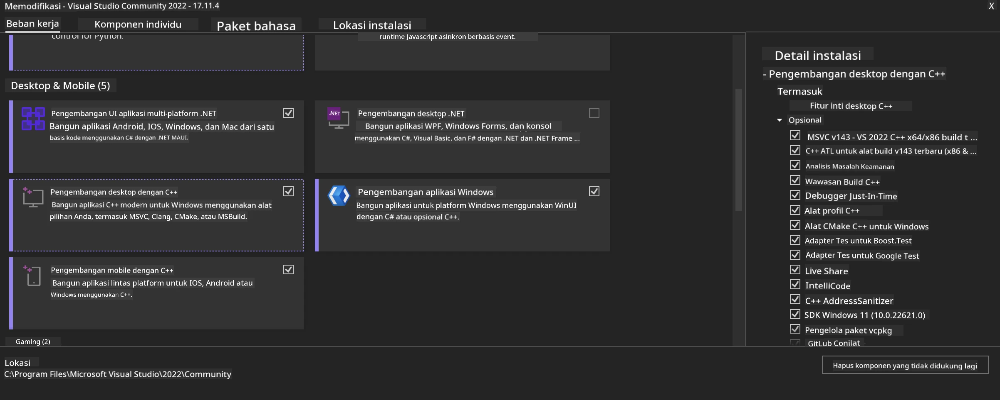
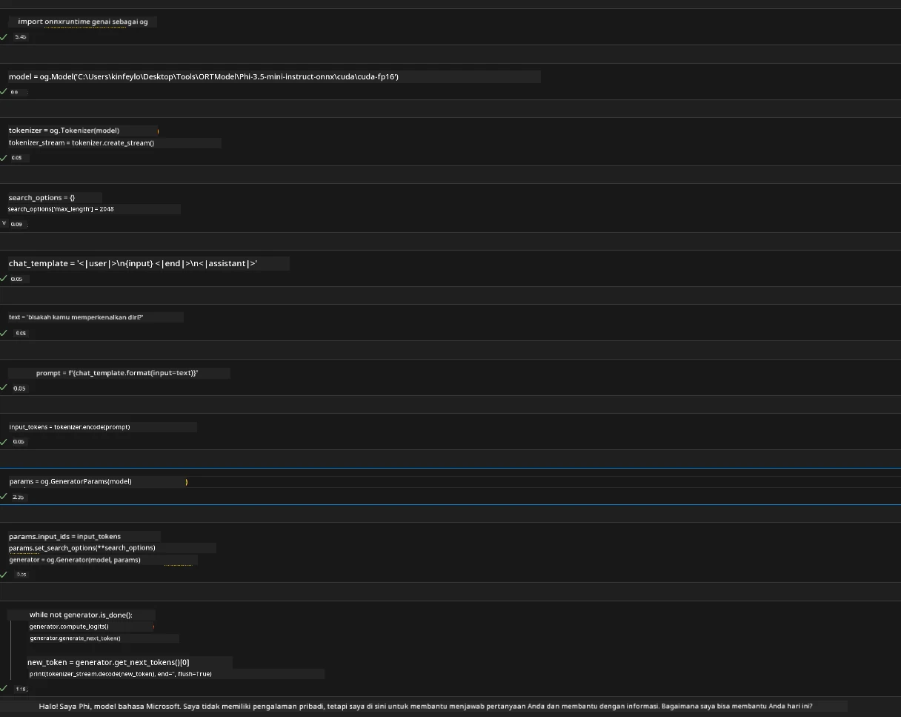
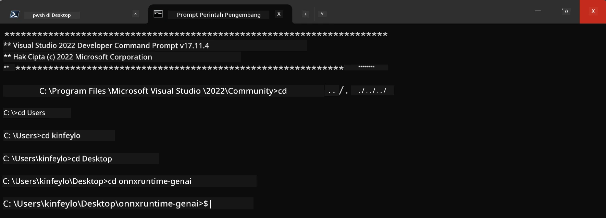

# **Panduan untuk OnnxRuntime GenAI Windows GPU**

Panduan ini memberikan langkah-langkah untuk mengatur dan menggunakan ONNX Runtime (ORT) dengan GPU di Windows. Dirancang untuk membantu Anda memanfaatkan akselerasi GPU untuk model Anda, meningkatkan kinerja dan efisiensi.

Dokumen ini memberikan panduan tentang:

- Pengaturan Lingkungan: Instruksi tentang cara menginstal dependensi yang diperlukan seperti CUDA, cuDNN, dan ONNX Runtime.
- Konfigurasi: Cara mengkonfigurasi lingkungan dan ONNX Runtime untuk memanfaatkan sumber daya GPU secara efektif.
- Tips Optimasi: Saran tentang cara menyetel pengaturan GPU Anda untuk kinerja optimal.

### **1. Python 3.10.x /3.11.8**

   ***Catatan*** Disarankan menggunakan [miniforge](https://github.com/conda-forge/miniforge/releases/latest/download/Miniforge3-Windows-x86_64.exe) sebagai lingkungan Python Anda

   ```bash

   conda create -n pydev python==3.11.8

   conda activate pydev

   ```

   ***Pengingat*** Jika Anda telah menginstal perpustakaan python ONNX, silakan hapus instalasinya

### **2. Instal CMake dengan winget**


   ```bash

   winget install -e --id Kitware.CMake

   ```

### **3. Instal Visual Studio 2022 - Desktop Development dengan C++**

   ***Catatan*** Jika Anda tidak ingin melakukan kompilasi, Anda dapat melewati langkah ini




### **4. Instal Driver NVIDIA**

1. **Driver GPU NVIDIA**  [https://www.nvidia.com/en-us/drivers/](https://www.nvidia.com/en-us/drivers/)

2. **NVIDIA CUDA 12.4** [https://developer.nvidia.com/cuda-12-4-0-download-archive](https://developer.nvidia.com/cuda-12-4-0-download-archive)

3. **NVIDIA CUDNN 9.4**  [https://developer.nvidia.com/cudnn-downloads](https://developer.nvidia.com/cudnn-downloads)

***Pengingat*** Harap gunakan pengaturan default dalam proses instalasi

### **5. Atur Lingkungan NVIDIA**

Salin pustaka NVIDIA CUDNN 9.4 lib, bin, include ke NVIDIA CUDA 12.4 lib, bin, include

- salin file *'C:\Program Files\NVIDIA\CUDNN\v9.4\bin\12.6'* ke *'C:\Program Files\NVIDIA GPU Computing Toolkit\CUDA\v12.4\bin*

- salin file *'C:\Program Files\NVIDIA\CUDNN\v9.4\include\12.6'* ke *'C:\Program Files\NVIDIA GPU Computing Toolkit\CUDA\v12.4\include*

- salin file *'C:\Program Files\NVIDIA\CUDNN\v9.4\lib\12.6'* ke *'C:\Program Files\NVIDIA GPU Computing Toolkit\CUDA\v12.4\lib\x64'*


### **6. Unduh Phi-3.5-mini-instruct-onnx**


   ```bash

   winget install -e --id Git.Git

   winget install -e --id GitHub.GitLFS

   git lfs install

   git clone https://huggingface.co/microsoft/Phi-3.5-mini-instruct-onnx

   ```

### **7. Menjalankan InferencePhi35Instruct.ipynb**

   Buka [Notebook](../../../../code/09.UpdateSamples/Aug/ortgpu-phi35-instruct.ipynb) dan jalankan





### **8. Kompilasi ORT GenAI GPU**


   ***Catatan*** 
   
   1. Harap hapus semua yang berkaitan dengan onnx, onnxruntime, dan onnxruntime-genai terlebih dahulu

   
   ```bash

   pip list 
   
   ```

   Kemudian hapus semua pustaka onnxruntime yaitu


   ```bash

   pip uninstall onnxruntime

   pip uninstall onnxruntime-genai

   pip uninstall onnxruntume-genai-cuda
   
   ```

   2. Periksa dukungan Ekstensi Visual Studio

   Periksa C:\Program Files\NVIDIA GPU Computing Toolkit\CUDA\v12.4\extras untuk memastikan bahwa C:\Program Files\NVIDIA GPU Computing Toolkit\CUDA\v12.4\extras\visual_studio_integration ada.
   
   Jika tidak ditemukan, periksa folder driver toolkit CUDA lainnya dan salin folder visual_studio_integration beserta isinya ke C:\Program Files\NVIDIA GPU Computing Toolkit\CUDA\v12.4\extras\visual_studio_integration


   - Jika Anda tidak ingin melakukan kompilasi, Anda dapat melewati langkah ini


   ```bash

   git clone https://github.com/microsoft/onnxruntime-genai

   ```

   - Unduh [https://github.com/microsoft/onnxruntime/releases/download/v1.19.2/onnxruntime-win-x64-gpu-1.19.2.zip](https://github.com/microsoft/onnxruntime/releases/download/v1.19.2/onnxruntime-win-x64-gpu-1.19.2.zip)

   - Ekstrak onnxruntime-win-x64-gpu-1.19.2.zip , dan ubah namanya menjadi **ort**, salin folder ort ke onnxruntime-genai

   - Menggunakan Windows Terminal, buka Developer Command Prompt for VS 2022 dan navigasi ke onnxruntime-genai



   - Kompilasi dengan lingkungan python Anda

   
   ```bash

   cd onnxruntime-genai

   python build.py --use_cuda  --cuda_home "C:\Program Files\NVIDIA GPU Computing Toolkit\CUDA\v12.4" --config Release
 

   cd build/Windows/Release/Wheel

   pip install .whl

   ```

---

<!-- CO-OP TRANSLATOR DISCLAIMER START -->
**Penafian**:
Dokumen ini telah diterjemahkan menggunakan layanan terjemahan AI [Co-op Translator](https://github.com/Azure/co-op-translator). Meskipun kami berupaya untuk mencapai akurasi, harap diketahui bahwa terjemahan otomatis mungkin mengandung kesalahan atau ketidakakuratan. Dokumen asli dalam bahasa aslinya harus dianggap sebagai sumber yang sah. Untuk informasi penting, disarankan menggunakan terjemahan profesional oleh manusia. Kami tidak bertanggung jawab atas kesalahpahaman atau penafsiran yang keliru yang timbul dari penggunaan terjemahan ini.
<!-- CO-OP TRANSLATOR DISCLAIMER END -->