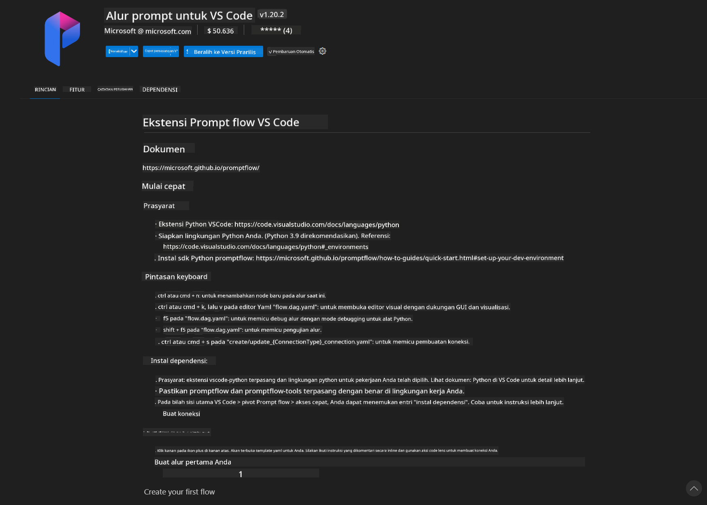
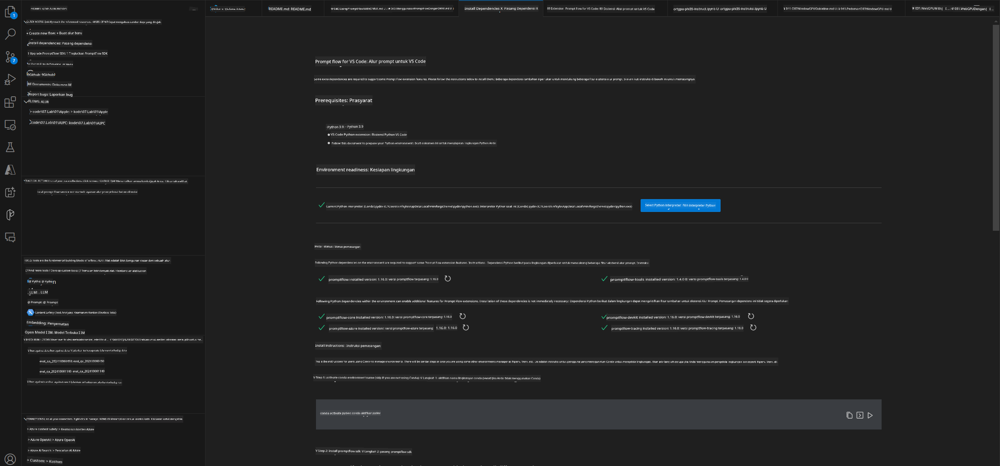
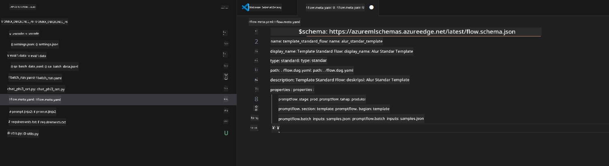
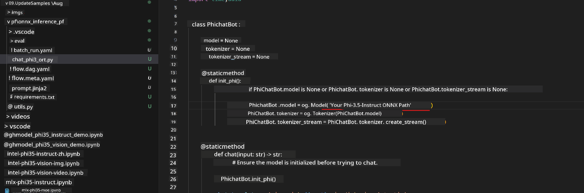
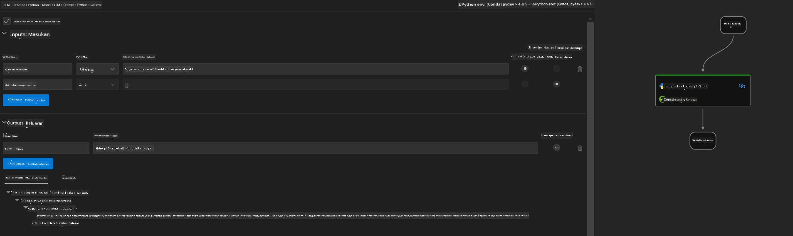
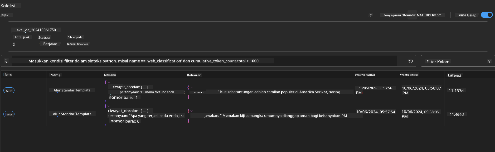

<!--
CO_OP_TRANSLATOR_METADATA:
{
  "original_hash": "92e7dac1e5af0dd7c94170fdaf6860fe",
  "translation_date": "2025-07-17T03:02:15+00:00",
  "source_file": "md/02.Application/01.TextAndChat/Phi3/UsingPromptFlowWithONNX.md",
  "language_code": "id"
}
-->
# Menggunakan Windows GPU untuk membuat solusi Prompt flow dengan Phi-3.5-Instruct ONNX

Dokumen berikut adalah contoh cara menggunakan PromptFlow dengan ONNX (Open Neural Network Exchange) untuk mengembangkan aplikasi AI berbasis model Phi-3.

PromptFlow adalah rangkaian alat pengembangan yang dirancang untuk mempermudah siklus pengembangan end-to-end aplikasi AI berbasis LLM (Large Language Model), mulai dari ideasi dan prototipe hingga pengujian dan evaluasi.

Dengan mengintegrasikan PromptFlow dengan ONNX, pengembang dapat:

- Mengoptimalkan Performa Model: Memanfaatkan ONNX untuk inferensi dan penyebaran model yang efisien.
- Menyederhanakan Pengembangan: Menggunakan PromptFlow untuk mengelola alur kerja dan mengotomatisasi tugas berulang.
- Meningkatkan Kolaborasi: Memfasilitasi kerja sama yang lebih baik antar anggota tim dengan menyediakan lingkungan pengembangan yang terpadu.

**Prompt flow** adalah rangkaian alat pengembangan yang dirancang untuk mempermudah siklus pengembangan end-to-end aplikasi AI berbasis LLM, mulai dari ideasi, prototipe, pengujian, evaluasi hingga penyebaran produksi dan pemantauan. Ini membuat rekayasa prompt jauh lebih mudah dan memungkinkan Anda membangun aplikasi LLM dengan kualitas produksi.

Prompt flow dapat terhubung ke OpenAI, Azure OpenAI Service, dan model yang dapat disesuaikan (Huggingface, LLM/SLM lokal). Kami berharap dapat menyebarkan model ONNX kuantisasi Phi-3.5 ke aplikasi lokal. Prompt flow dapat membantu kami merencanakan bisnis dengan lebih baik dan menyelesaikan solusi lokal berbasis Phi-3.5. Dalam contoh ini, kami akan menggabungkan ONNX Runtime GenAI Library untuk menyelesaikan solusi Prompt flow berbasis Windows GPU.

## **Instalasi**

### **ONNX Runtime GenAI untuk Windows GPU**

Baca panduan ini untuk mengatur ONNX Runtime GenAI untuk Windows GPU [klik di sini](./ORTWindowGPUGuideline.md)

### **Mengatur Prompt flow di VSCode**

1. Instal ekstensi Prompt flow di VS Code



2. Setelah menginstal ekstensi Prompt flow di VS Code, klik ekstensi tersebut, dan pilih **Installation dependencies** ikuti panduan ini untuk menginstal Prompt flow SDK di lingkungan Anda



3. Unduh [Sample Code](../../../../../../code/09.UpdateSamples/Aug/pf/onnx_inference_pf) dan buka contoh ini menggunakan VS Code



4. Buka **flow.dag.yaml** untuk memilih lingkungan Python Anda


   Buka **chat_phi3_ort.py** untuk mengubah lokasi Model Phi-3.5-instruct ONNX Anda



5. Jalankan prompt flow Anda untuk pengujian

Buka **flow.dag.yaml** klik visual editor


setelah klik ini, jalankan untuk menguji



1. Anda dapat menjalankan batch di terminal untuk memeriksa hasil lebih banyak


```bash

pf run create --file batch_run.yaml --stream --name 'Your eval qa name'    

```

Anda dapat memeriksa hasil di browser default Anda




**Penafian**:  
Dokumen ini telah diterjemahkan menggunakan layanan terjemahan AI [Co-op Translator](https://github.com/Azure/co-op-translator). Meskipun kami berupaya untuk mencapai akurasi, harap diingat bahwa terjemahan otomatis mungkin mengandung kesalahan atau ketidakakuratan. Dokumen asli dalam bahasa aslinya harus dianggap sebagai sumber yang sahih. Untuk informasi penting, disarankan menggunakan terjemahan profesional oleh manusia. Kami tidak bertanggung jawab atas kesalahpahaman atau penafsiran yang keliru yang timbul dari penggunaan terjemahan ini.