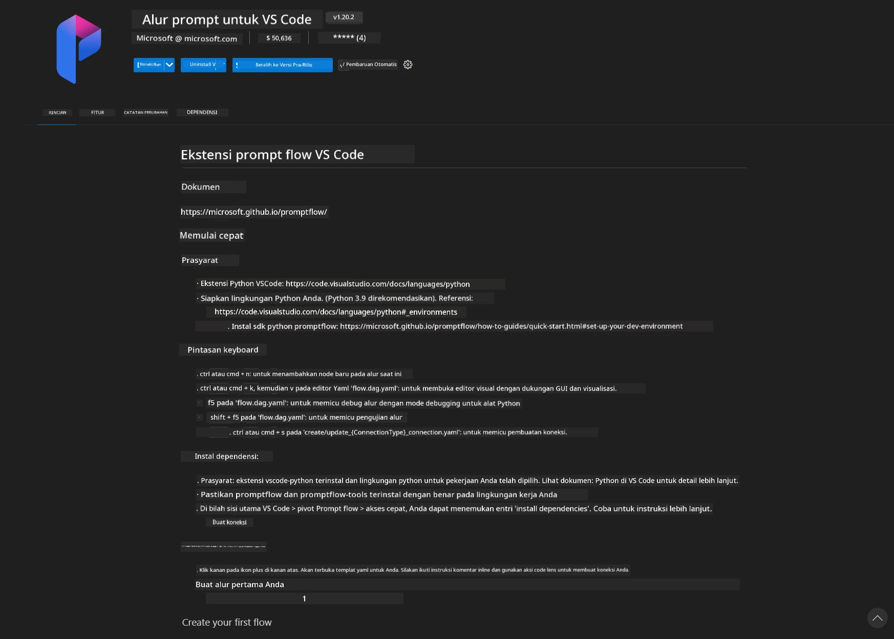
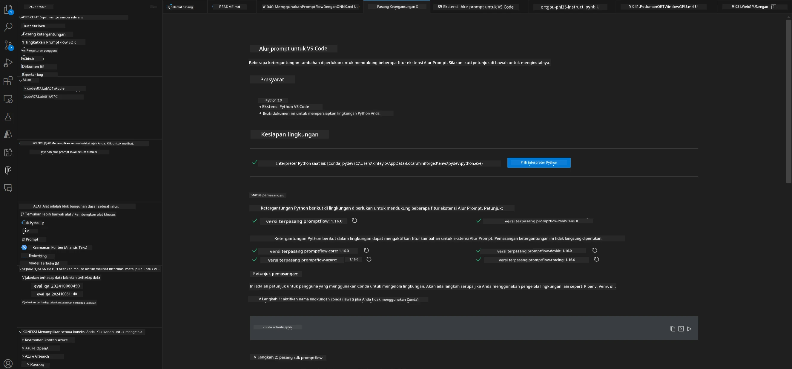
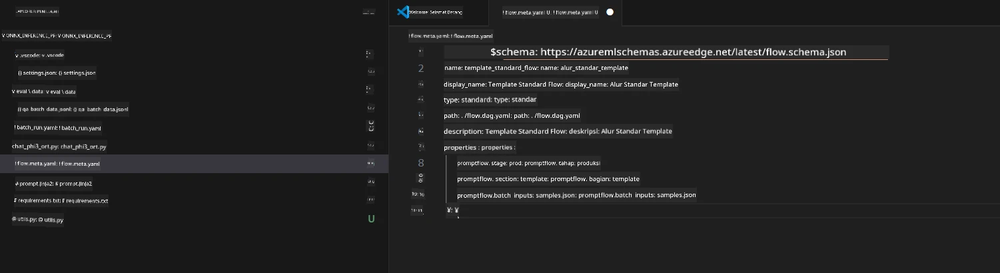
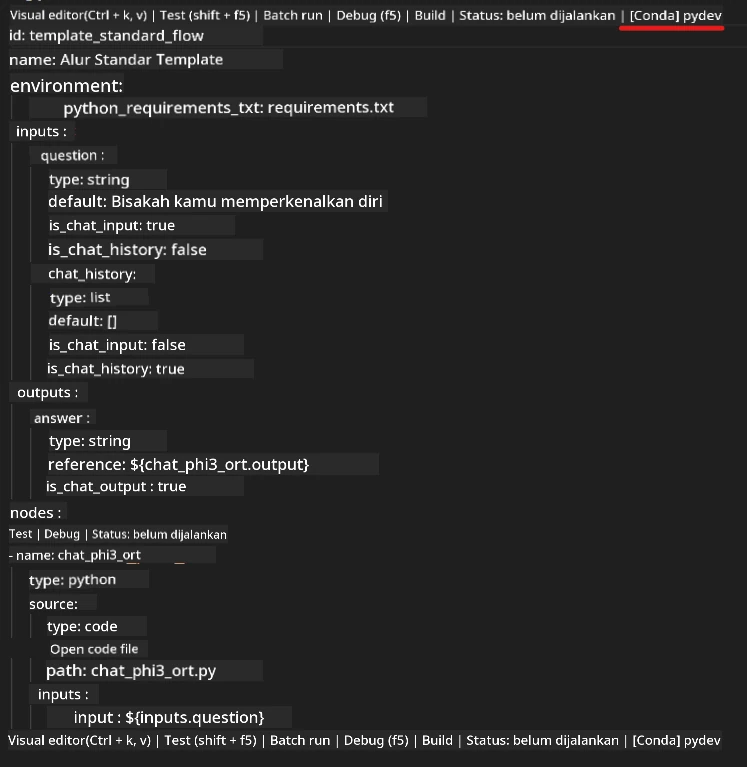
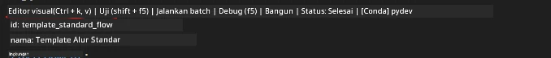
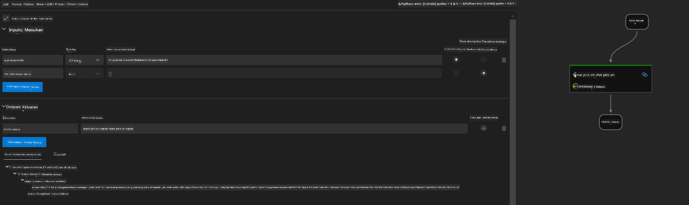
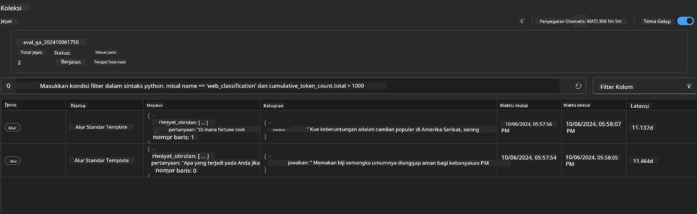

# Menggunakan GPU Windows untuk membuat solusi Prompt flow dengan Phi-3.5-Instruct ONNX 

Dokumen berikut adalah contoh cara menggunakan PromptFlow dengan ONNX (Open Neural Network Exchange) untuk mengembangkan aplikasi AI berbasis model Phi-3.

PromptFlow adalah rangkaian alat pengembangan yang dirancang untuk menyederhanakan siklus pengembangan aplikasi AI berbasis LLM (Large Language Model) secara menyeluruh, mulai dari ideasi dan prototyping hingga pengujian dan evaluasi.

Dengan mengintegrasikan PromptFlow dengan ONNX, pengembang dapat:

- Mengoptimalkan Kinerja Model: Memanfaatkan ONNX untuk inferensi dan penerapan model yang efisien.
- Menyederhanakan Pengembangan: Menggunakan PromptFlow untuk mengelola alur kerja dan mengotomatiskan tugas berulang.
- Meningkatkan Kolaborasi: Memfasilitasi kolaborasi yang lebih baik antar anggota tim dengan menyediakan lingkungan pengembangan yang terpadu.

**Prompt flow** adalah rangkaian alat pengembangan yang dirancang untuk menyederhanakan siklus pengembangan aplikasi AI berbasis LLM secara menyeluruh, mulai dari ideasi, prototyping, pengujian, evaluasi hingga penerapan dan pemantauan produksi. Ini membuat rekayasa prompt jauh lebih mudah dan memungkinkan Anda membangun aplikasi LLM dengan kualitas produksi.

Prompt flow dapat terhubung ke OpenAI, Azure OpenAI Service, dan model yang dapat dikustomisasi (Huggingface, LLM/SLM lokal). Kami berharap dapat menerapkan model Phi-3.5 ONNX yang terkuantisasi pada aplikasi lokal. Prompt flow dapat membantu kami merencanakan bisnis dengan lebih baik dan menyelesaikan solusi lokal berbasis Phi-3.5. Dalam contoh ini, kami akan menggabungkan ONNX Runtime GenAI Library untuk menyelesaikan solusi Prompt flow berbasis GPU Windows.

## **Instalasi**

### **ONNX Runtime GenAI untuk GPU Windows**

Baca panduan ini untuk mengatur ONNX Runtime GenAI untuk GPU Windows [klik di sini](./ORTWindowGPUGuideline.md)

### **Menyiapkan Prompt flow di VSCode**

1. Instal Ekstensi Prompt flow VS Code



2. Setelah memasang Ekstensi Prompt flow VS Code, klik ekstensi tersebut, dan pilih **Installation dependencies** ikuti panduan ini untuk memasang Prompt flow SDK di lingkungan Anda



3. Unduh [Kode Contoh](../../../../../../code/09.UpdateSamples/Aug/pf/onnx_inference_pf) dan gunakan VS Code untuk membuka contoh ini



4. Buka **flow.dag.yaml** untuk memilih env Python Anda



   Buka **chat_phi3_ort.py** untuk mengganti lokasi Model Phi-3.5-instruct ONNX Anda


5. Jalankan prompt flow Anda untuk pengujian

Buka **flow.dag.yaml** klik visual editor



setelah mengklik ini, jalankan untuk pengujian



1. Anda dapat menjalankan batch di terminal untuk memeriksa lebih banyak hasil


```bash

pf run create --file batch_run.yaml --stream --name 'Your eval qa name'    

```

Anda dapat memeriksa hasil di browser default Anda




---

<!-- CO-OP TRANSLATOR DISCLAIMER START -->
**Penafian**:
Dokumen ini telah diterjemahkan menggunakan layanan terjemahan AI [Co-op Translator](https://github.com/Azure/co-op-translator). Meskipun kami berupaya untuk mencapai akurasi, harap diketahui bahwa terjemahan otomatis mungkin mengandung kesalahan atau ketidakakuratan. Dokumen asli dalam bahasa aslinya harus dianggap sebagai sumber yang sah. Untuk informasi penting, disarankan menggunakan terjemahan profesional oleh manusia. Kami tidak bertanggung jawab atas kesalahpahaman atau penafsiran yang keliru yang timbul dari penggunaan terjemahan ini.
<!-- CO-OP TRANSLATOR DISCLAIMER END -->