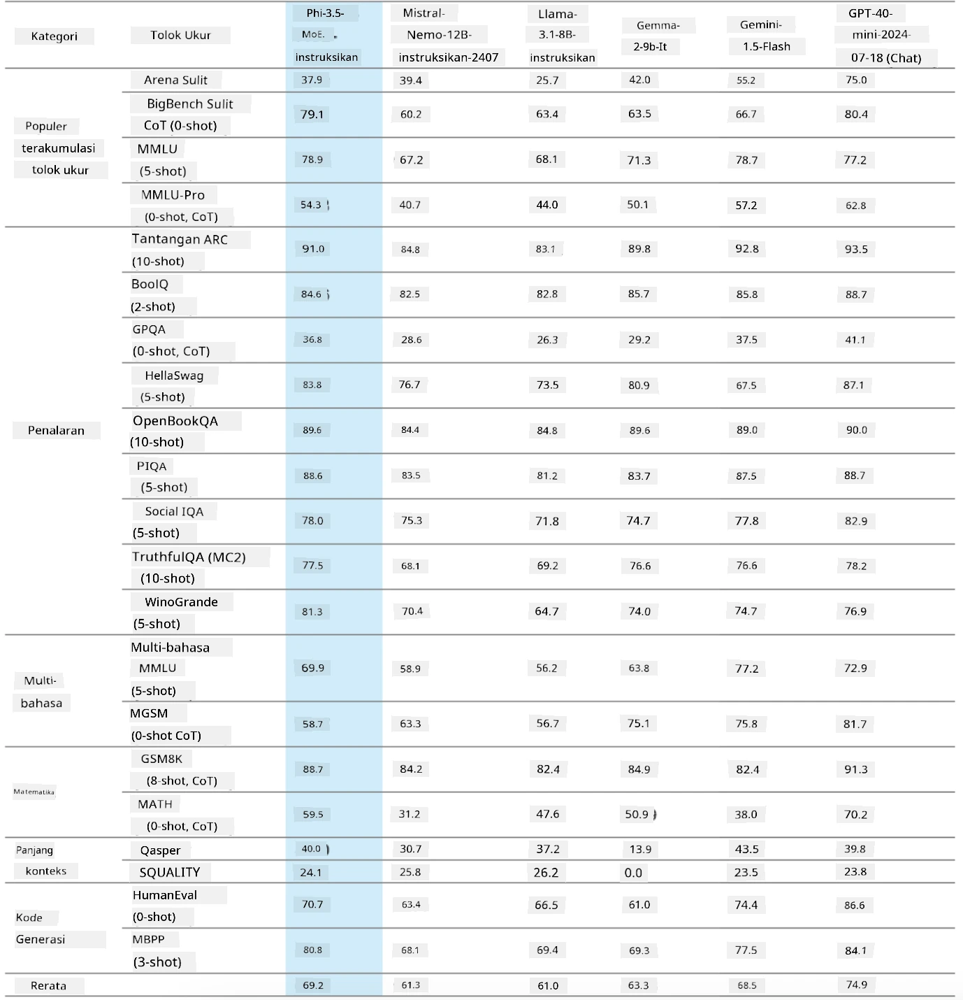
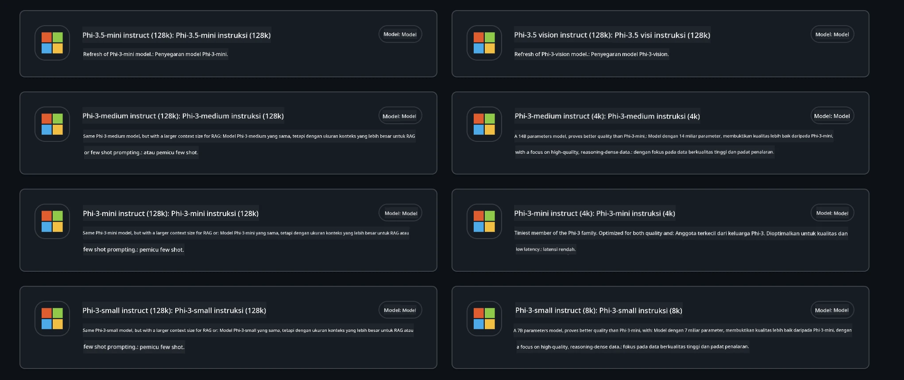
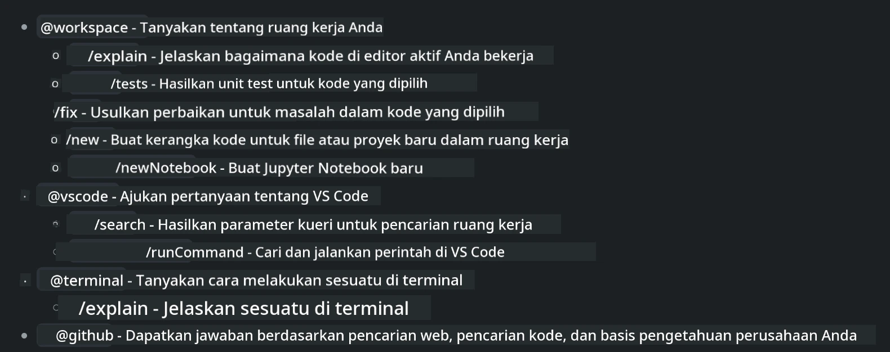
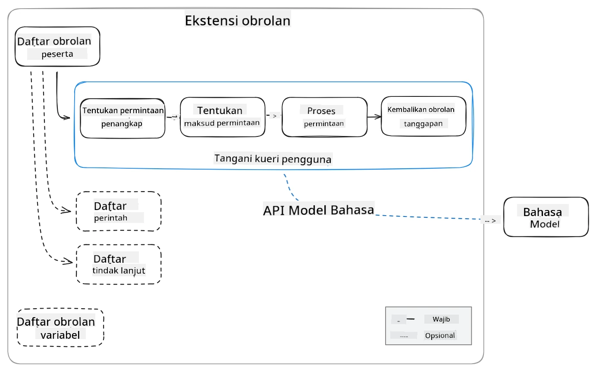
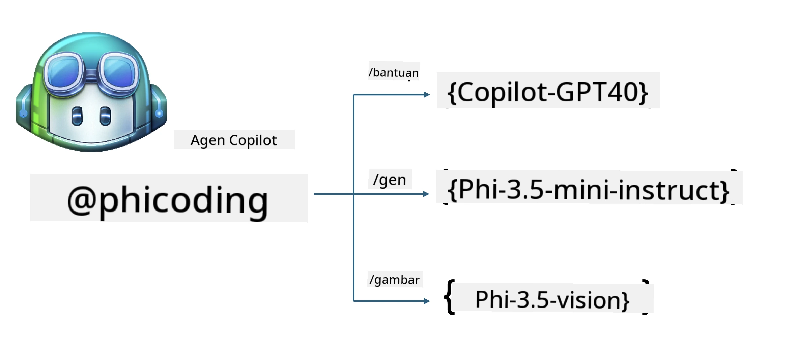
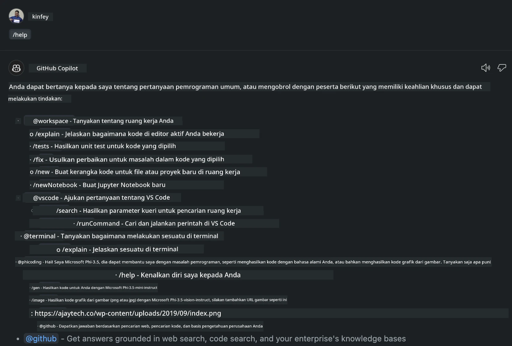
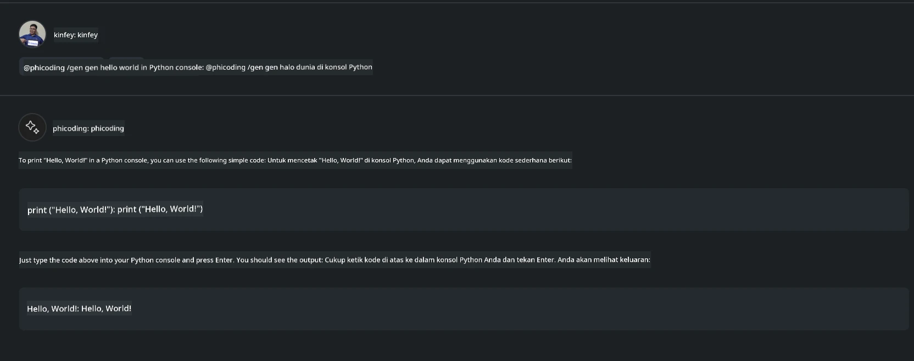
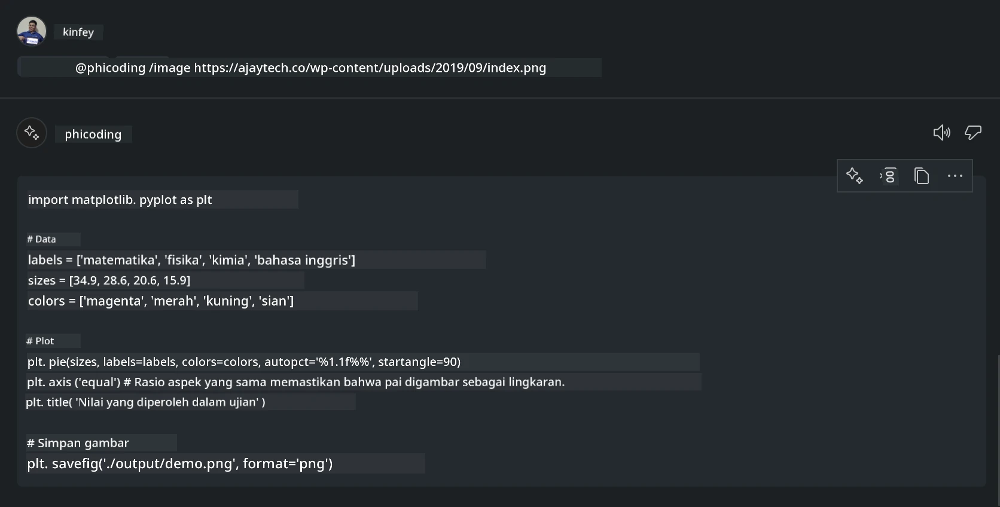

# **Buat Agen Visual Studio Code Chat Copilot Anda Sendiri dengan Phi-3.5 dari GitHub Models**

Apakah Anda menggunakan Visual Studio Code Copilot? Terutama di Chat, Anda bisa menggunakan berbagai agen untuk meningkatkan kemampuan dalam membuat, menulis, dan memelihara proyek di Visual Studio Code. Visual Studio Code menyediakan API yang memungkinkan perusahaan dan individu membuat agen berbeda berdasarkan bisnis mereka untuk memperluas kemampuan di berbagai bidang kepemilikan. Dalam artikel ini, kita akan fokus pada **Phi-3.5-mini-instruct (128k)** dan **Phi-3.5-vision-instruct (128k)** dari GitHub Models untuk membuat Agen Visual Studio Code Anda sendiri.

## **Tentang Phi-3.5 di GitHub Models**

Kita tahu bahwa Phi-3/3.5-mini-instruct dalam keluarga Phi-3/3.5 memiliki kemampuan pemahaman dan pembuatan kode yang kuat, dan memiliki keunggulan dibandingkan Gemma-2-9b dan Mistral-Nemo-12B-instruct-2407.



GitHub Models terbaru sudah menyediakan akses ke model Phi-3.5-mini-instruct (128k) dan Phi-3.5-vision-instruct (128k). Pengembang dapat mengaksesnya melalui OpenAI SDK, Azure AI Inference SDK, dan REST API.



***Note:*** Disarankan menggunakan Azure AI Inference SDK di sini, karena dapat lebih mudah beralih dengan Azure Model Catalog di lingkungan produksi

Berikut adalah hasil dari **Phi-3.5-mini-instruct (128k)** dan **Phi-3.5-vision-instruct (128k)** dalam skenario pembuatan kode setelah terhubung dengan GitHub Models, serta persiapan untuk contoh-contoh berikut

**Demo: GitHub Models Phi-3.5-mini-instruct (128k) menghasilkan kode dari Prompt** ([klik tautan ini](../../../../../../code/09.UpdateSamples/Aug/ghmodel_phi35_instruct_demo.ipynb))

**Demo: GitHub Models Phi-3.5-vision-instruct (128k) menghasilkan kode dari Gambar** ([klik tautan ini](../../../../../../code/09.UpdateSamples/Aug/ghmodel_phi35_vision_demo.ipynb))


## **Tentang GitHub Copilot Chat Agent**

GitHub Copilot Chat Agent dapat menyelesaikan berbagai tugas dalam berbagai skenario proyek berdasarkan kode. Sistem ini memiliki empat agen: workspace, github, terminal, vscode



Dengan menambahkan nama agen dengan ‘@’, Anda dapat dengan cepat menyelesaikan pekerjaan yang sesuai. Untuk perusahaan, jika Anda menambahkan konten terkait bisnis Anda seperti kebutuhan, pengkodean, spesifikasi pengujian, dan rilis, Anda bisa memiliki fungsi privat perusahaan yang lebih kuat berdasarkan GitHub Copilot.

Visual Studio Code Chat Agent kini secara resmi merilis API-nya, memungkinkan perusahaan atau pengembang perusahaan mengembangkan agen berdasarkan ekosistem bisnis perangkat lunak yang berbeda. Berdasarkan metode pengembangan Visual Studio Code Extension Development, Anda dapat dengan mudah mengakses antarmuka API Visual Studio Code Chat Agent. Kita dapat mengembangkan berdasarkan proses ini



Skenario pengembangan dapat mendukung akses ke API model pihak ketiga (seperti GitHub Models, Azure Model Catalog, dan layanan mandiri berbasis model open source) dan juga dapat menggunakan model gpt-35-turbo, gpt-4, dan gpt-4o yang disediakan oleh GitHub Copilot.

## **Tambahkan Agen @phicoding berbasis Phi-3.5**

Kami mencoba mengintegrasikan kemampuan pemrograman Phi-3.5 untuk menyelesaikan penulisan kode, pembuatan kode gambar, dan tugas lainnya. Membuat Agen yang dibangun di sekitar Phi-3.5 - @PHI, berikut beberapa fungsinya

1. Menghasilkan perkenalan diri berdasarkan GPT-4o yang disediakan oleh GitHub Copilot melalui perintah **@phicoding /help**

2. Menghasilkan kode untuk berbagai bahasa pemrograman berdasarkan **Phi-3.5-mini-instruct (128k)** melalui perintah **@phicoding /gen**

3. Menghasilkan kode berdasarkan **Phi-3.5-vision-instruct (128k)** dan penyelesaian gambar melalui perintah **@phicoding /image**



## **Langkah terkait**

1. Instal dukungan pengembangan Visual Studio Code Extension menggunakan npm

```bash

npm install --global yo generator-code 

```
2. Buat plugin Visual Studio Code Extension (menggunakan mode pengembangan Typescript, bernama phiext)

```bash

yo code 

```

3. Buka proyek yang dibuat dan modifikasi package.json. Berikut adalah instruksi dan konfigurasi terkait, serta konfigurasi GitHub Models. Perlu diperhatikan Anda harus menambahkan token GitHub Models Anda di sini.

```json

{
  "name": "phiext",
  "displayName": "phiext",
  "description": "",
  "version": "0.0.1",
  "engines": {
    "vscode": "^1.93.0"
  },
  "categories": [
    "AI",
    "Chat"
  ],
  "activationEvents": [],
  "enabledApiProposals": [
      "chatVariableResolver"
  ],
  "main": "./dist/extension.js",
  "contributes": {
    "chatParticipants": [
        {
            "id": "chat.phicoding",
            "name": "phicoding",
            "description": "Hey! I am Microsoft Phi-3.5, She can help me with coding problems, such as generation code with your natural language, or even generation code about chart from images. Just ask me anything!",
            "isSticky": true,
            "commands": [
                {
                    "name": "help",
                    "description": "Introduce myself to you"
                },
                {
                    "name": "gen",
                    "description": "Generate code for you with Microsoft Phi-3.5-mini-instruct"
                },
                {
                    "name": "image",
                    "description": "Generate code for chart from image(png or jpg) with Microsoft Phi-3.5-vision-instruct, please add image url like this : https://ajaytech.co/wp-content/uploads/2019/09/index.png"
                }
            ]
        }
    ],
    "commands": [
        {
            "command": "phicoding.namesInEditor",
            "title": "Use Microsoft Phi 3.5 in Editor"
        }
    ],
    "configuration": {
      "type": "object",
      "title": "githubmodels",
      "properties": {
        "githubmodels.endpoint": {
          "type": "string",
          "default": "https://models.inference.ai.azure.com",
          "description": "Your GitHub Models Endpoint",
          "order": 0
        },
        "githubmodels.api_key": {
          "type": "string",
          "default": "Your GitHub Models Token",
          "description": "Your GitHub Models Token",
          "order": 1
        },
        "githubmodels.phi35instruct": {
          "type": "string",
          "default": "Phi-3.5-mini-instruct",
          "description": "Your Phi-35-Instruct Model",
          "order": 2
        },
        "githubmodels.phi35vision": {
          "type": "string",
          "default": "Phi-3.5-vision-instruct",
          "description": "Your Phi-35-Vision Model",
          "order": 3
        }
      }
    }
  },
  "scripts": {
    "vscode:prepublish": "npm run package",
    "compile": "webpack",
    "watch": "webpack --watch",
    "package": "webpack --mode production --devtool hidden-source-map",
    "compile-tests": "tsc -p . --outDir out",
    "watch-tests": "tsc -p . -w --outDir out",
    "pretest": "npm run compile-tests && npm run compile && npm run lint",
    "lint": "eslint src",
    "test": "vscode-test"
  },
  "devDependencies": {
    "@types/vscode": "^1.93.0",
    "@types/mocha": "^10.0.7",
    "@types/node": "20.x",
    "@typescript-eslint/eslint-plugin": "^8.3.0",
    "@typescript-eslint/parser": "^8.3.0",
    "eslint": "^9.9.1",
    "typescript": "^5.5.4",
    "ts-loader": "^9.5.1",
    "webpack": "^5.94.0",
    "webpack-cli": "^5.1.4",
    "@vscode/test-cli": "^0.0.10",
    "@vscode/test-electron": "^2.4.1"
  },
  "dependencies": {
    "@types/node-fetch": "^2.6.11",
    "node-fetch": "^3.3.2",
    "@azure-rest/ai-inference": "latest",
    "@azure/core-auth": "latest",
    "@azure/core-sse": "latest"
  }
}


```

4. Modifikasi src/extension.ts

```typescript

// The module 'vscode' contains the VS Code extensibility API
// Import the module and reference it with the alias vscode in your code below
import * as vscode from 'vscode';
import ModelClient from "@azure-rest/ai-inference";
import { AzureKeyCredential } from "@azure/core-auth";


interface IPhiChatResult extends vscode.ChatResult {
    metadata: {
        command: string;
    };
}


const MODEL_SELECTOR: vscode.LanguageModelChatSelector = { vendor: 'copilot', family: 'gpt-4o' };

function isValidImageUrl(url: string): boolean {
    const regex = /^(https?:\/\/.*\.(?:png|jpg))$/i;
    return regex.test(url);
}
  

// This method is called when your extension is activated
// Your extension is activated the very first time the command is executed
export function activate(context: vscode.ExtensionContext) {

    const codinghandler: vscode.ChatRequestHandler = async (request: vscode.ChatRequest, context: vscode.ChatContext, stream: vscode.ChatResponseStream, token: vscode.CancellationToken): Promise<IPhiChatResult> => {


        const config : any = vscode.workspace.getConfiguration('githubmodels');
        const endPoint: string = config.get('endpoint');
        const apiKey: string = config.get('api_key');
        const phi35instruct: string = config.get('phi35instruct');
        const phi35vision: string = config.get('phi35vision');
        
        if (request.command === 'help') {

            const content = "Welcome to Coding assistant with Microsoft Phi-3.5"; 
            stream.progress(content);


            try {
                const [model] = await vscode.lm.selectChatModels(MODEL_SELECTOR);
                if (model) {
                    const messages = [
                        vscode.LanguageModelChatMessage.User("Please help me express this content in a humorous way: I am a programming assistant who can help you convert natural language into code and generate code based on the charts in the images. output format like this : Hey I am Phi ......")
                    ];
                    const chatResponse = await model.sendRequest(messages, {}, token);
                    for await (const fragment of chatResponse.text) {
                        stream.markdown(fragment);
                    }
                }
            } catch(err) {
                console.log(err);
            }


            return { metadata: { command: 'help' } };

        }

        
        if (request.command === 'gen') {

            const content = "Welcome to use phi-3.5 to generate code";

            stream.progress(content);

            const client = new ModelClient(endPoint, new AzureKeyCredential(apiKey));

            const response = await client.path("/chat/completions").post({
              body: {
                messages: [
                  { role:"system", content: "You are a coding assistant.Help answer all code generation questions." },
                  { role:"user", content: request.prompt }
                ],
                model: phi35instruct,
                temperature: 0.4,
                max_tokens: 1000,
                top_p: 1.
              }
            });

            stream.markdown(response.body.choices[0].message.content);

            return { metadata: { command: 'gen' } };

        }


        
        if (request.command === 'image') {


            const content = "Welcome to use phi-3.5 to generate code from image(png or jpg),image url like this:https://ajaytech.co/wp-content/uploads/2019/09/index.png";

            stream.progress(content);

            if (!isValidImageUrl(request.prompt)) {
                stream.markdown('Please provide a valid image URL');
                return { metadata: { command: 'image' } };
            }
            else
            {

                const client = new ModelClient(endPoint, new AzureKeyCredential(apiKey));
    
                const response = await client.path("/chat/completions").post({
                    body: {
                      messages: [
                        { role: "system", content: "You are a helpful assistant that describes images in details." },
                        { role: "user", content: [
                            { type: "text", text: "Please generate code according to the chart in the picture according to the following requirements\n1. Keep all information in the chart, including data and text\n2. Do not generate additional information that is not included in the chart\n3. Please extract data from the picture, do not generate it from csv\n4. Please save the regenerated chart as a chart and save it to ./output/demo.png"},
                            { type: "image_url", image_url: {url: request.prompt}
                            }
                          ]
                        }
                      ],
                      model: phi35vision,
                      temperature: 0.4,
                      max_tokens: 2048,
                      top_p: 1.
                    }
                  });
    
                
                stream.markdown(response.body.choices[0].message.content);
    
                return { metadata: { command: 'image' } };
            }


        }


        return { metadata: { command: '' } };
    };


    const phi_ext = vscode.chat.createChatParticipant("chat.phicoding", codinghandler);

    phi_ext.iconPath = new vscode.ThemeIcon('sparkle');


    phi_ext.followupProvider = {
        provideFollowups(result: IPhiChatResult, context: vscode.ChatContext, token: vscode.CancellationToken) {
            return [{
                prompt: 'Let us coding with Phi-3.5 😋😋😋😋',
                label: vscode.l10n.t('Enjoy coding with Phi-3.5'),
                command: 'help'
            } satisfies vscode.ChatFollowup];
        }
    };

    context.subscriptions.push(phi_ext);
}

// This method is called when your extension is deactivated
export function deactivate() {}


```

6. Menjalankan

***/help***



***@phicoding /help***


***@phicoding /gen***



***@phicoding /image***



Anda dapat mengunduh kode contoh :[klik](../../../../../../code/09.UpdateSamples/Aug/vscode)

## **Sumber Daya**

1. Daftar GitHub Models [https://gh.io/models](https://gh.io/models)

2. Pelajari Visual Studio Code Extension Development [https://code.visualstudio.com/api/get-started/your-first-extension](https://code.visualstudio.com/api/get-started/your-first-extension)

3. Pelajari tentang Visual Studio Code Coilot Chat API [https://code.visualstudio.com/api/extension-guides/chat](https://code.visualstudio.com/api/extension-guides/chat)

**Penafian**:  
Dokumen ini telah diterjemahkan menggunakan layanan terjemahan AI [Co-op Translator](https://github.com/Azure/co-op-translator). Meskipun kami berupaya untuk akurasi, harap diketahui bahwa terjemahan otomatis mungkin mengandung kesalahan atau ketidakakuratan. Dokumen asli dalam bahasa aslinya harus dianggap sebagai sumber yang sah. Untuk informasi penting, disarankan menggunakan terjemahan profesional oleh manusia. Kami tidak bertanggung jawab atas kesalahpahaman atau penafsiran yang salah yang timbul dari penggunaan terjemahan ini.