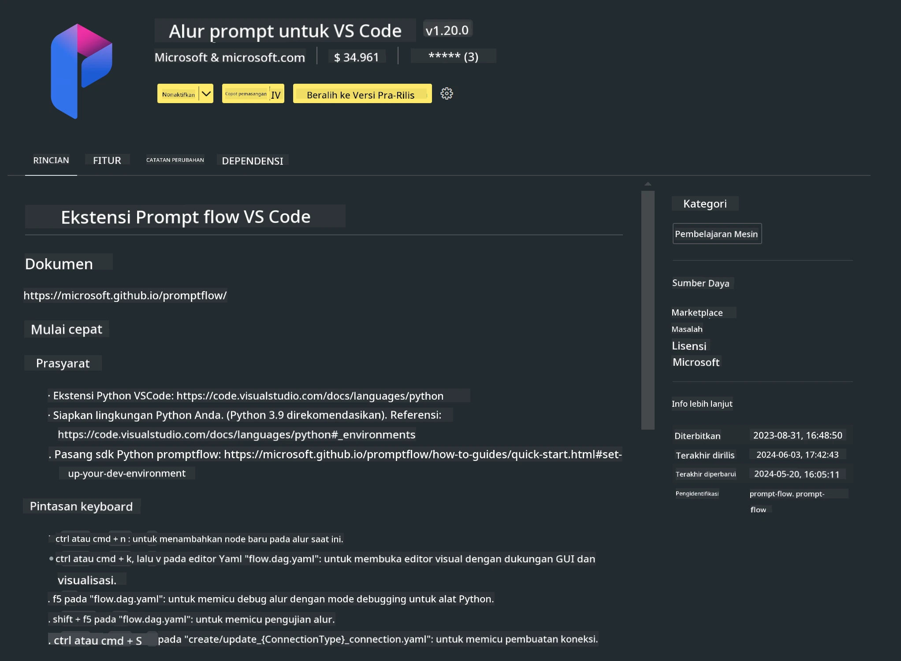

# **Lab 0 - Instalasi**

Saat memasuki Lab, kita perlu mengonfigurasi lingkungan yang relevan:


### **1. Python 3.11+**

Disarankan menggunakan miniforge untuk mengonfigurasi lingkungan Python Anda

Untuk mengonfigurasi miniforge, silakan lihat [https://github.com/conda-forge/miniforge](https://github.com/conda-forge/miniforge)

Setelah mengonfigurasi miniforge, jalankan perintah berikut di Power Shell

```bash

conda create -n pyenv python==3.11.8 -y

conda activate pyenv

```


### **2. Instal Prompt flow SDK**

Di Lab 1, kita menggunakan Prompt flow, jadi Anda perlu mengonfigurasi Prompt flow SDK.

```bash

pip install promptflow --upgrade

```

Anda dapat memeriksa promptflow sdk dengan perintah ini


```bash

pf --version

```

### **3. Instal Ekstensi Prompt flow di Visual Studio Code**




### **4. Intel NPU Acceleration Library**

Prosesor generasi baru Intel mendukung NPU. Jika Anda ingin menggunakan NPU untuk menjalankan LLMs / SLMs secara lokal, Anda dapat menggunakan ***Intel NPU Acceleration Library***. Jika ingin tahu lebih lanjut, Anda bisa membaca [https://github.com/microsoft/PhiCookBook/blob/main/md/01.Introduction/03/AIPC_Inference.md](https://github.com/microsoft/PhiCookBook/blob/main/md/01.Introduction/03/AIPC_Inference.md).

Instal Intel NPU Acceleration Library di bash


```bash

pip install intel-npu-acceleration-library

```

***Note***: Harap diperhatikan bahwa library ini mendukung transformers ***4.40.2***, pastikan versinya


### **5. Library Python Lainnya**


buat file requirements.txt dan tambahkan isi berikut

```txt

notebook
numpy 
scipy 
scikit-learn 
matplotlib 
pandas 
pillow 
graphviz

```


### **6. Instal NVM**

instal nvm di Powershell


```bash

winget install -e --id CoreyButler.NVMforWindows

```

instal nodejs 18.20


```bash

nvm install 18.20.0

nvm use 18.20.0

```

### **7. Instal Dukungan Pengembangan Visual Studio Code**


```bash

npm install --global yo generator-code

```

Selamat! Anda telah berhasil mengonfigurasi SDK. Selanjutnya, lanjutkan ke langkah-langkah praktik.

**Penafian**:  
Dokumen ini telah diterjemahkan menggunakan layanan terjemahan AI [Co-op Translator](https://github.com/Azure/co-op-translator). Meskipun kami berupaya untuk mencapai akurasi, harap diingat bahwa terjemahan otomatis mungkin mengandung kesalahan atau ketidakakuratan. Dokumen asli dalam bahasa aslinya harus dianggap sebagai sumber yang sahih. Untuk informasi penting, disarankan menggunakan terjemahan profesional oleh manusia. Kami tidak bertanggung jawab atas kesalahpahaman atau penafsiran yang keliru yang timbul dari penggunaan terjemahan ini.