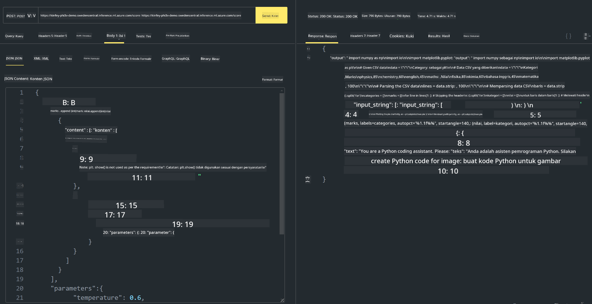

<!--
CO_OP_TRANSLATOR_METADATA:
{
  "original_hash": "20cb4e6ac1686248e8be913ccf6c2bc2",
  "translation_date": "2025-07-17T04:34:52+00:00",
  "source_file": "md/02.Application/02.Code/Phi3/VSCodeExt/HOL/Apple/03.DeployPhi3VisionOnAzure.md",
  "language_code": "id"
}
-->
# **Lab 3 - Deploy Phi-3-vision di Azure Machine Learning Service**

Kita menggunakan NPU untuk menyelesaikan deployment produksi dari kode lokal, kemudian kita ingin memperkenalkan kemampuan untuk menghadirkan PHI-3-VISION melalui layanan ini agar dapat mengubah gambar menjadi kode.

Dalam pengenalan ini, kita dapat dengan cepat membangun Model As Service Phi-3 Vision di Azure Machine Learning Service.

***Note***： Phi-3 Vision membutuhkan daya komputasi untuk menghasilkan konten dengan kecepatan lebih tinggi. Kita memerlukan daya komputasi cloud untuk membantu mencapai hal ini.


### **1. Buat Azure Machine Learning Service**

Kita perlu membuat Azure Machine Learning Service di Azure Portal. Jika ingin belajar caranya, silakan kunjungi tautan ini [https://learn.microsoft.com/azure/machine-learning/quickstart-create-resources?view=azureml-api-2](https://learn.microsoft.com/azure/machine-learning/quickstart-create-resources?view=azureml-api-2)


### **2. Pilih Phi-3 Vision di Azure Machine Learning Service**


### **3. Deploy Phi-3-Vision di Azure**


### **4. Uji Endpoint di Postman**





***Note***

1. Parameter yang dikirim harus mencakup Authorization, azureml-model-deployment, dan Content-Type. Kamu perlu memeriksa informasi deployment untuk mendapatkannya.

2. Untuk mengirim parameter, Phi-3-Vision perlu mengirimkan tautan gambar. Silakan merujuk pada metode GPT-4-Vision untuk mengirim parameter, seperti

```json

{
  "input_data":{
    "input_string":[
      {
        "role":"user",
        "content":[ 
          {
            "type": "text",
            "text": "You are a Python coding assistant.Please create Python code for image "
          },
          {
              "type": "image_url",
              "image_url": {
                "url": "https://ajaytech.co/wp-content/uploads/2019/09/index.png"
              }
          }
        ]
      }
    ],
    "parameters":{
          "temperature": 0.6,
          "top_p": 0.9,
          "do_sample": false,
          "max_new_tokens": 2048
    }
  }
}

```

3. Panggil **/score** menggunakan metode Post

**Selamat**! Kamu telah menyelesaikan deployment cepat PHI-3-VISION dan mencoba cara menggunakan gambar untuk menghasilkan kode. Selanjutnya, kita bisa membangun aplikasi dengan menggabungkan NPU dan cloud.

**Penafian**:  
Dokumen ini telah diterjemahkan menggunakan layanan terjemahan AI [Co-op Translator](https://github.com/Azure/co-op-translator). Meskipun kami berupaya untuk mencapai akurasi, harap diperhatikan bahwa terjemahan otomatis mungkin mengandung kesalahan atau ketidakakuratan. Dokumen asli dalam bahasa aslinya harus dianggap sebagai sumber yang sahih. Untuk informasi penting, disarankan menggunakan terjemahan profesional oleh manusia. Kami tidak bertanggung jawab atas kesalahpahaman atau penafsiran yang keliru yang timbul dari penggunaan terjemahan ini.