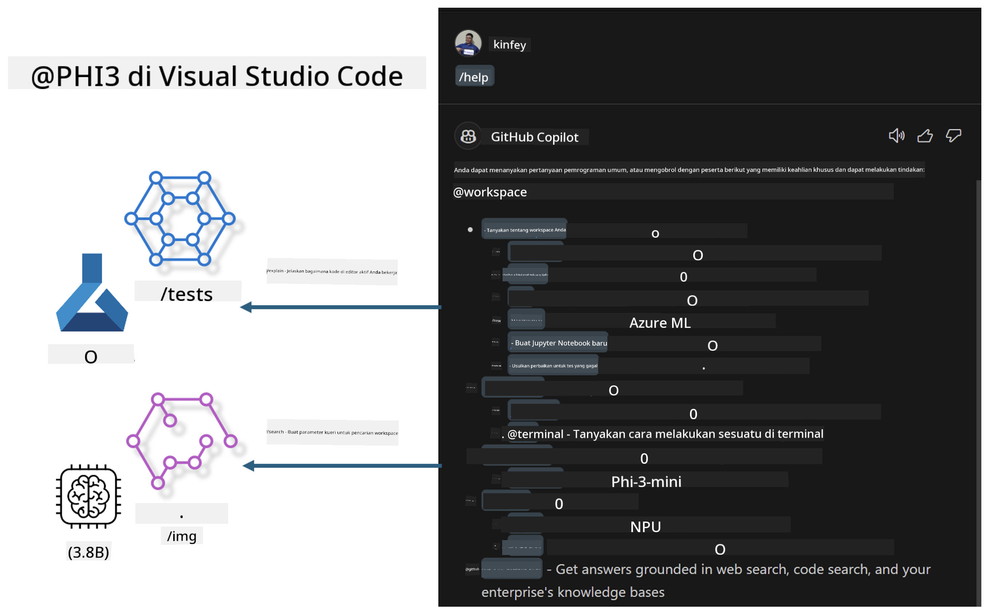

<!--
CO_OP_TRANSLATOR_METADATA:
{
  "original_hash": "00b7a699de8ac405fa821f4c0f7fc0ab",
  "translation_date": "2025-05-09T19:15:31+00:00",
  "source_file": "md/02.Application/02.Code/Phi3/VSCodeExt/README.md",
  "language_code": "id"
}
-->
# **Bangun Visual Studio Code GitHub Copilot Chat Anda Sendiri dengan Microsoft Phi-3 Family**

Apakah Anda pernah menggunakan workspace agent di GitHub Copilot Chat? Apakah Anda ingin membuat agen kode untuk tim Anda sendiri? Lab praktis ini bertujuan menggabungkan model open source untuk membangun agen bisnis kode tingkat perusahaan.

## **Dasar**

### **Mengapa memilih Microsoft Phi-3**

Phi-3 adalah seri keluarga, termasuk phi-3-mini, phi-3-small, dan phi-3-medium yang didasarkan pada parameter pelatihan berbeda untuk generasi teks, penyelesaian dialog, dan pembuatan kode. Ada juga phi-3-vision yang berbasis Vision. Ini cocok untuk perusahaan atau tim berbeda untuk membuat solusi AI generatif offline.

Disarankan untuk membaca tautan ini [https://github.com/microsoft/PhiCookBook/blob/main/md/01.Introduction/01/01.PhiFamily.md](https://github.com/microsoft/PhiCookBook/blob/main/md/01.Introduction/01/01.PhiFamily.md)

### **Microsoft GitHub Copilot Chat**

Ekstensi GitHub Copilot Chat memberikan antarmuka chat yang memungkinkan Anda berinteraksi dengan GitHub Copilot dan menerima jawaban atas pertanyaan terkait pemrograman langsung di dalam VS Code, tanpa harus membuka dokumentasi atau mencari di forum online.

Copilot Chat mungkin menggunakan penyorotan sintaks, indentasi, dan fitur format lain untuk memperjelas respons yang dihasilkan. Bergantung pada jenis pertanyaan dari pengguna, hasilnya dapat berisi tautan ke konteks yang digunakan Copilot untuk membuat jawaban, seperti file kode sumber atau dokumentasi, atau tombol untuk mengakses fungsi VS Code.

- Copilot Chat terintegrasi dalam alur kerja pengembang Anda dan memberikan bantuan di mana Anda membutuhkannya:

- Mulai percakapan chat inline langsung dari editor atau terminal untuk bantuan saat Anda sedang coding

- Gunakan tampilan Chat untuk memiliki asisten AI di samping yang siap membantu kapan saja

- Jalankan Quick Chat untuk mengajukan pertanyaan singkat dan kembali ke pekerjaan Anda

Anda dapat menggunakan GitHub Copilot Chat dalam berbagai skenario, seperti:

- Menjawab pertanyaan pemrograman tentang cara terbaik menyelesaikan masalah

- Menjelaskan kode orang lain dan menyarankan perbaikan

- Mengusulkan perbaikan kode

- Menghasilkan kasus uji unit

- Menghasilkan dokumentasi kode

Disarankan untuk membaca tautan ini [https://code.visualstudio.com/docs/copilot/copilot-chat](https://code.visualstudio.com/docs/copilot/copilot-chat?WT.mc_id=aiml-137032-kinfeylo)

###  **Microsoft GitHub Copilot Chat @workspace**

Mengacu pada **@workspace** di Copilot Chat memungkinkan Anda mengajukan pertanyaan tentang seluruh basis kode Anda. Berdasarkan pertanyaan tersebut, Copilot dengan cerdas mengambil file dan simbol yang relevan, yang kemudian dirujuk dalam jawabannya sebagai tautan dan contoh kode.

Untuk menjawab pertanyaan Anda, **@workspace** mencari melalui sumber yang sama yang digunakan pengembang saat menavigasi basis kode di VS Code:

- Semua file di workspace, kecuali file yang diabaikan oleh file .gitignore

- Struktur direktori dengan folder dan nama file bersarang

- Indeks pencarian kode GitHub, jika workspace adalah repositori GitHub dan diindeks oleh pencarian kode

- Simbol dan definisi di workspace

- Teks yang dipilih saat ini atau teks yang terlihat di editor aktif

Catatan: .gitignore dilewati jika Anda membuka file atau memilih teks dalam file yang diabaikan.

Disarankan untuk membaca tautan ini [[https://code.visualstudio.com/docs/copilot/copilot-chat](https://code.visualstudio.com/docs/copilot/workspace-context?WT.mc_id=aiml-137032-kinfeylo)]

## **Pelajari lebih lanjut tentang Lab ini**

GitHub Copilot telah sangat meningkatkan efisiensi pemrograman perusahaan, dan setiap perusahaan berharap dapat menyesuaikan fungsi terkait GitHub Copilot. Banyak perusahaan telah menyesuaikan Extensions serupa GitHub Copilot berdasarkan skenario bisnis dan model open source mereka sendiri. Untuk perusahaan, Extensions yang disesuaikan lebih mudah dikendalikan, tetapi ini juga memengaruhi pengalaman pengguna. Bagaimanapun, GitHub Copilot memiliki fungsi yang lebih kuat dalam menangani skenario umum dan profesionalisme. Jika pengalaman dapat tetap konsisten, akan lebih baik untuk menyesuaikan Extension perusahaan sendiri. GitHub Copilot Chat menyediakan API terkait bagi perusahaan untuk memperluas pengalaman Chat. Mempertahankan pengalaman yang konsisten dan memiliki fungsi yang disesuaikan adalah pengalaman pengguna yang lebih baik.

Lab ini terutama menggunakan model Phi-3 yang digabungkan dengan NPU lokal dan hybrid Azure untuk membangun Agent kustom di GitHub Copilot Chat ***@PHI3*** untuk membantu pengembang perusahaan menyelesaikan pembuatan kode***(@PHI3 /gen)*** dan menghasilkan kode berdasarkan gambar ***(@PHI3 /img)***.

### ***Catatan:*** 

Lab ini saat ini diimplementasikan di AIPC Intel CPU dan Apple Silicon. Kami akan terus memperbarui versi Qualcomm dari NPU.

## **Lab**

| Nama | Deskripsi | AIPC | Apple |
| ------------ | ----------- | -------- |-------- |
| Lab0 - Installations(✅) | Konfigurasi dan instalasi lingkungan terkait dan alat instalasi | [Go](./HOL/AIPC/01.Installations.md) |[Go](./HOL/Apple/01.Installations.md) |
| Lab1 - Run Prompt flow with Phi-3-mini (✅) | Digabungkan dengan AIPC / Apple Silicon, menggunakan NPU lokal untuk membuat pembuatan kode melalui Phi-3-mini | [Go](./HOL/AIPC/02.PromptflowWithNPU.md) |  [Go](./HOL/Apple/02.PromptflowWithMLX.md) |
| Lab2 - Deploy Phi-3-vision on Azure Machine Learning Service(✅) | Menghasilkan kode dengan menerapkan Model Catalog Azure Machine Learning Service - gambar Phi-3-vision | [Go](./HOL/AIPC/03.DeployPhi3VisionOnAzure.md) |[Go](./HOL/Apple/03.DeployPhi3VisionOnAzure.md) |
| Lab3 - Create a @phi-3 agent in GitHub Copilot Chat(✅)  | Membuat agen Phi-3 kustom di GitHub Copilot Chat untuk menyelesaikan pembuatan kode, pembuatan kode grafik, RAG, dll. | [Go](./HOL/AIPC/04.CreatePhi3AgentInVSCode.md) | [Go](./HOL/Apple/04.CreatePhi3AgentInVSCode.md) |
| Sample Code (✅)  | Unduh kode contoh | [Go](../../../../../../../code/07.Lab/01/AIPC) | [Go](../../../../../../../code/07.Lab/01/Apple) |

## **Sumber Daya**

1. Phi-3 Cookbook [https://github.com/microsoft/Phi-3CookBook](https://github.com/microsoft/Phi-3CookBook)

2. Pelajari lebih lanjut tentang GitHub Copilot [https://learn.microsoft.com/training/paths/copilot/](https://learn.microsoft.com/training/paths/copilot/?WT.mc_id=aiml-137032-kinfeylo)

3. Pelajari lebih lanjut tentang GitHub Copilot Chat [https://learn.microsoft.com/training/paths/accelerate-app-development-using-github-copilot/](https://learn.microsoft.com/training/paths/accelerate-app-development-using-github-copilot/?WT.mc_id=aiml-137032-kinfeylo)

4. Pelajari lebih lanjut tentang GitHub Copilot Chat API [https://code.visualstudio.com/api/extension-guides/chat](https://code.visualstudio.com/api/extension-guides/chat?WT.mc_id=aiml-137032-kinfeylo)

5. Pelajari lebih lanjut tentang Azure AI Foundry [https://learn.microsoft.com/training/paths/create-custom-copilots-ai-studio/](https://learn.microsoft.com/training/paths/create-custom-copilots-ai-studio/?WT.mc_id=aiml-137032-kinfeylo)

6. Pelajari lebih lanjut tentang Model Catalog Azure AI Foundry [https://learn.microsoft.com/azure/ai-studio/how-to/model-catalog-overview](https://learn.microsoft.com/azure/ai-studio/how-to/model-catalog-overview)

**Penafian**:  
Dokumen ini telah diterjemahkan menggunakan layanan terjemahan AI [Co-op Translator](https://github.com/Azure/co-op-translator). Meskipun kami berusaha untuk akurasi, harap diingat bahwa terjemahan otomatis mungkin mengandung kesalahan atau ketidakakuratan. Dokumen asli dalam bahasa aslinya harus dianggap sebagai sumber yang sahih. Untuk informasi penting, disarankan menggunakan terjemahan profesional oleh manusia. Kami tidak bertanggung jawab atas kesalahpahaman atau salah tafsir yang timbul dari penggunaan terjemahan ini.