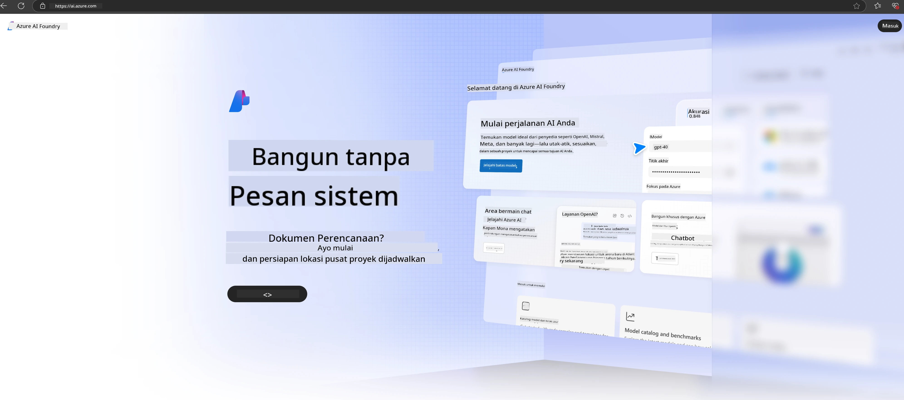

# **Menggunakan Phi-3 di Microsoft Foundry**

Dengan perkembangan Generative AI, kami berharap dapat menggunakan platform terpadu untuk mengelola berbagai LLM dan SLM, integrasi data perusahaan, operasi fine-tuning/RAG, serta evaluasi berbagai bisnis perusahaan setelah mengintegrasikan LLM dan SLM, dan lain-lain, sehingga aplikasi generative AI dapat diimplementasikan dengan lebih cerdas. [Microsoft Foundry](https://ai.azure.com) adalah platform aplikasi generative AI tingkat perusahaan.

Dengan Microsoft Foundry, Anda dapat mengevaluasi respons model bahasa besar (LLM) dan mengorkestrasi komponen aplikasi prompt dengan prompt flow untuk kinerja yang lebih baik. Platform ini memudahkan skalabilitas untuk mengubah proof of concept menjadi produksi penuh dengan mudah. Pemantauan dan penyempurnaan berkelanjutan mendukung kesuksesan jangka panjang.

Kita dapat dengan cepat menerapkan model Phi-3 di Microsoft Foundry melalui langkah-langkah sederhana, lalu menggunakan Microsoft Foundry untuk menyelesaikan Playground/Chat, Fine-tuning, evaluasi, dan pekerjaan terkait Phi-3 lainnya.

## **1. Persiapan**

Jika Anda sudah menginstal [Azure Developer CLI](https://learn.microsoft.com/azure/developer/azure-developer-cli/overview?WT.mc_id=aiml-138114-kinfeylo) di mesin Anda, menggunakan template ini semudah menjalankan perintah ini di direktori baru.

## Pembuatan Manual

Membuat proyek dan hub Microsoft Foundry adalah cara yang bagus untuk mengatur dan mengelola pekerjaan AI Anda. Berikut panduan langkah demi langkah untuk memulai:

### Membuat Proyek di Microsoft Foundry

1. **Buka Microsoft Foundry**: Masuk ke portal Microsoft Foundry.
2. **Buat Proyek**:
   - Jika Anda sedang berada di dalam proyek, pilih "Microsoft Foundry" di kiri atas halaman untuk kembali ke halaman Beranda.
   - Pilih "+ Create project".
   - Masukkan nama untuk proyek tersebut.
   - Jika Anda memiliki hub, hub tersebut akan dipilih secara default. Jika Anda memiliki akses ke lebih dari satu hub, Anda dapat memilih hub lain dari dropdown. Jika ingin membuat hub baru, pilih "Create new hub" dan berikan nama.
   - Pilih "Create".

### Membuat Hub di Microsoft Foundry

1. **Buka Microsoft Foundry**: Masuk dengan akun Azure Anda.
2. **Buat Hub**:
   - Pilih Management center dari menu kiri.
   - Pilih "All resources", lalu panah bawah di samping "+ New project" dan pilih "+ New hub".
   - Di dialog "Create a new hub", masukkan nama untuk hub Anda (misalnya, contoso-hub) dan sesuaikan bidang lain sesuai keinginan.
   - Pilih "Next", tinjau informasi, lalu pilih "Create".

Untuk instruksi lebih rinci, Anda dapat merujuk ke dokumentasi resmi [Microsoft](https://learn.microsoft.com/azure/ai-studio/how-to/create-projects).

Setelah berhasil dibuat, Anda dapat mengakses studio yang Anda buat melalui [ai.azure.com](https://ai.azure.com/)

Satu AI Foundry dapat memiliki beberapa proyek. Buat proyek di AI Foundry sebagai persiapan.

Buat Microsoft Foundry [QuickStarts](https://learn.microsoft.com/azure/ai-studio/quickstarts/get-started-code)

## **2. Menerapkan model Phi di Microsoft Foundry**

Klik opsi Explore pada proyek untuk masuk ke Model Catalog dan pilih Phi-3

Pilih Phi-3-mini-4k-instruct

Klik 'Deploy' untuk menerapkan model Phi-3-mini-4k-instruct

> [!NOTE]
>
> Anda dapat memilih daya komputasi saat menerapkan

## **3. Playground Chat Phi di Microsoft Foundry**

Buka halaman deployment, pilih Playground, dan ajak Phi-3 dari Microsoft Foundry mengobrol

## **4. Menerapkan Model dari Microsoft Foundry**

Untuk menerapkan model dari Azure Model Catalog, Anda dapat mengikuti langkah-langkah berikut:

- Masuk ke Microsoft Foundry.
- Pilih model yang ingin Anda terapkan dari katalog model Microsoft Foundry.
- Pada halaman Detail model, pilih Deploy lalu pilih Serverless API dengan Azure AI Content Safety.
- Pilih proyek tempat Anda ingin menerapkan model. Untuk menggunakan penawaran Serverless API, workspace Anda harus berada di wilayah East US 2 atau Sweden Central. Anda dapat menyesuaikan nama Deployment.
- Pada wizard deployment, pilih Pricing and terms untuk mempelajari harga dan ketentuan penggunaan.
- Pilih Deploy. Tunggu hingga deployment siap dan Anda diarahkan ke halaman Deployments.
- Pilih Open in playground untuk mulai berinteraksi dengan model.
- Anda dapat kembali ke halaman Deployments, pilih deployment, dan catat Target URL endpoint serta Secret Key, yang dapat Anda gunakan untuk memanggil deployment dan menghasilkan completions.
- Anda selalu dapat menemukan detail endpoint, URL, dan kunci akses dengan membuka tab Build dan memilih Deployments dari bagian Components.

> [!NOTE]
> Harap diperhatikan bahwa akun Anda harus memiliki izin peran Azure AI Developer pada Resource Group untuk melakukan langkah-langkah ini.

## **5. Menggunakan Phi API di Microsoft Foundry**

Anda dapat mengakses https://{Your project name}.region.inference.ml.azure.com/swagger.json melalui Postman GET dan menggabungkannya dengan Key untuk mempelajari antarmuka yang disediakan

Anda dapat dengan mudah mendapatkan parameter permintaan, serta parameter respons.

**Penafian**:  
Dokumen ini telah diterjemahkan menggunakan layanan terjemahan AI [Co-op Translator](https://github.com/Azure/co-op-translator). Meskipun kami berupaya untuk mencapai akurasi, harap diperhatikan bahwa terjemahan otomatis mungkin mengandung kesalahan atau ketidakakuratan. Dokumen asli dalam bahasa aslinya harus dianggap sebagai sumber yang sahih. Untuk informasi penting, disarankan menggunakan terjemahan profesional oleh manusia. Kami tidak bertanggung jawab atas kesalahpahaman atau penafsiran yang keliru yang timbul dari penggunaan terjemahan ini.