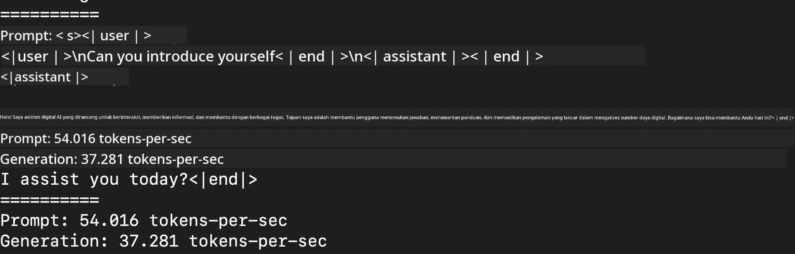
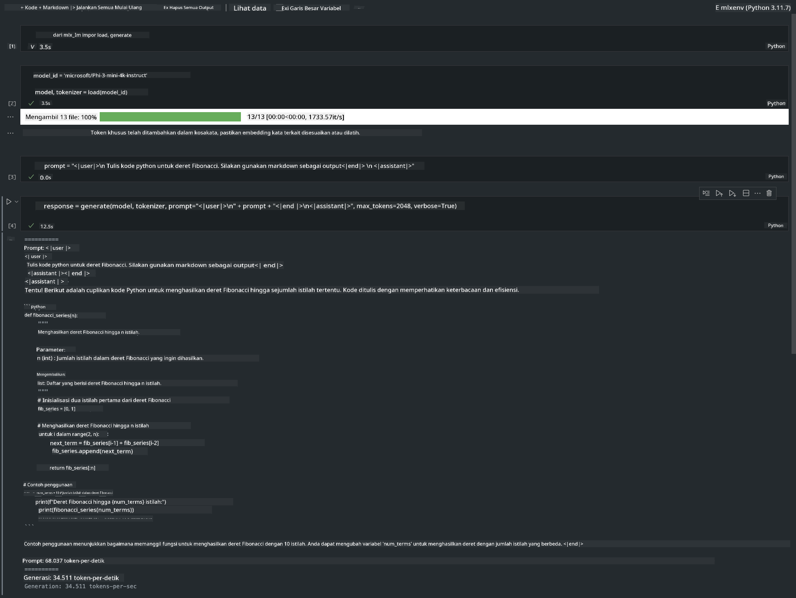

<!--
CO_OP_TRANSLATOR_METADATA:
{
  "original_hash": "dcb656f3d206fc4968e236deec5d4384",
  "translation_date": "2025-05-09T22:32:47+00:00",
  "source_file": "md/03.FineTuning/03.Inference/MLX_Inference.md",
  "language_code": "id"
}
-->
# **Inference Phi-3 dengan Apple MLX Framework**

## **Apa itu MLX Framework**

MLX adalah framework array untuk riset machine learning di Apple silicon, dibawa oleh tim riset machine learning Apple.

MLX dirancang oleh peneliti machine learning untuk peneliti machine learning. Framework ini dibuat agar mudah digunakan, tapi tetap efisien untuk melatih dan menjalankan model. Desain framework ini juga secara konsep sederhana. Kami ingin memudahkan peneliti untuk mengembangkan dan meningkatkan MLX dengan tujuan mengeksplorasi ide-ide baru dengan cepat.

LLM dapat dipercepat di perangkat Apple Silicon melalui MLX, dan model bisa dijalankan secara lokal dengan sangat praktis.

## **Menggunakan MLX untuk inference Phi-3-mini**

### **1. Siapkan lingkungan MLX kamu**

1. Python 3.11.x  
2. Install MLX Library


```bash

pip install mlx-lm

```

### **2. Menjalankan Phi-3-mini di Terminal dengan MLX**


```bash

python -m mlx_lm.generate --model microsoft/Phi-3-mini-4k-instruct --max-token 2048 --prompt  "<|user|>\nCan you introduce yourself<|end|>\n<|assistant|>"

```

Hasilnya (lingkungan saya Apple M1 Max, 64GB) adalah


### **3. Quantizing Phi-3-mini dengan MLX di Terminal**


```bash

python -m mlx_lm.convert --hf-path microsoft/Phi-3-mini-4k-instruct

```

***Note：*** Model bisa diquantize lewat mlx_lm.convert, dan quantisasi default adalah INT4. Contoh ini meng-quantize Phi-3-mini ke INT4

Model bisa diquantize lewat mlx_lm.convert, dan quantisasi default adalah INT4. Contoh ini untuk meng-quantize Phi-3-mini menjadi INT4. Setelah quantisasi, model akan disimpan di direktori default ./mlx_model

Kita bisa menguji model yang sudah diquantize dengan MLX lewat terminal


```bash

python -m mlx_lm.generate --model ./mlx_model/ --max-token 2048 --prompt  "<|user|>\nCan you introduce yourself<|end|>\n<|assistant|>"

```

Hasilnya adalah




### **4. Menjalankan Phi-3-mini dengan MLX di Jupyter Notebook**




***Note:*** Silakan baca contoh ini [klik tautan ini](../../../../../code/03.Inference/MLX/MLX_DEMO.ipynb)


## **Sumber Daya**

1. Pelajari tentang Apple MLX Framework [https://ml-explore.github.io](https://ml-explore.github.io/mlx/build/html/index.html)

2. Repo Apple MLX di GitHub [https://github.com/ml-explore](https://github.com/ml-explore)

**Penafian**:  
Dokumen ini telah diterjemahkan menggunakan layanan terjemahan AI [Co-op Translator](https://github.com/Azure/co-op-translator). Meskipun kami berusaha untuk akurasi, harap diingat bahwa terjemahan otomatis mungkin mengandung kesalahan atau ketidakakuratan. Dokumen asli dalam bahasa aslinya harus dianggap sebagai sumber yang otoritatif. Untuk informasi penting, disarankan menggunakan terjemahan manusia profesional. Kami tidak bertanggung jawab atas kesalahpahaman atau salah tafsir yang timbul dari penggunaan terjemahan ini.