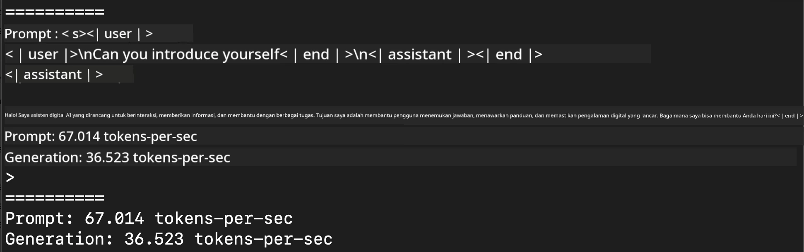
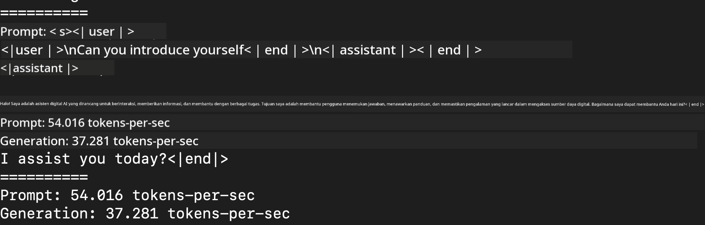
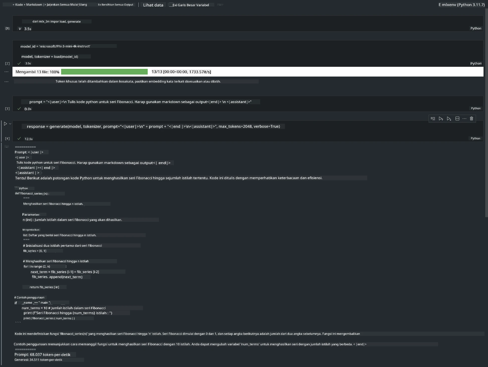

<!--
CO_OP_TRANSLATOR_METADATA:
{
  "original_hash": "dcb656f3d206fc4968e236deec5d4384",
  "translation_date": "2025-07-17T10:08:10+00:00",
  "source_file": "md/03.FineTuning/03.Inference/MLX_Inference.md",
  "language_code": "id"
}
-->
# **Inferensi Phi-3 dengan Apple MLX Framework**

## **Apa itu MLX Framework**

MLX adalah framework array untuk riset machine learning di Apple silicon, dikembangkan oleh tim riset machine learning Apple.

MLX dirancang oleh peneliti machine learning untuk peneliti machine learning. Framework ini dibuat agar mudah digunakan, namun tetap efisien untuk melatih dan menjalankan model. Desain framework ini juga secara konsep sederhana. Kami bertujuan agar peneliti dapat dengan mudah mengembangkan dan meningkatkan MLX untuk mempercepat eksplorasi ide-ide baru.

LLM dapat dipercepat di perangkat Apple Silicon melalui MLX, dan model dapat dijalankan secara lokal dengan sangat mudah.

## **Menggunakan MLX untuk inferensi Phi-3-mini**

### **1. Siapkan lingkungan MLX Anda**

1. Python 3.11.x  
2. Instal Library MLX


```bash

pip install mlx-lm

```

### **2. Menjalankan Phi-3-mini di Terminal dengan MLX**


```bash

python -m mlx_lm.generate --model microsoft/Phi-3-mini-4k-instruct --max-token 2048 --prompt  "<|user|>\nCan you introduce yourself<|end|>\n<|assistant|>"

```

Hasilnya (lingkungan saya menggunakan Apple M1 Max, 64GB) adalah



### **3. Mengkuantisasi Phi-3-mini dengan MLX di Terminal**


```bash

python -m mlx_lm.convert --hf-path microsoft/Phi-3-mini-4k-instruct

```

***Note：*** Model dapat dikuantisasi melalui mlx_lm.convert, dan kuantisasi default adalah INT4. Contoh ini mengkuantisasi Phi-3-mini ke INT4.

Model dapat dikuantisasi melalui mlx_lm.convert, dan kuantisasi default adalah INT4. Contoh ini mengkuantisasi Phi-3-mini menjadi INT4. Setelah dikuantisasi, model akan disimpan di direktori default ./mlx_model

Kita dapat menguji model yang sudah dikuantisasi dengan MLX dari terminal


```bash

python -m mlx_lm.generate --model ./mlx_model/ --max-token 2048 --prompt  "<|user|>\nCan you introduce yourself<|end|>\n<|assistant|>"

```

Hasilnya adalah




### **4. Menjalankan Phi-3-mini dengan MLX di Jupyter Notebook**




***Note:*** Silakan baca contoh ini [klik tautan ini](../../../../../code/03.Inference/MLX/MLX_DEMO.ipynb)


## **Sumber Daya**

1. Pelajari tentang Apple MLX Framework [https://ml-explore.github.io](https://ml-explore.github.io/mlx/build/html/index.html)

2. Repositori Apple MLX di GitHub [https://github.com/ml-explore](https://github.com/ml-explore)

**Penafian**:  
Dokumen ini telah diterjemahkan menggunakan layanan terjemahan AI [Co-op Translator](https://github.com/Azure/co-op-translator). Meskipun kami berupaya untuk akurasi, harap diketahui bahwa terjemahan otomatis mungkin mengandung kesalahan atau ketidakakuratan. Dokumen asli dalam bahasa aslinya harus dianggap sebagai sumber yang sahih. Untuk informasi penting, disarankan menggunakan terjemahan profesional oleh manusia. Kami tidak bertanggung jawab atas kesalahpahaman atau penafsiran yang keliru yang timbul dari penggunaan terjemahan ini.