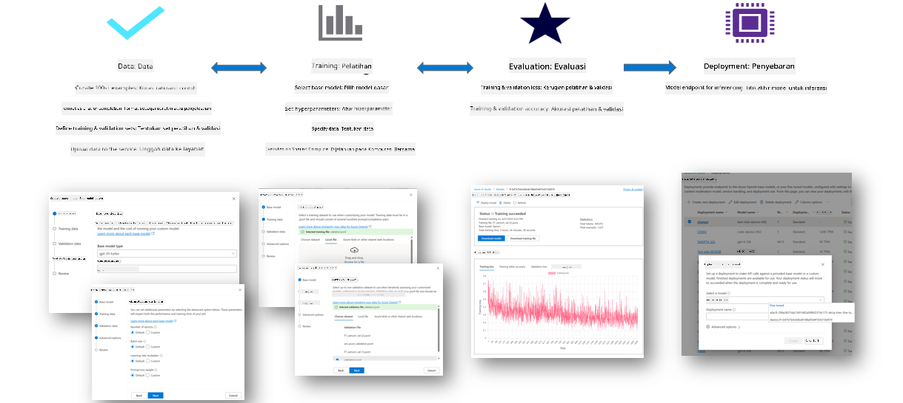
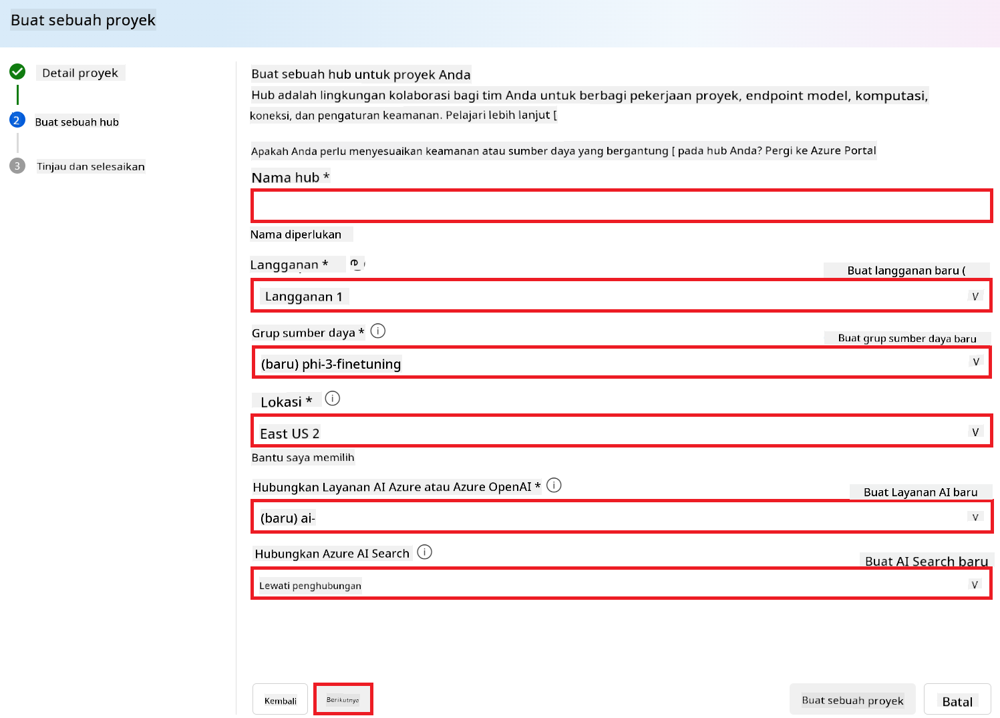
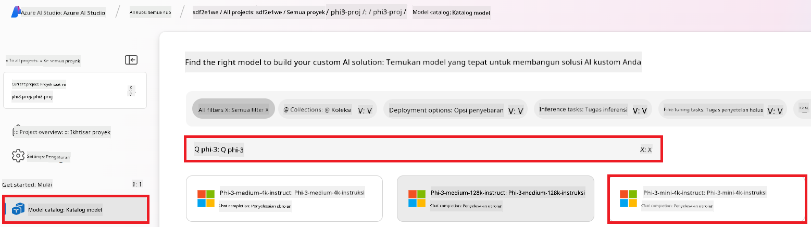
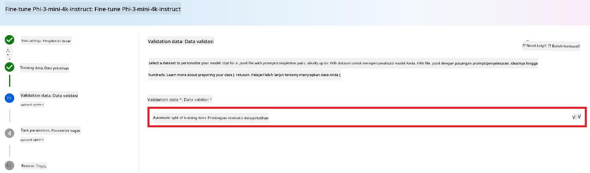

<!--
CO_OP_TRANSLATOR_METADATA:
{
  "original_hash": "c1559c5af6caccf6f623fd43a6b3a9a3",
  "translation_date": "2025-07-17T06:09:48+00:00",
  "source_file": "md/03.FineTuning/FineTuning_AIFoundry.md",
  "language_code": "id"
}
-->
# Fine-tuning Phi-3 dengan Azure AI Foundry

Mari kita jelajahi cara melakukan fine-tuning pada model bahasa Phi-3 Mini dari Microsoft menggunakan Azure AI Foundry. Fine-tuning memungkinkan Anda menyesuaikan Phi-3 Mini untuk tugas-tugas tertentu, sehingga model menjadi lebih kuat dan lebih paham konteks.

## Pertimbangan

- **Kemampuan:** Model mana yang bisa di-fine-tune? Apa saja yang bisa dilakukan oleh model dasar setelah di-fine-tune?
- **Biaya:** Bagaimana model harga untuk fine-tuning?
- **Kustomisasi:** Seberapa banyak saya bisa memodifikasi model dasar – dan dalam cara apa saja?
- **Kemudahan:** Bagaimana proses fine-tuning sebenarnya – apakah saya perlu menulis kode khusus? Apakah saya perlu menyediakan komputasi sendiri?
- **Keamanan:** Model yang sudah di-fine-tune diketahui memiliki risiko keamanan – apakah ada pengaman untuk mencegah dampak negatif yang tidak diinginkan?


## Persiapan untuk fine-tuning

### Prasyarat

> [!NOTE]
> Untuk model keluarga Phi-3, penawaran fine-tune dengan model bayar sesuai pemakaian hanya tersedia untuk hub yang dibuat di wilayah **East US 2**.

- Langganan Azure. Jika Anda belum memiliki langganan Azure, buat [akun Azure berbayar](https://azure.microsoft.com/pricing/purchase-options/pay-as-you-go) untuk memulai.

- Sebuah [proyek AI Foundry](https://ai.azure.com?WT.mc_id=aiml-138114-kinfeylo).
- Kontrol akses berbasis peran Azure (Azure RBAC) digunakan untuk memberikan akses ke operasi di Azure AI Foundry. Untuk melakukan langkah-langkah dalam artikel ini, akun pengguna Anda harus diberikan __peran Azure AI Developer__ pada grup sumber daya.

### Pendaftaran penyedia langganan

Pastikan langganan Anda sudah terdaftar pada penyedia sumber daya `Microsoft.Network`.

1. Masuk ke [portal Azure](https://portal.azure.com).
1. Pilih **Subscriptions** dari menu sebelah kiri.
1. Pilih langganan yang ingin Anda gunakan.
1. Pilih **AI project settings** > **Resource providers** dari menu sebelah kiri.
1. Pastikan **Microsoft.Network** ada dalam daftar penyedia sumber daya. Jika belum, tambahkan.

### Persiapan data

Siapkan data pelatihan dan validasi untuk melakukan fine-tuning model Anda. Dataset pelatihan dan validasi terdiri dari contoh input dan output sesuai dengan bagaimana Anda ingin model bekerja.

Pastikan semua contoh pelatihan mengikuti format yang diharapkan untuk inferensi. Untuk fine-tuning yang efektif, pastikan dataset seimbang dan beragam.

Ini meliputi menjaga keseimbangan data, memasukkan berbagai skenario, dan secara berkala memperbaiki data pelatihan agar sesuai dengan ekspektasi dunia nyata, sehingga menghasilkan respons model yang lebih akurat dan seimbang.

Jenis model yang berbeda membutuhkan format data pelatihan yang berbeda.

### Chat Completion

Data pelatihan dan validasi yang Anda gunakan **harus** diformat sebagai dokumen JSON Lines (JSONL). Untuk `Phi-3-mini-128k-instruct`, dataset fine-tuning harus diformat dalam format percakapan yang digunakan oleh API Chat completions.

### Contoh format file

```json
    {"messages": [{"role": "system", "content": "You are an Xbox customer support agent whose primary goal is to help users with issues they are experiencing with their Xbox devices. You are friendly and concise. You only provide factual answers to queries, and do not provide answers that are not related to Xbox."}, {"role": "user", "content": "Is Xbox better than PlayStation?"}, {"role": "assistant", "content": "I apologize, but I cannot provide personal opinions. My primary job is to assist you with any issues related to your Xbox device. Do you have any Xbox-related issues that need addressing?"}]}
    {"messages": [{"role": "system", "content": "You are an Xbox customer support agent whose primary goal is to help users with issues they are experiencing with their Xbox devices. You are friendly and concise. You only provide factual answers to queries, and do not provide answers that are not related to Xbox."}, {"role": "user", "content": "Can I play PC games on my Xbox?"}, {"role": "assistant", "content": "While Xbox consoles don't natively support PC games, they can play an array of Xbox games, many of which are also available on PC. Can I assist you with finding games compatible with your Xbox device?"}]}
    {"messages": [{"role": "system", "content": "You are an Xbox customer support agent whose primary goal is to help users with issues they are experiencing with their Xbox devices. You are friendly and concise. You only provide factual answers to queries, and do not provide answers that are not related to Xbox."}, {"role": "user", "content": "I'm having trouble connecting my Xbox to the Wi-Fi."}, {"role": "assistant", "content": "No worries, let's go through the network settings on your Xbox. Can you please tell me what happens when you try to connect it to the Wi-Fi?"}]}
```

Tipe file yang didukung adalah JSON Lines. File diunggah ke datastore default dan tersedia dalam proyek Anda.

## Fine-Tuning Phi-3 dengan Azure AI Foundry

Azure AI Foundry memungkinkan Anda menyesuaikan model bahasa besar dengan dataset pribadi melalui proses yang dikenal sebagai fine-tuning. Fine-tuning memberikan nilai signifikan dengan memungkinkan kustomisasi dan optimasi untuk tugas dan aplikasi tertentu. Ini menghasilkan peningkatan performa, efisiensi biaya, pengurangan latensi, dan keluaran yang disesuaikan.



### Membuat Proyek Baru

1. Masuk ke [Azure AI Foundry](https://ai.azure.com).

1. Pilih **+New project** untuk membuat proyek baru di Azure AI Foundry.

    

1. Lakukan tugas berikut:

    - Nama **Hub** proyek. Harus unik.
    - Pilih **Hub** yang akan digunakan (buat baru jika perlu).

    

1. Lakukan tugas berikut untuk membuat hub baru:

    - Masukkan **Nama Hub**. Harus unik.
    - Pilih **Subscription** Azure Anda.
    - Pilih **Resource group** yang akan digunakan (buat baru jika perlu).
    - Pilih **Lokasi** yang ingin digunakan.
    - Pilih **Connect Azure AI Services** yang akan digunakan (buat baru jika perlu).
    - Pilih **Connect Azure AI Search** ke **Skip connecting**.

    

1. Pilih **Next**.
1. Pilih **Create a project**.

### Persiapan Data

Sebelum fine-tuning, kumpulkan atau buat dataset yang relevan dengan tugas Anda, seperti instruksi chat, pasangan tanya-jawab, atau data teks lain yang sesuai. Bersihkan dan pra-proses data ini dengan menghilangkan noise, menangani nilai yang hilang, dan melakukan tokenisasi teks.

### Fine-tune model Phi-3 di Azure AI Foundry

> [!NOTE]
> Fine-tuning model Phi-3 saat ini didukung hanya untuk proyek yang berada di East US 2.

1. Pilih **Model catalog** dari tab sebelah kiri.

1. Ketik *phi-3* di **search bar** dan pilih model phi-3 yang ingin Anda gunakan.

    

1. Pilih **Fine-tune**.

    

1. Masukkan **Nama model fine-tuned**.

    

1. Pilih **Next**.

1. Lakukan tugas berikut:

    - Pilih **jenis tugas** menjadi **Chat completion**.
    - Pilih **Data pelatihan** yang ingin digunakan. Anda bisa mengunggahnya melalui data Azure AI Foundry atau dari lingkungan lokal Anda.

    

1. Pilih **Next**.

1. Unggah **Data validasi** yang ingin digunakan, atau pilih **Automatic split of training data**.

    

1. Pilih **Next**.

1. Lakukan tugas berikut:

    - Pilih **Batch size multiplier** yang ingin digunakan.
    - Pilih **Learning rate** yang ingin digunakan.
    - Pilih **Epochs** yang ingin digunakan.

    

1. Pilih **Submit** untuk memulai proses fine-tuning.

    

1. Setelah model Anda selesai di-fine-tune, status akan ditampilkan sebagai **Completed**, seperti pada gambar di bawah. Sekarang Anda bisa menerapkan model dan menggunakannya dalam aplikasi Anda sendiri, di playground, atau di prompt flow. Untuk informasi lebih lanjut, lihat [Cara menerapkan keluarga model bahasa kecil Phi-3 dengan Azure AI Foundry](https://learn.microsoft.com/azure/ai-studio/how-to/deploy-models-phi-3?tabs=phi-3-5&pivots=programming-language-python).

    

> [!NOTE]
> Untuk informasi lebih rinci tentang fine-tuning Phi-3, kunjungi [Fine-tune Phi-3 models in Azure AI Foundry](https://learn.microsoft.com/azure/ai-studio/how-to/fine-tune-phi-3?tabs=phi-3-mini).

## Membersihkan model yang sudah di-fine-tune

Anda dapat menghapus model yang sudah di-fine-tune dari daftar model fine-tuning di [Azure AI Foundry](https://ai.azure.com) atau dari halaman detail model. Pilih model fine-tuned yang ingin dihapus dari halaman Fine-tuning, lalu pilih tombol Delete untuk menghapus model tersebut.

> [!NOTE]
> Anda tidak bisa menghapus model kustom jika masih ada deployment yang aktif. Anda harus menghapus deployment model terlebih dahulu sebelum bisa menghapus model kustom.

## Biaya dan kuota

### Pertimbangan biaya dan kuota untuk model Phi-3 yang di-fine-tune sebagai layanan

Model Phi yang di-fine-tune sebagai layanan ditawarkan oleh Microsoft dan terintegrasi dengan Azure AI Foundry untuk digunakan. Anda dapat menemukan harga saat [menerapkan](https://learn.microsoft.com/azure/ai-studio/how-to/deploy-models-phi-3?tabs=phi-3-5&pivots=programming-language-python) atau melakukan fine-tuning model di tab Pricing and terms pada wizard deployment.

## Penyaringan konten

Model yang diterapkan sebagai layanan dengan model bayar sesuai pemakaian dilindungi oleh Azure AI Content Safety. Saat diterapkan ke endpoint real-time, Anda dapat memilih untuk menonaktifkan fitur ini. Dengan Azure AI Content Safety aktif, baik prompt maupun hasil keluaran melewati serangkaian model klasifikasi yang bertujuan mendeteksi dan mencegah keluaran konten berbahaya. Sistem penyaringan konten mendeteksi dan mengambil tindakan pada kategori konten berbahaya tertentu baik pada input prompt maupun output hasil. Pelajari lebih lanjut tentang [Azure AI Content Safety](https://learn.microsoft.com/azure/ai-studio/concepts/content-filtering).

**Konfigurasi Fine-Tuning**

Hyperparameter: Tentukan hyperparameter seperti learning rate, batch size, dan jumlah epoch pelatihan.

**Fungsi Loss**

Pilih fungsi loss yang sesuai untuk tugas Anda (misalnya, cross-entropy).

**Optimizer**

Pilih optimizer (misalnya, Adam) untuk pembaruan gradien selama pelatihan.

**Proses Fine-Tuning**

- Muat Model Pra-Latih: Muat checkpoint Phi-3 Mini.
- Tambahkan Lapisan Kustom: Tambahkan lapisan khusus tugas (misalnya, kepala klasifikasi untuk instruksi chat).

**Latih Model**  
Fine-tune model menggunakan dataset yang sudah disiapkan. Pantau kemajuan pelatihan dan sesuaikan hyperparameter jika perlu.

**Evaluasi dan Validasi**

Set Validasi: Pisahkan data Anda menjadi set pelatihan dan validasi.

**Evaluasi Performa**

Gunakan metrik seperti akurasi, F1-score, atau perplexity untuk menilai performa model.

## Simpan Model Fine-Tuned

**Checkpoint**  
Simpan checkpoint model fine-tuned untuk digunakan di masa depan.

## Deployment

- Deploy sebagai Layanan Web: Terapkan model fine-tuned Anda sebagai layanan web di Azure AI Foundry.
- Uji Endpoint: Kirim kueri uji ke endpoint yang sudah diterapkan untuk memverifikasi fungsinya.

## Iterasi dan Perbaikan

Iterasi: Jika performa belum memuaskan, lakukan iterasi dengan menyesuaikan hyperparameter, menambah data, atau fine-tuning dengan epoch tambahan.

## Pantau dan Perbaiki

Pantau terus perilaku model dan lakukan perbaikan sesuai kebutuhan.

## Kustomisasi dan Perluasan

Tugas Kustom: Phi-3 Mini dapat di-fine-tune untuk berbagai tugas selain instruksi chat. Jelajahi penggunaan lain!  
Eksperimen: Coba berbagai arsitektur, kombinasi lapisan, dan teknik untuk meningkatkan performa.

> [!NOTE]
> Fine-tuning adalah proses iteratif. Bereksperimenlah, pelajari, dan sesuaikan model Anda untuk mendapatkan hasil terbaik sesuai tugas spesifik Anda!

**Penafian**:  
Dokumen ini telah diterjemahkan menggunakan layanan terjemahan AI [Co-op Translator](https://github.com/Azure/co-op-translator). Meskipun kami berupaya untuk mencapai akurasi, harap diperhatikan bahwa terjemahan otomatis mungkin mengandung kesalahan atau ketidakakuratan. Dokumen asli dalam bahasa aslinya harus dianggap sebagai sumber yang sahih. Untuk informasi penting, disarankan menggunakan terjemahan profesional oleh manusia. Kami tidak bertanggung jawab atas kesalahpahaman atau penafsiran yang keliru yang timbul dari penggunaan terjemahan ini.