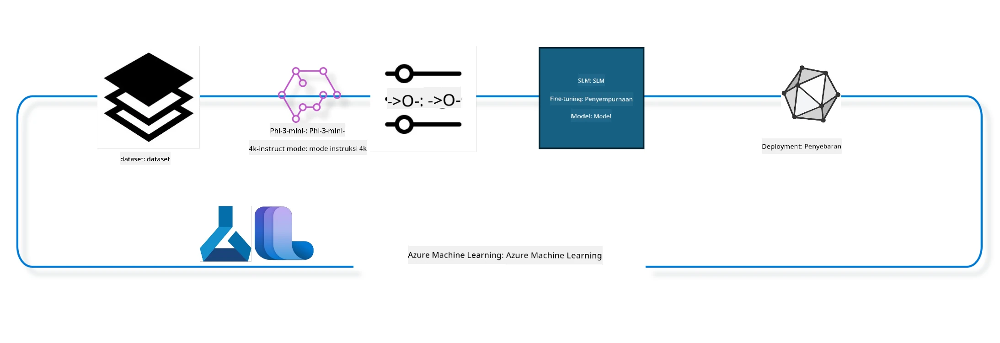

## Cara menggunakan komponen chat-completion dari Azure ML system registry untuk fine tuning model

Dalam contoh ini kami akan melakukan fine tuning model Phi-3-mini-4k-instruct untuk menyelesaikan percakapan antara 2 orang menggunakan dataset ultrachat_200k.



Contoh ini akan menunjukkan kepada Anda bagaimana melakukan fine tuning menggunakan Azure ML SDK dan Python kemudian menerapkan model yang telah di-fine tune ke endpoint online untuk inferensi waktu nyata.

### Data pelatihan

Kami akan menggunakan dataset ultrachat_200k. Ini adalah versi yang sangat difilter dari dataset UltraChat dan digunakan untuk melatih Zephyr-7B-β, model chat 7b mutakhir.

### Model

Kami akan menggunakan model Phi-3-mini-4k-instruct untuk menunjukkan bagaimana pengguna dapat melakukan fine tune model untuk tugas chat-completion. Jika Anda membuka notebook ini dari kartu model tertentu, ingat untuk mengganti nama model spesifik tersebut.

### Tugas

- Pilih model untuk fine tune.
- Pilih dan jelajahi data pelatihan.
- Konfigurasikan pekerjaan fine tuning.
- Jalankan pekerjaan fine tuning.
- Tinjau metrik pelatihan dan evaluasi.
- Daftarkan model yang telah di-fine tune.
- Terapkan model yang telah di-fine tune untuk inferensi waktu nyata.
- Bersihkan sumber daya.

## 1. Siapkan prasyarat

- Instal dependensi
- Hubungkan ke AzureML Workspace. Pelajari lebih lanjut di set up SDK authentication. Ganti <WORKSPACE_NAME>, <RESOURCE_GROUP>, dan <SUBSCRIPTION_ID> di bawah ini.
- Hubungkan ke azureml system registry
- Atur nama eksperimen opsional
- Periksa atau buat compute.

> [!NOTE]
> Persyaratan adalah satu node GPU dapat memiliki beberapa kartu GPU. Misalnya, dalam satu node Standard_NC24rs_v3 ada 4 NVIDIA V100 GPU sedangkan di Standard_NC12s_v3 ada 2 NVIDIA V100 GPU. Lihat dokumentasi untuk informasi ini. Jumlah kartu GPU per node disetel di parameter gpus_per_node di bawah. Menyetel nilai ini secara benar akan memastikan pemanfaatan semua GPU di node. SKU komputasi GPU yang direkomendasikan dapat ditemukan di sini dan di sini.

### Perpustakaan Python

Instal dependensi dengan menjalankan sel di bawah ini. Ini bukan langkah opsional jika menjalankan di lingkungan baru.

```bash
pip install azure-ai-ml
pip install azure-identity
pip install datasets==2.9.0
pip install mlflow
pip install azureml-mlflow
```

### Interaksi dengan Azure ML

1. Skrip Python ini digunakan untuk berinteraksi dengan layanan Azure Machine Learning (Azure ML). Berikut penjelasan tentang apa yang dilakukan skrip ini:

    - Mengimpor modul yang diperlukan dari paket azure.ai.ml, azure.identity, dan azure.ai.ml.entities. Juga mengimpor modul time.

    - Mencoba mengautentikasi menggunakan DefaultAzureCredential(), yang memberikan pengalaman autentikasi yang disederhanakan untuk mulai mengembangkan aplikasi yang berjalan di cloud Azure. Jika gagal, menggunakan fallback ke InteractiveBrowserCredential(), yang memberikan prompt login interaktif.

    - Kemudian mencoba membuat instance MLClient menggunakan metode from_config, yang membaca konfigurasi dari file config default (config.json). Jika gagal, membuat instance MLClient dengan menyediakan secara manual subscription_id, resource_group_name, dan workspace_name.

    - Membuat instance MLClient lain, kali ini untuk registry Azure ML bernama "azureml". Registry ini tempat model, pipeline fine-tuning, dan environment disimpan.

    - Mengatur experiment_name menjadi "chat_completion_Phi-3-mini-4k-instruct".

    - Menghasilkan timestamp unik dengan mengonversi waktu saat ini (dalam detik sejak epoch, sebagai angka floating point) menjadi integer lalu menjadi string. Timestamp ini dapat digunakan untuk membuat nama dan versi unik.

    ```python
    # Impor modul yang diperlukan dari Azure ML dan Azure Identity
    from azure.ai.ml import MLClient
    from azure.identity import (
        DefaultAzureCredential,
        InteractiveBrowserCredential,
    )
    from azure.ai.ml.entities import AmlCompute
    import time  # Impor modul time
    
    # Coba otentikasi menggunakan DefaultAzureCredential
    try:
        credential = DefaultAzureCredential()
        credential.get_token("https://management.azure.com/.default")
    except Exception as ex:  # Jika DefaultAzureCredential gagal, gunakan InteractiveBrowserCredential
        credential = InteractiveBrowserCredential()
    
    # Coba buat instance MLClient menggunakan file konfigurasi default
    try:
        workspace_ml_client = MLClient.from_config(credential=credential)
    except:  # Jika itu gagal, buat instance MLClient dengan memberikan detail secara manual
        workspace_ml_client = MLClient(
            credential,
            subscription_id="<SUBSCRIPTION_ID>",
            resource_group_name="<RESOURCE_GROUP>",
            workspace_name="<WORKSPACE_NAME>",
        )
    
    # Buat instance MLClient lain untuk registry Azure ML yang bernama "azureml"
    # Registry ini adalah tempat penyimpanan model, pipeline fine-tuning, dan lingkungan
    registry_ml_client = MLClient(credential, registry_name="azureml")
    
    # Tetapkan nama eksperimen
    experiment_name = "chat_completion_Phi-3-mini-4k-instruct"
    
    # Buat timestamp unik yang dapat digunakan untuk nama dan versi yang harus unik
    timestamp = str(int(time.time()))
    ```

## 2. Pilih model dasar untuk fine tune

1. Phi-3-mini-4k-instruct adalah model ringan dengan 3,8 miliar parameter, mutakhir, dan dibangun berdasarkan dataset yang digunakan untuk Phi-2. Model ini termasuk keluarga model Phi-3, dan versi Mini hadir dalam dua varian yaitu 4K dan 128K yang merupakan panjang konteks (dalam token) yang dapat didukung. Kita perlu melakukan fine tune model ini untuk tujuan spesifik kita agar dapat digunakan. Anda dapat menelusuri model-model ini di Model Catalog di AzureML Studio, dengan memfilter berdasarkan tugas chat-completion. Dalam contoh ini, kami menggunakan model Phi-3-mini-4k-instruct. Jika Anda membuka notebook ini untuk model berbeda, ganti nama dan versi model sesuai.

> [!NOTE]
> properti id model dari model ini. Ini akan digunakan sebagai input untuk pekerjaan fine tuning. Ini juga tersedia sebagai field Asset ID di halaman detail model di AzureML Studio Model Catalog.

2. Skrip Python ini berinteraksi dengan layanan Azure Machine Learning (Azure ML). Berikut penjelasan apa yang dilakukan:

    - Menetapkan model_name menjadi "Phi-3-mini-4k-instruct".

    - Menggunakan metode get dari properti models pada objek registry_ml_client untuk mengambil versi terbaru dari model dengan nama yang ditentukan dari registry Azure ML. Metode get dipanggil dengan dua argumen: nama model dan label yang menunjukkan untuk mengambil versi terbaru dari model.

    - Mencetak pesan ke konsol yang menunjukkan nama, versi, dan id model yang akan digunakan untuk fine tuning. Metode format dari string digunakan untuk menyisipkan nama, versi, dan id model ke dalam pesan. Nama, versi, dan id model diakses sebagai properti dari objek foundation_model.

    ```python
    # Atur nama model
    model_name = "Phi-3-mini-4k-instruct"
    
    # Dapatkan versi terbaru dari model dari registri Azure ML
    foundation_model = registry_ml_client.models.get(model_name, label="latest")
    
    # Cetak nama model, versi, dan id
    # Informasi ini berguna untuk pelacakan dan debugging
    print(
        "\n\nUsing model name: {0}, version: {1}, id: {2} for fine tuning".format(
            foundation_model.name, foundation_model.version, foundation_model.id
        )
    )
    ```

## 3. Buat compute yang akan digunakan untuk pekerjaan ini

Job finetune bekerja HANYA dengan compute GPU. Ukuran compute tergantung pada besar model dan dalam banyak kasus menjadi sulit menentukan compute yang tepat untuk pekerjaan ini. Dalam sel ini, kami membimbing pengguna memilih compute yang tepat untuk pekerjaan ini.

> [!NOTE]
> Compute yang tercantum di bawah bekerja dengan konfigurasi paling optimal. Perubahan apapun pada konfigurasi dapat menyebabkan error Cuda Out Of Memory. Dalam kasus tersebut, cobalah tingkatkan compute ke ukuran compute yang lebih besar.

> [!NOTE]
> Saat memilih compute_cluster_size di bawah, pastikan compute tersedia di grup sumber daya Anda. Jika compute tertentu tidak tersedia, Anda dapat mengajukan permintaan untuk mendapatkan akses ke sumber daya compute tersebut.

### Memeriksa Dukungan Model untuk Fine Tuning

1. Skrip Python ini berinteraksi dengan model Azure Machine Learning (Azure ML). Berikut penjelasan apa yang dilakukan skrip ini:

    - Mengimpor modul ast, yang menyediakan fungsi untuk memproses pohon sintaksis abstrak Python.

    - Memeriksa apakah objek foundation_model (yang mewakili model di Azure ML) memiliki tag bernama finetune_compute_allow_list. Tag di Azure ML adalah pasangan kunci-nilai yang dapat Anda buat dan gunakan untuk memfilter serta mengurutkan model.

    - Jika tag finetune_compute_allow_list ada, menggunakan fungsi ast.literal_eval untuk menguraikan nilai tag (string) secara aman menjadi list Python. List ini kemudian ditetapkan ke variabel computes_allow_list. Skrip ini lalu mencetak pesan yang menunjukkan bahwa compute harus dibuat dari list tersebut.

    - Jika tag finetune_compute_allow_list tidak ada, menetapkan computes_allow_list menjadi None dan mencetak pesan yang menunjukkan bahwa tag finetune_compute_allow_list bukan bagian dari tag model.

    - Singkatnya, skrip ini memeriksa tag tertentu dalam metadata model, mengonversi nilai tag menjadi list jika ada, dan memberikan umpan balik kepada pengguna.

    ```python
    # Impor modul ast, yang menyediakan fungsi untuk memproses pohon tata bahasa abstrak Python
    import ast
    
    # Periksa apakah tag 'finetune_compute_allow_list' ada dalam tag model
    if "finetune_compute_allow_list" in foundation_model.tags:
        # Jika tag ada, gunakan ast.literal_eval untuk dengan aman mengurai nilai tag (string) menjadi daftar Python
        computes_allow_list = ast.literal_eval(
            foundation_model.tags["finetune_compute_allow_list"]
        )  # konversi string menjadi daftar python
        # Cetak pesan yang menunjukkan bahwa sebuah compute harus dibuat dari daftar
        print(f"Please create a compute from the above list - {computes_allow_list}")
    else:
        # Jika tag tidak ada, set computes_allow_list ke None
        computes_allow_list = None
        # Cetak pesan yang menunjukkan bahwa tag 'finetune_compute_allow_list' tidak ada dalam tag model
        print("`finetune_compute_allow_list` is not part of model tags")
    ```

### Memeriksa Compute Instance

1. Skrip Python ini berinteraksi dengan layanan Azure Machine Learning (Azure ML) dan melakukan beberapa pemeriksaan pada instance compute. Berikut penjelasan apa yang dilakukan:

    - Mencoba mengambil instance compute dengan nama yang disimpan di compute_cluster dari workspace Azure ML. Jika status provisioning compute instance adalah "failed", maka melempar ValueError.

    - Memeriksa apakah computes_allow_list tidak None. Jika tidak, mengonversi semua ukuran compute dalam list ke huruf kecil dan memeriksa apakah ukuran compute instance saat ini ada di list. Jika tidak, melempar ValueError.

    - Jika computes_allow_list adalah None, memeriksa apakah ukuran compute instance ada di daftar ukuran VM GPU yang tidak didukung. Jika iya, melempar ValueError.

    - Mengambil daftar semua ukuran compute yang tersedia di workspace. Kemudian melakukan iterasi pada list tersebut, dan untuk setiap ukuran compute, memeriksa apakah namanya cocok dengan ukuran compute instance saat ini. Jika cocok, mengambil jumlah GPU untuk ukuran compute tersebut dan mengatur gpu_count_found menjadi True.

    - Jika gpu_count_found True, mencetak jumlah GPU di compute instance. Jika False, melempar ValueError.

    - Singkatnya, skrip ini melakukan beberapa pemeriksaan pada compute instance di Azure ML workspace, termasuk memeriksa status provisioning, ukurannya terhadap daftar yang diperbolehkan atau tidak, dan jumlah GPU yang dimilikinya.
    
    ```python
    # Cetak pesan pengecualian
    print(e)
    # Naikkan ValueError jika ukuran komputasi tidak tersedia di workspace
    raise ValueError(
        f"WARNING! Compute size {compute_cluster_size} not available in workspace"
    )
    
    # Ambil instance komputasi dari workspace Azure ML
    compute = workspace_ml_client.compute.get(compute_cluster)
    # Periksa apakah status penyediaan instance komputasi adalah "failed"
    if compute.provisioning_state.lower() == "failed":
        # Naikkan ValueError jika status penyediaan adalah "failed"
        raise ValueError(
            f"Provisioning failed, Compute '{compute_cluster}' is in failed state. "
            f"please try creating a different compute"
        )
    
    # Periksa apakah computes_allow_list tidak None
    if computes_allow_list is not None:
        # Ubah semua ukuran komputasi dalam computes_allow_list menjadi huruf kecil
        computes_allow_list_lower_case = [x.lower() for x in computes_allow_list]
        # Periksa apakah ukuran instance komputasi ada dalam computes_allow_list_lower_case
        if compute.size.lower() not in computes_allow_list_lower_case:
            # Naikkan ValueError jika ukuran instance komputasi tidak ada dalam computes_allow_list_lower_case
            raise ValueError(
                f"VM size {compute.size} is not in the allow-listed computes for finetuning"
            )
    else:
        # Definisikan daftar ukuran VM GPU yang tidak didukung
        unsupported_gpu_vm_list = [
            "standard_nc6",
            "standard_nc12",
            "standard_nc24",
            "standard_nc24r",
        ]
        # Periksa apakah ukuran instance komputasi ada dalam unsupported_gpu_vm_list
        if compute.size.lower() in unsupported_gpu_vm_list:
            # Naikkan ValueError jika ukuran instance komputasi ada dalam unsupported_gpu_vm_list
            raise ValueError(
                f"VM size {compute.size} is currently not supported for finetuning"
            )
    
    # Inisialisasi flag untuk memeriksa apakah jumlah GPU dalam instance komputasi telah ditemukan
    gpu_count_found = False
    # Ambil daftar semua ukuran komputasi yang tersedia di workspace
    workspace_compute_sku_list = workspace_ml_client.compute.list_sizes()
    available_sku_sizes = []
    # Iterasi atas daftar ukuran komputasi yang tersedia
    for compute_sku in workspace_compute_sku_list:
        available_sku_sizes.append(compute_sku.name)
        # Periksa apakah nama ukuran komputasi cocok dengan ukuran instance komputasi
        if compute_sku.name.lower() == compute.size.lower():
            # Jika cocok, ambil jumlah GPU untuk ukuran komputasi itu dan set gpu_count_found ke True
            gpus_per_node = compute_sku.gpus
            gpu_count_found = True
    # Jika gpu_count_found True, cetak jumlah GPU di instance komputasi
    if gpu_count_found:
        print(f"Number of GPU's in compute {compute.size}: {gpus_per_node}")
    else:
        # Jika gpu_count_found False, naikkan ValueError
        raise ValueError(
            f"Number of GPU's in compute {compute.size} not found. Available skus are: {available_sku_sizes}."
            f"This should not happen. Please check the selected compute cluster: {compute_cluster} and try again."
        )
    ```

## 4. Pilih dataset untuk fine-tuning model

1. Kami menggunakan dataset ultrachat_200k. Dataset ini memiliki empat pembagian, cocok untuk Supervised fine-tuning (sft).
Generation ranking (gen). Jumlah contoh per split ditunjukkan sebagai berikut:

    ```bash
    train_sft test_sft  train_gen  test_gen
    207865  23110  256032  28304
    ```

1. Beberapa sel berikut menunjukkan persiapan data dasar untuk fine tuning:

### Visualisasikan beberapa baris data

Kami ingin contoh ini berjalan cepat, jadi simpan file train_sft, test_sft yang berisi 5% dari baris yang sudah dipangkas. Ini berarti model yang di-fine tune akan memiliki akurasi lebih rendah, jadi tidak boleh digunakan di dunia nyata.
download-dataset.py digunakan untuk mengunduh dataset ultrachat_200k dan mengubah dataset menjadi format yang dapat dikonsumsi oleh komponen pipeline fine tune. Karena dataset ini besar, di sini kami hanya memiliki bagian dari dataset.

1. Menjalankan skrip di bawah hanya mengunduh 5% data. Ini dapat ditingkatkan dengan mengubah parameter dataset_split_pc ke persentase yang diinginkan.

> [!NOTE]
> Beberapa model bahasa memiliki kode bahasa berbeda sehingga nama kolom di dataset harus mencerminkan hal yang sama.

1. Berikut contoh bagaimana data harus terlihat
Dataset chat-completion disimpan dalam format parquet dengan setiap entri menggunakan skema berikut:

    - Ini adalah dokumen JSON (JavaScript Object Notation), format pertukaran data populer. Ini bukan kode yang dapat dijalankan, melainkan cara menyimpan dan mentransport data. Berikut penjelasan strukturnya:

    - "prompt": Kunci ini memegang nilai string yang mewakili tugas atau pertanyaan yang diajukan kepada asisten AI.

    - "messages": Kunci ini memegang array objek. Setiap objek mewakili pesan dalam percakapan antara pengguna dan asisten AI. Setiap objek pesan memiliki dua kunci:

    - "content": Kunci ini memegang nilai string yang mewakili isi pesan.
    - "role": Kunci ini memegang nilai string yang mewakili peran entitas yang mengirim pesan. Bisa "user" atau "assistant".
    - "prompt_id": Kunci ini memegang nilai string yang merupakan pengenal unik untuk prompt tersebut.

1. Dalam dokumen JSON khusus ini, percakapan direpresentasikan di mana pengguna meminta asisten AI membuat protagonis untuk cerita distopia. Asisten merespons, lalu pengguna meminta lebih detail. Asisten setuju memberikan lebih detail. Seluruh percakapan terkait dengan prompt id tertentu.

    ```python
    {
        // The task or question posed to an AI assistant
        "prompt": "Create a fully-developed protagonist who is challenged to survive within a dystopian society under the rule of a tyrant. ...",
        
        // An array of objects, each representing a message in a conversation between a user and an AI assistant
        "messages":[
            {
                // The content of the user's message
                "content": "Create a fully-developed protagonist who is challenged to survive within a dystopian society under the rule of a tyrant. ...",
                // The role of the entity that sent the message
                "role": "user"
            },
            {
                // The content of the assistant's message
                "content": "Name: Ava\n\n Ava was just 16 years old when the world as she knew it came crashing down. The government had collapsed, leaving behind a chaotic and lawless society. ...",
                // The role of the entity that sent the message
                "role": "assistant"
            },
            {
                // The content of the user's message
                "content": "Wow, Ava's story is so intense and inspiring! Can you provide me with more details.  ...",
                // The role of the entity that sent the message
                "role": "user"
            }, 
            {
                // The content of the assistant's message
                "content": "Certainly! ....",
                // The role of the entity that sent the message
                "role": "assistant"
            }
        ],
        
        // A unique identifier for the prompt
        "prompt_id": "d938b65dfe31f05f80eb8572964c6673eddbd68eff3db6bd234d7f1e3b86c2af"
    }
    ```

### Unduh Data

1. Skrip Python ini digunakan untuk mengunduh dataset menggunakan skrip pembantu bernama download-dataset.py. Berikut penjelasan apa yang dilakukan:

    - Mengimpor modul os, yang menyediakan cara portabel menggunakan fungsi sistem operasi.

    - Menggunakan fungsi os.system untuk menjalankan skrip download-dataset.py di shell dengan argumen baris perintah tertentu. Argumen menentukan dataset yang akan diunduh (HuggingFaceH4/ultrachat_200k), direktori tujuan unduhan (ultrachat_200k_dataset), dan persentase dataset yang di-split (5). Fungsi os.system mengembalikan status keluar dari perintah yang dijalankan; status ini disimpan dalam variabel exit_status.

    - Memeriksa apakah exit_status bukan 0. Pada sistem operasi mirip Unix, status keluar 0 biasanya menandakan perintah berhasil, sedangkan angka lain menandakan error. Jika exit_status bukan 0, maka melempar Exception dengan pesan bahwa terjadi kesalahan saat mengunduh dataset.

    - Singkatnya, skrip ini menjalankan perintah untuk mengunduh dataset dengan skrip pembantu, dan melempar pengecualian jika perintah gagal.
    
    ```python
    # Impor modul os, yang menyediakan cara menggunakan fungsionalitas tergantung sistem operasi
    import os
    
    # Gunakan fungsi os.system untuk menjalankan skrip download-dataset.py di shell dengan argumen baris perintah tertentu
    # Argumen menentukan dataset yang akan diunduh (HuggingFaceH4/ultrachat_200k), direktori untuk mengunduhnya (ultrachat_200k_dataset), dan persentase dataset untuk dibagi (5)
    # Fungsi os.system mengembalikan status keluar dari perintah yang dijalankan; status ini disimpan dalam variabel exit_status
    exit_status = os.system(
        "python ./download-dataset.py --dataset HuggingFaceH4/ultrachat_200k --download_dir ultrachat_200k_dataset --dataset_split_pc 5"
    )
    
    # Periksa jika exit_status tidak sama dengan 0
    # Di sistem operasi mirip Unix, status keluar 0 biasanya menunjukkan perintah berhasil, sementara angka lain menunjukkan kesalahan
    # Jika exit_status tidak 0, lempar Exception dengan pesan yang menunjukkan ada kesalahan dalam mengunduh dataset
    if exit_status != 0:
        raise Exception("Error downloading dataset")
    ```

### Memuat Data ke dalam DataFrame

1. Skrip Python ini memuat file JSON Lines ke dalam DataFrame pandas dan menampilkan 5 baris pertama. Berikut penjelasan apa yang dilakukan:

    - Mengimpor pustaka pandas, yang merupakan pustaka manipulasi dan analisis data yang kuat.

    - Mengatur lebar kolom maksimum untuk opsi tampilan pandas menjadi 0. Ini berarti teks lengkap dari setiap kolom akan ditampilkan tanpa pemotongan saat DataFrame dicetak.
    - Ini menggunakan fungsi pd.read_json untuk memuat file train_sft.jsonl dari direktori ultrachat_200k_dataset ke dalam sebuah DataFrame. Argumen lines=True menunjukkan bahwa file tersebut dalam format JSON Lines, di mana setiap baris adalah objek JSON yang terpisah.

    - Ini menggunakan metode head untuk menampilkan 5 baris pertama dari DataFrame. Jika DataFrame memiliki kurang dari 5 baris, maka akan menampilkan semuanya.

    - Singkatnya, skrip ini memuat file JSON Lines ke dalam DataFrame dan menampilkan 5 baris pertama dengan teks kolom lengkap.
    
    ```python
    # Impor pustaka pandas, yang merupakan pustaka manipulasi dan analisis data yang kuat
    import pandas as pd
    
    # Atur lebar kolom maksimum untuk opsi tampilan pandas menjadi 0
    # Ini berarti teks lengkap dari setiap kolom akan ditampilkan tanpa pemotongan ketika DataFrame dicetak
    pd.set_option("display.max_colwidth", 0)
    
    # Gunakan fungsi pd.read_json untuk memuat file train_sft.jsonl dari direktori ultrachat_200k_dataset ke dalam DataFrame
    # Argumen lines=True menunjukkan bahwa file menggunakan format JSON Lines, di mana setiap baris adalah objek JSON terpisah
    df = pd.read_json("./ultrachat_200k_dataset/train_sft.jsonl", lines=True)
    
    # Gunakan metode head untuk menampilkan 5 baris pertama dari DataFrame
    # Jika DataFrame memiliki kurang dari 5 baris, maka akan menampilkan semuanya
    df.head()
    ```

## 5. Kirim pekerjaan pelatihan ulang menggunakan model dan data sebagai masukan

Buat pekerjaan yang menggunakan komponen pipeline chat-completion. Pelajari lebih lanjut tentang semua parameter yang didukung untuk pelatihan ulang.

### Mendefinisikan parameter finetune

1. Parameter finetune dapat dikelompokkan menjadi 2 kategori - parameter pelatihan, parameter optimasi

1. Parameter pelatihan mendefinisikan aspek pelatihan seperti -

    - Optimizer, scheduler yang digunakan
    - Metrik untuk mengoptimalkan finetune
    - Jumlah langkah pelatihan dan ukuran batch dan sebagainya
    - Parameter optimasi membantu dalam mengoptimalkan memori GPU dan menggunakan sumber daya komputasi secara efektif.

1. Berikut beberapa parameter yang termasuk dalam kategori ini. Parameter optimasi berbeda untuk setiap model dan dikemas dengan model untuk menangani variasi ini.

    - Aktifkan deepspeed dan LoRA
    - Aktifkan pelatihan presisi campuran
    - Aktifkan pelatihan multi-node

> [!NOTE]
> Pelatihan ulang terawasi dapat mengakibatkan kehilangan keselarasan atau pelupaan katastropik. Kami sarankan memeriksa masalah ini dan menjalankan tahap keselarasan setelah Anda melakukan finetune.

### Parameter Fine Tuning

1. Skrip Python ini mengatur parameter untuk melatih ulang model pembelajaran mesin. Berikut rinciannya:

    - Mengatur parameter pelatihan default seperti jumlah epoch pelatihan, ukuran batch untuk pelatihan dan evaluasi, laju pembelajaran, dan tipe scheduler laju pembelajaran.

    - Mengatur parameter optimasi default seperti apakah menerapkan Layer-wise Relevance Propagation (LoRa) dan DeepSpeed, serta tahap DeepSpeed.

    - Menggabungkan parameter pelatihan dan optimasi ke dalam satu dictionary bernama finetune_parameters.

    - Memeriksa apakah foundation_model memiliki parameter default spesifik model. Jika ada, ia mencetak pesan peringatan dan memperbarui finetune_parameters dengan default spesifik model tersebut. Fungsi ast.literal_eval digunakan untuk mengonversi default spesifik model dari string ke dictionary Python.

    - Mencetak set parameter finetuning akhir yang akan digunakan untuk pelaksanaan.

    - Singkatnya, skrip ini mengatur dan menampilkan parameter untuk melakukan finetune model pembelajaran mesin, dengan kemampuan untuk menimpa parameter default dengan yang spesifik model.

    ```python
    # Atur parameter pelatihan default seperti jumlah epoch pelatihan, ukuran batch untuk pelatihan dan evaluasi, tingkat pembelajaran, dan jenis penjadwal tingkat pembelajaran
    training_parameters = dict(
        num_train_epochs=3,
        per_device_train_batch_size=1,
        per_device_eval_batch_size=1,
        learning_rate=5e-6,
        lr_scheduler_type="cosine",
    )
    
    # Atur parameter optimasi default seperti apakah akan menerapkan Layer-wise Relevance Propagation (LoRa) dan DeepSpeed, serta tahap DeepSpeed
    optimization_parameters = dict(
        apply_lora="true",
        apply_deepspeed="true",
        deepspeed_stage=2,
    )
    
    # Gabungkan parameter pelatihan dan optimasi ke dalam satu kamus bernama finetune_parameters
    finetune_parameters = {**training_parameters, **optimization_parameters}
    
    # Periksa apakah foundation_model memiliki parameter default khusus model
    # Jika iya, cetak pesan peringatan dan perbarui kamus finetune_parameters dengan default khusus model tersebut
    # Fungsi ast.literal_eval digunakan untuk mengonversi default khusus model dari string menjadi kamus Python
    if "model_specific_defaults" in foundation_model.tags:
        print("Warning! Model specific defaults exist. The defaults could be overridden.")
        finetune_parameters.update(
            ast.literal_eval(  # konversi string ke kamus python
                foundation_model.tags["model_specific_defaults"]
            )
        )
    
    # Cetak set parameter fine-tuning akhir yang akan digunakan untuk menjalankan proses tersebut
    print(
        f"The following finetune parameters are going to be set for the run: {finetune_parameters}"
    )
    ```

### Pipeline Pelatihan

1. Skrip Python ini mendefinisikan fungsi untuk menghasilkan nama tampilan untuk pipeline pelatihan pembelajaran mesin, lalu memanggil fungsi ini untuk membuat dan mencetak nama tampilan. Berikut rinciannya:

1. Fungsi get_pipeline_display_name didefinisikan. Fungsi ini menghasilkan nama tampilan berdasarkan berbagai parameter terkait pipeline pelatihan.

1. Di dalam fungsi, dihitung total ukuran batch dengan mengalikan ukuran batch per perangkat, jumlah langkah akumulasi gradien, jumlah GPU per node, dan jumlah node yang digunakan untuk finetuning.

1. Mendapatkan berbagai parameter lain seperti tipe scheduler laju pembelajaran, apakah DeepSpeed diterapkan, tahap DeepSpeed, apakah Layer-wise Relevance Propagation (LoRa) diterapkan, batas jumlah checkpoint model yang disimpan, dan panjang maksimum urutan.

1. Membuat string yang mencakup semua parameter tersebut, dipisahkan oleh tanda hubung. Jika diterapkan DeepSpeed atau LoRa, string mencantumkan "ds" diikuti tahap DeepSpeed, atau "lora", masing-masing. Jika tidak, termasuk "nods" atau "nolora", masing-masing.

1. Fungsi mengembalikan string ini, yang berfungsi sebagai nama tampilan untuk pipeline pelatihan.

1. Setelah fungsi didefinisikan, ia dipanggil untuk menghasilkan nama tampilan, kemudian mencetaknya.

1. Singkatnya, skrip ini menghasilkan nama tampilan untuk pipeline pelatihan pembelajaran mesin berdasarkan berbagai parameter, dan kemudian mencetak nama tampilan ini.

    ```python
    # Definisikan fungsi untuk menghasilkan nama tampilan untuk pipeline pelatihan
    def get_pipeline_display_name():
        # Hitung total ukuran batch dengan mengalikan ukuran batch per perangkat, jumlah langkah akumulasi gradien, jumlah GPU per node, dan jumlah node yang digunakan untuk fine-tuning
        batch_size = (
            int(finetune_parameters.get("per_device_train_batch_size", 1))
            * int(finetune_parameters.get("gradient_accumulation_steps", 1))
            * int(gpus_per_node)
            * int(finetune_parameters.get("num_nodes_finetune", 1))
        )
        # Ambil tipe scheduler learning rate
        scheduler = finetune_parameters.get("lr_scheduler_type", "linear")
        # Ambil apakah DeepSpeed diterapkan
        deepspeed = finetune_parameters.get("apply_deepspeed", "false")
        # Ambil tahap DeepSpeed
        ds_stage = finetune_parameters.get("deepspeed_stage", "2")
        # Jika DeepSpeed diterapkan, sertakan "ds" diikuti oleh tahap DeepSpeed dalam nama tampilan; jika tidak, sertakan "nods"
        if deepspeed == "true":
            ds_string = f"ds{ds_stage}"
        else:
            ds_string = "nods"
        # Ambil apakah Layer-wise Relevance Propagation (LoRa) diterapkan
        lora = finetune_parameters.get("apply_lora", "false")
        # Jika LoRa diterapkan, sertakan "lora" dalam nama tampilan; jika tidak, sertakan "nolora"
        if lora == "true":
            lora_string = "lora"
        else:
            lora_string = "nolora"
        # Ambil batas jumlah checkpoint model yang disimpan
        save_limit = finetune_parameters.get("save_total_limit", -1)
        # Ambil panjang urutan maksimum
        seq_len = finetune_parameters.get("max_seq_length", -1)
        # Buat nama tampilan dengan menggabungkan semua parameter ini, dipisahkan oleh tanda hubung
        return (
            model_name
            + "-"
            + "ultrachat"
            + "-"
            + f"bs{batch_size}"
            + "-"
            + f"{scheduler}"
            + "-"
            + ds_string
            + "-"
            + lora_string
            + f"-save_limit{save_limit}"
            + f"-seqlen{seq_len}"
        )
    
    # Panggil fungsi untuk menghasilkan nama tampilan
    pipeline_display_name = get_pipeline_display_name()
    # Cetak nama tampilan
    print(f"Display name used for the run: {pipeline_display_name}")
    ```

### Mengonfigurasi Pipeline

Skrip Python ini mendefinisikan dan mengonfigurasi pipeline pembelajaran mesin menggunakan Azure Machine Learning SDK. Berikut rinciannya:

1. Mengimpor modul yang diperlukan dari Azure AI ML SDK.

1. Mengambil komponen pipeline bernama "chat_completion_pipeline" dari registry.

1. Mendefinisikan pekerjaan pipeline menggunakan dekorator `@pipeline` dan fungsi `create_pipeline`. Nama pipeline ditetapkan ke `pipeline_display_name`.

1. Di dalam fungsi `create_pipeline`, menginisialisasi komponen pipeline yang diambil dengan berbagai parameter, termasuk path model, klaster komputasi untuk berbagai tahap, pembagian dataset untuk pelatihan dan pengujian, jumlah GPU untuk finetuning, dan parameter finetuning lainnya.

1. Memetakan output dari pekerjaan finetuning ke output pekerjaan pipeline. Ini dilakukan agar model yang telah di-finetune dapat didaftarkan dengan mudah, yang diperlukan untuk menerapkan model ke endpoint online atau batch.

1. Membuat instansi pipeline dengan memanggil fungsi `create_pipeline`.

1. Mengatur pengaturan `force_rerun` pipeline ke `True`, yang berarti hasil cached dari pekerjaan sebelumnya tidak akan digunakan.

1. Mengatur pengaturan `continue_on_step_failure` pipeline ke `False`, yang berarti pipeline akan berhenti jika ada langkah yang gagal.

1. Singkatnya, skrip ini mendefinisikan dan mengonfigurasi pipeline pembelajaran mesin untuk tugas chat completion menggunakan Azure Machine Learning SDK.

    ```python
    # Impor modul yang diperlukan dari Azure AI ML SDK
    from azure.ai.ml.dsl import pipeline
    from azure.ai.ml import Input
    
    # Ambil komponen pipeline bernama "chat_completion_pipeline" dari registri
    pipeline_component_func = registry_ml_client.components.get(
        name="chat_completion_pipeline", label="latest"
    )
    
    # Definisikan pekerjaan pipeline menggunakan dekorator @pipeline dan fungsi create_pipeline
    # Nama pipeline diatur ke pipeline_display_name
    @pipeline(name=pipeline_display_name)
    def create_pipeline():
        # Inisialisasi komponen pipeline yang diambil dengan berbagai parameter
        # Ini termasuk jalur model, cluster komputasi untuk berbagai tahap, pembagian dataset untuk pelatihan dan pengujian, jumlah GPU yang digunakan untuk fine-tuning, dan parameter fine-tuning lainnya
        chat_completion_pipeline = pipeline_component_func(
            mlflow_model_path=foundation_model.id,
            compute_model_import=compute_cluster,
            compute_preprocess=compute_cluster,
            compute_finetune=compute_cluster,
            compute_model_evaluation=compute_cluster,
            # Petakan pembagian dataset ke parameter
            train_file_path=Input(
                type="uri_file", path="./ultrachat_200k_dataset/train_sft.jsonl"
            ),
            test_file_path=Input(
                type="uri_file", path="./ultrachat_200k_dataset/test_sft.jsonl"
            ),
            # Pengaturan pelatihan
            number_of_gpu_to_use_finetuning=gpus_per_node,  # Diatur ke jumlah GPU yang tersedia di komputasi
            **finetune_parameters
        )
        return {
            # Petakan keluaran dari pekerjaan fine tuning ke keluaran pekerjaan pipeline
            # Ini dilakukan agar kita dapat dengan mudah mendaftarkan model yang sudah di-fine tune
            # Mendaftarkan model diperlukan untuk menyebarkan model ke endpoint online atau batch
            "trained_model": chat_completion_pipeline.outputs.mlflow_model_folder
        }
    
    # Buat instance pipeline dengan memanggil fungsi create_pipeline
    pipeline_object = create_pipeline()
    
    # Jangan gunakan hasil cache dari pekerjaan sebelumnya
    pipeline_object.settings.force_rerun = True
    
    # Atur continue on step failure ke False
    # Ini berarti pipeline akan berhenti jika ada langkah yang gagal
    pipeline_object.settings.continue_on_step_failure = False
    ```

### Mengirim Pekerjaan

1. Skrip Python ini mengirimkan pekerjaan pipeline pembelajaran mesin ke workspace Azure Machine Learning dan kemudian menunggu pekerjaan selesai. Berikut rinciannya:

    - Memanggil metode create_or_update dari objek jobs dalam workspace_ml_client untuk mengirim pekerjaan pipeline. Pipeline yang dijalankan ditentukan oleh pipeline_object, dan eksperimen di mana pekerjaan dijalankan ditentukan oleh experiment_name.

    - Kemudian memanggil metode stream dari objek jobs dalam workspace_ml_client untuk menunggu pekerjaan pipeline selesai. Pekerjaan yang ditunggu ditentukan oleh atribut name dari objek pipeline_job.

    - Singkatnya, skrip ini mengirimkan pekerjaan pipeline pembelajaran mesin ke workspace Azure Machine Learning, dan kemudian menunggu pekerjaan selesai.

    ```python
    # Kirim pekerjaan pipeline ke workspace Azure Machine Learning
    # Pipeline yang akan dijalankan ditentukan oleh pipeline_object
    # Eksperimen tempat pekerjaan dijalankan ditentukan oleh experiment_name
    pipeline_job = workspace_ml_client.jobs.create_or_update(
        pipeline_object, experiment_name=experiment_name
    )
    
    # Tunggu hingga pekerjaan pipeline selesai
    # Pekerjaan yang harus ditunggu ditentukan oleh atribut name dari objek pipeline_job
    workspace_ml_client.jobs.stream(pipeline_job.name)
    ```

## 6. Mendaftarkan model yang sudah di-finetune dengan workspace

Kita akan mendaftarkan model dari output pekerjaan finetuning. Ini akan melacak hubungan garis keturunan antara model yang sudah di-finetune dan pekerjaan finetuning. Pekerjaan finetuning, selanjutnya, melacak garis keturunan ke model dasar, data, dan kode pelatihan.

### Mendaftarkan Model ML

1. Skrip Python ini mendaftarkan model pembelajaran mesin yang dilatih dalam pipeline Azure Machine Learning. Berikut rinciannya:

    - Mengimpor modul yang diperlukan dari Azure AI ML SDK.

    - Memeriksa apakah output trained_model tersedia dari pekerjaan pipeline dengan memanggil metode get dari objek jobs di workspace_ml_client dan mengakses atribut outputs-nya.

    - Membuat path ke model terlatih dengan memformat string menggunakan nama pekerjaan pipeline dan nama output ("trained_model").

    - Mendefinisikan nama untuk model yang sudah di-finetune dengan menambahkan "-ultrachat-200k" pada nama model asli dan mengganti semua tanda garis miring dengan tanda hubung.

    - Mempersiapkan pendaftaran model dengan membuat objek Model dengan berbagai parameter, termasuk path ke model, tipe model (model MLflow), nama dan versi model, serta deskripsi model.

    - Mendaftarkan model dengan memanggil metode create_or_update dari objek models di workspace_ml_client dengan objek Model sebagai argumen.

    - Mencetak model yang sudah didaftarkan.

1. Singkatnya, skrip ini mendaftarkan model pembelajaran mesin yang dilatih dalam pipeline Azure Machine Learning.
    
    ```python
    # Impor modul yang diperlukan dari Azure AI ML SDK
    from azure.ai.ml.entities import Model
    from azure.ai.ml.constants import AssetTypes
    
    # Periksa apakah output `trained_model` tersedia dari pipeline job
    print("pipeline job outputs: ", workspace_ml_client.jobs.get(pipeline_job.name).outputs)
    
    # Bangun path ke model yang telah dilatih dengan memformat string menggunakan nama pipeline job dan nama output ("trained_model")
    model_path_from_job = "azureml://jobs/{0}/outputs/{1}".format(
        pipeline_job.name, "trained_model"
    )
    
    # Tentukan nama untuk model yang telah disesuaikan dengan menambahkan "-ultrachat-200k" ke nama model asli dan mengganti setiap garis miring dengan tanda hubung
    finetuned_model_name = model_name + "-ultrachat-200k"
    finetuned_model_name = finetuned_model_name.replace("/", "-")
    
    print("path to register model: ", model_path_from_job)
    
    # Siapkan pendaftaran model dengan membuat objek Model dengan berbagai parameter
    # Ini termasuk path ke model, tipe model (model MLflow), nama dan versi model, serta deskripsi model
    prepare_to_register_model = Model(
        path=model_path_from_job,
        type=AssetTypes.MLFLOW_MODEL,
        name=finetuned_model_name,
        version=timestamp,  # Gunakan timestamp sebagai versi untuk menghindari konflik versi
        description=model_name + " fine tuned model for ultrachat 200k chat-completion",
    )
    
    print("prepare to register model: \n", prepare_to_register_model)
    
    # Daftarkan model dengan memanggil metode create_or_update dari objek models dalam workspace_ml_client dengan objek Model sebagai argumen
    registered_model = workspace_ml_client.models.create_or_update(
        prepare_to_register_model
    )
    
    # Cetak model yang telah terdaftar
    print("registered model: \n", registered_model)
    ```

## 7. Menerapkan model yang sudah di-finetune ke endpoint online

Endpoint online memberikan REST API yang tahan lama yang dapat digunakan untuk mengintegrasikan dengan aplikasi yang perlu menggunakan model.

### Mengelola Endpoint

1. Skrip Python ini membuat endpoint online yang dikelola di Azure Machine Learning untuk model yang sudah didaftarkan. Berikut rinciannya:

    - Mengimpor modul yang diperlukan dari Azure AI ML SDK.

    - Mendefinisikan nama unik untuk endpoint online dengan menambahkan cap waktu ke string "ultrachat-completion-".

    - Mempersiapkan pembuatan endpoint online dengan membuat objek ManagedOnlineEndpoint dengan berbagai parameter, termasuk nama endpoint, deskripsi endpoint, dan mode autentikasi ("key").

    - Membuat endpoint online dengan memanggil metode begin_create_or_update dari workspace_ml_client dengan objek ManagedOnlineEndpoint sebagai argumen. Kemudian menunggu operasi pembuatan selesai dengan memanggil metode wait.

1. Singkatnya, skrip ini membuat endpoint online yang dikelola di Azure Machine Learning untuk model yang sudah didaftarkan.

    ```python
    # Impor modul yang diperlukan dari Azure AI ML SDK
    from azure.ai.ml.entities import (
        ManagedOnlineEndpoint,
        ManagedOnlineDeployment,
        ProbeSettings,
        OnlineRequestSettings,
    )
    
    # Tentukan nama unik untuk endpoint online dengan menambahkan cap waktu ke string "ultrachat-completion-"
    online_endpoint_name = "ultrachat-completion-" + timestamp
    
    # Siapkan untuk membuat endpoint online dengan membuat objek ManagedOnlineEndpoint dengan berbagai parameter
    # Ini mencakup nama endpoint, deskripsi endpoint, dan mode autentikasi ("key")
    endpoint = ManagedOnlineEndpoint(
        name=online_endpoint_name,
        description="Online endpoint for "
        + registered_model.name
        + ", fine tuned model for ultrachat-200k-chat-completion",
        auth_mode="key",
    )
    
    # Buat endpoint online dengan memanggil metode begin_create_or_update dari workspace_ml_client dengan objek ManagedOnlineEndpoint sebagai argumen
    # Kemudian tunggu operasi pembuatan selesai dengan memanggil metode wait
    workspace_ml_client.begin_create_or_update(endpoint).wait()
    ```

> [!NOTE]
> Anda dapat menemukan daftar SKU yang didukung untuk penerapan di sini - [Daftar SKU endpoint online yang dikelola](https://learn.microsoft.com/azure/machine-learning/reference-managed-online-endpoints-vm-sku-list)

### Menerapkan Model ML

1. Skrip Python ini menerapkan model pembelajaran mesin yang sudah didaftarkan ke endpoint online yang dikelola di Azure Machine Learning. Berikut rinciannya:

    - Mengimpor modul ast, yang menyediakan fungsi untuk memproses pohon abstrak sintaksis Python.

    - Mengatur tipe instance untuk penerapan menjadi "Standard_NC6s_v3".

    - Memeriksa apakah tag inference_compute_allow_list ada dalam foundation model. Jika ada, mengonversi nilai tag dari string ke daftar Python dan menetapkannya ke inference_computes_allow_list. Jika tidak, menetapkan inference_computes_allow_list menjadi None.

    - Memeriksa apakah tipe instance yang ditentukan ada dalam daftar yang diizinkan. Jika tidak, mencetak pesan yang meminta pengguna memilih tipe instance dari daftar yang diizinkan.

    - Mempersiapkan pembuatan penerapan dengan membuat objek ManagedOnlineDeployment dengan berbagai parameter, termasuk nama penerapan, nama endpoint, ID model, tipe dan jumlah instance, pengaturan liveness probe, dan pengaturan permintaan.

    - Membuat penerapan dengan memanggil metode begin_create_or_update dari workspace_ml_client dengan objek ManagedOnlineDeployment sebagai argumen. Kemudian menunggu operasi pembuatan selesai dengan memanggil metode wait.

    - Mengatur trafik endpoint untuk mengarahkan 100% trafik ke penerapan "demo".

    - Memperbarui endpoint dengan memanggil metode begin_create_or_update dari workspace_ml_client dengan objek endpoint sebagai argumen. Kemudian menunggu operasi pembaruan selesai dengan memanggil metode result.

1. Singkatnya, skrip ini menerapkan model pembelajaran mesin yang sudah didaftarkan ke endpoint online yang dikelola di Azure Machine Learning.

    ```python
    # Impor modul ast, yang menyediakan fungsi untuk memproses pohon dari tata bahasa abstrak Python
    import ast
    
    # Tetapkan tipe instance untuk deployment
    instance_type = "Standard_NC6s_v3"
    
    # Periksa apakah tag `inference_compute_allow_list` ada di model dasar
    if "inference_compute_allow_list" in foundation_model.tags:
        # Jika ada, konversi nilai tag dari string ke daftar Python dan tetapkan ke `inference_computes_allow_list`
        inference_computes_allow_list = ast.literal_eval(
            foundation_model.tags["inference_compute_allow_list"]
        )
        print(f"Please create a compute from the above list - {computes_allow_list}")
    else:
        # Jika tidak, setel `inference_computes_allow_list` ke `None`
        inference_computes_allow_list = None
        print("`inference_compute_allow_list` is not part of model tags")
    
    # Periksa apakah tipe instance yang ditentukan ada dalam daftar yang diizinkan
    if (
        inference_computes_allow_list is not None
        and instance_type not in inference_computes_allow_list
    ):
        print(
            f"`instance_type` is not in the allow listed compute. Please select a value from {inference_computes_allow_list}"
        )
    
    # Siapkan untuk membuat deployment dengan membuat objek `ManagedOnlineDeployment` dengan berbagai parameter
    demo_deployment = ManagedOnlineDeployment(
        name="demo",
        endpoint_name=online_endpoint_name,
        model=registered_model.id,
        instance_type=instance_type,
        instance_count=1,
        liveness_probe=ProbeSettings(initial_delay=600),
        request_settings=OnlineRequestSettings(request_timeout_ms=90000),
    )
    
    # Buat deployment dengan memanggil metode `begin_create_or_update` dari `workspace_ml_client` dengan objek `ManagedOnlineDeployment` sebagai argumen
    # Kemudian tunggu hingga operasi pembuatan selesai dengan memanggil metode `wait`
    workspace_ml_client.online_deployments.begin_create_or_update(demo_deployment).wait()
    
    # Atur traffic endpoint untuk mengarahkan 100% traffic ke deployment "demo"
    endpoint.traffic = {"demo": 100}
    
    # Perbarui endpoint dengan memanggil metode `begin_create_or_update` dari `workspace_ml_client` dengan objek `endpoint` sebagai argumen
    # Kemudian tunggu hingga operasi pembaruan selesai dengan memanggil metode `result`
    workspace_ml_client.begin_create_or_update(endpoint).result()
    ```

## 8. Uji endpoint dengan data contoh

Kita akan mengambil beberapa data contoh dari dataset pengujian dan mengirimkannya ke endpoint online untuk inferensi. Kemudian kita akan menampilkan label hasil skor bersamaan dengan label ground truth.

### Membaca hasil

1. Skrip Python ini membaca file JSON Lines ke dalam DataFrame pandas, mengambil sampel acak, dan mereset indeks. Berikut rinciannya:

    - Membaca file ./ultrachat_200k_dataset/test_gen.jsonl ke DataFrame pandas. Fungsi read_json digunakan dengan argumen lines=True karena file dalam format JSON Lines, di mana setiap baris adalah objek JSON terpisah.

    - Mengambil sampel acak 1 baris dari DataFrame. Fungsi sample digunakan dengan argumen n=1 untuk menentukan jumlah baris acak yang dipilih.

    - Mereset indeks DataFrame. Fungsi reset_index digunakan dengan argument drop=True untuk menghapus indeks asli dan menggantinya dengan indeks baru dengan nilai integer default.

    - Menampilkan 2 baris pertama dari DataFrame menggunakan fungsi head dengan argumen 2. Namun, karena DataFrame hanya berisi satu baris setelah sampling, hanya baris tersebut yang akan ditampilkan.

1. Singkatnya, skrip ini membaca file JSON Lines ke dalam DataFrame pandas, mengambil sampel acak 1 baris, mereset indeks, dan menampilkan baris pertama.
    
    ```python
    # Impor pustaka pandas
    import pandas as pd
    
    # Baca file JSON Lines './ultrachat_200k_dataset/test_gen.jsonl' ke dalam DataFrame pandas
    # Argumen 'lines=True' menunjukkan bahwa file dalam format JSON Lines, di mana setiap baris adalah objek JSON terpisah
    test_df = pd.read_json("./ultrachat_200k_dataset/test_gen.jsonl", lines=True)
    
    # Ambil sampel acak sebanyak 1 baris dari DataFrame
    # Argumen 'n=1' menentukan jumlah baris acak yang dipilih
    test_df = test_df.sample(n=1)
    
    # Reset indeks DataFrame
    # Argumen 'drop=True' menunjukkan bahwa indeks asli akan dihapus dan digantikan dengan indeks baru berupa nilai integer default
    # Argumen 'inplace=True' menunjukkan bahwa DataFrame diubah secara langsung (tanpa membuat objek baru)
    test_df.reset_index(drop=True, inplace=True)
    
    # Tampilkan 2 baris pertama dari DataFrame
    # Namun, karena DataFrame hanya berisi satu baris setelah pengambilan sampel, ini hanya akan menampilkan satu baris tersebut
    test_df.head(2)
    ```

### Membuat Objek JSON

1. Skrip Python ini membuat objek JSON dengan parameter tertentu dan menyimpannya ke file. Berikut rinciannya:

    - Mengimpor modul json, yang menyediakan fungsi untuk bekerja dengan data JSON.
    - Ini membuat kamus parameters dengan kunci dan nilai yang mewakili parameter untuk model pembelajaran mesin. Kunci-kuncinya adalah "temperature", "top_p", "do_sample", dan "max_new_tokens", dengan nilai yang sesuai masing-masing 0.6, 0.9, True, dan 200.

    - Ini membuat kamus lain test_json dengan dua kunci: "input_data" dan "params". Nilai dari "input_data" adalah kamus lain dengan kunci "input_string" dan "parameters". Nilai dari "input_string" adalah sebuah daftar yang berisi pesan pertama dari DataFrame test_df. Nilai dari "parameters" adalah kamus parameters yang dibuat sebelumnya. Nilai dari "params" adalah kamus kosong.

    - Ini membuka sebuah file bernama sample_score.json
    
    ```python
    # Impor modul json, yang menyediakan fungsi untuk bekerja dengan data JSON
    import json
    
    # Buat kamus `parameters` dengan kunci dan nilai yang mewakili parameter untuk model pembelajaran mesin
    # Kunci-kuncinya adalah "temperature", "top_p", "do_sample", dan "max_new_tokens", dan nilai yang sesuai adalah 0.6, 0.9, True, dan 200 secara berturut-turut
    parameters = {
        "temperature": 0.6,
        "top_p": 0.9,
        "do_sample": True,
        "max_new_tokens": 200,
    }
    
    # Buat kamus lain `test_json` dengan dua kunci: "input_data" dan "params"
    # Nilai dari "input_data" adalah kamus lain dengan kunci "input_string" dan "parameters"
    # Nilai dari "input_string" adalah daftar yang berisi pesan pertama dari DataFrame `test_df`
    # Nilai dari "parameters" adalah kamus `parameters` yang dibuat sebelumnya
    # Nilai dari "params" adalah kamus kosong
    test_json = {
        "input_data": {
            "input_string": [test_df["messages"][0]],
            "parameters": parameters,
        },
        "params": {},
    }
    
    # Buka sebuah berkas bernama `sample_score.json` di direktori `./ultrachat_200k_dataset` dalam mode tulis
    with open("./ultrachat_200k_dataset/sample_score.json", "w") as f:
        # Tulis kamus `test_json` ke dalam berkas dalam format JSON menggunakan fungsi `json.dump`
        json.dump(test_json, f)
    ```

### Memanggil Endpoint

1. Skrip Python ini memanggil sebuah endpoint online di Azure Machine Learning untuk memberikan skor pada sebuah file JSON. Berikut adalah penjelasannya:

    - Ini memanggil metode invoke dari properti online_endpoints dari objek workspace_ml_client. Metode ini digunakan untuk mengirim permintaan ke endpoint online dan mendapatkan respons.

    - Ini menentukan nama endpoint dan deployment dengan argumen endpoint_name dan deployment_name. Dalam kasus ini, nama endpoint disimpan di variabel online_endpoint_name dan nama deployment adalah "demo".

    - Ini menentukan jalur ke file JSON yang akan diberi skor dengan argumen request_file. Dalam kasus ini, filenya adalah ./ultrachat_200k_dataset/sample_score.json.

    - Ini menyimpan respons dari endpoint ke dalam variabel response.

    - Ini mencetak respons mentah.

1. Singkatnya, skrip ini memanggil sebuah endpoint online di Azure Machine Learning untuk memberikan skor pada file JSON dan mencetak responsnya.

    ```python
    # Memanggil endpoint online di Azure Machine Learning untuk menilai file `sample_score.json`
    # Metode `invoke` dari properti `online_endpoints` dari objek `workspace_ml_client` digunakan untuk mengirim permintaan ke endpoint online dan mendapatkan respons
    # Argumen `endpoint_name` menentukan nama endpoint, yang disimpan dalam variabel `online_endpoint_name`
    # Argumen `deployment_name` menentukan nama deployment, yaitu "demo"
    # Argumen `request_file` menentukan jalur ke file JSON yang akan dinilai, yaitu `./ultrachat_200k_dataset/sample_score.json`
    response = workspace_ml_client.online_endpoints.invoke(
        endpoint_name=online_endpoint_name,
        deployment_name="demo",
        request_file="./ultrachat_200k_dataset/sample_score.json",
    )
    
    # Mencetak respons mentah dari endpoint
    print("raw response: \n", response, "\n")
    ```

## 9. Hapus endpoint online

1. Jangan lupa untuk menghapus endpoint online, jika tidak Anda akan membiarkan meteran tagihan berjalan untuk komputasi yang digunakan oleh endpoint tersebut. Baris kode Python ini menghapus sebuah endpoint online di Azure Machine Learning. Berikut penjelasannya:

    - Ini memanggil metode begin_delete dari properti online_endpoints dari objek workspace_ml_client. Metode ini digunakan untuk memulai penghapusan sebuah endpoint online.

    - Ini menentukan nama endpoint yang akan dihapus dengan argumen name. Dalam kasus ini, nama endpoint disimpan di variabel online_endpoint_name.

    - Ini memanggil metode wait untuk menunggu operasi penghapusan selesai. Ini adalah operasi blokir, artinya akan mencegah skrip untuk melanjutkan sampai penghapusan selesai.

    - Singkatnya, baris kode ini memulai penghapusan sebuah endpoint online di Azure Machine Learning dan menunggu operasi tersebut selesai.

    ```python
    # Hapus endpoint online di Azure Machine Learning
    # Metode `begin_delete` dari properti `online_endpoints` dari objek `workspace_ml_client` digunakan untuk memulai penghapusan sebuah endpoint online
    # Argumen `name` menentukan nama endpoint yang akan dihapus, yang disimpan dalam variabel `online_endpoint_name`
    # Metode `wait` dipanggil untuk menunggu operasi penghapusan selesai. Ini adalah operasi blocking, yang berarti akan mencegah skrip untuk melanjutkan sampai penghapusan selesai
    workspace_ml_client.online_endpoints.begin_delete(name=online_endpoint_name).wait()
    ```

---

<!-- CO-OP TRANSLATOR DISCLAIMER START -->
**Penafian**:  
Dokumen ini telah diterjemahkan menggunakan layanan terjemahan AI [Co-op Translator](https://github.com/Azure/co-op-translator). Meskipun kami berupaya untuk mencapai akurasi, harap diperhatikan bahwa terjemahan otomatis mungkin mengandung kesalahan atau ketidaktepatan. Dokumen asli dalam bahasa aslinya harus dianggap sebagai sumber yang sahih. Untuk informasi yang penting, disarankan menggunakan terjemahan profesional oleh manusia. Kami tidak bertanggung jawab atas kesalahpahaman atau penafsiran yang keliru yang timbul dari penggunaan terjemahan ini.
<!-- CO-OP TRANSLATOR DISCLAIMER END -->