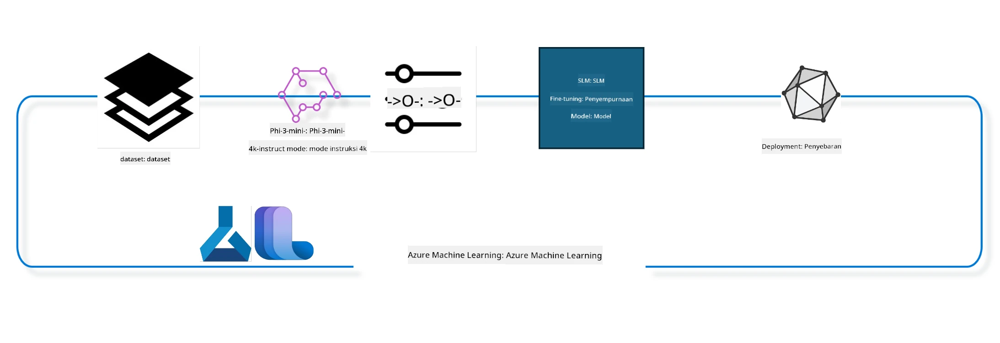

## Cara menggunakan komponen chat-completion dari registry sistem Azure ML untuk fine-tune model

Dalam contoh ini kita akan melakukan fine tuning pada model Phi-3-mini-4k-instruct untuk melengkapi percakapan antara 2 orang menggunakan dataset ultrachat_200k.



Contoh ini akan menunjukkan bagaimana melakukan fine tuning menggunakan Azure ML SDK dan Python serta kemudian menerapkan model yang telah di-fine tune ke endpoint online untuk inferensi waktu nyata.

### Data pelatihan

Kita akan menggunakan dataset ultrachat_200k. Ini adalah versi yang sangat terfilter dari dataset UltraChat dan digunakan untuk melatih Zephyr-7B-β, model chat 7b mutakhir.

### Model

Kita akan menggunakan model Phi-3-mini-4k-instruct untuk menunjukkan bagaimana pengguna bisa melakukan fine tune model untuk tugas chat-completion. Jika Anda membuka notebook ini dari kartu model tertentu, ingat untuk mengganti nama model tersebut.

### Tugas

- Pilih model untuk di-fine tune.
- Pilih dan jelajahi data pelatihan.
- Konfigurasikan pekerjaan fine tuning.
- Jalankan pekerjaan fine tuning.
- Tinjau metrik pelatihan dan evaluasi.
- Daftarkan model yang sudah di-fine tune.
- Deploy model yang sudah di-fine tune untuk inferensi waktu nyata.
- Bersihkan sumber daya.

## 1. Siapkan prasyarat

- Instal dependensi
- Hubungkan ke AzureML Workspace. Pelajari lebih lanjut di set up SDK authentication. Ganti <WORKSPACE_NAME>, <RESOURCE_GROUP> dan <SUBSCRIPTION_ID> di bawah.
- Hubungkan ke sistem registry azureml
- Tetapkan nama eksperimen opsional
- Periksa atau buat compute.

> [!NOTE]
> Persyaratan sebuah node GPU tunggal bisa memiliki beberapa kartu GPU. Contohnya, pada satu node Standard_NC24rs_v3 terdapat 4 GPU NVIDIA V100 sedangkan pada Standard_NC12s_v3 terdapat 2 GPU NVIDIA V100. Lihat dokumentasi untuk informasi ini. Jumlah kartu GPU per node diatur pada parameter gpus_per_node di bawah. Pengaturan nilai ini dengan benar akan memastikan pemanfaatan semua GPU dalam node. SKU compute GPU yang direkomendasikan dapat ditemukan di sini dan di sini.

### Perpustakaan Python

Instal dependensi dengan menjalankan sel di bawah. Ini bukan langkah opsional jika menjalankan di lingkungan baru.

```bash
pip install azure-ai-ml
pip install azure-identity
pip install datasets==2.9.0
pip install mlflow
pip install azureml-mlflow
```

### Berinteraksi dengan Azure ML

1. Script Python ini digunakan untuk berinteraksi dengan layanan Azure Machine Learning (Azure ML). Berikut adalah rinciannya:

    - Mengimpor modul yang diperlukan dari paket azure.ai.ml, azure.identity, dan azure.ai.ml.entities. Juga mengimpor modul time.

    - Mencoba mengautentikasi dengan DefaultAzureCredential(), yang menyediakan pengalaman autentikasi yang disederhanakan untuk mulai mengembangkan aplikasi yang dijalankan di cloud Azure. Jika gagal, akan beralih ke InteractiveBrowserCredential(), yang menyediakan prompt login interaktif.

    - Kemudian mencoba membuat instance MLClient menggunakan metode from_config, yang membaca konfigurasi dari file config standar (config.json). Jika gagal, membuat instance MLClient secara manual dengan menyediakan subscription_id, resource_group_name, dan workspace_name.

    - Membuat instance MLClient lain, kali ini untuk registry Azure ML bernama "azureml". Registry ini adalah tempat model, pipeline fine-tuning, dan environment disimpan.

    - Menetapkan experiment_name menjadi "chat_completion_Phi-3-mini-4k-instruct".

    - Menghasilkan timestamp unik dengan mengonversi waktu saat ini (dalam detik sejak epoch, sebagai angka floating) menjadi integer dan kemudian string. Timestamp ini dapat digunakan untuk membuat nama dan versi yang unik.

    ```python
    # Impor modul yang diperlukan dari Azure ML dan Azure Identity
    from azure.ai.ml import MLClient
    from azure.identity import (
        DefaultAzureCredential,
        InteractiveBrowserCredential,
    )
    from azure.ai.ml.entities import AmlCompute
    import time  # Impor modul time
    
    # Coba autentikasi menggunakan DefaultAzureCredential
    try:
        credential = DefaultAzureCredential()
        credential.get_token("https://management.azure.com/.default")
    except Exception as ex:  # Jika DefaultAzureCredential gagal, gunakan InteractiveBrowserCredential
        credential = InteractiveBrowserCredential()
    
    # Coba buat instance MLClient menggunakan file konfigurasi default
    try:
        workspace_ml_client = MLClient.from_config(credential=credential)
    except:  # Jika itu gagal, buat instance MLClient dengan memberikan detail secara manual
        workspace_ml_client = MLClient(
            credential,
            subscription_id="<SUBSCRIPTION_ID>",
            resource_group_name="<RESOURCE_GROUP>",
            workspace_name="<WORKSPACE_NAME>",
        )
    
    # Buat instance MLClient lain untuk registri Azure ML bernama "azureml"
    # Registri ini tempat model, pipeline fine-tuning, dan lingkungan disimpan
    registry_ml_client = MLClient(credential, registry_name="azureml")
    
    # Tetapkan nama eksperimen
    experiment_name = "chat_completion_Phi-3-mini-4k-instruct"
    
    # Hasilkan timestamp unik yang dapat digunakan untuk nama dan versi yang harus unik
    timestamp = str(int(time.time()))
    ```

## 2. Pilih model dasar untuk fine tune

1. Phi-3-mini-4k-instruct adalah model ringan dengan 3,8 miliar parameter, model mutakhir terbuka yang dibangun berdasarkan dataset yang digunakan untuk Phi-2. Model ini termasuk keluarga model Phi-3, dan versi Mini tersedia dalam dua varian 4K dan 128K yang merupakan panjang konteks (dalam token) yang bisa didukung, kita perlu melakukan fine tune model ini untuk tujuan khusus kita agar dapat digunakan. Anda dapat menelusuri model-model ini di Katalog Model di AzureML Studio, dengan filter tugas chat-completion. Dalam contoh ini, kita menggunakan model Phi-3-mini-4k-instruct. Jika Anda membuka notebook ini untuk model yang berbeda, ganti nama dan versi model sesuai kebutuhan.

> [!NOTE]
> properti id model dari model tersebut. Ini akan diteruskan sebagai input untuk pekerjaan fine tuning. Ini juga tersedia sebagai field Asset ID di halaman detail model di Katalog Model AzureML Studio.

2. Script Python ini berinteraksi dengan layanan Azure Machine Learning (Azure ML). Berikut rincian yang dilakukan:

    - Menetapkan model_name menjadi "Phi-3-mini-4k-instruct".

    - Menggunakan metode get dari properti models pada objek registry_ml_client untuk mengambil versi terbaru dari model dengan nama yang ditentukan dari registry Azure ML. Metode get dipanggil dengan dua argumen: nama model dan label yang menunjukkan bahwa versi terbaru model yang akan diambil.

    - Mencetak pesan ke konsol yang menunjukkan nama, versi, dan id model yang akan digunakan untuk fine-tuning. Metode format dari string digunakan untuk memasukkan nama, versi, dan id model ke dalam pesan. Nama, versi, dan id model diakses sebagai properti dari objek foundation_model.

    ```python
    # Atur nama model
    model_name = "Phi-3-mini-4k-instruct"
    
    # Dapatkan versi terbaru dari model dari registry Azure ML
    foundation_model = registry_ml_client.models.get(model_name, label="latest")
    
    # Cetak nama model, versi, dan id
    # Informasi ini berguna untuk pelacakan dan debugging
    print(
        "\n\nUsing model name: {0}, version: {1}, id: {2} for fine tuning".format(
            foundation_model.name, foundation_model.version, foundation_model.id
        )
    )
    ```

## 3. Buat compute yang akan digunakan dengan pekerjaan

Pekerjaan fine tune hanya bisa bekerja dengan compute GPU. Ukuran compute tergantung seberapa besar modelnya dan dalam banyak kasus sulit untuk menentukan compute yang tepat untuk pekerjaan tersebut. Pada sel ini, kami memandu pengguna memilih compute yang tepat untuk pekerjaan ini.

> [!NOTE]
> Compute yang tercantum di bawah bekerja dengan konfigurasi yang paling optimal. Perubahan apapun pada konfigurasi bisa menyebabkan error Cuda Out Of Memory. Dalam kasus seperti itu, coba tingkatkan compute ke ukuran yang lebih besar.

> [!NOTE]
> Saat memilih compute_cluster_size di bawah, pastikan compute tersedia di resource group Anda. Jika compute tertentu tidak tersedia Anda bisa meminta akses ke sumber daya compute tersebut.

### Memeriksa Model untuk Dukungan Fine Tuning

1. Script Python ini berinteraksi dengan model Azure Machine Learning (Azure ML). Berikut rinciannya:

    - Mengimpor modul ast, yang menyediakan fungsi untuk memproses pohon sintaks abstrak Python.

    - Memeriksa apakah objek foundation_model (yang mewakili model di Azure ML) memiliki tag bernama finetune_compute_allow_list. Tag di Azure ML adalah pasangan kunci-nilai yang dapat dibuat dan digunakan untuk menyaring dan mengurutkan model.

    - Jika tag finetune_compute_allow_list ada, menggunakan fungsi ast.literal_eval untuk mengurai nilai tag (sebuah string) dengan aman menjadi list Python. List ini kemudian ditugaskan ke variabel computes_allow_list. Kemudian mencetak pesan yang menunjukkan bahwa compute harus dibuat dari daftar tersebut.

    - Jika tag finetune_compute_allow_list tidak ada, mengatur computes_allow_list menjadi None dan mencetak pesan yang menunjukkan tag finetune_compute_allow_list tidak merupakan bagian dari tag model.

    - Singkatnya, script ini memeriksa keberadaan tag tertentu dalam metadata model, mengonversi nilai tag menjadi list jika ada, dan memberikan umpan balik ke pengguna sesuai.

    ```python
    # Impor modul ast, yang menyediakan fungsi untuk memproses pohon dari tata bahasa abstrak sintaks Python
    import ast
    
    # Periksa apakah tag 'finetune_compute_allow_list' ada dalam tag model
    if "finetune_compute_allow_list" in foundation_model.tags:
        # Jika tag ada, gunakan ast.literal_eval untuk dengan aman mengurai nilai tag (string) menjadi daftar Python
        computes_allow_list = ast.literal_eval(
            foundation_model.tags["finetune_compute_allow_list"]
        )  # mengubah string menjadi daftar python
        # Cetak pesan yang menunjukkan bahwa sebuah compute harus dibuat dari daftar
        print(f"Please create a compute from the above list - {computes_allow_list}")
    else:
        # Jika tag tidak ada, atur computes_allow_list menjadi None
        computes_allow_list = None
        # Cetak pesan yang menunjukkan bahwa tag 'finetune_compute_allow_list' bukan bagian dari tag model
        print("`finetune_compute_allow_list` is not part of model tags")
    ```

### Memeriksa Compute Instance

1. Script Python ini berinteraksi dengan layanan Azure Machine Learning (Azure ML) dan melakukan beberapa pemeriksaan pada instance compute. Berikut rinciannya:

    - Mencoba mengambil instance compute dengan nama yang tersimpan di compute_cluster dari workspace Azure ML. Jika status provisioning compute instance adalah "failed", maka menghasilkan ValueError.

    - Memeriksa apakah computes_allow_list tidak None. Jika tidak, mengonversi semua ukuran compute dalam daftar menjadi huruf kecil dan memeriksa apakah ukuran compute instance saat ini ada di daftar. Jika tidak, menghasilkan ValueError.

    - Jika computes_allow_list adalah None, memeriksa apakah ukuran compute instance ada dalam daftar ukuran VM GPU yang tidak didukung. Jika iya, menghasilkan ValueError.

    - Mengambil daftar semua ukuran compute yang tersedia di workspace. Kemudian mengiterasi daftar tersebut, dan untuk setiap ukuran compute, memeriksa apakah namanya cocok dengan ukuran compute instance saat ini. Jika cocok, mengambil jumlah GPU untuk ukuran compute tersebut dan menetapkan gpu_count_found menjadi True.

    - Jika gpu_count_found True, mencetak jumlah GPU pada compute instance. Jika tidak, menghasilkan ValueError.

    - Singkatnya, script ini melakukan beberapa pemeriksaan pada instance compute di workspace Azure ML, termasuk memeriksa status provisioning, ukurannya terhadap daftar allow atau deny, dan jumlah GPU yang dimiliki.

    ```python
    # Cetak pesan pengecualian
    print(e)
    # Naikkan ValueError jika ukuran komputasi tidak tersedia di workspace
    raise ValueError(
        f"WARNING! Compute size {compute_cluster_size} not available in workspace"
    )
    
    # Ambil instance komputasi dari workspace Azure ML
    compute = workspace_ml_client.compute.get(compute_cluster)
    # Periksa apakah status penyediaan instance komputasi adalah "gagal"
    if compute.provisioning_state.lower() == "failed":
        # Naikkan ValueError jika status penyediaan adalah "gagal"
        raise ValueError(
            f"Provisioning failed, Compute '{compute_cluster}' is in failed state. "
            f"please try creating a different compute"
        )
    
    # Periksa apakah computes_allow_list tidak None
    if computes_allow_list is not None:
        # Ubah semua ukuran komputasi di computes_allow_list menjadi huruf kecil
        computes_allow_list_lower_case = [x.lower() for x in computes_allow_list]
        # Periksa apakah ukuran instance komputasi ada di computes_allow_list_lower_case
        if compute.size.lower() not in computes_allow_list_lower_case:
            # Naikkan ValueError jika ukuran instance komputasi tidak ada di computes_allow_list_lower_case
            raise ValueError(
                f"VM size {compute.size} is not in the allow-listed computes for finetuning"
            )
    else:
        # Definisikan daftar ukuran VM GPU yang tidak didukung
        unsupported_gpu_vm_list = [
            "standard_nc6",
            "standard_nc12",
            "standard_nc24",
            "standard_nc24r",
        ]
        # Periksa apakah ukuran instance komputasi ada di unsupported_gpu_vm_list
        if compute.size.lower() in unsupported_gpu_vm_list:
            # Naikkan ValueError jika ukuran instance komputasi ada di unsupported_gpu_vm_list
            raise ValueError(
                f"VM size {compute.size} is currently not supported for finetuning"
            )
    
    # Inisialisasi flag untuk memeriksa apakah jumlah GPU di instance komputasi telah ditemukan
    gpu_count_found = False
    # Ambil daftar semua ukuran komputasi yang tersedia di workspace
    workspace_compute_sku_list = workspace_ml_client.compute.list_sizes()
    available_sku_sizes = []
    # Iterasi melalui daftar ukuran komputasi yang tersedia
    for compute_sku in workspace_compute_sku_list:
        available_sku_sizes.append(compute_sku.name)
        # Periksa apakah nama ukuran komputasi cocok dengan ukuran instance komputasi
        if compute_sku.name.lower() == compute.size.lower():
            # Jika ya, ambil jumlah GPU untuk ukuran komputasi itu dan setel gpu_count_found ke True
            gpus_per_node = compute_sku.gpus
            gpu_count_found = True
    # Jika gpu_count_found True, cetak jumlah GPU di instance komputasi
    if gpu_count_found:
        print(f"Number of GPU's in compute {compute.size}: {gpus_per_node}")
    else:
        # Jika gpu_count_found False, naikkan ValueError
        raise ValueError(
            f"Number of GPU's in compute {compute.size} not found. Available skus are: {available_sku_sizes}."
            f"This should not happen. Please check the selected compute cluster: {compute_cluster} and try again."
        )
    ```

## 4. Pilih dataset untuk fine tuning model

1. Kita menggunakan dataset ultrachat_200k. Dataset ini memiliki empat bagian, cocok untuk Supervised fine-tuning (sft).
Ranking generasi (gen). Jumlah contoh per bagian ditampilkan sebagai berikut:

    ```bash
    train_sft test_sft  train_gen  test_gen
    207865  23110  256032  28304
    ```

1. Sel berikut menunjukkan persiapan data dasar untuk fine tuning:

### Visualisasikan beberapa baris data

Kita ingin sampel ini berjalan cepat, jadi simpan file train_sft, test_sft yang hanya berisi 5% dari baris yang sudah dipangkas. Ini berarti model yang di-fine tune akan memiliki akurasi lebih rendah, sehingga sebaiknya tidak digunakan untuk keperluan dunia nyata.
download-dataset.py digunakan untuk mengunduh dataset ultrachat_200k dan mengubah dataset ke format yang bisa dikonsumsi oleh komponen pipeline fine tune. Karena dataset ini besar, kita hanya memiliki sebagian dataset di sini.

1. Menjalankan skrip di bawah hanya mengunduh 5% data. Ini dapat ditingkatkan dengan mengubah parameter dataset_split_pc ke persentase yang diinginkan.

> [!NOTE]
> Beberapa model bahasa memiliki kode bahasa yang berbeda sehingga nama kolom di dataset harus mencerminkan hal tersebut.

1. Berikut contoh bagaimana data tersebut terlihat
Dataset chat-completion disimpan dalam format parquet dengan setiap entri menggunakan skema berikut:

    - Ini adalah dokumen JSON (JavaScript Object Notation), format pertukaran data populer. Ini bukan kode yang dapat dijalankan, melainkan cara menyimpan dan mentransport data. Berikut rinciannya:

    - "prompt": Kunci ini berisi nilai string yang mewakili tugas atau pertanyaan yang diajukan ke asisten AI.

    - "messages": Kunci ini berisi array objek. Setiap objek mewakili sebuah pesan dalam percakapan antara pengguna dan asisten AI. Setiap objek pesan memiliki dua kunci:

    - "content": Kunci ini berisi nilai string yang merupakan isi pesan.
    - "role": Kunci ini berisi nilai string yang menunjukkan peran entitas yang mengirim pesan. Bisa "user" atau "assistant".
    - "prompt_id": Kunci ini berisi nilai string yang merupakan pengenal unik untuk prompt tersebut.

1. Dalam dokumen JSON spesifik ini, sebuah percakapan direpresentasikan di mana seorang pengguna meminta asisten AI untuk membuat protagonis untuk cerita distopia. Asisten merespons, kemudian pengguna meminta detail lebih lanjut. Asisten setuju memberikan detail lebih lanjut. Seluruh percakapan terkait dengan prompt id tertentu.

    ```python
    {
        // The task or question posed to an AI assistant
        "prompt": "Create a fully-developed protagonist who is challenged to survive within a dystopian society under the rule of a tyrant. ...",
        
        // An array of objects, each representing a message in a conversation between a user and an AI assistant
        "messages":[
            {
                // The content of the user's message
                "content": "Create a fully-developed protagonist who is challenged to survive within a dystopian society under the rule of a tyrant. ...",
                // The role of the entity that sent the message
                "role": "user"
            },
            {
                // The content of the assistant's message
                "content": "Name: Ava\n\n Ava was just 16 years old when the world as she knew it came crashing down. The government had collapsed, leaving behind a chaotic and lawless society. ...",
                // The role of the entity that sent the message
                "role": "assistant"
            },
            {
                // The content of the user's message
                "content": "Wow, Ava's story is so intense and inspiring! Can you provide me with more details.  ...",
                // The role of the entity that sent the message
                "role": "user"
            }, 
            {
                // The content of the assistant's message
                "content": "Certainly! ....",
                // The role of the entity that sent the message
                "role": "assistant"
            }
        ],
        
        // A unique identifier for the prompt
        "prompt_id": "d938b65dfe31f05f80eb8572964c6673eddbd68eff3db6bd234d7f1e3b86c2af"
    }
    ```

### Unduh Data

1. Script Python ini digunakan untuk mengunduh dataset menggunakan skrip pembantu bernama download-dataset.py. Berikut rinciannya:

    - Mengimpor modul os, yang menyediakan cara portabel menggunakan fungsi sistem operasi.

    - Menggunakan fungsi os.system untuk menjalankan skrip download-dataset.py di shell dengan argumen baris perintah spesifik. Argumen menentukan dataset yang diunduh (HuggingFaceH4/ultrachat_200k), direktori tujuan unduhan (ultrachat_200k_dataset), dan persentase dataset yang diambil (5). Fungsi os.system mengembalikan status keluar perintah yang dijalankan; status ini disimpan di variabel exit_status.

    - Memeriksa apakah exit_status tidak sama dengan 0. Dalam sistem operasi mirip Unix, status keluar 0 biasanya menandakan perintah berhasil, sedangkan angka lain menandakan error. Jika exit_status tidak 0, maka melempar Exception dengan pesan error dalam mengunduh dataset.

    - Singkatnya, script ini menjalankan perintah untuk mengunduh dataset menggunakan skrip pembantu, dan melempar exception jika perintah gagal.

    ```python
    # Impor modul os, yang menyediakan cara untuk menggunakan fungsionalitas tergantung pada sistem operasi
    import os
    
    # Gunakan fungsi os.system untuk menjalankan skrip download-dataset.py di shell dengan argumen baris perintah tertentu
    # Argumen tersebut menentukan dataset yang akan diunduh (HuggingFaceH4/ultrachat_200k), direktori tempat mengunduhnya (ultrachat_200k_dataset), dan persentase pembagian dataset (5)
    # Fungsi os.system mengembalikan status keluar dari perintah yang dijalankannya; status ini disimpan dalam variabel exit_status
    exit_status = os.system(
        "python ./download-dataset.py --dataset HuggingFaceH4/ultrachat_200k --download_dir ultrachat_200k_dataset --dataset_split_pc 5"
    )
    
    # Periksa jika exit_status tidak sama dengan 0
    # Di sistem operasi mirip Unix, status keluar 0 biasanya menunjukkan bahwa perintah berhasil, sementara nomor lain menunjukkan ada kesalahan
    # Jika exit_status bukan 0, lemparkan Exception dengan pesan yang menunjukkan bahwa terjadi kesalahan saat mengunduh dataset
    if exit_status != 0:
        raise Exception("Error downloading dataset")
    ```

### Memuat Data ke dalam DataFrame
1. Skrip Python ini memuat berkas JSON Lines ke dalam DataFrame pandas dan menampilkan 5 baris pertama. Berikut penjelasan dari apa yang dilakukan:

    - Ini mengimpor pustaka pandas, yang merupakan pustaka manipulasi dan analisis data yang kuat.

    - Ini mengatur lebar kolom maksimum untuk opsi tampilan pandas ke 0. Ini berarti teks lengkap setiap kolom akan ditampilkan tanpa pemotongan saat DataFrame dicetak.

    - Ini menggunakan fungsi pd.read_json untuk memuat berkas train_sft.jsonl dari direktori ultrachat_200k_dataset ke dalam DataFrame. Argumen lines=True menunjukkan bahwa berkas tersebut dalam format JSON Lines, di mana setiap baris adalah objek JSON terpisah.

    - Ini menggunakan metode head untuk menampilkan 5 baris pertama dari DataFrame. Jika DataFrame memiliki kurang dari 5 baris, maka akan menampilkan semuanya.

    - Singkatnya, skrip ini memuat berkas JSON Lines ke dalam DataFrame dan menampilkan 5 baris pertama dengan teks kolom lengkap.
    
    ```python
    # Impor pustaka pandas, yang merupakan pustaka manipulasi dan analisis data yang kuat
    import pandas as pd
    
    # Atur lebar kolom maksimum untuk opsi tampilan pandas ke 0
    # Ini berarti teks penuh dari setiap kolom akan ditampilkan tanpa pemendekan saat DataFrame dicetak
    pd.set_option("display.max_colwidth", 0)
    
    # Gunakan fungsi pd.read_json untuk memuat file train_sft.jsonl dari direktori ultrachat_200k_dataset ke dalam DataFrame
    # Argumen lines=True menunjukkan bahwa file dalam format JSON Lines, di mana setiap baris adalah objek JSON yang terpisah
    df = pd.read_json("./ultrachat_200k_dataset/train_sft.jsonl", lines=True)
    
    # Gunakan metode head untuk menampilkan 5 baris pertama dari DataFrame
    # Jika DataFrame memiliki kurang dari 5 baris, maka semua baris akan ditampilkan
    df.head()
    ```

## 5. Kirim pekerjaan fine tuning menggunakan model dan data sebagai input

Buat pekerjaan yang menggunakan komponen pipeline chat-completion. Pelajari lebih lanjut tentang semua parameter yang didukung untuk fine tuning.

### Definisikan parameter finetune

1. Parameter finetune dapat dikelompokkan menjadi 2 kategori - parameter pelatihan, parameter optimasi

1. Parameter pelatihan mendefinisikan aspek pelatihan seperti -

    - Optimizer, scheduler yang digunakan
    - Metrik untuk mengoptimalkan fine tune
    - Jumlah langkah pelatihan dan ukuran batch dan sebagainya
    - Parameter optimasi membantu dalam mengoptimalkan memori GPU dan menggunakan sumber daya komputasi secara efektif.

1. Berikut beberapa parameter yang termasuk dalam kategori ini. Parameter optimasi berbeda untuk setiap model dan dikemas dengan model untuk menangani variasi tersebut.

    - Aktifkan deepspeed dan LoRA
    - Aktifkan pelatihan presisi campuran
    - Aktifkan pelatihan multi-node

> [!NOTE]
> Fine tuning terawasi dapat menyebabkan hilangnya alignment atau pelupaan katastropik. Kami menyarankan untuk memeriksa masalah ini dan menjalankan tahap alignment setelah Anda melakukan fine tune.

### Parameter Fine Tuning

1. Skrip Python ini mengatur parameter untuk fine tuning model pembelajaran mesin. Berikut penjelasan dari apa yang dilakukan:

    - Mengatur parameter pelatihan default seperti jumlah epoch pelatihan, ukuran batch untuk pelatihan dan evaluasi, learning rate, dan tipe scheduler learning rate.

    - Mengatur parameter optimasi default seperti apakah akan menerapkan Layer-wise Relevance Propagation (LoRa) dan DeepSpeed, dan tahap DeepSpeed.

    - Menggabungkan parameter pelatihan dan optimasi menjadi satu dictionary bernama finetune_parameters.

    - Memeriksa apakah foundation_model memiliki parameter default khusus model. Jika ya, mencetak pesan peringatan dan memperbarui dictionary finetune_parameters dengan default khusus model tersebut. Fungsi ast.literal_eval digunakan untuk mengonversi default khusus model dari string menjadi dictionary Python.

    - Mencetak set parameter fine tuning akhir yang akan digunakan untuk proses running.

    - Singkatnya, skrip ini mengatur dan menampilkan parameter untuk fine tuning model pembelajaran mesin dengan kemampuan untuk mengganti parameter default dengan parameter khusus model.

    ```python
    # Atur parameter pelatihan default seperti jumlah epoch pelatihan, ukuran batch untuk pelatihan dan evaluasi, tingkat pembelajaran, dan jenis penjadwal tingkat pembelajaran
    training_parameters = dict(
        num_train_epochs=3,
        per_device_train_batch_size=1,
        per_device_eval_batch_size=1,
        learning_rate=5e-6,
        lr_scheduler_type="cosine",
    )
    
    # Atur parameter optimasi default seperti apakah akan menerapkan Layer-wise Relevance Propagation (LoRa) dan DeepSpeed, serta tahap DeepSpeed
    optimization_parameters = dict(
        apply_lora="true",
        apply_deepspeed="true",
        deepspeed_stage=2,
    )
    
    # Gabungkan parameter pelatihan dan optimasi ke dalam satu dictionary yang disebut finetune_parameters
    finetune_parameters = {**training_parameters, **optimization_parameters}
    
    # Periksa apakah foundation_model memiliki parameter default spesifik model
    # Jika iya, cetak pesan peringatan dan perbarui dictionary finetune_parameters dengan default spesifik model tersebut
    # Fungsi ast.literal_eval digunakan untuk mengubah default spesifik model dari string menjadi dictionary Python
    if "model_specific_defaults" in foundation_model.tags:
        print("Warning! Model specific defaults exist. The defaults could be overridden.")
        finetune_parameters.update(
            ast.literal_eval(  # mengubah string menjadi dict python
                foundation_model.tags["model_specific_defaults"]
            )
        )
    
    # Cetak set parameter tuning akhir yang akan digunakan untuk menjalankan proses
    print(
        f"The following finetune parameters are going to be set for the run: {finetune_parameters}"
    )
    ```

### Pipeline Pelatihan

1. Skrip Python ini mendefinisikan fungsi untuk menghasilkan nama tampilan untuk pipeline pelatihan pembelajaran mesin, kemudian memanggil fungsi ini untuk menghasilkan dan mencetak nama tampilan. Berikut penjelasan dari apa yang dilakukan:

1. Fungsi get_pipeline_display_name didefinisikan. Fungsi ini menghasilkan nama tampilan berdasarkan berbagai parameter terkait pipeline pelatihan.

1. Di dalam fungsi, ia menghitung total ukuran batch dengan mengalikan ukuran batch per perangkat, jumlah langkah akumulasi gradien, jumlah GPU per node, dan jumlah node yang digunakan untuk fine tuning.

1. Ia mengambil berbagai parameter lain seperti tipe scheduler learning rate, apakah DeepSpeed diterapkan, tahap DeepSpeed, apakah Layer-wise Relevance Propagation (LoRa) diterapkan, batas jumlah model checkpoint yang disimpan, dan panjang urutan maksimum.

1. Ia membangun string yang mencakup semua parameter ini, dipisahkan dengan tanda hubung. Jika DeepSpeed atau LoRa diterapkan, string menyertakan "ds" diikuti dengan tahap DeepSpeed, atau "lora", masing-masing. Jika tidak, string menyertakan "nods" atau "nolora", masing-masing.

1. Fungsi mengembalikan string ini, yang berfungsi sebagai nama tampilan untuk pipeline pelatihan.

1. Setelah fungsi didefinisikan, fungsi tersebut dipanggil untuk menghasilkan nama tampilan, yang kemudian dicetak.

1. Singkatnya, skrip ini menghasilkan nama tampilan untuk pipeline pelatihan pembelajaran mesin berdasarkan berbagai parameter, kemudian mencetak nama tampilan tersebut.

    ```python
    # Definisikan fungsi untuk menghasilkan nama tampilan untuk pipeline pelatihan
    def get_pipeline_display_name():
        # Hitung total ukuran batch dengan mengalikan ukuran batch per perangkat, jumlah langkah akumulasi gradien, jumlah GPU per node, dan jumlah node yang digunakan untuk fine-tuning
        batch_size = (
            int(finetune_parameters.get("per_device_train_batch_size", 1))
            * int(finetune_parameters.get("gradient_accumulation_steps", 1))
            * int(gpus_per_node)
            * int(finetune_parameters.get("num_nodes_finetune", 1))
        )
        # Ambil jenis penjadwal learning rate
        scheduler = finetune_parameters.get("lr_scheduler_type", "linear")
        # Ambil apakah DeepSpeed diterapkan
        deepspeed = finetune_parameters.get("apply_deepspeed", "false")
        # Ambil tahap DeepSpeed
        ds_stage = finetune_parameters.get("deepspeed_stage", "2")
        # Jika DeepSpeed diterapkan, sertakan "ds" diikuti oleh tahap DeepSpeed dalam nama tampilan; jika tidak, sertakan "nods"
        if deepspeed == "true":
            ds_string = f"ds{ds_stage}"
        else:
            ds_string = "nods"
        # Ambil apakah Layer-wise Relevance Propagation (LoRa) diterapkan
        lora = finetune_parameters.get("apply_lora", "false")
        # Jika LoRa diterapkan, sertakan "lora" dalam nama tampilan; jika tidak, sertakan "nolora"
        if lora == "true":
            lora_string = "lora"
        else:
            lora_string = "nolora"
        # Ambil batas jumlah checkpoint model yang disimpan
        save_limit = finetune_parameters.get("save_total_limit", -1)
        # Ambil panjang maksimum urutan
        seq_len = finetune_parameters.get("max_seq_length", -1)
        # Buat nama tampilan dengan menggabungkan semua parameter ini, dipisahkan oleh tanda hubung
        return (
            model_name
            + "-"
            + "ultrachat"
            + "-"
            + f"bs{batch_size}"
            + "-"
            + f"{scheduler}"
            + "-"
            + ds_string
            + "-"
            + lora_string
            + f"-save_limit{save_limit}"
            + f"-seqlen{seq_len}"
        )
    
    # Panggil fungsi untuk menghasilkan nama tampilan
    pipeline_display_name = get_pipeline_display_name()
    # Cetak nama tampilan
    print(f"Display name used for the run: {pipeline_display_name}")
    ```

### Mengonfigurasi Pipeline

Skrip Python ini mendefinisikan dan mengonfigurasi pipeline pembelajaran mesin menggunakan Azure Machine Learning SDK. Berikut penjelasan dari apa yang dilakukan:

1. Mengimpor modul yang diperlukan dari Azure AI ML SDK.

1. Mengambil komponen pipeline bernama "chat_completion_pipeline" dari registry.

1. Mendefinisikan pekerjaan pipeline menggunakan dekorator `@pipeline` dan fungsi `create_pipeline`. Nama pipeline disetel ke `pipeline_display_name`.

1. Di dalam fungsi `create_pipeline`, menginisialisasi komponen pipeline yang diambil dengan berbagai parameter, termasuk path model, klaster komputasi untuk berbagai tahap, pembagian dataset untuk pelatihan dan pengujian, jumlah GPU yang digunakan untuk fine tuning, dan parameter fine tuning lainnya.

1. Memetakan keluaran pekerjaan fine tuning ke keluaran pekerjaan pipeline. Ini dilakukan agar model yang sudah di-fine tune dapat dengan mudah didaftarkan, yang diperlukan untuk menerapkan model ke endpoint online atau batch.

1. Membuat instance pipeline dengan memanggil fungsi `create_pipeline`.

1. Menyetel pengaturan `force_rerun` dari pipeline ke `True`, yang berarti hasil cache dari pekerjaan sebelumnya tidak akan digunakan.

1. Menyetel pengaturan `continue_on_step_failure` dari pipeline ke `False`, yang berarti pipeline akan berhenti jika ada langkah yang gagal.

1. Singkatnya, skrip ini mendefinisikan dan mengonfigurasi pipeline pembelajaran mesin untuk tugas chat completion menggunakan Azure Machine Learning SDK.

    ```python
    # Impor modul yang diperlukan dari Azure AI ML SDK
    from azure.ai.ml.dsl import pipeline
    from azure.ai.ml import Input
    
    # Ambil komponen pipeline bernama "chat_completion_pipeline" dari registry
    pipeline_component_func = registry_ml_client.components.get(
        name="chat_completion_pipeline", label="latest"
    )
    
    # Definisikan job pipeline menggunakan dekorator @pipeline dan fungsi create_pipeline
    # Nama pipeline diatur ke pipeline_display_name
    @pipeline(name=pipeline_display_name)
    def create_pipeline():
        # Inisialisasi komponen pipeline yang diambil dengan berbagai parameter
        # Ini termasuk path model, cluster komputasi untuk berbagai tahap, pembagian dataset untuk pelatihan dan pengujian, jumlah GPU yang digunakan untuk fine-tuning, dan parameter fine-tuning lainnya
        chat_completion_pipeline = pipeline_component_func(
            mlflow_model_path=foundation_model.id,
            compute_model_import=compute_cluster,
            compute_preprocess=compute_cluster,
            compute_finetune=compute_cluster,
            compute_model_evaluation=compute_cluster,
            # Pemetaan pembagian dataset ke parameter
            train_file_path=Input(
                type="uri_file", path="./ultrachat_200k_dataset/train_sft.jsonl"
            ),
            test_file_path=Input(
                type="uri_file", path="./ultrachat_200k_dataset/test_sft.jsonl"
            ),
            # Pengaturan pelatihan
            number_of_gpu_to_use_finetuning=gpus_per_node,  # Diatur ke jumlah GPU yang tersedia di komputasi
            **finetune_parameters
        )
        return {
            # Pemetaan output dari job fine tuning ke output job pipeline
            # Ini dilakukan agar kita dapat dengan mudah mendaftarkan model yang sudah di-fine tune
            # Mendaftarkan model diperlukan untuk menerapkan model ke endpoint online atau batch
            "trained_model": chat_completion_pipeline.outputs.mlflow_model_folder
        }
    
    # Buat instance pipeline dengan memanggil fungsi create_pipeline
    pipeline_object = create_pipeline()
    
    # Jangan gunakan hasil cache dari job sebelumnya
    pipeline_object.settings.force_rerun = True
    
    # Atur continue on step failure ke False
    # Ini berarti pipeline akan berhenti jika ada langkah yang gagal
    pipeline_object.settings.continue_on_step_failure = False
    ```

### Kirim Pekerjaan

1. Skrip Python ini mengirimkan pekerjaan pipeline pembelajaran mesin ke workspace Azure Machine Learning dan kemudian menunggu pekerjaan selesai. Berikut penjelasan dari apa yang dilakukan:

    - Memanggil metode create_or_update dari objek jobs di workspace_ml_client untuk mengirimkan pekerjaan pipeline. Pipeline yang akan dijalankan ditentukan oleh pipeline_object, dan eksperimen di mana pekerjaan dijalankan ditentukan oleh experiment_name.

    - Kemudian memanggil metode stream dari objek jobs di workspace_ml_client untuk menunggu pekerjaan pipeline selesai. Pekerjaan yang ditunggu ditentukan oleh atribut name dari objek pipeline_job.

    - Singkatnya, skrip ini mengirimkan pekerjaan pipeline pembelajaran mesin ke workspace Azure Machine Learning, lalu menunggu pekerjaan selesai.

    ```python
    # Kirim pekerjaan pipeline ke workspace Azure Machine Learning
    # Pipeline yang akan dijalankan ditentukan oleh pipeline_object
    # Eksperimen di mana pekerjaan dijalankan ditentukan oleh experiment_name
    pipeline_job = workspace_ml_client.jobs.create_or_update(
        pipeline_object, experiment_name=experiment_name
    )
    
    # Tunggu sampai pekerjaan pipeline selesai
    # Pekerjaan yang ditunggu ditentukan oleh atribut name dari objek pipeline_job
    workspace_ml_client.jobs.stream(pipeline_job.name)
    ```

## 6. Daftarkan model hasil fine tuning di workspace

Kita akan mendaftarkan model dari keluaran pekerjaan fine tuning. Ini akan melacak garis keturunan antara model yang di-fine tune dan pekerjaan fine tuning. Pekerjaan fine tuning, selanjutnya, melacak garis keturunan ke foundation model, data, dan kode pelatihan.

### Mendaftarkan Model ML

1. Skrip Python ini mendaftarkan model pembelajaran mesin yang dilatih dalam pipeline Azure Machine Learning. Berikut penjelasan dari apa yang dilakukan:

    - Mengimpor modul yang diperlukan dari Azure AI ML SDK.

    - Memeriksa apakah output trained_model tersedia dari pekerjaan pipeline dengan memanggil metode get dari objek jobs di workspace_ml_client dan mengakses atribut outputs-nya.

    - Menyusun path ke model yang dilatih dengan memformat string menggunakan nama pekerjaan pipeline dan nama output ("trained_model").

    - Mendefinisikan nama untuk model fine-tuned dengan menambahkan "-ultrachat-200k" ke nama model asli dan mengganti setiap tanda garis miring dengan tanda hubung.

    - Mempersiapkan pendaftaran model dengan membuat objek Model dengan berbagai parameter, termasuk path ke model, tipe model (model MLflow), nama dan versi model, dan deskripsi model.

    - Mendaftarkan model dengan memanggil metode create_or_update dari objek models di workspace_ml_client dengan objek Model sebagai argumen.

    - Mencetak model yang sudah didaftarkan.

1. Singkatnya, skrip ini mendaftarkan model pembelajaran mesin yang dilatih dalam pipeline Azure Machine Learning.
    
    ```python
    # Impor modul yang diperlukan dari Azure AI ML SDK
    from azure.ai.ml.entities import Model
    from azure.ai.ml.constants import AssetTypes
    
    # Periksa apakah output `trained_model` tersedia dari pipeline job
    print("pipeline job outputs: ", workspace_ml_client.jobs.get(pipeline_job.name).outputs)
    
    # Bangun jalur ke model yang dilatih dengan memformat string dengan nama pipeline job dan nama output ("trained_model")
    model_path_from_job = "azureml://jobs/{0}/outputs/{1}".format(
        pipeline_job.name, "trained_model"
    )
    
    # Tentukan nama untuk model yang disesuaikan dengan menambahkan "-ultrachat-200k" ke nama model asli dan mengganti setiap garis miring dengan tanda hubung
    finetuned_model_name = model_name + "-ultrachat-200k"
    finetuned_model_name = finetuned_model_name.replace("/", "-")
    
    print("path to register model: ", model_path_from_job)
    
    # Siapkan pendaftaran model dengan membuat objek Model dengan berbagai parameter
    # Ini termasuk jalur ke model, tipe model (model MLflow), nama dan versi model, serta deskripsi model
    prepare_to_register_model = Model(
        path=model_path_from_job,
        type=AssetTypes.MLFLOW_MODEL,
        name=finetuned_model_name,
        version=timestamp,  # Gunakan timestamp sebagai versi untuk menghindari konflik versi
        description=model_name + " fine tuned model for ultrachat 200k chat-completion",
    )
    
    print("prepare to register model: \n", prepare_to_register_model)
    
    # Daftarkan model dengan memanggil metode create_or_update dari objek models di workspace_ml_client dengan objek Model sebagai argumen
    registered_model = workspace_ml_client.models.create_or_update(
        prepare_to_register_model
    )
    
    # Cetak model yang telah didaftarkan
    print("registered model: \n", registered_model)
    ```

## 7. Terapkan model fine tuned ke endpoint online

Endpoint online menyediakan API REST yang tahan lama yang dapat digunakan untuk integrasi dengan aplikasi yang perlu menggunakan model.

### Kelola Endpoint

1. Skrip Python ini membuat endpoint online terkelola di Azure Machine Learning untuk model yang sudah didaftarkan. Berikut penjelasan dari apa yang dilakukan:

    - Mengimpor modul yang diperlukan dari Azure AI ML SDK.

    - Mendefinisikan nama unik untuk endpoint online dengan menambahkan cap waktu ke string "ultrachat-completion-".

    - Mempersiapkan pembuatan endpoint online dengan membuat objek ManagedOnlineEndpoint dengan berbagai parameter, termasuk nama endpoint, deskripsi endpoint, dan mode otentikasi ("key").

    - Membuat endpoint online dengan memanggil metode begin_create_or_update dari workspace_ml_client dengan objek ManagedOnlineEndpoint sebagai argumen. Kemudian menunggu operasi pembuatan selesai dengan memanggil metode wait.

1. Singkatnya, skrip ini membuat endpoint online terkelola di Azure Machine Learning untuk model yang sudah didaftarkan.

    ```python
    # Impor modul yang diperlukan dari Azure AI ML SDK
    from azure.ai.ml.entities import (
        ManagedOnlineEndpoint,
        ManagedOnlineDeployment,
        ProbeSettings,
        OnlineRequestSettings,
    )
    
    # Tentukan nama unik untuk endpoint online dengan menambahkan cap waktu ke string "ultrachat-completion-"
    online_endpoint_name = "ultrachat-completion-" + timestamp
    
    # Siapkan untuk membuat endpoint online dengan membuat objek ManagedOnlineEndpoint dengan berbagai parameter
    # Ini termasuk nama endpoint, deskripsi endpoint, dan mode autentikasi ("key")
    endpoint = ManagedOnlineEndpoint(
        name=online_endpoint_name,
        description="Online endpoint for "
        + registered_model.name
        + ", fine tuned model for ultrachat-200k-chat-completion",
        auth_mode="key",
    )
    
    # Buat endpoint online dengan memanggil metode begin_create_or_update dari workspace_ml_client dengan objek ManagedOnlineEndpoint sebagai argumen
    # Kemudian tunggu operasi pembuatan selesai dengan memanggil metode wait
    workspace_ml_client.begin_create_or_update(endpoint).wait()
    ```

> [!NOTE]
> Anda dapat menemukan daftar SKU yang didukung untuk penerapan di sini - [Managed online endpoints SKU list](https://learn.microsoft.com/azure/machine-learning/reference-managed-online-endpoints-vm-sku-list)

### Menerapkan Model ML

1. Skrip Python ini menerapkan model pembelajaran mesin yang sudah didaftarkan ke endpoint online terkelola di Azure Machine Learning. Berikut penjelasan dari apa yang dilakukan:

    - Mengimpor modul ast, yang menyediakan fungsi untuk memproses pohon grammar sintaks abstrak Python.

    - Menetapkan tipe instance untuk penerapan menjadi "Standard_NC6s_v3".

    - Memeriksa apakah tag inference_compute_allow_list ada di foundation model. Jika ada, mengonversi nilai tag dari string ke list Python dan menetapkannya ke inference_computes_allow_list. Jika tidak ada, menetapkan inference_computes_allow_list ke None.

    - Memeriksa apakah tipe instance yang ditentukan ada dalam daftar yang diizinkan. Jika tidak, mencetak pesan yang meminta pengguna untuk memilih tipe instance dari daftar yang diizinkan.

    - Mempersiapkan pembuatan deployment dengan membuat objek ManagedOnlineDeployment dengan berbagai parameter, termasuk nama deployment, nama endpoint, ID model, tipe dan jumlah instance, pengaturan liveness probe, dan pengaturan permintaan.

    - Membuat deployment dengan memanggil metode begin_create_or_update dari workspace_ml_client dengan objek ManagedOnlineDeployment sebagai argumen. Kemudian menunggu operasi pembuatan selesai dengan memanggil metode wait.

    - Menyetel trafik endpoint untuk mengarahkan 100% trafik ke deployment "demo".

    - Memperbarui endpoint dengan memanggil metode begin_create_or_update dari workspace_ml_client dengan objek endpoint sebagai argumen. Kemudian menunggu operasi pembaruan selesai dengan memanggil metode result.

1. Singkatnya, skrip ini menerapkan model pembelajaran mesin yang sudah didaftarkan ke endpoint online terkelola di Azure Machine Learning.

    ```python
    # Impor modul ast, yang menyediakan fungsi untuk memproses pohon tata bahasa abstrak Python
    import ast
    
    # Atur tipe instance untuk penyebaran
    instance_type = "Standard_NC6s_v3"
    
    # Periksa apakah tag `inference_compute_allow_list` ada dalam model dasar
    if "inference_compute_allow_list" in foundation_model.tags:
        # Jika ada, ubah nilai tag dari string menjadi daftar Python dan tetapkan ke `inference_computes_allow_list`
        inference_computes_allow_list = ast.literal_eval(
            foundation_model.tags["inference_compute_allow_list"]
        )
        print(f"Please create a compute from the above list - {computes_allow_list}")
    else:
        # Jika tidak, setel `inference_computes_allow_list` ke `None`
        inference_computes_allow_list = None
        print("`inference_compute_allow_list` is not part of model tags")
    
    # Periksa apakah tipe instance yang ditentukan ada dalam daftar yang diizinkan
    if (
        inference_computes_allow_list is not None
        and instance_type not in inference_computes_allow_list
    ):
        print(
            f"`instance_type` is not in the allow listed compute. Please select a value from {inference_computes_allow_list}"
        )
    
    # Siapkan untuk membuat penyebaran dengan membuat objek `ManagedOnlineDeployment` dengan berbagai parameter
    demo_deployment = ManagedOnlineDeployment(
        name="demo",
        endpoint_name=online_endpoint_name,
        model=registered_model.id,
        instance_type=instance_type,
        instance_count=1,
        liveness_probe=ProbeSettings(initial_delay=600),
        request_settings=OnlineRequestSettings(request_timeout_ms=90000),
    )
    
    # Buat penyebaran dengan memanggil metode `begin_create_or_update` dari `workspace_ml_client` dengan objek `ManagedOnlineDeployment` sebagai argumen
    # Kemudian tunggu operasi pembuatan selesai dengan memanggil metode `wait`
    workspace_ml_client.online_deployments.begin_create_or_update(demo_deployment).wait()
    
    # Atur lalu lintas endpoint untuk mengarahkan 100% lalu lintas ke penyebaran "demo"
    endpoint.traffic = {"demo": 100}
    
    # Perbarui endpoint dengan memanggil metode `begin_create_or_update` dari `workspace_ml_client` dengan objek `endpoint` sebagai argumen
    # Kemudian tunggu operasi pembaruan selesai dengan memanggil metode `result`
    workspace_ml_client.begin_create_or_update(endpoint).result()
    ```

## 8. Uji endpoint dengan data sampel

Kita akan mengambil beberapa data sampel dari dataset pengujian dan mengirimkannya ke endpoint online untuk inferensi. Kemudian kita akan menampilkan label hasil scoring bersamaan dengan label ground truth.

### Membaca hasil

1. Skrip Python ini membaca berkas JSON Lines ke dalam DataFrame pandas, mengambil sampel acak, dan mengatur ulang indeks. Berikut penjelasan dari apa yang dilakukan:

    - Membaca berkas ./ultrachat_200k_dataset/test_gen.jsonl ke dalam DataFrame pandas. Fungsi read_json digunakan dengan argumen lines=True karena berkas dalam format JSON Lines, di mana setiap baris adalah objek JSON terpisah.

    - Mengambil sampel acak sebanyak 1 baris dari DataFrame. Fungsi sample digunakan dengan argumen n=1 untuk menentukan jumlah baris acak yang dipilih.

    - Mengatur ulang indeks DataFrame. Fungsi reset_index digunakan dengan argumen drop=True untuk menghapus indeks asli dan menggantinya dengan indeks baru berupa nilai integer default.

    - Menampilkan 2 baris pertama dari DataFrame menggunakan fungsi head dengan argumen 2. Namun, karena DataFrame hanya berisi satu baris setelah sampling, ini hanya akan menampilkan satu baris tersebut.

1. Singkatnya, skrip ini membaca berkas JSON Lines ke dalam DataFrame pandas, mengambil sampel acak 1 baris, mengatur ulang indeks, dan menampilkan baris pertama.
    
    ```python
    # Impor pustaka pandas
    import pandas as pd
    
    # Baca file JSON Lines './ultrachat_200k_dataset/test_gen.jsonl' ke dalam DataFrame pandas
    # Argumen 'lines=True' menunjukkan bahwa file tersebut dalam format JSON Lines, di mana setiap baris adalah objek JSON yang terpisah
    test_df = pd.read_json("./ultrachat_200k_dataset/test_gen.jsonl", lines=True)
    
    # Ambil sampel acak sebanyak 1 baris dari DataFrame
    # Argumen 'n=1' menentukan jumlah baris acak yang akan dipilih
    test_df = test_df.sample(n=1)
    
    # Reset indeks DataFrame
    # Argumen 'drop=True' menunjukkan bahwa indeks asli harus dihapus dan digantikan dengan indeks baru berupa nilai integer default
    # Argumen 'inplace=True' menunjukkan bahwa DataFrame harus dimodifikasi secara langsung (tanpa membuat objek baru)
    test_df.reset_index(drop=True, inplace=True)
    
    # Tampilkan 2 baris pertama dari DataFrame
    # Namun, karena DataFrame hanya berisi satu baris setelah pengambilan sampel, maka hanya baris tersebut yang akan ditampilkan
    test_df.head(2)
    ```

### Buat Objek JSON
1. Skrip Python ini membuat objek JSON dengan parameter tertentu dan menyimpannya ke dalam file. Berikut adalah penjelasan dari apa yang dilakukan:

    - Mengimpor modul json, yang menyediakan fungsi untuk bekerja dengan data JSON.

    - Membuat dictionary parameters dengan kunci dan nilai yang mewakili parameter untuk model pembelajaran mesin. Kunci-kuncinya adalah "temperature", "top_p", "do_sample", dan "max_new_tokens", dengan nilai masing-masing 0.6, 0.9, True, dan 200.

    - Membuat dictionary lain bernama test_json dengan dua kunci: "input_data" dan "params". Nilai dari "input_data" adalah dictionary lain dengan kunci "input_string" dan "parameters". Nilai dari "input_string" adalah daftar yang berisi pesan pertama dari DataFrame test_df. Nilai dari "parameters" adalah dictionary parameters yang dibuat sebelumnya. Nilai dari "params" adalah dictionary kosong.

    - Membuka file bernama sample_score.json
    
    ```python
    # Impor modul json, yang menyediakan fungsi untuk bekerja dengan data JSON
    import json
    
    # Buat dictionary `parameters` dengan kunci dan nilai yang mewakili parameter untuk model pembelajaran mesin
    # Kunci-kuncinya adalah "temperature", "top_p", "do_sample", dan "max_new_tokens", dengan nilai masing-masing 0.6, 0.9, True, dan 200
    parameters = {
        "temperature": 0.6,
        "top_p": 0.9,
        "do_sample": True,
        "max_new_tokens": 200,
    }
    
    # Buat dictionary lain `test_json` dengan dua kunci: "input_data" dan "params"
    # Nilai dari "input_data" adalah dictionary lain dengan kunci "input_string" dan "parameters"
    # Nilai dari "input_string" adalah list yang berisi pesan pertama dari DataFrame `test_df`
    # Nilai dari "parameters" adalah dictionary `parameters` yang dibuat sebelumnya
    # Nilai dari "params" adalah dictionary kosong
    test_json = {
        "input_data": {
            "input_string": [test_df["messages"][0]],
            "parameters": parameters,
        },
        "params": {},
    }
    
    # Buka file bernama `sample_score.json` di direktori `./ultrachat_200k_dataset` dalam mode tulis
    with open("./ultrachat_200k_dataset/sample_score.json", "w") as f:
        # Tulis dictionary `test_json` ke file dalam format JSON menggunakan fungsi `json.dump`
        json.dump(test_json, f)
    ```

### Memanggil Endpoint

1. Skrip Python ini memanggil endpoint online di Azure Machine Learning untuk memberikan skor pada file JSON. Berikut adalah penjelasan dari apa yang dilakukan:

    - Memanggil metode invoke dari properti online_endpoints pada objek workspace_ml_client. Metode ini digunakan untuk mengirim permintaan ke endpoint online dan mendapatkan respons.

    - Menentukan nama endpoint dan deployment menggunakan argumen endpoint_name dan deployment_name. Dalam kasus ini, nama endpoint disimpan dalam variabel online_endpoint_name dan nama deployment adalah "demo".

    - Menentukan path ke file JSON yang akan diberi skor dengan argumen request_file. Dalam kasus ini, filenya adalah ./ultrachat_200k_dataset/sample_score.json.

    - Menyimpan respons dari endpoint ke variabel response.

    - Mencetak respons mentah.

1. Ringkasnya, skrip ini memanggil endpoint online di Azure Machine Learning untuk memberikan skor pada file JSON dan mencetak responsnya.

    ```python
    # Memanggil endpoint online di Azure Machine Learning untuk memberi skor pada file `sample_score.json`
    # Metode `invoke` dari properti `online_endpoints` pada objek `workspace_ml_client` digunakan untuk mengirim permintaan ke endpoint online dan mendapatkan respons
    # Argumen `endpoint_name` menentukan nama endpoint, yang disimpan dalam variabel `online_endpoint_name`
    # Argumen `deployment_name` menentukan nama deployment, yaitu "demo"
    # Argumen `request_file` menentukan jalur ke file JSON yang akan diberi skor, yaitu `./ultrachat_200k_dataset/sample_score.json`
    response = workspace_ml_client.online_endpoints.invoke(
        endpoint_name=online_endpoint_name,
        deployment_name="demo",
        request_file="./ultrachat_200k_dataset/sample_score.json",
    )
    
    # Cetak respons mentah dari endpoint
    print("raw response: \n", response, "\n")
    ```

## 9. Menghapus endpoint online

1. Jangan lupa untuk menghapus endpoint online, jika tidak kamu akan meninggalkan pengukuran tagihan berjalan untuk komputasi yang digunakan oleh endpoint tersebut. Baris kode Python ini menghapus endpoint online di Azure Machine Learning. Berikut penjelasannya:

    - Memanggil metode begin_delete dari properti online_endpoints pada objek workspace_ml_client. Metode ini digunakan untuk memulai penghapusan endpoint online.

    - Menentukan nama endpoint yang akan dihapus dengan argumen name. Dalam kasus ini, nama endpoint disimpan dalam variabel online_endpoint_name.

    - Memanggil metode wait untuk menunggu operasi penghapusan selesai. Ini adalah operasi pemblokiran, artinya skrip akan berhenti hingga penghapusan selesai.

    - Singkatnya, baris kode ini memulai penghapusan endpoint online di Azure Machine Learning dan menunggu operasi tersebut selesai.

    ```python
    # Hapus endpoint online di Azure Machine Learning
    # Metode `begin_delete` dari properti `online_endpoints` pada objek `workspace_ml_client` digunakan untuk memulai penghapusan endpoint online
    # Argumen `name` menentukan nama endpoint yang akan dihapus, yang disimpan dalam variabel `online_endpoint_name`
    # Metode `wait` dipanggil untuk menunggu operasi penghapusan selesai. Ini adalah operasi yang memblokir, artinya skrip tidak akan lanjut sampai penghapusan selesai
    workspace_ml_client.online_endpoints.begin_delete(name=online_endpoint_name).wait()
    ```

---

<!-- CO-OP TRANSLATOR DISCLAIMER START -->
**Penafian**:  
Dokumen ini telah diterjemahkan menggunakan layanan terjemahan AI [Co-op Translator](https://github.com/Azure/co-op-translator). Meskipun kami berupaya untuk mencapai ketepatan, harap diperhatikan bahwa terjemahan otomatis mungkin mengandung kesalahan atau ketidaktepatan. Dokumen asli dalam bahasa aslinya harus dianggap sebagai sumber yang otoritatif. Untuk informasi penting, disarankan menggunakan jasa penerjemah profesional manusia. Kami tidak bertanggung jawab atas kesalahpahaman atau salah tafsir yang timbul dari penggunaan terjemahan ini.
<!-- CO-OP TRANSLATOR DISCLAIMER END -->