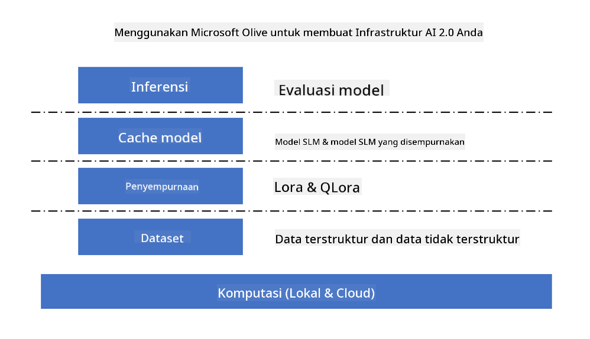
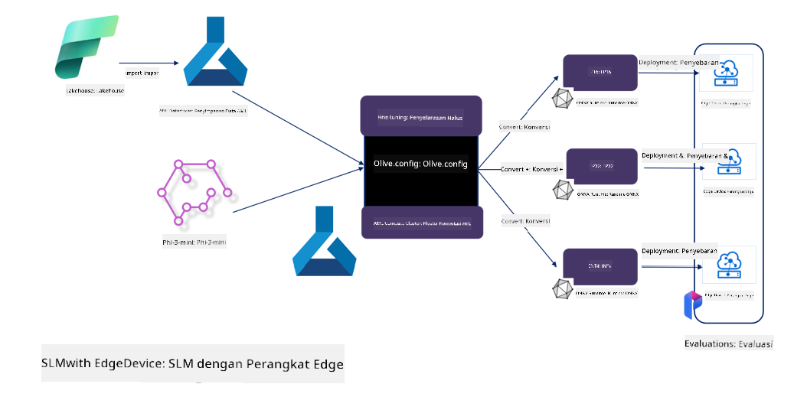

<!--
CO_OP_TRANSLATOR_METADATA:
{
  "original_hash": "5764be88ad2eb4f341e742eb8f14fab1",
  "translation_date": "2025-05-09T20:53:34+00:00",
  "source_file": "md/03.FineTuning/FineTuning_MicrosoftOlive.md",
  "language_code": "id"
}
-->
# **Fine-tuning Phi-3 dengan Microsoft Olive**

[Olive](https://github.com/microsoft/OLive?WT.mc_id=aiml-138114-kinfeylo) adalah alat optimasi model yang mudah digunakan dan sadar perangkat keras yang menggabungkan teknik-teknik terdepan di industri dalam kompresi model, optimasi, dan kompilasi.

Alat ini dirancang untuk menyederhanakan proses optimasi model machine learning, memastikan penggunaan arsitektur perangkat keras tertentu secara paling efisien.

Baik Anda bekerja pada aplikasi berbasis cloud atau perangkat edge, Olive memungkinkan Anda mengoptimalkan model dengan mudah dan efektif.

## Fitur Utama:
- Olive menggabungkan dan mengotomatisasi teknik optimasi untuk target perangkat keras yang diinginkan.
- Tidak ada satu teknik optimasi yang cocok untuk semua skenario, sehingga Olive memungkinkan perluasan dengan memberi ruang bagi para ahli industri untuk menambahkan inovasi optimasi mereka.

## Mengurangi Upaya Engineering:
- Pengembang seringkali harus mempelajari dan menggunakan berbagai toolchain khusus vendor perangkat keras untuk mempersiapkan dan mengoptimalkan model yang sudah dilatih untuk deployment.
- Olive menyederhanakan pengalaman ini dengan mengotomatisasi teknik optimasi untuk perangkat keras yang diinginkan.

## Solusi Optimasi End-to-End Siap Pakai:

Dengan menggabungkan dan menyetel teknik yang terintegrasi, Olive menawarkan solusi terpadu untuk optimasi end-to-end.
Alat ini mempertimbangkan batasan seperti akurasi dan latensi saat mengoptimalkan model.

## Menggunakan Microsoft Olive untuk fine-tuning

Microsoft Olive adalah alat optimasi model open source yang sangat mudah digunakan dan dapat mencakup baik fine-tuning maupun referensi dalam bidang kecerdasan buatan generatif. Hanya diperlukan konfigurasi sederhana, dikombinasikan dengan penggunaan model bahasa kecil open source dan lingkungan runtime terkait (AzureML / GPU lokal, CPU, DirectML), Anda dapat menyelesaikan fine-tuning atau referensi model melalui optimasi otomatis, dan menemukan model terbaik untuk dideploy ke cloud atau perangkat edge. Memungkinkan perusahaan membangun model vertikal industri mereka sendiri baik di on-premises maupun di cloud.



## Phi-3 Fine Tuning dengan Microsoft Olive



## Contoh Kode dan Contoh Phi-3 Olive
Dalam contoh ini Anda akan menggunakan Olive untuk:

- Fine-tune adapter LoRA untuk mengklasifikasikan frasa menjadi Sad, Joy, Fear, Surprise.
- Menggabungkan bobot adapter ke dalam model dasar.
- Mengoptimalkan dan mengkuantisasi model menjadi int4.

[Sample Code](../../code/03.Finetuning/olive-ort-example/README.md)

### Setup Microsoft Olive

Instalasi Microsoft Olive sangat sederhana, dan juga dapat diinstal untuk CPU, GPU, DirectML, dan Azure ML

```bash
pip install olive-ai
```

Jika Anda ingin menjalankan model ONNX dengan CPU, Anda dapat menggunakan

```bash
pip install olive-ai[cpu]
```

Jika Anda ingin menjalankan model ONNX dengan GPU, Anda dapat menggunakan

```python
pip install olive-ai[gpu]
```

Jika Anda ingin menggunakan Azure ML, gunakan

```python
pip install git+https://github.com/microsoft/Olive#egg=olive-ai[azureml]
```

**Perhatian**  
Persyaratan OS: Ubuntu 20.04 / 22.04

### **Config.json Microsoft Olive**

Setelah instalasi, Anda dapat mengkonfigurasi pengaturan spesifik model yang berbeda melalui file Config, termasuk data, komputasi, pelatihan, deployment, dan pembuatan model.

**1. Data**

Di Microsoft Olive, pelatihan dengan data lokal dan data cloud dapat didukung, dan dapat dikonfigurasi dalam pengaturan.

*Pengaturan data lokal*

Anda dapat dengan mudah mengatur dataset yang perlu dilatih untuk fine-tuning, biasanya dalam format json, dan menyesuaikannya dengan template data. Ini perlu disesuaikan berdasarkan kebutuhan model (misalnya, disesuaikan dengan format yang dibutuhkan oleh Microsoft Phi-3-mini. Jika Anda memiliki model lain, silakan merujuk pada format fine-tuning yang diperlukan oleh model lain untuk diproses)

```json

    "data_configs": [
        {
            "name": "dataset_default_train",
            "type": "HuggingfaceContainer",
            "load_dataset_config": {
                "params": {
                    "data_name": "json", 
                    "data_files":"dataset/dataset-classification.json",
                    "split": "train"
                }
            },
            "pre_process_data_config": {
                "params": {
                    "dataset_type": "corpus",
                    "text_cols": [
                            "phrase",
                            "tone"
                    ],
                    "text_template": "### Text: {phrase}\n### The tone is:\n{tone}",
                    "corpus_strategy": "join",
                    "source_max_len": 2048,
                    "pad_to_max_len": false,
                    "use_attention_mask": false
                }
            }
        }
    ],
```

**Pengaturan sumber data cloud**

Dengan menghubungkan datastore Azure AI Studio/Azure Machine Learning Service untuk mengakses data di cloud, Anda dapat memilih untuk memasukkan berbagai sumber data ke Azure AI Studio/Azure Machine Learning Service melalui Microsoft Fabric dan Azure Data sebagai dukungan untuk fine-tuning data.

```json

    "data_configs": [
        {
            "name": "dataset_default_train",
            "type": "HuggingfaceContainer",
            "load_dataset_config": {
                "params": {
                    "data_name": "json", 
                    "data_files": {
                        "type": "azureml_datastore",
                        "config": {
                            "azureml_client": {
                                "subscription_id": "Your Azure Subscrition ID",
                                "resource_group": "Your Azure Resource Group",
                                "workspace_name": "Your Azure ML Workspaces name"
                            },
                            "datastore_name": "workspaceblobstore",
                            "relative_path": "Your train_data.json Azure ML Location"
                        }
                    },
                    "split": "train"
                }
            },
            "pre_process_data_config": {
                "params": {
                    "dataset_type": "corpus",
                    "text_cols": [
                            "Question",
                            "Best Answer"
                    ],
                    "text_template": "<|user|>\n{Question}<|end|>\n<|assistant|>\n{Best Answer}\n<|end|>",
                    "corpus_strategy": "join",
                    "source_max_len": 2048,
                    "pad_to_max_len": false,
                    "use_attention_mask": false
                }
            }
        }
    ],
    
```

**2. Konfigurasi Komputasi**

Jika Anda perlu menggunakan lokal, Anda bisa langsung memakai sumber daya data lokal. Jika perlu menggunakan sumber daya Azure AI Studio / Azure Machine Learning Service, Anda harus mengkonfigurasi parameter Azure terkait, nama komputasi, dan lain-lain.

```json

    "systems": {
        "aml": {
            "type": "AzureML",
            "config": {
                "accelerators": ["gpu"],
                "hf_token": true,
                "aml_compute": "Your Azure AI Studio / Azure Machine Learning Service Compute Name",
                "aml_docker_config": {
                    "base_image": "Your Azure AI Studio / Azure Machine Learning Service docker",
                    "conda_file_path": "conda.yaml"
                }
            }
        },
        "azure_arc": {
            "type": "AzureML",
            "config": {
                "accelerators": ["gpu"],
                "aml_compute": "Your Azure AI Studio / Azure Machine Learning Service Compute Name",
                "aml_docker_config": {
                    "base_image": "Your Azure AI Studio / Azure Machine Learning Service docker",
                    "conda_file_path": "conda.yaml"
                }
            }
        }
    },
```

***Perhatian***

Karena dijalankan melalui container di Azure AI Studio/Azure Machine Learning Service, lingkungan yang dibutuhkan harus dikonfigurasi. Ini dikonfigurasi dalam environment conda.yaml.

```yaml

name: project_environment
channels:
  - defaults
dependencies:
  - python=3.8.13
  - pip=22.3.1
  - pip:
      - einops
      - accelerate
      - azure-keyvault-secrets
      - azure-identity
      - bitsandbytes
      - datasets
      - huggingface_hub
      - peft
      - scipy
      - sentencepiece
      - torch>=2.2.0
      - transformers
      - git+https://github.com/microsoft/Olive@jiapli/mlflow_loading_fix#egg=olive-ai[gpu]
      - --extra-index-url https://aiinfra.pkgs.visualstudio.com/PublicPackages/_packaging/ORT-Nightly/pypi/simple/ 
      - ort-nightly-gpu==1.18.0.dev20240307004
      - --extra-index-url https://aiinfra.pkgs.visualstudio.com/PublicPackages/_packaging/onnxruntime-genai/pypi/simple/
      - onnxruntime-genai-cuda

    

```

**3. Pilih SLM Anda**

Anda bisa menggunakan model langsung dari Hugging face, atau menggabungkannya langsung dengan Model Catalog Azure AI Studio / Azure Machine Learning untuk memilih model yang digunakan. Dalam contoh kode di bawah ini kami menggunakan Microsoft Phi-3-mini sebagai contoh.

Jika Anda memiliki model secara lokal, Anda dapat menggunakan metode ini

```json

    "input_model":{
        "type": "PyTorchModel",
        "config": {
            "hf_config": {
                "model_name": "model-cache/microsoft/phi-3-mini",
                "task": "text-generation",
                "model_loading_args": {
                    "trust_remote_code": true
                }
            }
        }
    },
```

Jika Anda ingin menggunakan model dari Azure AI Studio / Azure Machine Learning Service, Anda dapat menggunakan metode ini

```json

    "input_model":{
        "type": "PyTorchModel",
        "config": {
            "model_path": {
                "type": "azureml_registry_model",
                "config": {
                    "name": "microsoft/Phi-3-mini-4k-instruct",
                    "registry_name": "azureml-msr",
                    "version": "11"
                }
            },
             "model_file_format": "PyTorch.MLflow",
             "hf_config": {
                "model_name": "microsoft/Phi-3-mini-4k-instruct",
                "task": "text-generation",
                "from_pretrained_args": {
                    "trust_remote_code": true
                }
            }
        }
    },
```

**Perhatian:**  
Kita perlu integrasi dengan Azure AI Studio / Azure Machine Learning Service, jadi saat mengatur model, harap perhatikan nomor versi dan penamaan terkait.

Semua model di Azure harus diset ke PyTorch.MLflow

Anda harus memiliki akun Hugging face dan mengikat kunci ke nilai Key Azure AI Studio / Azure Machine Learning

**4. Algoritma**

Microsoft Olive membungkus algoritma fine-tuning Lora dan QLora dengan sangat baik. Yang perlu Anda konfigurasi hanyalah beberapa parameter terkait. Di sini saya menggunakan QLora sebagai contoh.

```json
        "lora": {
            "type": "LoRA",
            "config": {
                "target_modules": [
                    "o_proj",
                    "qkv_proj"
                ],
                "double_quant": true,
                "lora_r": 64,
                "lora_alpha": 64,
                "lora_dropout": 0.1,
                "train_data_config": "dataset_default_train",
                "eval_dataset_size": 0.3,
                "training_args": {
                    "seed": 0,
                    "data_seed": 42,
                    "per_device_train_batch_size": 1,
                    "per_device_eval_batch_size": 1,
                    "gradient_accumulation_steps": 4,
                    "gradient_checkpointing": false,
                    "learning_rate": 0.0001,
                    "num_train_epochs": 3,
                    "max_steps": 10,
                    "logging_steps": 10,
                    "evaluation_strategy": "steps",
                    "eval_steps": 187,
                    "group_by_length": true,
                    "adam_beta2": 0.999,
                    "max_grad_norm": 0.3
                }
            }
        },
```

Jika Anda ingin konversi kuantisasi, cabang utama Microsoft Olive sudah mendukung metode onnxruntime-genai. Anda dapat mengaturnya sesuai kebutuhan:

1. gabungkan bobot adapter ke dalam model dasar  
2. Konversi model ke model onnx dengan presisi yang dibutuhkan menggunakan ModelBuilder

misalnya mengkonversi ke INT4 yang telah dikuantisasi

```json

        "merge_adapter_weights": {
            "type": "MergeAdapterWeights"
        },
        "builder": {
            "type": "ModelBuilder",
            "config": {
                "precision": "int4"
            }
        }
```

**Perhatian**  
- Jika Anda menggunakan QLoRA, konversi kuantisasi ONNXRuntime-genai belum didukung saat ini.  
- Perlu dicatat bahwa Anda dapat mengatur langkah-langkah di atas sesuai kebutuhan sendiri. Tidak wajib mengkonfigurasi semua langkah tersebut secara lengkap. Tergantung kebutuhan, Anda dapat langsung menggunakan langkah algoritma tanpa fine-tuning. Akhirnya, Anda perlu mengkonfigurasi engine terkait.

```json

    "engine": {
        "log_severity_level": 0,
        "host": "aml",
        "target": "aml",
        "search_strategy": false,
        "execution_providers": ["CUDAExecutionProvider"],
        "cache_dir": "../model-cache/models/phi3-finetuned/cache",
        "output_dir" : "../model-cache/models/phi3-finetuned"
    }
```

**5. Selesai fine-tuning**

Di command line, jalankan di direktori olive-config.json

```bash
olive run --config olive-config.json  
```

**Penafian**:  
Dokumen ini telah diterjemahkan menggunakan layanan terjemahan AI [Co-op Translator](https://github.com/Azure/co-op-translator). Meskipun kami berusaha untuk akurasi, harap diingat bahwa terjemahan otomatis mungkin mengandung kesalahan atau ketidakakuratan. Dokumen asli dalam bahasa aslinya harus dianggap sebagai sumber yang sahih. Untuk informasi penting, disarankan menggunakan terjemahan profesional oleh manusia. Kami tidak bertanggung jawab atas kesalahpahaman atau salah tafsir yang timbul dari penggunaan terjemahan ini.