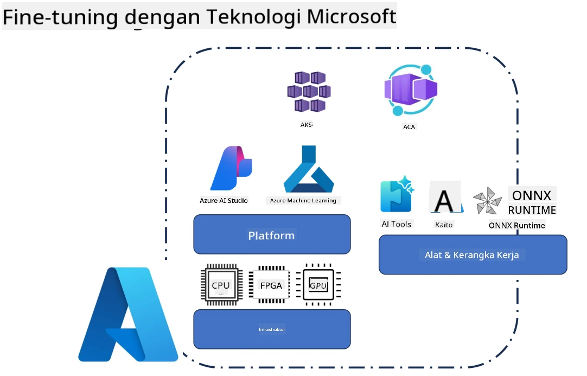
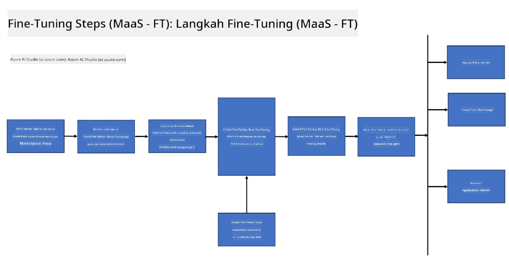
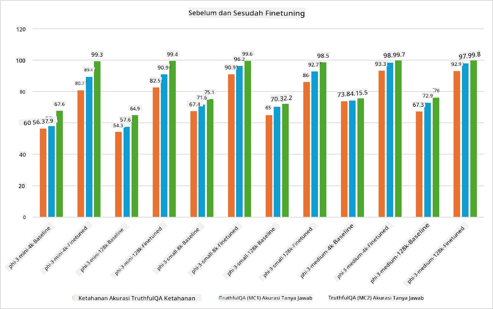

<!--
CO_OP_TRANSLATOR_METADATA:
{
  "original_hash": "cb5648935f63edc17e95ce38f23adc32",
  "translation_date": "2025-07-17T08:28:51+00:00",
  "source_file": "md/03.FineTuning/FineTuning_Scenarios.md",
  "language_code": "id"
}
-->
## Skenario Fine Tuning

**Platform** Ini mencakup berbagai teknologi seperti Azure AI Foundry, Azure Machine Learning, AI Tools, Kaito, dan ONNX Runtime.

**Infrastruktur** Ini mencakup CPU dan FPGA, yang sangat penting untuk proses fine-tuning. Saya akan tunjukkan ikon untuk masing-masing teknologi ini.

**Alat & Kerangka Kerja** Ini mencakup ONNX Runtime dan ONNX Runtime. Saya akan tunjukkan ikon untuk masing-masing teknologi ini.  
[Masukkan ikon untuk ONNX Runtime dan ONNX Runtime]

Proses fine-tuning dengan teknologi Microsoft melibatkan berbagai komponen dan alat. Dengan memahami dan memanfaatkan teknologi ini, kita dapat melakukan fine-tuning aplikasi secara efektif dan menciptakan solusi yang lebih baik.

## Model sebagai Layanan

Fine-tune model menggunakan fine-tuning yang dihosting, tanpa perlu membuat dan mengelola compute.

Fine-tuning tanpa server tersedia untuk model Phi-3-mini dan Phi-3-medium, memungkinkan pengembang untuk dengan cepat dan mudah menyesuaikan model untuk skenario cloud dan edge tanpa harus mengatur compute. Kami juga telah mengumumkan bahwa Phi-3-small kini tersedia melalui penawaran Models-as-a-Service kami sehingga pengembang dapat dengan cepat dan mudah memulai pengembangan AI tanpa harus mengelola infrastruktur dasar.

## Model sebagai Platform

Pengguna mengelola compute mereka sendiri untuk melakukan fine-tuning model mereka.

[Contoh Fine Tuning](https://github.com/Azure/azureml-examples/blob/main/sdk/python/foundation-models/system/finetune/chat-completion/chat-completion.ipynb)

## Skenario Fine Tuning

| | | | | | | |
|-|-|-|-|-|-|-|
|Skenario|LoRA|QLoRA|PEFT|DeepSpeed|ZeRO|DORA|
|Menyesuaikan LLM yang sudah dilatih sebelumnya untuk tugas atau domain tertentu|Ya|Ya|Ya|Ya|Ya|Ya|
|Fine-tuning untuk tugas NLP seperti klasifikasi teks, pengenalan entitas bernama, dan terjemahan mesin|Ya|Ya|Ya|Ya|Ya|Ya|
|Fine-tuning untuk tugas QA|Ya|Ya|Ya|Ya|Ya|Ya|
|Fine-tuning untuk menghasilkan respons seperti manusia dalam chatbot|Ya|Ya|Ya|Ya|Ya|Ya|
|Fine-tuning untuk menghasilkan musik, seni, atau bentuk kreativitas lainnya|Ya|Ya|Ya|Ya|Ya|Ya|
|Mengurangi biaya komputasi dan finansial|Ya|Ya|Tidak|Ya|Ya|Tidak|
|Mengurangi penggunaan memori|Tidak|Ya|Tidak|Ya|Ya|Ya|
|Menggunakan parameter lebih sedikit untuk fine-tuning yang efisien|Tidak|Ya|Ya|Tidak|Tidak|Ya|
|Bentuk paralelisme data yang hemat memori yang memberikan akses ke memori GPU agregat dari semua perangkat GPU yang tersedia|Tidak|Tidak|Tidak|Ya|Ya|Ya|

## Contoh Performa Fine Tuning

**Penafian**:  
Dokumen ini telah diterjemahkan menggunakan layanan terjemahan AI [Co-op Translator](https://github.com/Azure/co-op-translator). Meskipun kami berupaya untuk akurasi, harap diketahui bahwa terjemahan otomatis mungkin mengandung kesalahan atau ketidakakuratan. Dokumen asli dalam bahasa aslinya harus dianggap sebagai sumber yang sah. Untuk informasi penting, disarankan menggunakan terjemahan profesional oleh manusia. Kami tidak bertanggung jawab atas kesalahpahaman atau penafsiran yang keliru yang timbul dari penggunaan terjemahan ini.