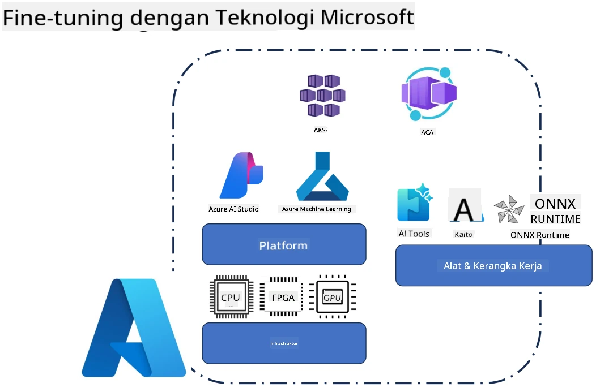
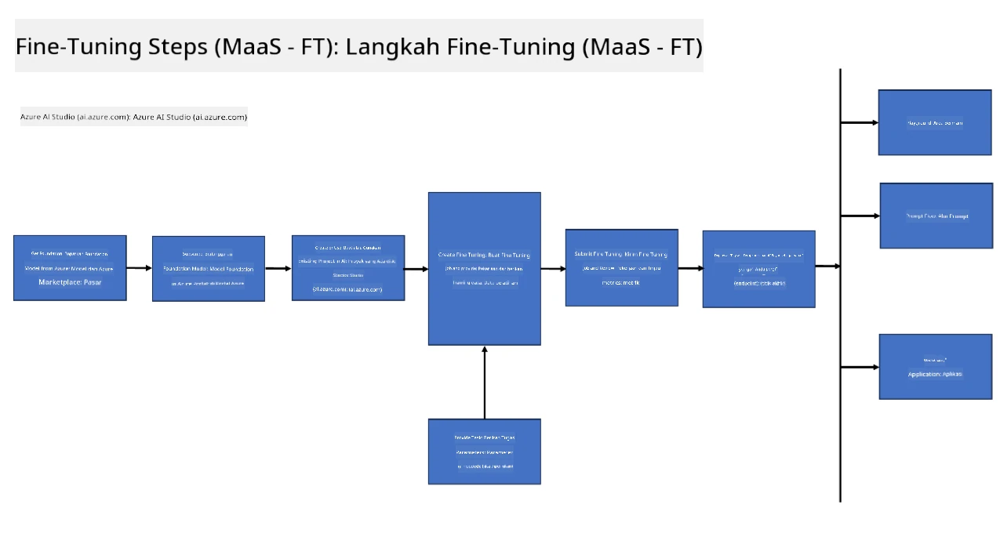
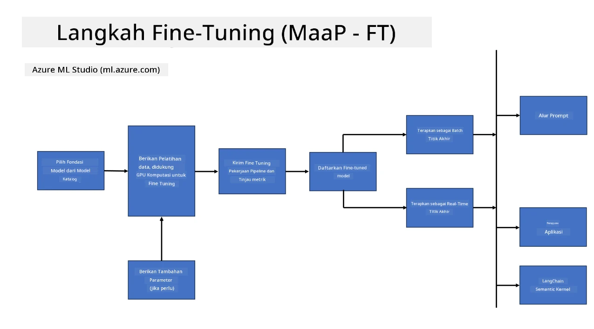
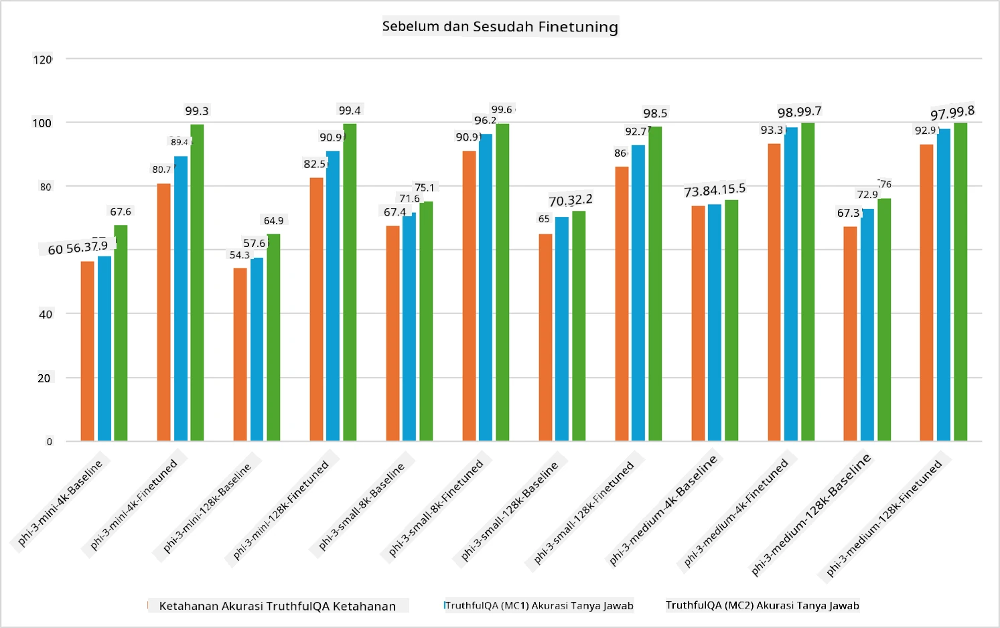

## Skenario Fine Tuning

Bagian ini memberikan gambaran umum tentang skenario fine-tuning di lingkungan Microsoft Foundry dan Azure, termasuk model deployment, lapisan infrastruktur, dan teknik optimasi yang umum digunakan.

**Platform**  
Ini mencakup layanan terkelola seperti Microsoft Foundry (sebelumnya Azure AI Foundry) dan Azure Machine Learning, yang menyediakan manajemen model, orkestrasi, pelacakan eksperimen, dan alur kerja deployment.

**Infrastruktur**  
Fine-tuning memerlukan sumber daya komputasi yang dapat diskalakan. Di lingkungan Azure, ini biasanya mencakup mesin virtual berbasis GPU dan sumber daya CPU untuk beban kerja ringan, bersama dengan penyimpanan yang dapat diskalakan untuk dataset dan checkpoint.

**Alat & Framework**  
Alur kerja fine-tuning biasanya bergantung pada framework dan pustaka optimasi seperti Hugging Face Transformers, DeepSpeed, dan PEFT (Parameter-Efficient Fine-Tuning).

Proses fine-tuning dengan teknologi Microsoft mencakup layanan platform, infrastruktur komputasi, dan framework pelatihan. Dengan memahami bagaimana komponen-komponen ini bekerja bersama, pengembang dapat dengan efisien menyesuaikan model dasar untuk tugas dan skenario produksi tertentu.

## Model sebagai Layanan

Fine-tune model menggunakan fine-tuning yang dihosting, tanpa perlu membuat dan mengelola komputasi.

Fine-tuning serverless sekarang tersedia untuk keluarga model Phi-3, Phi-3.5, dan Phi-4, memungkinkan pengembang untuk dengan cepat dan mudah menyesuaikan model untuk skenario cloud dan edge tanpa harus mengatur komputasi.

## Model sebagai Platform

Pengguna mengelola komputasi mereka sendiri untuk melakukan fine-tuning pada model mereka.

[Contoh Fine Tuning](https://github.com/Azure/azureml-examples/blob/main/sdk/python/foundation-models/system/finetune/chat-completion/chat-completion.ipynb)

## Perbandingan Teknik Fine-Tuning

|Skenario|LoRA|QLoRA|PEFT|DeepSpeed|ZeRO|DoRA|
|---|---|---|---|---|---|---|
|Menyesuaikan LLM yang telah dilatih sebelumnya ke tugas atau domain tertentu|Ya|Ya|Ya|Ya|Ya|Ya|
|Fine-tuning untuk tugas NLP seperti klasifikasi teks, pengenalan entitas bernama, dan terjemahan mesin|Ya|Ya|Ya|Ya|Ya|Ya|
|Fine-tuning untuk tugas QA|Ya|Ya|Ya|Ya|Ya|Ya|
|Fine-tuning untuk menghasilkan respons seperti manusia pada chatbot|Ya|Ya|Ya|Ya|Ya|Ya|
|Fine-tuning untuk menghasilkan musik, seni, atau bentuk kreativitas lainnya|Ya|Ya|Ya|Ya|Ya|Ya|
|Mengurangi biaya komputasi dan finansial|Ya|Ya|Ya|Ya|Ya|Ya|
|Mengurangi penggunaan memori|Ya|Ya|Ya|Ya|Ya|Ya|
|Menggunakan parameter lebih sedikit untuk fine-tuning yang efisien|Ya|Ya|Ya|Tidak|Tidak|Ya|
|Bentuk paralelisme data yang hemat memori yang memberikan akses ke memori GPU agregat dari semua perangkat GPU yang tersedia|Tidak|Tidak|Tidak|Ya|Ya|Tidak|

> [!NOTE]
> LoRA, QLoRA, PEFT, dan DoRA adalah metode fine-tuning yang efisien dalam penggunaan parameter, sementara DeepSpeed dan ZeRO berfokus pada pelatihan terdistribusi dan optimasi memori.

## Contoh Performa Fine Tuning

---

<!-- CO-OP TRANSLATOR DISCLAIMER START -->
**Disclaimer**:
Dokumen ini telah diterjemahkan menggunakan layanan terjemahan AI [Co-op Translator](https://github.com/Azure/co-op-translator). Meskipun kami berupaya untuk akurasi, mohon diperhatikan bahwa terjemahan otomatis dapat mengandung kesalahan atau ketidakakuratan. Dokumen asli dalam bahasa aslinya harus dianggap sebagai sumber yang sah. Untuk informasi penting, disarankan menggunakan terjemahan profesional oleh manusia. Kami tidak bertanggung jawab atas kesalahpahaman atau salah tafsir yang timbul dari penggunaan terjemahan ini.
<!-- CO-OP TRANSLATOR DISCLAIMER END -->