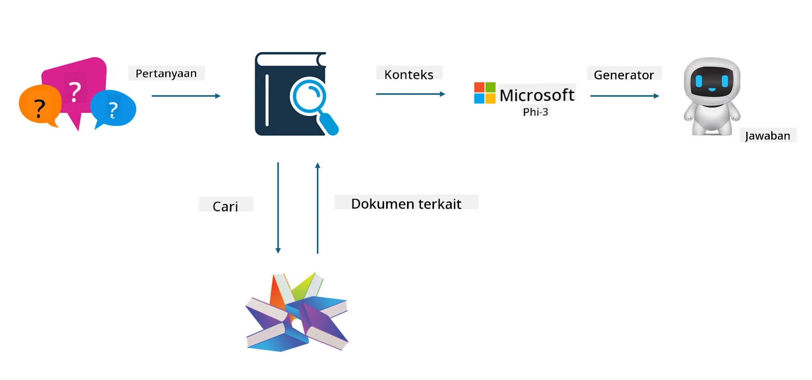

## Finetuning vs RAG

## Retrieval Augmented Generation

RAG adalah pengambilan data + pembuatan teks. Data terstruktur dan tidak terstruktur dari perusahaan disimpan dalam database vektor. Saat mencari konten yang relevan, ringkasan dan konten yang sesuai ditemukan untuk membentuk konteks, lalu kemampuan penyelesaian teks dari LLM/SLM digabungkan untuk menghasilkan konten.

## Proses RAG

## Fine-tuning
Fine-tuning didasarkan pada peningkatan model tertentu. Tidak perlu memulai dari algoritma model, tetapi data harus terus dikumpulkan. Jika Anda menginginkan terminologi dan ekspresi bahasa yang lebih tepat dalam aplikasi industri, fine-tuning adalah pilihan yang lebih baik. Namun, jika data Anda sering berubah, fine-tuning bisa menjadi rumit.

## Cara memilih
Jika jawaban kita memerlukan pengenalan data eksternal, RAG adalah pilihan terbaik.

Jika Anda perlu menghasilkan pengetahuan industri yang stabil dan tepat, fine-tuning akan menjadi pilihan yang baik. RAG mengutamakan pengambilan konten yang relevan tetapi mungkin tidak selalu menangkap nuansa khusus secara tepat.

Fine-tuning membutuhkan dataset berkualitas tinggi, dan jika hanya dalam cakupan data kecil, perbedaannya tidak akan signifikan. RAG lebih fleksibel.  
Fine-tuning adalah kotak hitam, sebuah metafisika, dan sulit untuk memahami mekanisme internalnya. Namun RAG dapat memudahkan menemukan sumber data, sehingga secara efektif mengatur halusinasi atau kesalahan konten dan memberikan transparansi yang lebih baik.

**Penafian**:  
Dokumen ini telah diterjemahkan menggunakan layanan terjemahan AI [Co-op Translator](https://github.com/Azure/co-op-translator). Meskipun kami berupaya untuk mencapai akurasi, harap diingat bahwa terjemahan otomatis mungkin mengandung kesalahan atau ketidakakuratan. Dokumen asli dalam bahasa aslinya harus dianggap sebagai sumber yang sahih. Untuk informasi penting, disarankan menggunakan terjemahan profesional oleh manusia. Kami tidak bertanggung jawab atas kesalahpahaman atau penafsiran yang keliru yang timbul dari penggunaan terjemahan ini.