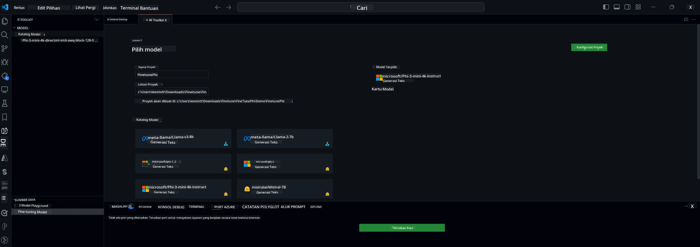

## Selamat Datang di AI Toolkit untuk VS Code

[AI Toolkit untuk VS Code](https://github.com/microsoft/vscode-ai-toolkit/tree/main) menggabungkan berbagai model dari Azure AI Studio Catalog dan katalog lain seperti Hugging Face. Toolkit ini mempermudah tugas pengembangan umum untuk membangun aplikasi AI dengan alat dan model generatif AI melalui:
- Memulai dengan penemuan model dan playground.
- Fine-tuning model dan inferensi menggunakan sumber daya komputasi lokal.
- Fine-tuning dan inferensi jarak jauh menggunakan sumber daya Azure.

[Pasang AI Toolkit untuk VSCode](https://marketplace.visualstudio.com/items?itemName=ms-windows-ai-studio.windows-ai-studio)




**[Private Preview]** Penyediaan satu klik untuk Azure Container Apps guna menjalankan fine-tuning dan inferensi model di cloud.

Sekarang mari kita mulai pengembangan aplikasi AI Anda:

- [Selamat Datang di AI Toolkit untuk VS Code](../../../../md/03.FineTuning)
- [Pengembangan Lokal](../../../../md/03.FineTuning)
  - [Persiapan](../../../../md/03.FineTuning)
  - [Aktifkan Conda](../../../../md/03.FineTuning)
  - [Hanya fine-tuning model dasar](../../../../md/03.FineTuning)
  - [Fine-tuning dan inferensi model](../../../../md/03.FineTuning)
  - [Fine-tuning Model](../../../../md/03.FineTuning)
  - [Microsoft Olive](../../../../md/03.FineTuning)
  - [Contoh dan Sumber Daya Fine Tuning](../../../../md/03.FineTuning)
- [**\[Private Preview\]** Pengembangan Jarak Jauh](../../../../md/03.FineTuning)
  - [Prasyarat](../../../../md/03.FineTuning)
  - [Membuat Proyek Pengembangan Jarak Jauh](../../../../md/03.FineTuning)
  - [Menyediakan Sumber Daya Azure](../../../../md/03.FineTuning)
  - [\[Opsional\] Tambahkan Token Huggingface ke Secret Azure Container App](../../../../md/03.FineTuning)
  - [Jalankan Fine-tuning](../../../../md/03.FineTuning)
  - [Menyediakan Endpoint Inferensi](../../../../md/03.FineTuning)
  - [Deploy Endpoint Inferensi](../../../../md/03.FineTuning)
  - [Penggunaan Lanjutan](../../../../md/03.FineTuning)

## Pengembangan Lokal
### Persiapan

1. Pastikan driver NVIDIA sudah terpasang di host.
2. Jalankan `huggingface-cli login`, jika Anda menggunakan HF untuk pemanfaatan dataset.
3. Penjelasan pengaturan kunci `Olive` untuk hal-hal yang memodifikasi penggunaan memori.

### Aktifkan Conda
Karena kita menggunakan lingkungan WSL yang bersifat bersama, Anda perlu mengaktifkan lingkungan conda secara manual. Setelah langkah ini, Anda dapat menjalankan fine-tuning atau inferensi.

```bash
conda activate [conda-env-name] 
```

### Hanya fine-tuning model dasar
Untuk mencoba model dasar tanpa fine-tuning, Anda dapat menjalankan perintah ini setelah mengaktifkan conda.

```bash
cd inference

# Web browser interface allows to adjust a few parameters like max new token length, temperature and so on.
# User has to manually open the link (e.g. http://0.0.0.0:7860) in a browser after gradio initiates the connections.
python gradio_chat.py --baseonly
```

### Fine-tuning dan inferensi model

Setelah workspace dibuka dalam dev container, buka terminal (path default adalah root proyek), lalu jalankan perintah di bawah ini untuk melakukan fine-tuning LLM pada dataset yang dipilih.

```bash
python finetuning/invoke_olive.py 
```

Checkpoint dan model akhir akan disimpan di folder `models`.

Selanjutnya jalankan inferensi dengan model yang sudah di-fine-tune melalui chat di `console`, `web browser`, atau `prompt flow`.

```bash
cd inference

# Console interface.
python console_chat.py

# Web browser interface allows to adjust a few parameters like max new token length, temperature and so on.
# User has to manually open the link (e.g. http://127.0.0.1:7860) in a browser after gradio initiates the connections.
python gradio_chat.py
```

Untuk menggunakan `prompt flow` di VS Code, silakan lihat [Quick Start](https://microsoft.github.io/promptflow/how-to-guides/quick-start.html).

### Fine-tuning Model

Selanjutnya, unduh model berikut sesuai dengan ketersediaan GPU di perangkat Anda.

Untuk memulai sesi fine-tuning lokal menggunakan QLoRA, pilih model yang ingin Anda fine-tune dari katalog kami.
| Platform(s) | GPU tersedia | Nama model | Ukuran (GB) |
|---------|---------|--------|--------|
| Windows | Ya | Phi-3-mini-4k-**directml**-int4-awq-block-128-onnx | 2.13GB |
| Linux | Ya | Phi-3-mini-4k-**cuda**-int4-onnx | 2.30GB |
| Windows<br>Linux | Tidak | Phi-3-mini-4k-**cpu**-int4-rtn-block-32-acc-level-4-onnx | 2.72GB |

**_Catatan_** Anda tidak perlu Akun Azure untuk mengunduh model-model ini.

Model Phi3-mini (int4) berukuran sekitar 2GB-3GB. Tergantung kecepatan jaringan Anda, proses pengunduhan bisa memakan waktu beberapa menit.

Mulailah dengan memilih nama proyek dan lokasi.
Selanjutnya, pilih model dari katalog model. Anda akan diminta untuk mengunduh template proyek. Setelah itu, klik "Configure Project" untuk mengatur berbagai pengaturan.

### Microsoft Olive

Kami menggunakan [Olive](https://microsoft.github.io/Olive/why-olive.html) untuk menjalankan fine-tuning QLoRA pada model PyTorch dari katalog kami. Semua pengaturan sudah dipreset dengan nilai default untuk mengoptimalkan proses fine-tuning secara lokal dengan penggunaan memori yang efisien, namun dapat disesuaikan dengan skenario Anda.

### Contoh dan Sumber Daya Fine Tuning

- [Panduan Memulai Fine tuning](https://learn.microsoft.com/windows/ai/toolkit/toolkit-fine-tune)
- [Fine tuning dengan Dataset HuggingFace](https://github.com/microsoft/vscode-ai-toolkit/blob/main/archive/walkthrough-hf-dataset.md)
- [Fine tuning dengan Simple DataSet](https://github.com/microsoft/vscode-ai-toolkit/blob/main/archive/walkthrough-simple-dataset.md)

## **[Private Preview]** Pengembangan Jarak Jauh

### Prasyarat

1. Untuk menjalankan fine-tuning model di lingkungan Azure Container App jarak jauh Anda, pastikan langganan Anda memiliki kapasitas GPU yang cukup. Ajukan [tiket dukungan](https://azure.microsoft.com/support/create-ticket/) untuk meminta kapasitas yang diperlukan bagi aplikasi Anda. [Dapatkan Info Lebih Lanjut tentang kapasitas GPU](https://learn.microsoft.com/azure/container-apps/workload-profiles-overview)
2. Jika Anda menggunakan dataset privat di HuggingFace, pastikan Anda memiliki [akun HuggingFace](https://huggingface.co/?WT.mc_id=aiml-137032-kinfeylo) dan [membuat token akses](https://huggingface.co/docs/hub/security-tokens?WT.mc_id=aiml-137032-kinfeylo)
3. Aktifkan fitur Remote Fine-tuning dan Inference di AI Toolkit untuk VS Code
   1. Buka Pengaturan VS Code dengan memilih *File -> Preferences -> Settings*.
   2. Navigasi ke *Extensions* dan pilih *AI Toolkit*.
   3. Pilih opsi *"Enable Remote Fine-tuning And Inference"*.
   4. Muat ulang VS Code agar perubahan berlaku.

- [Fine tuning Jarak Jauh](https://github.com/microsoft/vscode-ai-toolkit/blob/main/archive/remote-finetuning.md)

### Membuat Proyek Pengembangan Jarak Jauh
1. Jalankan command palette `AI Toolkit: Focus on Resource View`.
2. Navigasi ke *Model Fine-tuning* untuk mengakses katalog model. Beri nama proyek Anda dan pilih lokasi di mesin Anda. Kemudian, klik tombol *"Configure Project"*.
3. Konfigurasi Proyek
    1. Hindari mengaktifkan opsi *"Fine-tune locally"*.
    2. Pengaturan konfigurasi Olive akan muncul dengan nilai default yang sudah disetel. Silakan sesuaikan dan isi konfigurasi ini sesuai kebutuhan.
    3. Lanjutkan ke *Generate Project*. Tahap ini menggunakan WSL dan melibatkan pembuatan lingkungan Conda baru, sebagai persiapan untuk pembaruan mendatang yang mencakup Dev Containers.
4. Klik *"Relaunch Window In Workspace"* untuk membuka proyek pengembangan jarak jauh Anda.

> **Catatan:** Proyek saat ini dapat berjalan secara lokal atau jarak jauh dalam AI Toolkit untuk VS Code. Jika Anda memilih *"Fine-tune locally"* saat membuat proyek, proyek akan berjalan hanya di WSL tanpa kemampuan pengembangan jarak jauh. Sebaliknya, jika Anda tidak mengaktifkan *"Fine-tune locally"*, proyek akan terbatas pada lingkungan Azure Container App jarak jauh.

### Menyediakan Sumber Daya Azure
Untuk memulai, Anda perlu menyediakan Sumber Daya Azure untuk fine-tuning jarak jauh. Lakukan ini dengan menjalankan perintah `AI Toolkit: Provision Azure Container Apps job for fine-tuning` dari command palette.

Pantau kemajuan penyediaan melalui tautan yang ditampilkan di output channel.

### [Opsional] Tambahkan Token Huggingface ke Secret Azure Container App
Jika Anda menggunakan dataset privat HuggingFace, atur token HuggingFace Anda sebagai variabel lingkungan agar tidak perlu login manual di Hugging Face Hub.
Anda dapat melakukannya dengan perintah `AI Toolkit: Add Azure Container Apps Job secret for fine-tuning`. Dengan perintah ini, Anda dapat menetapkan nama secret sebagai [`HF_TOKEN`](https://huggingface.co/docs/huggingface_hub/package_reference/environment_variables#hftoken) dan menggunakan token Hugging Face Anda sebagai nilai secret.

### Jalankan Fine-tuning
Untuk memulai pekerjaan fine-tuning jarak jauh, jalankan perintah `AI Toolkit: Run fine-tuning`.

Untuk melihat log sistem dan konsol, Anda dapat mengunjungi portal Azure menggunakan tautan di panel output (langkah lebih lanjut di [Lihat dan Query Log di Azure](https://aka.ms/ai-toolkit/remote-provision#view-and-query-logs-on-azure)). Atau, Anda dapat melihat log konsol langsung di panel output VSCode dengan menjalankan perintah `AI Toolkit: Show the running fine-tuning job streaming logs`.
> **Catatan:** Pekerjaan mungkin antre karena sumber daya tidak mencukupi. Jika log tidak muncul, jalankan perintah `AI Toolkit: Show the running fine-tuning job streaming logs`, tunggu sebentar, lalu jalankan kembali perintah tersebut untuk menyambung ulang ke log streaming.

Selama proses ini, QLoRA akan digunakan untuk fine-tuning, dan akan membuat adapter LoRA untuk model yang digunakan saat inferensi.
Hasil fine-tuning akan disimpan di Azure Files.

### Menyediakan Endpoint Inferensi
Setelah adapter dilatih di lingkungan jarak jauh, gunakan aplikasi Gradio sederhana untuk berinteraksi dengan model.
Sama seperti proses fine-tuning, Anda perlu menyiapkan Sumber Daya Azure untuk inferensi jarak jauh dengan menjalankan perintah `AI Toolkit: Provision Azure Container Apps for inference` dari command palette.

Secara default, langganan dan grup sumber daya untuk inferensi harus sama dengan yang digunakan untuk fine-tuning. Inferensi akan menggunakan Azure Container App Environment yang sama dan mengakses model serta adapter model yang disimpan di Azure Files, yang dibuat selama langkah fine-tuning.

### Deploy Endpoint Inferensi
Jika Anda ingin merevisi kode inferensi atau memuat ulang model inferensi, jalankan perintah `AI Toolkit: Deploy for inference`. Ini akan menyinkronkan kode terbaru Anda dengan Azure Container App dan me-restart replika.

Setelah deployment berhasil, Anda dapat mengakses API inferensi dengan mengklik tombol "*Go to Inference Endpoint*" yang muncul di notifikasi VSCode. Atau, endpoint API web dapat ditemukan di bawah `ACA_APP_ENDPOINT` di `./infra/inference.config.json` dan di panel output. Anda sekarang siap untuk mengevaluasi model menggunakan endpoint ini.

### Penggunaan Lanjutan
Untuk informasi lebih lanjut tentang pengembangan jarak jauh dengan AI Toolkit, lihat dokumentasi [Fine-Tuning models remotely](https://aka.ms/ai-toolkit/remote-provision) dan [Inferencing with the fine-tuned model](https://aka.ms/ai-toolkit/remote-inference).

**Penafian**:  
Dokumen ini telah diterjemahkan menggunakan layanan terjemahan AI [Co-op Translator](https://github.com/Azure/co-op-translator). Meskipun kami berupaya untuk mencapai akurasi, harap diperhatikan bahwa terjemahan otomatis mungkin mengandung kesalahan atau ketidakakuratan. Dokumen asli dalam bahasa aslinya harus dianggap sebagai sumber yang sahih. Untuk informasi penting, disarankan menggunakan terjemahan profesional oleh manusia. Kami tidak bertanggung jawab atas kesalahpahaman atau penafsiran yang keliru yang timbul dari penggunaan terjemahan ini.