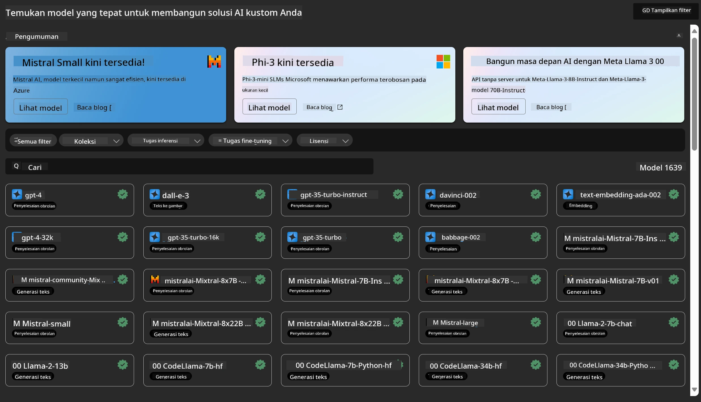
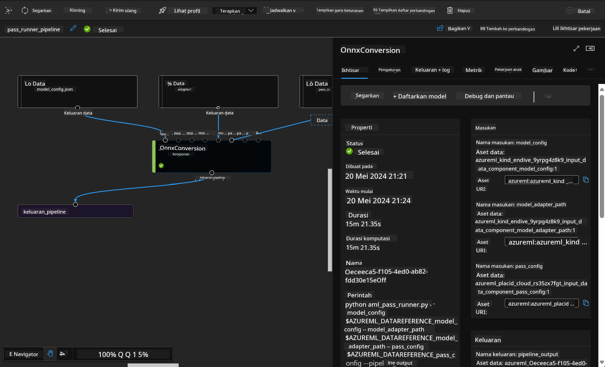

# **Memperkenalkan Azure Machine Learning Service**

[Azure Machine Learning](https://ml.azure.com?WT.mc_id=aiml-138114-kinfeylo) adalah layanan cloud untuk mempercepat dan mengelola siklus hidup proyek machine learning (ML).

Para profesional ML, ilmuwan data, dan insinyur dapat menggunakannya dalam alur kerja sehari-hari mereka untuk:

- Melatih dan menerapkan model.
- Mengelola operasi machine learning (MLOps).
- Anda dapat membuat model di Azure Machine Learning atau menggunakan model yang dibangun dari platform open-source, seperti PyTorch, TensorFlow, atau scikit-learn.
- Alat MLOps membantu Anda memantau, melatih ulang, dan menerapkan kembali model.

## Untuk siapa Azure Machine Learning?

**Ilmuwan Data dan Insinyur ML**

Mereka dapat menggunakan alat untuk mempercepat dan mengotomatisasi alur kerja sehari-hari mereka.  
Azure ML menyediakan fitur untuk keadilan, penjelasan, pelacakan, dan auditabilitas.

**Pengembang Aplikasi:**  
Mereka dapat mengintegrasikan model ke dalam aplikasi atau layanan dengan mulus.

**Pengembang Platform**

Mereka memiliki akses ke kumpulan alat yang kuat yang didukung oleh API Azure Resource Manager yang tahan lama.  
Alat ini memungkinkan pembangunan tooling ML yang canggih.

**Perusahaan**

Bekerja di cloud Microsoft Azure, perusahaan mendapatkan manfaat dari keamanan yang sudah dikenal dan kontrol akses berbasis peran.  
Membuat proyek untuk mengontrol akses ke data yang dilindungi dan operasi tertentu.

## Produktivitas untuk Semua Anggota Tim  
Proyek ML sering kali membutuhkan tim dengan beragam keahlian untuk membangun dan memelihara.

Azure ML menyediakan alat yang memungkinkan Anda untuk:  
- Berkolaborasi dengan tim melalui notebook bersama, sumber daya komputasi, komputasi tanpa server, data, dan lingkungan.  
- Mengembangkan model dengan keadilan, penjelasan, pelacakan, dan auditabilitas untuk memenuhi persyaratan lineage dan kepatuhan audit.  
- Menerapkan model ML dengan cepat dan mudah dalam skala besar, serta mengelola dan mengawasinya secara efisien dengan MLOps.  
- Menjalankan beban kerja machine learning di mana saja dengan tata kelola, keamanan, dan kepatuhan bawaan.

## Alat Platform yang Kompatibel Lintas Platform

Siapa pun di tim ML dapat menggunakan alat favorit mereka untuk menyelesaikan pekerjaan.  
Baik Anda menjalankan eksperimen cepat, tuning hyperparameter, membangun pipeline, atau mengelola inferensi, Anda dapat menggunakan antarmuka yang sudah dikenal seperti:  
- Azure Machine Learning Studio  
- Python SDK (v2)  
- Azure CLI (v2)  
- Azure Resource Manager REST APIs

Saat Anda menyempurnakan model dan berkolaborasi sepanjang siklus pengembangan, Anda dapat berbagi dan menemukan aset, sumber daya, dan metrik dalam UI Azure Machine Learning studio.

## **LLM/SLM di Azure ML**

Azure ML telah menambahkan banyak fungsi terkait LLM/SLM, menggabungkan LLMOps dan SLMOps untuk menciptakan platform teknologi kecerdasan buatan generatif tingkat perusahaan.

### **Model Catalog**

Pengguna perusahaan dapat menerapkan berbagai model sesuai dengan skenario bisnis yang berbeda melalui Model Catalog, dan menyediakan layanan sebagai Model as Service bagi pengembang atau pengguna perusahaan untuk mengakses.

Model Catalog di Azure Machine Learning studio adalah pusat untuk menemukan dan menggunakan berbagai model yang memungkinkan Anda membangun aplikasi Generative AI. Model catalog menampilkan ratusan model dari penyedia model seperti Azure OpenAI service, Mistral, Meta, Cohere, Nvidia, Hugging Face, termasuk model yang dilatih oleh Microsoft. Model dari penyedia selain Microsoft adalah Produk Non-Microsoft, sebagaimana didefinisikan dalam Ketentuan Produk Microsoft, dan tunduk pada ketentuan yang disediakan bersama model tersebut.

### **Job Pipeline**

Inti dari pipeline machine learning adalah memecah tugas machine learning lengkap menjadi alur kerja multistep. Setiap langkah adalah komponen yang dapat dikelola yang dapat dikembangkan, dioptimalkan, dikonfigurasi, dan diotomatisasi secara individual. Langkah-langkah tersebut terhubung melalui antarmuka yang terdefinisi dengan baik. Layanan pipeline Azure Machine Learning secara otomatis mengatur semua ketergantungan antar langkah pipeline.

Dalam fine-tuning SLM / LLM, kita dapat mengelola data, pelatihan, dan proses generasi melalui Pipeline.

### **Prompt flow**

Manfaat menggunakan Azure Machine Learning prompt flow  
Azure Machine Learning prompt flow menawarkan berbagai manfaat yang membantu pengguna beralih dari ideasi ke eksperimen dan akhirnya ke aplikasi berbasis LLM yang siap produksi:

**Kelincahan rekayasa prompt**

Pengalaman penulisan interaktif: Azure Machine Learning prompt flow menyediakan representasi visual dari struktur flow, memungkinkan pengguna dengan mudah memahami dan menavigasi proyek mereka. Ini juga menawarkan pengalaman pengkodean seperti notebook untuk pengembangan dan debugging flow yang efisien.  
Varian untuk tuning prompt: Pengguna dapat membuat dan membandingkan beberapa varian prompt, memfasilitasi proses penyempurnaan iteratif.

Evaluasi: Flow evaluasi bawaan memungkinkan pengguna menilai kualitas dan efektivitas prompt dan flow mereka.

Sumber daya lengkap: Azure Machine Learning prompt flow mencakup perpustakaan alat bawaan, contoh, dan template yang menjadi titik awal pengembangan, menginspirasi kreativitas dan mempercepat proses.

**Kesiapan perusahaan untuk aplikasi berbasis LLM**

Kolaborasi: Azure Machine Learning prompt flow mendukung kolaborasi tim, memungkinkan banyak pengguna bekerja bersama dalam proyek rekayasa prompt, berbagi pengetahuan, dan menjaga kontrol versi.

Platform serba ada: Azure Machine Learning prompt flow menyederhanakan seluruh proses rekayasa prompt, dari pengembangan dan evaluasi hingga penerapan dan pemantauan. Pengguna dapat dengan mudah menerapkan flow mereka sebagai endpoint Azure Machine Learning dan memantau kinerjanya secara real-time, memastikan operasi optimal dan perbaikan berkelanjutan.

Solusi Kesiapan Perusahaan Azure Machine Learning: Prompt flow memanfaatkan solusi kesiapan perusahaan Azure Machine Learning yang kuat, menyediakan fondasi yang aman, skalabel, dan andal untuk pengembangan, eksperimen, dan penerapan flow.

Dengan Azure Machine Learning prompt flow, pengguna dapat melepaskan kelincahan rekayasa prompt mereka, berkolaborasi secara efektif, dan memanfaatkan solusi kelas perusahaan untuk pengembangan dan penerapan aplikasi berbasis LLM yang sukses.

Menggabungkan kekuatan komputasi, data, dan berbagai komponen Azure ML, pengembang perusahaan dapat dengan mudah membangun aplikasi kecerdasan buatan mereka sendiri.

**Penafian**:  
Dokumen ini telah diterjemahkan menggunakan layanan terjemahan AI [Co-op Translator](https://github.com/Azure/co-op-translator). Meskipun kami berupaya untuk mencapai akurasi, harap diperhatikan bahwa terjemahan otomatis mungkin mengandung kesalahan atau ketidakakuratan. Dokumen asli dalam bahasa aslinya harus dianggap sebagai sumber yang sahih. Untuk informasi penting, disarankan menggunakan terjemahan profesional oleh manusia. Kami tidak bertanggung jawab atas kesalahpahaman atau penafsiran yang keliru yang timbul dari penggunaan terjemahan ini.