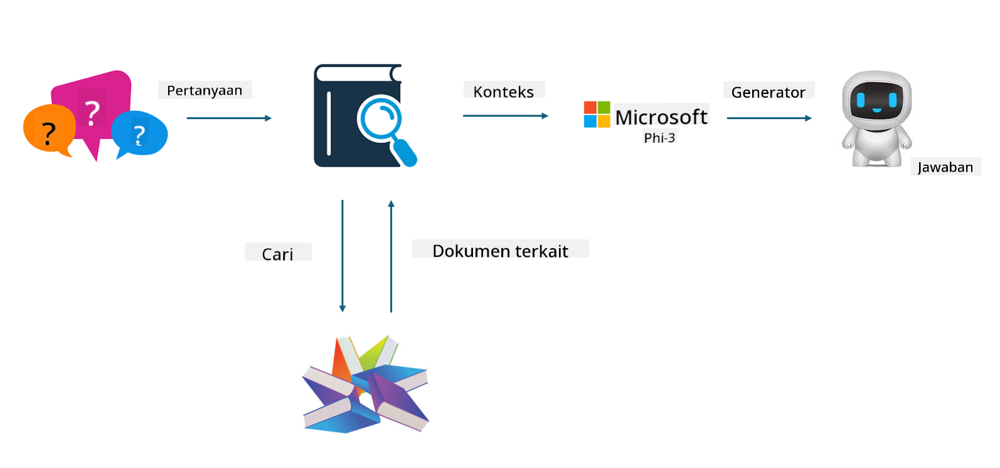

<!--
CO_OP_TRANSLATOR_METADATA:
{
  "original_hash": "743d7e9cb9c4e8ea642d77bee657a7fa",
  "translation_date": "2025-05-09T22:28:28+00:00",
  "source_file": "md/03.FineTuning/LetPhi3gotoIndustriy.md",
  "language_code": "id"
}
-->
# **Jadikan Phi-3 sebagai ahli industri**

Untuk memasukkan model Phi-3 ke dalam sebuah industri, Anda perlu menambahkan data bisnis industri ke model Phi-3. Kami memiliki dua opsi berbeda, yang pertama adalah RAG (Retrieval Augmented Generation) dan yang kedua adalah Fine Tuning.

## **RAG vs Fine-Tuning**

### **Retrieval Augmented Generation**

RAG adalah pengambilan data + pembuatan teks. Data terstruktur dan tidak terstruktur dari perusahaan disimpan dalam database vektor. Saat mencari konten yang relevan, ringkasan dan konten yang sesuai ditemukan untuk membentuk konteks, dan kemampuan penyelesaian teks dari LLM/SLM digabungkan untuk menghasilkan konten.

### **Fine-tuning**

Fine-tuning didasarkan pada peningkatan suatu model tertentu. Ini tidak perlu dimulai dari algoritma model, tetapi data perlu terus dikumpulkan. Jika Anda menginginkan terminologi dan ekspresi bahasa yang lebih tepat dalam aplikasi industri, fine-tuning adalah pilihan yang lebih baik. Namun, jika data Anda sering berubah, fine-tuning bisa menjadi rumit.

### **Cara memilih**

1. Jika jawaban kita memerlukan pengenalan data eksternal, RAG adalah pilihan terbaik

2. Jika Anda perlu menghasilkan pengetahuan industri yang stabil dan tepat, fine-tuning akan menjadi pilihan yang baik. RAG mengutamakan pengambilan konten yang relevan tetapi mungkin tidak selalu tepat dalam nuansa khusus.

3. Fine-tuning membutuhkan dataset berkualitas tinggi, dan jika hanya dalam cakupan data yang kecil, tidak akan memberikan banyak perbedaan. RAG lebih fleksibel

4. Fine-tuning adalah kotak hitam, sebuah metafisika, dan sulit untuk memahami mekanisme internalnya. Tetapi RAG dapat memudahkan menemukan sumber data, sehingga secara efektif menyesuaikan halusinasi atau kesalahan konten dan memberikan transparansi yang lebih baik.

### **Skenario**

1. Industri vertikal membutuhkan kosakata dan ekspresi profesional khusus, ***Fine-tuning*** akan menjadi pilihan terbaik

2. Sistem QA, yang melibatkan sintesis berbagai titik pengetahuan, ***RAG*** akan menjadi pilihan terbaik

3. Kombinasi alur bisnis otomatis ***RAG + Fine-tuning*** adalah pilihan terbaik

## **Cara menggunakan RAG**

Database vektor adalah kumpulan data yang disimpan dalam bentuk matematis. Database vektor memudahkan model pembelajaran mesin untuk mengingat input sebelumnya, memungkinkan pembelajaran mesin digunakan untuk mendukung kasus penggunaan seperti pencarian, rekomendasi, dan pembuatan teks. Data dapat diidentifikasi berdasarkan metrik kesamaan daripada kecocokan tepat, memungkinkan model komputer memahami konteks data.

Database vektor adalah kunci untuk mewujudkan RAG. Kita dapat mengonversi data menjadi penyimpanan vektor melalui model vektor seperti text-embedding-3, jina-ai-embedding, dll.

Pelajari lebih lanjut tentang membuat aplikasi RAG di [https://github.com/microsoft/Phi-3CookBook](https://github.com/microsoft/Phi-3CookBook?WT.mc_id=aiml-138114-kinfeylo) 

## **Cara menggunakan Fine-tuning**

Algoritma yang umum digunakan dalam Fine-tuning adalah Lora dan QLora. Bagaimana cara memilih?
- [Pelajari Lebih Lanjut dengan notebook contoh ini](../../../../code/04.Finetuning/Phi_3_Inference_Finetuning.ipynb)
- [Contoh Python FineTuning Sample](../../../../code/04.Finetuning/FineTrainingScript.py)

### **Lora dan QLora**

LoRA (Low-Rank Adaptation) dan QLoRA (Quantized Low-Rank Adaptation) adalah teknik yang digunakan untuk fine-tuning model bahasa besar (LLM) menggunakan Parameter Efficient Fine Tuning (PEFT). Teknik PEFT dirancang untuk melatih model dengan lebih efisien dibandingkan metode tradisional.  
LoRA adalah teknik fine-tuning mandiri yang mengurangi penggunaan memori dengan menerapkan aproksimasi low-rank pada matriks pembaruan bobot. Ini menawarkan waktu pelatihan yang cepat dan mempertahankan performa yang mendekati metode fine-tuning tradisional.

QLoRA adalah versi pengembangan dari LoRA yang menggabungkan teknik kuantisasi untuk lebih mengurangi penggunaan memori. QLoRA mengkuantisasi presisi parameter bobot dalam LLM yang sudah dilatih sebelumnya ke presisi 4-bit, yang lebih efisien memori dibandingkan LoRA. Namun, pelatihan QLoRA sekitar 30% lebih lambat dibandingkan pelatihan LoRA karena langkah tambahan kuantisasi dan dekuantisasi.

QLoRA menggunakan LoRA sebagai pelengkap untuk memperbaiki kesalahan yang diperkenalkan selama kuantisasi. QLoRA memungkinkan fine-tuning model besar dengan miliaran parameter pada GPU yang relatif kecil dan tersedia secara luas. Misalnya, QLoRA dapat melakukan fine-tuning model 70B parameter yang membutuhkan 36 GPU dengan hanya 2

**Penafian**:  
Dokumen ini telah diterjemahkan menggunakan layanan terjemahan AI [Co-op Translator](https://github.com/Azure/co-op-translator). Meskipun kami berusaha untuk akurasi, harap diketahui bahwa terjemahan otomatis mungkin mengandung kesalahan atau ketidakakuratan. Dokumen asli dalam bahasa aslinya harus dianggap sebagai sumber yang otoritatif. Untuk informasi penting, disarankan menggunakan terjemahan profesional oleh manusia. Kami tidak bertanggung jawab atas kesalahpahaman atau salah tafsir yang timbul dari penggunaan terjemahan ini.