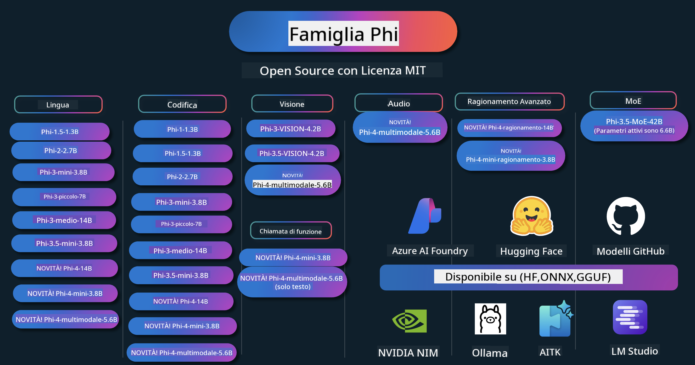

<!--
CO_OP_TRANSLATOR_METADATA:
{
  "original_hash": "1cab9282e04f2e1c388a38dca7763c16",
  "translation_date": "2025-05-09T03:52:18+00:00",
  "source_file": "README.md",
  "language_code": "it"
}
-->
# Phi Cookbook: Esempi pratici con i modelli Phi di Microsoft

  

  
  
  

  
  

Phi è una serie di modelli AI open source sviluppati da Microsoft.

Attualmente Phi è il modello di linguaggio piccolo (SLM) più potente ed economico, con ottime performance in scenari multilingue, ragionamento, generazione di testo/chat, coding, immagini, audio e altro.

Puoi distribuire Phi nel cloud o su dispositivi edge, e costruire facilmente applicazioni di intelligenza artificiale generativa anche con risorse di calcolo limitate.

Segui questi passaggi per iniziare a usare queste risorse:  
1. **Forka il repository**: clicca su   
2. **Clona il repository**: `git clone https://github.com/microsoft/PhiCookBook.git`  
3. [**Unisciti alla community Microsoft AI su Discord e incontra esperti e altri sviluppatori**](https://discord.com/invite/ByRwuEEgH4?WT.mc_id=aiml-137032-kinfeylo)

## 🌐 Supporto Multilingue

### Supportato tramite GitHub Action (Automatizzato e sempre aggiornato)

[Francese](../fr/README.md) | [Spagnolo](../es/README.md) | [Tedesco](../de/README.md) | [Russo](../ru/README.md) | [Arabo](../ar/README.md) | [Persiano (Farsi)](../fa/README.md) | [Urdu](../ur/README.md) | [Cinese (semplificato)](../zh/README.md) | [Cinese (tradizionale, Macao)](../mo/README.md) | [Cinese (tradizionale, Hong Kong)](../hk/README.md) | [Cinese (tradizionale, Taiwan)](../tw/README.md) | [Giapponese](../ja/README.md) | [Coreano](../ko/README.md) | [Hindi](../hi/README.md)

### Supportato tramite CLI
[Bengali](../bn/README.md) | [Marathi](../mr/README.md) | [Nepali](../ne/README.md) | [Punjabi (Gurmukhi)](../pa/README.md) | [Portuguese (Portugal)](../pt/README.md) | [Portuguese (Brazil)](../br/README.md) | [Italian](./README.md) | [Polish](../pl/README.md) | [Turkish](../tr/README.md) | [Greek](../el/README.md) | [Thai](../th/README.md) | [Swedish](../sv/README.md) | [Danish](../da/README.md) | [Norwegian](../no/README.md) | [Finnish](../fi/README.md) | [Dutch](../nl/README.md) | [Hebrew](../he/README.md) | [Vietnamese](../vi/README.md) | [Indonesian](../id/README.md) | [Malay](../ms/README.md) | [Tagalog (Filipino)](../tl/README.md) | [Swahili](../sw/README.md) | [Hungarian](../hu/README.md) | [Czech](../cs/README.md) | [Slovak](../sk/README.md) | [Romanian](../ro/README.md) | [Bulgarian](../bg/README.md) | [Serbian (Cyrillic)](../sr/README.md) | [Croatian](../hr/README.md) | [Slovenian](../sl/README.md)

## Indice dei Contenuti

- Introduzione
- [Benvenuti nella famiglia Phi](./md/01.Introduction/01/01.PhiFamily.md)
  - [Configurare il tuo ambiente](./md/01.Introduction/01/01.EnvironmentSetup.md)
  - [Comprendere le tecnologie chiave](./md/01.Introduction/01/01.Understandingtech.md)
  - [Sicurezza AI per i modelli Phi](./md/01.Introduction/01/01.AISafety.md)
  - [Supporto hardware Phi](./md/01.Introduction/01/01.Hardwaresupport.md)
  - [Modelli Phi e disponibilità sulle piattaforme](./md/01.Introduction/01/01.Edgeandcloud.md)
  - [Utilizzo di Guidance-ai e Phi](./md/01.Introduction/01/01.Guidance.md)
  - [Modelli GitHub Marketplace](https://github.com/marketplace/models)
  - [Catalogo modelli AI Azure](https://ai.azure.com)

- Inferenza Phi in ambienti diversi
    -  [Hugging face](./md/01.Introduction/02/01.HF.md)
    -  [Modelli GitHub](./md/01.Introduction/02/02.GitHubModel.md)
    -  [Catalogo modelli Azure AI Foundry](./md/01.Introduction/02/03.AzureAIFoundry.md)
    -  [Ollama](./md/01.Introduction/02/04.Ollama.md)
    -  [AI Toolkit VSCode (AITK)](./md/01.Introduction/02/05.AITK.md)
    -  [NVIDIA NIM](./md/01.Introduction/02/06.NVIDIA.md)

- Inferenza Phi Family
    - [Inferenza Phi su iOS](./md/01.Introduction/03/iOS_Inference.md)
    - [Inferenza Phi su Android](./md/01.Introduction/03/Android_Inference.md)
    - [Inferenza Phi su Jetson](./md/01.Introduction/03/Jetson_Inference.md)
    - [Inferenza Phi su AI PC](./md/01.Introduction/03/AIPC_Inference.md)
    - [Inferenza Phi con Apple MLX Framework](./md/01.Introduction/03/MLX_Inference.md)
    - [Inferenza Phi su server locale](./md/01.Introduction/03/Local_Server_Inference.md)
    - [Inferenza Phi su server remoto usando AI Toolkit](./md/01.Introduction/03/Remote_Interence.md)
    - [Inferenza Phi con Rust](./md/01.Introduction/03/Rust_Inference.md)
    - [Inferenza Phi--Vision in locale](./md/01.Introduction/03/Vision_Inference.md)
    - [Inferenza Phi con Kaito AKS, contenitori Azure (supporto ufficiale)](./md/01.Introduction/03/Kaito_Inference.md)
-  [Quantizzazione Phi Family](./md/01.Introduction/04/QuantifyingPhi.md)
    - [Quantizzare Phi-3.5 / 4 usando llama.cpp](./md/01.Introduction/04/UsingLlamacppQuantifyingPhi.md)
    - [Quantizzare Phi-3.5 / 4 usando estensioni Generative AI per onnxruntime](./md/01.Introduction/04/UsingORTGenAIQuantifyingPhi.md)
    - [Quantizzare Phi-3.5 / 4 usando Intel OpenVINO](./md/01.Introduction/04/UsingIntelOpenVINOQuantifyingPhi.md)
    - [Quantizzare Phi-3.5 / 4 usando Apple MLX Framework](./md/01.Introduction/04/UsingAppleMLXQuantifyingPhi.md)

-  Valutazione Phi
- [Response AI](./md/01.Introduction/05/ResponsibleAI.md)
    - [Azure AI Foundry per la valutazione](./md/01.Introduction/05/AIFoundry.md)
    - [Utilizzo di Promptflow per la valutazione](./md/01.Introduction/05/Promptflow.md)
 
- RAG con Azure AI Search
    - [Come usare Phi-4-mini e Phi-4-multimodal(RAG) con Azure AI Search](https://github.com/microsoft/PhiCookBook/blob/main/code/06.E2E/E2E_Phi-4-RAG-Azure-AI-Search.ipynb)

- Esempi di sviluppo applicazioni Phi
  - Applicazioni di testo e chat
    - Esempi Phi-4 🆕
      - [📓] [Chat con il modello ONNX Phi-4-mini](./md/02.Application/01.TextAndChat/Phi4/ChatWithPhi4ONNX/README.md)
      - [Chat con modello ONNX Phi-4 locale in .NET](../../md/04.HOL/dotnet/src/LabsPhi4-Chat-01OnnxRuntime)
      - [App console chat .NET con Phi-4 ONNX usando Semantic Kernel](../../md/04.HOL/dotnet/src/LabsPhi4-Chat-02SK)
    - Esempi Phi-3 / 3.5
      - [Chatbot locale nel browser usando Phi3, ONNX Runtime Web e WebGPU](https://github.com/microsoft/onnxruntime-inference-examples/tree/main/js/chat)
      - [Chat OpenVino](./md/02.Application/01.TextAndChat/Phi3/E2E_OpenVino_Chat.md)
      - [Multi modello - Phi-3-mini interattivo e OpenAI Whisper](./md/02.Application/01.TextAndChat/Phi3/E2E_Phi-3-mini_with_whisper.md)
      - [MLFlow - Creare un wrapper e usare Phi-3 con MLFlow](./md//02.Application/01.TextAndChat/Phi3/E2E_Phi-3-MLflow.md)
      - [Ottimizzazione modello - Come ottimizzare Phi-3-mini per ONNX Runtime Web con Olive](https://github.com/microsoft/Olive/tree/main/examples/phi3)
      - [App WinUI3 con Phi-3 mini-4k-instruct-onnx](https://github.com/microsoft/Phi3-Chat-WinUI3-Sample/)
      - [Esempio app note multi modello AI con WinUI3](https://github.com/microsoft/ai-powered-notes-winui3-sample)
      - [Fine-tune e integrazione modelli Phi-3 personalizzati con Prompt flow](./md/02.Application/01.TextAndChat/Phi3/E2E_Phi-3-FineTuning_PromptFlow_Integration.md)
      - [Fine-tune e integrazione modelli Phi-3 personalizzati con Prompt flow in Azure AI Foundry](./md/02.Application/01.TextAndChat/Phi3/E2E_Phi-3-FineTuning_PromptFlow_Integration_AIFoundry.md)
      - [Valutazione del modello Phi-3 / Phi-3.5 fine-tuned in Azure AI Foundry focalizzandosi sui principi Responsible AI di Microsoft](./md/02.Application/01.TextAndChat/Phi3/E2E_Phi-3-Evaluation_AIFoundry.md)
      - [📓] [Esempio di predizione linguistica Phi-3.5-mini-instruct (Cinese/Inglese)](../../md/02.Application/01.TextAndChat/Phi3/phi3-instruct-demo.ipynb)
      - [Chatbot RAG Phi-3.5-Instruct WebGPU](./md/02.Application/01.TextAndChat/Phi3/WebGPUWithPhi35Readme.md)
      - [Uso di Windows GPU per creare soluzioni Prompt flow con Phi-3.5-Instruct ONNX](./md/02.Application/01.TextAndChat/Phi3/UsingPromptFlowWithONNX.md)
      - [Uso di Microsoft Phi-3.5 tflite per creare app Android](./md/02.Application/01.TextAndChat/Phi3/UsingPhi35TFLiteCreateAndroidApp.md)
      - [Esempio Q&A .NET usando modello ONNX Phi-3 locale con Microsoft.ML.OnnxRuntime](../../md/04.HOL/dotnet/src/LabsPhi301)
      - [App console chat .NET con Semantic Kernel e Phi-3](../../md/04.HOL/dotnet/src/LabsPhi302)

  - Esempi basati su codice con Azure AI Inference SDK 
    - Esempi Phi-4 🆕
      - [📓] [Genera codice progetto usando Phi-4-multimodal](./md/02.Application/02.Code/Phi4/GenProjectCode/README.md)
    - Esempi Phi-3 / 3.5
      - [Costruisci il tuo GitHub Copilot Chat per Visual Studio Code con Microsoft Phi-3 Family](./md/02.Application/02.Code/Phi3/VSCodeExt/README.md)
      - [Crea il tuo agente Chat Copilot per Visual Studio Code con Phi-3.5 usando modelli GitHub](/md/02.Application/02.Code/Phi3/CreateVSCodeChatAgentWithGitHubModels.md)

  - Esempi di ragionamento avanzato
    - Esempi Phi-4 🆕
      - [📓] [Esempi Phi-4-mini-reasoning o Phi-4-reasoning](./md/02.Application/03.AdvancedReasoning/Phi4/AdvancedResoningPhi4mini/README.md)
      - [📓] [Fine-tuning Phi-4-mini-reasoning con Microsoft Olive](../../md/02.Application/03.AdvancedReasoning/Phi4/AdvancedResoningPhi4mini/olive_ft_phi_4_reasoning_with_medicaldata.ipynb)
      - [📓] [Fine-tuning Phi-4-mini-reasoning con Apple MLX](../../md/02.Application/03.AdvancedReasoning/Phi4/AdvancedResoningPhi4mini/mlx_ft_phi_4_reasoning_with_medicaldata.ipynb)
      - [📓] [Phi-4-mini-reasoning con modelli GitHub](../../md/02.Application/02.Code/Phi4r/github_models_inference.ipynb)
- [📓] [Phi-4-mini ragionamento con modelli Azure AI Foundry](../../md/02.Application/02.Code/Phi4r/azure_models_inference.ipynb)
  - Demo
      - [Demo Phi-4-mini ospitate su Hugging Face Spaces](https://huggingface.co/spaces/microsoft/phi-4-mini?WT.mc_id=aiml-137032-kinfeylo)
      - [Demo Phi-4-multimodale ospitate su Hugging Face Spaces](https://huggingface.co/spaces/microsoft/phi-4-multimodal?WT.mc_id=aiml-137032-kinfeylo)
  - Esempi Visione
    - Esempi Phi-4 🆕
      - [📓] [Usa Phi-4-multimodale per leggere immagini e generare codice](./md/02.Application/04.Vision/Phi4/CreateFrontend/README.md) 
    - Esempi Phi-3 / 3.5
      -  [📓][Phi-3-vision - da testo immagine a testo](../../md/02.Application/04.Vision/Phi3/E2E_Phi-3-vision-image-text-to-text-online-endpoint.ipynb)
      - [Phi-3-vision-ONNX](https://onnxruntime.ai/docs/genai/tutorials/phi3-v.html)
      - [📓][Phi-3-vision CLIP Embedding](../../md/02.Application/04.Vision/Phi3/E2E_Phi-3-vision-image-text-to-text-online-endpoint.ipynb)
      - [DEMO: Phi-3 Recycling](https://github.com/jennifermarsman/PhiRecycling/)
      - [Phi-3-vision - assistente visivo linguistico - con Phi3-Vision e OpenVINO](https://docs.openvino.ai/nightly/notebooks/phi-3-vision-with-output.html)
      - [Phi-3 Vision Nvidia NIM](./md/02.Application/04.Vision/Phi3/E2E_Nvidia_NIM_Vision.md)
      - [Phi-3 Vision OpenVino](./md/02.Application/04.Vision/Phi3/E2E_OpenVino_Phi3Vision.md)
      - [📓][Phi-3.5 Vision esempio multi-frame o multi-immagine](../../md/02.Application/04.Vision/Phi3/phi3-vision-demo.ipynb)
      - [Phi-3 Vision modello ONNX locale usando Microsoft.ML.OnnxRuntime .NET](../../md/04.HOL/dotnet/src/LabsPhi303)
      - [Modello ONNX locale Phi-3 Vision basato su menu usando Microsoft.ML.OnnxRuntime .NET](../../md/04.HOL/dotnet/src/LabsPhi304)

  - Esempi Audio
    - Esempi Phi-4 🆕
      - [📓] [Estrazione di trascrizioni audio con Phi-4-multimodale](./md/02.Application/05.Audio/Phi4/Transciption/README.md)
      - [📓] [Esempio audio Phi-4-multimodale](../../md/02.Application/05.Audio/Phi4/Siri/demo.ipynb)
      - [📓] [Esempio di traduzione vocale Phi-4-multimodale](../../md/02.Application/05.Audio/Phi4/Translate/demo.ipynb)
      - [Applicazione console .NET che usa Phi-4-multimodale Audio per analizzare un file audio e generare trascrizione](../../md/04.HOL/dotnet/src/LabsPhi4-MultiModal-02Audio)

  - Esempi MOE
    - Esempi Phi-3 / 3.5
      - [📓] [Modelli Mixture of Experts (MoEs) Phi-3.5 - esempio social media](../../md/02.Application/06.MoE/Phi3/phi3_moe_demo.ipynb)
      - [📓] [Costruire una pipeline Retrieval-Augmented Generation (RAG) con NVIDIA NIM Phi-3 MOE, Azure AI Search e LlamaIndex](../../md/02.Application/06.MoE/Phi3/azure-ai-search-nvidia-rag.ipynb)
  - Esempi Function Calling
    - Esempi Phi-4 🆕
      -  [📓] [Uso di Function Calling con Phi-4-mini](./md/02.Application/07.FunctionCalling/Phi4/FunctionCallingBasic/README.md)
      -  [📓] [Uso di Function Calling per creare multi-agenti con Phi-4-mini](../../md/02.Application/07.FunctionCalling/Phi4/Multiagents/Phi_4_mini_multiagent.ipynb)
      -  [📓] [Uso di Function Calling con Ollama](../../md/02.Application/07.FunctionCalling/Phi4/Ollama/ollama_functioncalling.ipynb)
  - Esempi Multimodal Mixing
    - Esempi Phi-4 🆕
      -  [📓] [Uso di Phi-4-multimodale come giornalista tecnologico](../../md/02.Application/08.Multimodel/Phi4/TechJournalist/phi_4_mm_audio_text_publish_news.ipynb)
      - [Applicazione console .NET che usa Phi-4-multimodale per analizzare immagini](../../md/04.HOL/dotnet/src/LabsPhi4-MultiModal-01Images)

- Fine-tuning Phi Esempi
  - [Scenari di fine-tuning](./md/03.FineTuning/FineTuning_Scenarios.md)
  - [Fine-tuning vs RAG](./md/03.FineTuning/FineTuning_vs_RAG.md)
  - [Fine-tuning: lascia che Phi-3 diventi un esperto di settore](./md/03.FineTuning/LetPhi3gotoIndustriy.md)
  - [Fine-tuning Phi-3 con AI Toolkit per VS Code](./md/03.FineTuning/Finetuning_VSCodeaitoolkit.md)
  - [Fine-tuning Phi-3 con Azure Machine Learning Service](./md/03.FineTuning/Introduce_AzureML.md)
- [Fine-tuning Phi-3 con Lora](./md/03.FineTuning/FineTuning_Lora.md)
  - [Fine-tuning Phi-3 con QLora](./md/03.FineTuning/FineTuning_Qlora.md)
  - [Fine-tuning Phi-3 con Azure AI Foundry](./md/03.FineTuning/FineTuning_AIFoundry.md)
  - [Fine-tuning Phi-3 con Azure ML CLI/SDK](./md/03.FineTuning/FineTuning_MLSDK.md)
  - [Fine-tuning con Microsoft Olive](./md/03.FineTuning/FineTuning_MicrosoftOlive.md)
  - [Laboratorio práctico de Fine-tuning con Microsoft Olive](./md/03.FineTuning/olive-lab/readme.md)
  - [Fine-tuning Phi-3-vision con Weights and Bias](./md/03.FineTuning/FineTuning_Phi-3-visionWandB.md)
  - [Fine-tuning Phi-3 con Apple MLX Framework](./md/03.FineTuning/FineTuning_MLX.md)
  - [Fine-tuning Phi-3-vision (soporte oficial)](./md/03.FineTuning/FineTuning_Vision.md)
  - [Fine-Tuning Phi-3 con Kaito AKS, Azure Containers (soporte oficial)](./md/03.FineTuning/FineTuning_Kaito.md)
  - [Fine-Tuning Phi-3 y 3.5 Vision](https://github.com/2U1/Phi3-Vision-Finetune)

- Laboratorio práctico
  - [Explorando modelos de vanguardia: LLMs, SLMs, desarrollo local y más](https://github.com/microsoft/aitour-exploring-cutting-edge-models)
  - [Desbloqueando el potencial del NLP: Fine-Tuning con Microsoft Olive](https://github.com/azure/Ignite_FineTuning_workshop)

- Artículos y publicaciones académicas
  - [Textbooks Are All You Need II: informe técnico de phi-1.5](https://arxiv.org/abs/2309.05463)
  - [Informe técnico de Phi-3: un modelo de lenguaje altamente capaz localmente en tu teléfono](https://arxiv.org/abs/2404.14219)
  - [Informe técnico de Phi-4](https://arxiv.org/abs/2412.08905)
  - [Informe técnico de Phi-4-Mini: modelos multimodales compactos pero potentes mediante mezcla de LoRAs](https://arxiv.org/abs/2503.01743)
  - [Optimizando modelos de lenguaje pequeños para llamadas de función en vehículos](https://arxiv.org/abs/2501.02342)
  - [(WhyPHI) Fine-Tuning PHI-3 para respuestas a preguntas de opción múltiple: metodología, resultados y desafíos](https://arxiv.org/abs/2501.01588)
  - [Informe técnico de Phi-4-reasoning](https://www.microsoft.com/en-us/research/wp-content/uploads/2025/04/phi_4_reasoning.pdf)
  - [Informe técnico de Phi-4-mini-reasoning](https://huggingface.co/microsoft/Phi-4-mini-reasoning/blob/main/Phi-4-Mini-Reasoning.pdf)

## Uso de modelos Phi

### Phi en Azure AI Foundry

Puedes aprender cómo usar Microsoft Phi y cómo construir soluciones E2E en tus diferentes dispositivos de hardware. Para experimentar Phi por ti mismo, comienza probando los modelos y personalizando Phi para tus escenarios usando el [Catálogo de modelos Azure AI Foundry](https://aka.ms/phi3-azure-ai). Puedes aprender más en Comenzando con [Azure AI Foundry](/md/02.QuickStart/AzureAIFoundry_QuickStart.md)

**Playground**  
Cada modelo tiene un playground dedicado para probar el modelo en [Azure AI Playground](https://aka.ms/try-phi3).

### Phi en modelos de GitHub

Puedes aprender cómo usar Microsoft Phi y cómo construir soluciones E2E en tus diferentes dispositivos de hardware. Para experimentar Phi por ti mismo, comienza jugando con el modelo y personalizando Phi para tus escenarios usando el [Catálogo de modelos de GitHub](https://github.com/marketplace/models?WT.mc_id=aiml-137032-kinfeylo). Puedes aprender más en Comenzando con [Catálogo de modelos de GitHub](/md/02.QuickStart/GitHubModel_QuickStart.md)

**Playground**  
Cada modelo tiene un [playground dedicado para probar el modelo](/md/02.QuickStart/GitHubModel_QuickStart.md).

### Phi en Hugging Face

También puedes encontrar el modelo en [Hugging Face](https://huggingface.co/microsoft)

**Playground**  
[Playground de Hugging Chat](https://huggingface.co/chat/models/microsoft/Phi-3-mini-4k-instruct)

## IA Responsable

Microsoft está comprometido a ayudar a nuestros clientes a usar nuestros productos de IA de forma responsable, compartiendo nuestros aprendizajes y construyendo asociaciones basadas en la confianza mediante herramientas como Transparency Notes e Impact Assessments. Muchos de estos recursos están disponibles en [https://aka.ms/RAI](https://aka.ms/RAI).  
El enfoque de Microsoft hacia la IA responsable se basa en nuestros principios de IA de equidad, confiabilidad y seguridad, privacidad y protección, inclusión, transparencia y responsabilidad.
Modelli su larga scala di linguaggio naturale, immagini e voce - come quelli utilizzati in questo esempio - possono potenzialmente comportarsi in modi ingiusti, inaffidabili o offensivi, causando di conseguenza danni. Consulta la [nota sulla trasparenza del servizio Azure OpenAI](https://learn.microsoft.com/legal/cognitive-services/openai/transparency-note?tabs=text) per essere informato sui rischi e le limitazioni.

L'approccio consigliato per mitigare questi rischi è includere un sistema di sicurezza nella tua architettura in grado di rilevare e prevenire comportamenti dannosi. [Azure AI Content Safety](https://learn.microsoft.com/azure/ai-services/content-safety/overview) offre un livello di protezione indipendente, capace di rilevare contenuti dannosi generati dagli utenti e dall’IA nelle applicazioni e nei servizi. Azure AI Content Safety include API per testo e immagini che permettono di identificare materiale potenzialmente dannoso. All’interno di Azure AI Foundry, il servizio Content Safety consente di visualizzare, esplorare e provare esempi di codice per rilevare contenuti dannosi in diverse modalità. La seguente [documentazione quickstart](https://learn.microsoft.com/azure/ai-services/content-safety/quickstart-text?tabs=visual-studio%2Clinux&pivots=programming-language-rest) ti guida nel fare richieste al servizio.

Un altro aspetto da considerare è la performance complessiva dell’applicazione. Con applicazioni multimodali e multimodello, intendiamo per performance il fatto che il sistema funzioni come tu e i tuoi utenti vi aspettate, incluso il non generare output dannosi. È importante valutare le prestazioni della tua applicazione complessiva utilizzando i [valutatori di Performance e Qualità e Rischio e Sicurezza](https://learn.microsoft.com/azure/ai-studio/concepts/evaluation-metrics-built-in). Hai inoltre la possibilità di creare e valutare con [valutatori personalizzati](https://learn.microsoft.com/azure/ai-studio/how-to/develop/evaluate-sdk#custom-evaluators).

Puoi valutare la tua applicazione AI nel tuo ambiente di sviluppo utilizzando l’[Azure AI Evaluation SDK](https://microsoft.github.io/promptflow/index.html). Dato un dataset di test o un obiettivo, le generazioni della tua applicazione di AI generativa vengono misurate quantitativamente con valutatori integrati o personalizzati a tua scelta. Per iniziare con l’azure ai evaluation sdk e valutare il tuo sistema, puoi seguire la [guida quickstart](https://learn.microsoft.com/azure/ai-studio/how-to/develop/flow-evaluate-sdk). Una volta eseguita una valutazione, puoi [visualizzare i risultati in Azure AI Foundry](https://learn.microsoft.com/azure/ai-studio/how-to/evaluate-flow-results).

## Marchi

Questo progetto può contenere marchi o loghi di progetti, prodotti o servizi. L’uso autorizzato dei marchi o loghi Microsoft è soggetto e deve seguire le [Linee guida sui marchi e sul branding Microsoft](https://www.microsoft.com/legal/intellectualproperty/trademarks/usage/general).  
L’uso di marchi o loghi Microsoft in versioni modificate di questo progetto non deve creare confusione né implicare sponsorizzazione da parte di Microsoft. Qualsiasi uso di marchi o loghi di terze parti è soggetto alle politiche di tali terze parti.

**Disclaimer**:  
Questo documento è stato tradotto utilizzando il servizio di traduzione automatica AI [Co-op Translator](https://github.com/Azure/co-op-translator). Pur impegnandoci per l’accuratezza, si prega di notare che le traduzioni automatiche possono contenere errori o imprecisioni. Il documento originale nella sua lingua nativa deve essere considerato la fonte autorevole. Per informazioni critiche, si raccomanda la traduzione professionale umana. Non siamo responsabili per eventuali incomprensioni o interpretazioni errate derivanti dall’uso di questa traduzione.