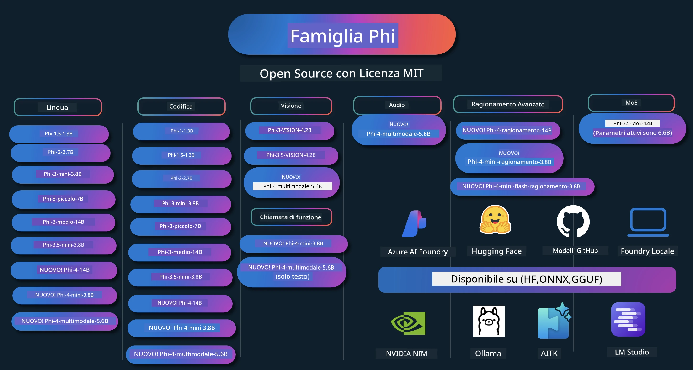

# Phi Cookbook: Esempi Pratici con i Modelli Phi di Microsoft

[](https://codespaces.new/microsoft/phicookbook)
[](https://vscode.dev/redirect?url=vscode://ms-vscode-remote.remote-containers/cloneInVolume?url=https://github.com/microsoft/phicookbook)

[](https://GitHub.com/microsoft/phicookbook/graphs/contributors/?WT.mc_id=aiml-137032-kinfeylo)
[](https://GitHub.com/microsoft/phicookbook/issues/?WT.mc_id=aiml-137032-kinfeylo)
[](https://GitHub.com/microsoft/phicookbook/pulls/?WT.mc_id=aiml-137032-kinfeylo)
[](http://makeapullrequest.com?WT.mc_id=aiml-137032-kinfeylo)

[](https://GitHub.com/microsoft/phicookbook/watchers/?WT.mc_id=aiml-137032-kinfeylo)
[](https://GitHub.com/microsoft/phicookbook/network/?WT.mc_id=aiml-137032-kinfeylo)
[](https://GitHub.com/microsoft/phicookbook/stargazers/?WT.mc_id=aiml-137032-kinfeylo)

[](https://discord.com/invite/ByRwuEEgH4)

Phi è una serie di modelli AI open source sviluppati da Microsoft.

Phi è attualmente il modello linguistico piccolo (SLM) più potente ed efficace in termini di costi, con benchmark molto buoni in scenari multilingue, ragionamento, generazione di testo/chat, coding, immagini, audio e altri.

Puoi distribuire Phi nel cloud o su dispositivi edge, e puoi facilmente costruire applicazioni di intelligenza artificiale generativa con risorse computazionali limitate.

Segui questi passaggi per iniziare a usare queste risorse:
1. **Forka il Repository**: Clicca su [](https://GitHub.com/microsoft/phicookbook/network/?WT.mc_id=aiml-137032-kinfeylo)
2. **Clona il Repository**: `git clone https://github.com/microsoft/PhiCookBook.git`
3. [**Unisciti alla Community Discord Microsoft AI e incontra esperti e altri sviluppatori**](https://discord.com/invite/ByRwuEEgH4?WT.mc_id=aiml-137032-kinfeylo)



### 🌐 Supporto Multilingue

#### Supportato tramite GitHub Action (Automatizzato e sempre aggiornato)

<!-- CO-OP TRANSLATOR LANGUAGES TABLE START -->
[Arabo](../ar/README.md) | [Bengalese](../bn/README.md) | [Bulgaro](../bg/README.md) | [Birmano (Myanmar)](../my/README.md) | [Cinese (Semplificato)](../zh-CN/README.md) | [Cinese (Tradizionale, Hong Kong)](../zh-HK/README.md) | [Cinese (Tradizionale, Macau)](../zh-MO/README.md) | [Cinese (Tradizionale, Taiwan)](../zh-TW/README.md) | [Croato](../hr/README.md) | [Ceco](../cs/README.md) | [Danese](../da/README.md) | [Olandese](../nl/README.md) | [Estone](../et/README.md) | [Finlandese](../fi/README.md) | [Francese](../fr/README.md) | [Tedesco](../de/README.md) | [Greco](../el/README.md) | [Ebraico](../he/README.md) | [Hindi](../hi/README.md) | [Ungherese](../hu/README.md) | [Indonesiano](../id/README.md) | [Italiano](./README.md) | [Giapponese](../ja/README.md) | [Kannada](../kn/README.md) | [Coreano](../ko/README.md) | [Lituano](../lt/README.md) | [Malese](../ms/README.md) | [Malayalam](../ml/README.md) | [Marathi](../mr/README.md) | [Nepalese](../ne/README.md) | [Pidgin Nigeriano](../pcm/README.md) | [Norvegese](../no/README.md) | [Persiano (Farsi)](../fa/README.md) | [Polacco](../pl/README.md) | [Portoghese (Brasile)](../pt-BR/README.md) | [Portoghese (Portogallo)](../pt-PT/README.md) | [Punjabi (Gurmukhi)](../pa/README.md) | [Rumeno](../ro/README.md) | [Russo](../ru/README.md) | [Serbo (Cirillico)](../sr/README.md) | [Slovacco](../sk/README.md) | [Sloveno](../sl/README.md) | [Spagnolo](../es/README.md) | [Swahili](../sw/README.md) | [Svedese](../sv/README.md) | [Tagalog (Filippino)](../tl/README.md) | [Tamil](../ta/README.md) | [Telugu](../te/README.md) | [Thai](../th/README.md) | [Turco](../tr/README.md) | [Ucraino](../uk/README.md) | [Urdu](../ur/README.md) | [Vietnamita](../vi/README.md)

> **Preferisci Clonare Localmente?**

> Questo repository include traduzioni in oltre 50 lingue che aumentano significativamente la dimensione del download. Per clonare senza traduzioni, usa lo sparse checkout:
> ```bash
> git clone --filter=blob:none --sparse https://github.com/microsoft/PhiCookBook.git
> cd PhiCookBook
> git sparse-checkout set --no-cone '/*' '!translations' '!translated_images'
> ```
> Questo ti dà tutto il necessario per completare il corso con un download molto più veloce.
<!-- CO-OP TRANSLATOR LANGUAGES TABLE END -->

## Indice

- Introduzione
  - [Benvenuto nella Famiglia Phi](./md/01.Introduction/01/01.PhiFamily.md)
  - [Configurazione dell'ambiente](./md/01.Introduction/01/01.EnvironmentSetup.md)
  - [Comprensione delle Tecnologie Chiave](./md/01.Introduction/01/01.Understandingtech.md)
  - [Sicurezza AI per i Modelli Phi](./md/01.Introduction/01/01.AISafety.md)
  - [Supporto Hardware Phi](./md/01.Introduction/01/01.Hardwaresupport.md)
  - [Modelli Phi & Disponibilità su diverse piattaforme](./md/01.Introduction/01/01.Edgeandcloud.md)
  - [Usare Guidance-ai e Phi](./md/01.Introduction/01/01.Guidance.md)
  - [Modelli GitHub Marketplace](https://github.com/marketplace/models)
  - [Catalogo Modelli Azure AI](https://ai.azure.com)

- Inferenzia Phi in diversi ambienti
    -  [Hugging face](./md/01.Introduction/02/01.HF.md)
    -  [Modelli GitHub](./md/01.Introduction/02/02.GitHubModel.md)
    -  [Catalogo Modelli Azure AI Foundry](./md/01.Introduction/02/03.AzureAIFoundry.md)
    -  [Ollama](./md/01.Introduction/02/04.Ollama.md)
    -  [AI Toolkit VSCode (AITK)](./md/01.Introduction/02/05.AITK.md)
    -  [NVIDIA NIM](./md/01.Introduction/02/06.NVIDIA.md)
    -  [Foundry Locale](./md/01.Introduction/02/07.FoundryLocal.md)

- Inferenza Famiglia Phi
    - [Inferenza Phi su iOS](./md/01.Introduction/03/iOS_Inference.md)
    - [Inferenza Phi su Android](./md/01.Introduction/03/Android_Inference.md)
    - [Inferenza Phi su Jetson](./md/01.Introduction/03/Jetson_Inference.md)
    - [Inferenza Phi su AI PC](./md/01.Introduction/03/AIPC_Inference.md)
    - [Inferenza Phi con il Framework Apple MLX](./md/01.Introduction/03/MLX_Inference.md)
    - [Inferenza Phi su Server Locale](./md/01.Introduction/03/Local_Server_Inference.md)
    - [Inferenza Phi su Server Remoto usando AI Toolkit](./md/01.Introduction/03/Remote_Interence.md)
    - [Inferenza Phi con Rust](./md/01.Introduction/03/Rust_Inference.md)
    - [Inferenza Phi--Visione in Locale](./md/01.Introduction/03/Vision_Inference.md)
    - [Inferenza Phi con Kaito AKS, Azure Containers (supporto ufficiale)](./md/01.Introduction/03/Kaito_Inference.md)
-  [Quantificazione Famiglia Phi](./md/01.Introduction/04/QuantifyingPhi.md)
    - [Quantizzazione Phi-3.5 / 4 usando llama.cpp](./md/01.Introduction/04/UsingLlamacppQuantifyingPhi.md)
    - [Quantizzazione Phi-3.5 / 4 usando estensioni Generative AI per onnxruntime](./md/01.Introduction/04/UsingORTGenAIQuantifyingPhi.md)
    - [Quantizzazione Phi-3.5 / 4 usando Intel OpenVINO](./md/01.Introduction/04/UsingIntelOpenVINOQuantifyingPhi.md)
    - [Quantizzazione Phi-3.5 / 4 usando il Framework Apple MLX](./md/01.Introduction/04/UsingAppleMLXQuantifyingPhi.md)

-  Valutazione Phi
    - [Intelligenza Artificiale Responsabile](./md/01.Introduction/05/ResponsibleAI.md)
    - [Azure AI Foundry per la Valutazione](./md/01.Introduction/05/AIFoundry.md)
    - [Uso di Promptflow per la Valutazione](./md/01.Introduction/05/Promptflow.md)

- RAG con Azure AI Search
    - [Come usare Phi-4-mini e Phi-4-multimodal(RAG) con Azure AI Search](https://github.com/microsoft/PhiCookBook/blob/main/code/06.E2E/E2E_Phi-4-RAG-Azure-AI-Search.ipynb)

- Esempi di sviluppo applicazioni Phi
  - Applicazioni Testo & Chat
    - Esempi Phi-4 🆕
      - [📓] [Chat con Modello Phi-4-mini ONNX](./md/02.Application/01.TextAndChat/Phi4/ChatWithPhi4ONNX/README.md)
      - [Chat con Modello ONNX Phi-4 locale .NET](../../md/04.HOL/dotnet/src/LabsPhi4-Chat-01OnnxRuntime)
      - [App Console Chat .NET con Phi-4 ONNX usando Semantic Kernel](../../md/04.HOL/dotnet/src/LabsPhi4-Chat-02SK)
    - Esempi Phi-3 / 3.5
      - [Chatbot Locale nel browser usando Phi3, ONNX Runtime Web e WebGPU](https://github.com/microsoft/onnxruntime-inference-examples/tree/main/js/chat)
      - [Chat OpenVino](./md/02.Application/01.TextAndChat/Phi3/E2E_OpenVino_Chat.md)
      - [Multi Modello - Phi-3-mini Interattivo e OpenAI Whisper](./md/02.Application/01.TextAndChat/Phi3/E2E_Phi-3-mini_with_whisper.md)
      - [MLFlow - Creare un wrapper e usare Phi-3 con MLFlow](./md//02.Application/01.TextAndChat/Phi3/E2E_Phi-3-MLflow.md)
      - [Ottimizzazione del Modello - Come ottimizzare il modello Phi-3-min per ONNX Runtime Web con Olive](https://github.com/microsoft/Olive/tree/main/examples/phi3)
      - [App WinUI3 con Phi-3 mini-4k-instruct-onnx](https://github.com/microsoft/Phi3-Chat-WinUI3-Sample/)
      -[Esempio App Note Multi Modello AI Powered WinUI3](https://github.com/microsoft/ai-powered-notes-winui3-sample)
      - [Fine-tuning e Integrazione di modelli Phi-3 personalizzati con Prompt flow](./md/02.Application/01.TextAndChat/Phi3/E2E_Phi-3-FineTuning_PromptFlow_Integration.md)
      - [Fine-tuning e Integrazione di modelli Phi-3 personalizzati con Prompt flow in Azure AI Foundry](./md/02.Application/01.TextAndChat/Phi3/E2E_Phi-3-FineTuning_PromptFlow_Integration_AIFoundry.md)
      - [Valutare il Modello Phi-3 / Phi-3.5 Fine-tuned in Azure AI Foundry concentrandosi sui Principi di AI Responsabile di Microsoft](./md/02.Application/01.TextAndChat/Phi3/E2E_Phi-3-Evaluation_AIFoundry.md)
      - [📓] [Esempio di previsione linguistica Phi-3.5-mini-instruct (Cinese/Inglese)](./md/02.Application/01.TextAndChat/Phi3/phi3-instruct-demo.ipynb)
      - [Chatbot Phi-3.5-Instruct WebGPU RAG](./md/02.Application/01.TextAndChat/Phi3/WebGPUWithPhi35Readme.md)
      - [Uso di Windows GPU per creare soluzioni Prompt flow con Phi-3.5-Instruct ONNX](./md/02.Application/01.TextAndChat/Phi3/UsingPromptFlowWithONNX.md)
      - [Uso di Microsoft Phi-3.5 tflite per creare un'app Android](./md/02.Application/01.TextAndChat/Phi3/UsingPhi35TFLiteCreateAndroidApp.md)
      - [Esempio Q&A .NET usando modello ONNX Phi-3 locale con Microsoft.ML.OnnxRuntime](../../md/04.HOL/dotnet/src/LabsPhi301)
      - [App chat console .NET con Semantic Kernel e Phi-3](../../md/04.HOL/dotnet/src/LabsPhi302)

  - Campioni di codice basati su Azure AI Inference SDK
    - Campioni Phi-4 🆕
      - [📓] [Generare codice progetto usando Phi-4-multimodale](./md/02.Application/02.Code/Phi4/GenProjectCode/README.md)
    - Campioni Phi-3 / 3.5
      - [Crea il tuo Visual Studio Code GitHub Copilot Chat con Microsoft Phi-3 Family](./md/02.Application/02.Code/Phi3/VSCodeExt/README.md)
      - [Crea il tuo agente Visual Studio Code Chat Copilot con Phi-3.5 tramite modelli GitHub](/md/02.Application/02.Code/Phi3/CreateVSCodeChatAgentWithGitHubModels.md)

  - Campioni di Ragionamento Avanzato
    - Campioni Phi-4 🆕
      - [📓] [Campioni Phi-4-mini-reasoning o Phi-4-reasoning](./md/02.Application/03.AdvancedReasoning/Phi4/AdvancedResoningPhi4mini/README.md)
      - [📓] [Fine-tuning Phi-4-mini-reasoning con Microsoft Olive](./md/02.Application/03.AdvancedReasoning/Phi4/AdvancedResoningPhi4mini/olive_ft_phi_4_reasoning_with_medicaldata.ipynb)
      - [📓] [Fine-tuning Phi-4-mini-reasoning con Apple MLX](./md/02.Application/03.AdvancedReasoning/Phi4/AdvancedResoningPhi4mini/mlx_ft_phi_4_reasoning_with_medicaldata.ipynb)
      - [📓] [Phi-4-mini-reasoning con modelli GitHub](./md/02.Application/02.Code/Phi4r/github_models_inference.ipynb)
      - [📓] [Phi-4-mini-reasoning con modelli Azure AI Foundry](./md/02.Application/02.Code/Phi4r/azure_models_inference.ipynb)
  - Demo
      - [Demo Phi-4-mini ospitate su Hugging Face Spaces](https://huggingface.co/spaces/microsoft/phi-4-mini?WT.mc_id=aiml-137032-kinfeylo)
      - [Demo Phi-4-multimodale ospitate su Hugging Face Spaces](https://huggingface.co/spaces/microsoft/phi-4-multimodal?WT.mc_id=aiml-137032-kinfeylo)
  - Campioni Visione
    - Campioni Phi-4 🆕
      - [📓] [Usare Phi-4-multimodale per leggere immagini e generare codice](./md/02.Application/04.Vision/Phi4/CreateFrontend/README.md) 
    - Campioni Phi-3 / 3.5
      -  [📓][Phi-3-vision-immagine testo a testo](./md/02.Application/04.Vision/Phi3/E2E_Phi-3-vision-image-text-to-text-online-endpoint.ipynb)
      - [Phi-3-vision-ONNX](https://onnxruntime.ai/docs/genai/tutorials/phi3-v.html)
      - [📓][Phi-3-vision CLIP Embedding](./md/02.Application/04.Vision/Phi3/E2E_Phi-3-vision-image-text-to-text-online-endpoint.ipynb)
      - [DEMO: Phi-3 Recycling](https://github.com/jennifermarsman/PhiRecycling/)
      - [Phi-3-vision - Assistente di linguaggio visivo - con Phi3-Vision e OpenVINO](https://docs.openvino.ai/nightly/notebooks/phi-3-vision-with-output.html)
      - [Phi-3 Vision Nvidia NIM](./md/02.Application/04.Vision/Phi3/E2E_Nvidia_NIM_Vision.md)
      - [Phi-3 Vision OpenVino](./md/02.Application/04.Vision/Phi3/E2E_OpenVino_Phi3Vision.md)
      - [📓][Esempio Phi-3.5 Vision multi-frame o multi-immagine](./md/02.Application/04.Vision/Phi3/phi3-vision-demo.ipynb)
      - [Phi-3 Vision Modello ONNX Locale usando Microsoft.ML.OnnxRuntime .NET](../../md/04.HOL/dotnet/src/LabsPhi303)
      - [Menu basato su Phi-3 Vision Modello ONNX Locale usando Microsoft.ML.OnnxRuntime .NET](../../md/04.HOL/dotnet/src/LabsPhi304)

  - Campioni Math
    - Campioni Phi-4-Mini-Flash-Reasoning-Instruct 🆕 [Demo Math con Phi-4-Mini-Flash-Reasoning-Instruct](./md/02.Application/09.Math/MathDemo.ipynb)

  - Campioni Audio
    - Campioni Phi-4 🆕
      - [📓] [Estrazione di trascrizioni audio usando Phi-4-multimodale](./md/02.Application/05.Audio/Phi4/Transciption/README.md)
      - [📓] [Campione Audio Phi-4-multimodale](./md/02.Application/05.Audio/Phi4/Siri/demo.ipynb)
      - [📓] [Campione di traduzione vocale Phi-4-multimodale](./md/02.Application/05.Audio/Phi4/Translate/demo.ipynb)
      - [Applicazione console .NET usando Phi-4-multimodale Audio per analizzare file audio e generare trascrizione](../../md/04.HOL/dotnet/src/LabsPhi4-MultiModal-02Audio)

  - Campioni MOE
    - Campioni Phi-3 / 3.5
      - [📓] [Modelli Phi-3.5 Mixture of Experts (MoEs) esempio social media](./md/02.Application/06.MoE/Phi3/phi3_moe_demo.ipynb)
      - [📓] [Creazione di una pipeline Retrieval-Augmented Generation (RAG) con NVIDIA NIM Phi-3 MOE, Azure AI Search e LlamaIndex](./md/02.Application/06.MoE/Phi3/azure-ai-search-nvidia-rag.ipynb)
      - 
  - Campioni Function Calling
    - Campioni Phi-4 🆕
      -  [📓] [Uso di Function Calling con Phi-4-mini](./md/02.Application/07.FunctionCalling/Phi4/FunctionCallingBasic/README.md)
      -  [📓] [Uso di Function Calling per creare multi-agenti con Phi-4-mini](./md/02.Application/07.FunctionCalling/Phi4/Multiagents/Phi_4_mini_multiagent.ipynb)
      -  [📓] [Uso di Function Calling con Ollama](./md/02.Application/07.FunctionCalling/Phi4/Ollama/ollama_functioncalling.ipynb)
      -  [📓] [Uso di Function Calling con ONNX](./md/02.Application/07.FunctionCalling/Phi4/ONNX/onnx_parallel_functioncalling.ipynb)
  - Campioni di Mix Multimodale
    - Campioni Phi-4 🆕
      -  [📓] [Uso di Phi-4-multimodale come giornalista tecnologico](./md/02.Application/08.Multimodel/Phi4/TechJournalist/phi_4_mm_audio_text_publish_news.ipynb)
      - [Applicazione console .NET che usa Phi-4-multimodale per analizzare immagini](../../md/04.HOL/dotnet/src/LabsPhi4-MultiModal-01Images)

- Fine-tuning Phi Campioni
  - [Scenari di Fine-tuning](./md/03.FineTuning/FineTuning_Scenarios.md)
  - [Fine-tuning vs RAG](./md/03.FineTuning/FineTuning_vs_RAG.md)
  - [Fine-tuning: lascia che Phi-3 diventi un esperto di settore](./md/03.FineTuning/LetPhi3gotoIndustriy.md)
  - [Fine-tuning Phi-3 con AI Toolkit per VS Code](./md/03.FineTuning/Finetuning_VSCodeaitoolkit.md)
  - [Fine-tuning Phi-3 con Azure Machine Learning Service](./md/03.FineTuning/Introduce_AzureML.md)
  - [Fine-tuning Phi-3 con Lora](./md/03.FineTuning/FineTuning_Lora.md)
  - [Fine-tuning Phi-3 con QLora](./md/03.FineTuning/FineTuning_Qlora.md)
  - [Fine-tuning Phi-3 con Azure AI Foundry](./md/03.FineTuning/FineTuning_AIFoundry.md)
  - [Fine-tuning Phi-3 con Azure ML CLI/SDK](./md/03.FineTuning/FineTuning_MLSDK.md)
  - [Fine-tuning con Microsoft Olive](./md/03.FineTuning/FineTuning_MicrosoftOlive.md)
  - [Lab pratico di fine-tuning con Microsoft Olive](./md/03.FineTuning/olive-lab/readme.md)
  - [Fine-tuning Phi-3-vision con Weights and Bias](./md/03.FineTuning/FineTuning_Phi-3-visionWandB.md)
  - [Fine-tuning Phi-3 con Framework Apple MLX](./md/03.FineTuning/FineTuning_MLX.md)
  - [Fine-tuning Phi-3-vision (supporto ufficiale)](./md/03.FineTuning/FineTuning_Vision.md)
  - [Fine-Tuning Phi-3 con Kaito AKS, Azure Containers (supporto ufficiale)](./md/03.FineTuning/FineTuning_Kaito.md)
  - [Fine-Tuning Phi-3 e 3.5 Vision](https://github.com/2U1/Phi3-Vision-Finetune)

- Laboratori pratici
  - [Esplorare modelli all'avanguardia: LLM, SLM, sviluppo locale e altro](https://github.com/microsoft/aitour-exploring-cutting-edge-models)
  - [Sbloccare il potenziale NLP: Fine-tuning con Microsoft Olive](https://github.com/azure/Ignite_FineTuning_workshop)

- Articoli di ricerca accademica e pubblicazioni
  - [I libri di testo sono tutto ciò di cui hai bisogno II: rapporto tecnico phi-1.5](https://arxiv.org/abs/2309.05463)
  - [Rapporto tecnico Phi-3: un modello linguistico altamente capace localmente sul tuo telefono](https://arxiv.org/abs/2404.14219)
  - [Rapporto tecnico Phi-4](https://arxiv.org/abs/2412.08905)
  - [Rapporto tecnico Phi-4-Mini: modelli linguistici multimodali compatti ma potenti tramite miscela di LoRAs](https://arxiv.org/abs/2503.01743)
  - [Ottimizzazione di piccoli modelli linguistici per chiamate di funzione in-vehicle](https://arxiv.org/abs/2501.02342)
  - [(WhyPHI) Fine-tuning di PHI-3 per domande a scelta multipla: metodologia, risultati e sfide](https://arxiv.org/abs/2501.01588)
  - [Rapporto tecnico Phi-4-reasoning](https://www.microsoft.com/en-us/research/wp-content/uploads/2025/04/phi_4_reasoning.pdf)
  - [Rapporto tecnico Phi-4-mini-reasoning](https://huggingface.co/microsoft/Phi-4-mini-reasoning/blob/main/Phi-4-Mini-Reasoning.pdf)

## Utilizzo dei modelli Phi

### Phi su Azure AI Foundry

Puoi imparare come usare Microsoft Phi e come costruire soluzioni end-to-end sui tuoi diversi dispositivi hardware. Per provare Phi di persona, inizia a giocare con i modelli e personalizza Phi per i tuoi scenari utilizzando il [catalogo modelli Azure AI Foundry](https://aka.ms/phi3-azure-ai). Puoi saperne di più su Come iniziare con [Azure AI Foundry](/md/02.QuickStart/AzureAIFoundry_QuickStart.md)

**Playground**  
Ogni modello ha un playground dedicato per testare il modello [Azure AI Playground](https://aka.ms/try-phi3).

### Phi su GitHub Models

Puoi imparare come usare Microsoft Phi e come costruire soluzioni end-to-end sui tuoi diversi dispositivi hardware. Per provare Phi di persona, inizia a giocare con il modello e personalizza Phi per i tuoi scenari usando il [catalogo modelli GitHub](https://github.com/marketplace/models?WT.mc_id=aiml-137032-kinfeylo). Puoi saperne di più su Come iniziare con [GitHub Model Catalog](/md/02.QuickStart/GitHubModel_QuickStart.md)

**Playground**  
Ogni modello ha un [playground dedicato per testare il modello](/md/02.QuickStart/GitHubModel_QuickStart.md).

### Phi su Hugging Face

Puoi anche trovare il modello su [Hugging Face](https://huggingface.co/microsoft)

**Playground**  
 [Hugging Chat playground](https://huggingface.co/chat/models/microsoft/Phi-3-mini-4k-instruct)

 ## 🎒 Altri corsi

Il nostro team produce altri corsi! Dai un’occhiata a:

<!-- CO-OP TRANSLATOR OTHER COURSES START -->
### LangChain
[](https://aka.ms/langchain4j-for-beginners)
[](https://aka.ms/langchainjs-for-beginners?WT.mc_id=m365-94501-dwahlin)
[](https://github.com/microsoft/langchain-for-beginners?WT.mc_id=m365-94501-dwahlin)
---

### Azure / Edge / MCP / Agents
[](https://github.com/microsoft/AZD-for-beginners?WT.mc_id=academic-105485-koreyst)
[](https://github.com/microsoft/edgeai-for-beginners?WT.mc_id=academic-105485-koreyst)
[](https://github.com/microsoft/mcp-for-beginners?WT.mc_id=academic-105485-koreyst)
[](https://github.com/microsoft/ai-agents-for-beginners?WT.mc_id=academic-105485-koreyst)

---
 
### Serie AI Generativa
[](https://github.com/microsoft/generative-ai-for-beginners?WT.mc_id=academic-105485-koreyst)
[-9333EA?style=for-the-badge&labelColor=E5E7EB&color=9333EA)](https://github.com/microsoft/Generative-AI-for-beginners-dotnet?WT.mc_id=academic-105485-koreyst)
[-C084FC?style=for-the-badge&labelColor=E5E7EB&color=C084FC)](https://github.com/microsoft/generative-ai-for-beginners-java?WT.mc_id=academic-105485-koreyst)
[-E879F9?style=for-the-badge&labelColor=E5E7EB&color=E879F9)](https://github.com/microsoft/generative-ai-with-javascript?WT.mc_id=academic-105485-koreyst)

---
 
### Apprendimento di base
[](https://aka.ms/ml-beginners?WT.mc_id=academic-105485-koreyst)
[](https://aka.ms/datascience-beginners?WT.mc_id=academic-105485-koreyst)
[](https://aka.ms/ai-beginners?WT.mc_id=academic-105485-koreyst)
[](https://github.com/microsoft/Security-101?WT.mc_id=academic-96948-sayoung)
[](https://aka.ms/webdev-beginners?WT.mc_id=academic-105485-koreyst)
[](https://aka.ms/iot-beginners?WT.mc_id=academic-105485-koreyst)
[](https://github.com/microsoft/xr-development-for-beginners?WT.mc_id=academic-105485-koreyst)

---
 
### Serie Copilot
[](https://aka.ms/GitHubCopilotAI?WT.mc_id=academic-105485-koreyst)
[](https://github.com/microsoft/mastering-github-copilot-for-dotnet-csharp-developers?WT.mc_id=academic-105485-koreyst)
[](https://github.com/microsoft/CopilotAdventures?WT.mc_id=academic-105485-koreyst)
<!-- CO-OP TRANSLATOR OTHER COURSES END -->

## AI Responsabile

Microsoft si impegna ad aiutare i nostri clienti a usare i nostri prodotti AI in modo responsabile, condividendo le nostre esperienze e costruendo partnership basate sulla fiducia tramite strumenti come Note di Trasparenza e Valutazioni di Impatto. Molte di queste risorse si trovano su [https://aka.ms/RAI](https://aka.ms/RAI).  
L’approccio di Microsoft all’intelligenza artificiale responsabile si basa sui nostri principi AI di equità, affidabilità e sicurezza, privacy e sicurezza, inclusività, trasparenza e responsabilità.

Modelli su larga scala per linguaggio naturale, immagini e voce - come quelli usati in questo esempio - possono potenzialmente comportarsi in modi che risultano ingiusti, inaffidabili o offensivi, causando quindi danni. Si prega di consultare la [nota di trasparenza del servizio Azure OpenAI](https://learn.microsoft.com/legal/cognitive-services/openai/transparency-note?tabs=text) per essere informati sui rischi e le limitazioni.

L’approccio raccomandato per mitigare questi rischi è includere un sistema di sicurezza nella tua architettura in grado di rilevare e prevenire comportamenti dannosi. [Azure AI Content Safety](https://learn.microsoft.com/azure/ai-services/content-safety/overview) fornisce un livello indipendente di protezione, in grado di rilevare contenuti nocivi generati dagli utenti e dall’AI nelle applicazioni e nei servizi. Azure AI Content Safety include API per testo e immagini che ti permettono di rilevare materiale dannoso. All’interno di Azure AI Foundry, il servizio Content Safety ti consente di visualizzare, esplorare e provare codici di esempio per rilevare contenuti dannosi in diverse modalità. La seguente [documentazione quickstart](https://learn.microsoft.com/azure/ai-services/content-safety/quickstart-text?tabs=visual-studio%2Clinux&pivots=programming-language-rest) ti guida a effettuare richieste al servizio.
Un altro aspetto da considerare è la prestazione complessiva dell'applicazione. Con applicazioni multimodali e multismodello, per prestazione intendiamo che il sistema funzioni come previsto da te e dai tuoi utenti, incluso non generare output dannosi. È importante valutare le prestazioni della tua applicazione complessiva utilizzando i [valutatori di Prestazioni, Qualità, Rischio e Sicurezza](https://learn.microsoft.com/azure/ai-studio/concepts/evaluation-metrics-built-in). Hai anche la possibilità di creare e valutare con [valutatori personalizzati](https://learn.microsoft.com/azure/ai-studio/how-to/develop/evaluate-sdk#custom-evaluators).

Puoi valutare la tua applicazione AI nel tuo ambiente di sviluppo utilizzando l'[Azure AI Evaluation SDK](https://microsoft.github.io/promptflow/index.html). Fornendo un dataset di test o un obiettivo, le generazioni della tua applicazione di AI generativa vengono misurate quantitativamente con valutatori integrati o valutatori personalizzati a tua scelta. Per iniziare con l'azure ai evaluation sdk per valutare il tuo sistema, puoi seguire la [guida rapida](https://learn.microsoft.com/azure/ai-studio/how-to/develop/flow-evaluate-sdk). Una volta eseguito un ciclo di valutazione, puoi [visualizzare i risultati in Azure AI Foundry](https://learn.microsoft.com/azure/ai-studio/how-to/evaluate-flow-results). 

## Marchi Registrati

Questo progetto può contenere marchi o loghi di progetti, prodotti o servizi. L'uso autorizzato dei marchi o loghi Microsoft è soggetto e deve seguire le [Linee guida sui Marchi e Brand Microsoft](https://www.microsoft.com/legal/intellectualproperty/trademarks/usage/general).
L'uso di marchi o loghi Microsoft in versioni modificate di questo progetto non deve causare confusione o implicare sponsorizzazione da parte di Microsoft. Qualsiasi uso di marchi o loghi di terzi è soggetto alle politiche di tali terzi.

## Richiedere Aiuto

Se rimani bloccato o hai domande sulla creazione di app AI, partecipa a:

[](https://aka.ms/foundry/discord)

Se hai feedback sul prodotto o errori durante la creazione, visita:

[](https://aka.ms/foundry/forum)

---

<!-- CO-OP TRANSLATOR DISCLAIMER START -->
**Disclaimer**:  
Questo documento è stato tradotto utilizzando il servizio di traduzione automatica [Co-op Translator](https://github.com/Azure/co-op-translator). Pur impegnandoci per garantire la massima accuratezza, si prega di considerare che le traduzioni automatiche possono contenere errori o inesattezze. Il documento originale nella sua lingua nativa deve essere considerato la fonte autorevole. Per informazioni critiche, si raccomanda una traduzione professionale effettuata da un essere umano. Non siamo responsabili per eventuali malintesi o interpretazioni errate derivanti dall’uso di questa traduzione.
<!-- CO-OP TRANSLATOR DISCLAIMER END -->