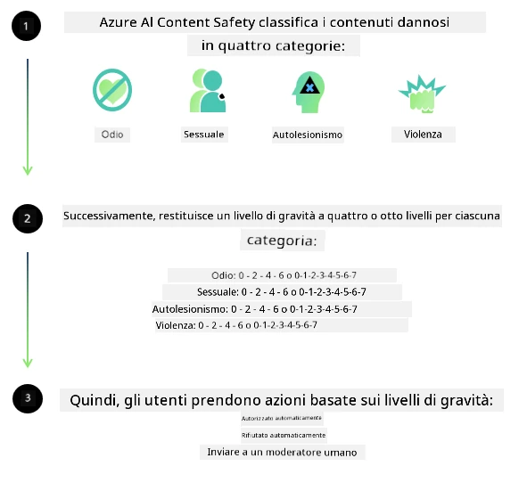

<!--
CO_OP_TRANSLATOR_METADATA:
{
  "original_hash": "839ccc4b3886ef10cfd4e64977f5792d",
  "translation_date": "2026-01-05T14:19:08+00:00",
  "source_file": "md/01.Introduction/01/01.AISafety.md",
  "language_code": "it"
}
-->
# Sicurezza AI per i modelli Phi
La famiglia di modelli Phi è stata sviluppata in conformità con il [Microsoft Responsible AI Standard](https://www.microsoft.com/ai/principles-and-approach#responsible-ai-standard), un insieme aziendale di requisiti basati sui seguenti sei principi: responsabilità, trasparenza, equità, affidabilità e sicurezza, privacy e sicurezza, e inclusività che formano i [Principi di AI Responsabile di Microsoft](https://www.microsoft.com/ai/responsible-ai).

Come per i precedenti modelli Phi, è stata adottata una valutazione della sicurezza multifaccettata e un approccio post-addestramento alla sicurezza, con misure aggiuntive per tenere conto delle capacità multilingue di questa versione. Il nostro approccio alla formazione e alle valutazioni di sicurezza, incluso il test in più lingue e categorie di rischio, è descritto nel [Phi Safety Post-Training Paper](https://arxiv.org/abs/2407.13833). Sebbene i modelli Phi beneficino di questo approccio, gli sviluppatori dovrebbero applicare le migliori pratiche di AI responsabile, compresa la mappatura, la misurazione e la mitigazione dei rischi associati al loro caso d'uso specifico e al contesto culturale e linguistico.

## Migliori Pratiche

Come altri modelli, la famiglia di modelli Phi potrebbe comportarsi in modi ingiusti, inaffidabili o offensivi.

Alcuni dei comportamenti limitanti di SLM e LLM di cui essere consapevoli includono:

- **Qualità del Servizio:** I modelli Phi sono addestrati principalmente su testo in inglese. Le lingue diverse dall'inglese sperimenteranno prestazioni peggiori. Le varietà di lingua inglese con meno rappresentanza nei dati di addestramento potrebbero presentare prestazioni peggiori rispetto all'inglese americano standard.
- **Rappresentazione dei Danni e Perpetuazione di Stereotipi:** Questi modelli possono sovra- o sotto-rappresentare gruppi di persone, cancellare la rappresentanza di alcuni gruppi o rinforzare stereotipi umilianti o negativi. Nonostante il post-addestramento di sicurezza, queste limitazioni potrebbero ancora essere presenti a causa di diversi livelli di rappresentanza di diversi gruppi o della prevalenza di esempi di stereotipi negativi nei dati di addestramento che riflettono modelli reali e pregiudizi sociali.
- **Contenuto Inappropriato o Offensivo:** Questi modelli potrebbero produrre altri tipi di contenuti inappropriati o offensivi, il che potrebbe rendere inadeguata la distribuzione in contesti sensibili senza ulteriori mitigazioni specifiche per il caso d'uso.
- **Affidabilità delle Informazioni:** I modelli di linguaggio possono generare contenuti insensati o fabbricati che potrebbero sembrare ragionevoli ma sono inaccurati o obsoleti.
- **Campo Limitato per il Codice:** La maggior parte dei dati di addestramento di Phi-3 si basa su Python e utilizza pacchetti comuni come "typing, math, random, collections, datetime, itertools". Se il modello genera script Python che utilizzano altri pacchetti o script in altre lingue, consigliamo vivamente agli utenti di verificare manualmente tutti gli usi dell'API.

Gli sviluppatori dovrebbero applicare le migliori pratiche di AI responsabile e sono responsabili di garantire che un caso d'uso specifico sia conforme alle leggi e regolamenti rilevanti (ad es. privacy, commercio, ecc.).

## Considerazioni sull'AI Responsabile

Come altri modelli di linguaggio, i modelli della serie Phi possono potenzialmente comportarsi in modi che sono ingiusti, inaffidabili o offensivi. Alcuni dei comportamenti limitanti di cui essere consapevoli includono:

**Qualità del Servizio:** I modelli Phi sono addestrati principalmente su testo in inglese. Le lingue diverse dall'inglese sperimenteranno prestazioni peggiori. Le varietà di lingua inglese con meno rappresentanza nei dati di addestramento potrebbero presentare prestazioni peggiori rispetto all'inglese americano standard.

**Rappresentazione dei Danni e Perpetuazione di Stereotipi:** Questi modelli possono sovra- o sotto-rappresentare gruppi di persone, cancellare la rappresentanza di alcuni gruppi o rinforzare stereotipi umilianti o negativi. Nonostante il post-addestramento di sicurezza, queste limitazioni potrebbero ancora essere presenti a causa di diversi livelli di rappresentanza di diversi gruppi o della prevalenza di esempi di stereotipi negativi nei dati di addestramento che riflettono modelli reali e pregiudizi sociali.

**Contenuto Inappropriato o Offensivo:** Questi modelli potrebbero produrre altri tipi di contenuti inappropriati o offensivi, il che potrebbe rendere inadeguata la distribuzione in contesti sensibili senza ulteriori mitigazioni specifiche per il caso d'uso.
- **Affidabilità delle Informazioni:** I modelli di linguaggio possono generare contenuti insensati o fabbricati che potrebbero sembrare ragionevoli ma sono inaccurati o obsoleti.

**Campo Limitato per il Codice:** La maggior parte dei dati di addestramento di Phi-3 si basa su Python e utilizza pacchetti comuni come "typing, math, random, collections, datetime, itertools". Se il modello genera script Python che utilizzano altri pacchetti o script in altre lingue, consigliamo vivamente agli utenti di verificare manualmente tutti gli usi dell'API.

Gli sviluppatori dovrebbero applicare le migliori pratiche di AI responsabile e sono responsabili di garantire che un caso d'uso specifico sia conforme alle leggi e regolamenti rilevanti (ad es. privacy, commercio, ecc.). Aree importanti da considerare includono:

**Allocazione:** I modelli potrebbero non essere adatti per scenari che potrebbero avere un impatto consequenziale sullo status legale o sull'allocazione di risorse o opportunità di vita (ad es. abitazione, occupazione, credito, ecc.) senza ulteriori valutazioni e tecniche di debiasing aggiuntive.

**Scenari ad Alto Rischio:** Gli sviluppatori dovrebbero valutare l'idoneità dell'uso dei modelli in scenari ad alto rischio dove risultati ingiusti, inaffidabili o offensivi potrebbero essere estremamente costosi o causare danni. Ciò include fornire consigli in domini sensibili o esperti dove accuratezza e affidabilità sono critiche (ad es. consigli legali o sanitari). Ulteriori salvaguardie dovrebbero essere implementate a livello di applicazione secondo il contesto di distribuzione.

**Disinformazione:** I modelli potrebbero produrre informazioni inaccurate. Gli sviluppatori dovrebbero seguire le migliori pratiche di trasparenza e informare gli utenti finali che stanno interagendo con un sistema AI. A livello applicativo, gli sviluppatori possono costruire meccanismi di feedback e pipeline per basare le risposte su informazioni contestuali specifiche del caso d'uso, una tecnica nota come Retrieval Augmented Generation (RAG).

**Generazione di Contenuti Dannosi:** Gli sviluppatori dovrebbero valutare i risultati nel loro contesto e utilizzare i classificatori di sicurezza disponibili o soluzioni personalizzate appropriate per il loro caso d'uso.

**Uso Improprio:** Altre forme di uso improprio come frodi, spam o produzione di malware possono essere possibili e gli sviluppatori dovrebbero assicurarsi che le loro applicazioni non violino leggi e regolamenti applicabili.

### Fine-tuning e Sicurezza dei Contenuti AI

Dopo il fine-tuning di un modello, consigliamo vivamente di sfruttare le misure di [Azure AI Content Safety](https://learn.microsoft.com/azure/ai-services/content-safety/overview) per monitorare i contenuti generati dai modelli, identificare e bloccare potenziali rischi, minacce e problemi di qualità.

[Azure AI Content Safety](https://learn.microsoft.com/azure/ai-services/content-safety/overview) supporta sia contenuti testuali che immagini. Può essere distribuito nel cloud, in contenitori disconnessi e su dispositivi edge / embedded.

## Panoramica di Azure AI Content Safety

Azure AI Content Safety non è una soluzione unica per tutti; può essere personalizzata per allinearsi alle politiche specifiche delle aziende. Inoltre, i suoi modelli multilingue le consentono di comprendere più lingue simultaneamente.

- **Azure AI Content Safety**
- **Microsoft Developer**
- **5 video**

Il servizio Azure AI Content Safety rileva contenuti dannosi generati dagli utenti e dall'AI in applicazioni e servizi. Include API per testo e immagini che consentono di rilevare materiale dannoso o inappropriato.

[AI Content Safety Playlist](https://www.youtube.com/playlist?list=PLlrxD0HtieHjaQ9bJjyp1T7FeCbmVcPkQ)

---

<!-- CO-OP TRANSLATOR DISCLAIMER START -->
**Dichiarazione di non responsabilità**:
Questo documento è stato tradotto utilizzando il servizio di traduzione automatica [Co-op Translator](https://github.com/Azure/co-op-translator). Pur impegnandoci per garantire accuratezza, si prega di notare che le traduzioni automatizzate possono contenere errori o imprecisioni. Il documento originale nella sua lingua nativa deve essere considerato la fonte autorevole. Per informazioni critiche, si raccomanda una traduzione professionale effettuata da un traduttore umano. Non siamo responsabili per eventuali malintesi o interpretazioni errate derivanti dall'uso di questa traduzione.
<!-- CO-OP TRANSLATOR DISCLAIMER END -->