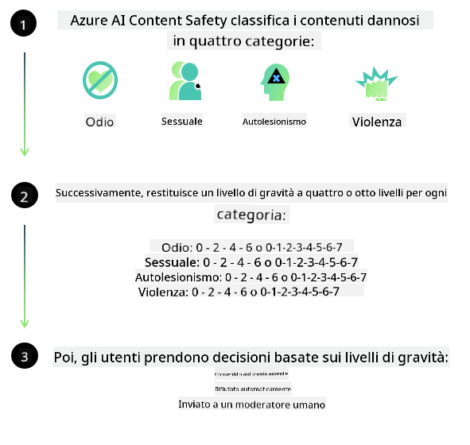
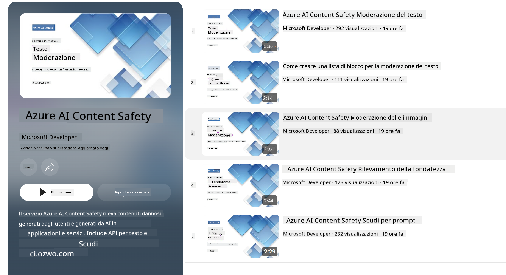

<!--
CO_OP_TRANSLATOR_METADATA:
{
  "original_hash": "c8273672cc57df2be675407a1383aaf0",
  "translation_date": "2025-07-16T17:47:14+00:00",
  "source_file": "md/01.Introduction/01/01.AISafety.md",
  "language_code": "it"
}
-->
# Sicurezza AI per i modelli Phi  
La famiglia di modelli Phi è stata sviluppata in conformità con il [Microsoft Responsible AI Standard](https://query.prod.cms.rt.microsoft.com/cms/api/am/binary/RE5cmFl), un insieme di requisiti aziendali basati su sei principi fondamentali: responsabilità, trasparenza, equità, affidabilità e sicurezza, privacy e protezione, e inclusività, che costituiscono i [principi di Responsible AI di Microsoft](https://www.microsoft.com/ai/responsible-ai).

Come per i modelli Phi precedenti, è stato adottato un approccio multi-sfaccettato alla valutazione della sicurezza e alla post-formazione sulla sicurezza, con misure aggiuntive per tenere conto delle capacità multilingue di questa versione. Il nostro approccio alla formazione e alle valutazioni di sicurezza, inclusi i test in più lingue e categorie di rischio, è descritto nel [Phi Safety Post-Training Paper](https://arxiv.org/abs/2407.13833). Sebbene i modelli Phi beneficino di questo approccio, gli sviluppatori dovrebbero applicare le migliori pratiche di Responsible AI, inclusa la mappatura, la misurazione e la mitigazione dei rischi associati al loro specifico caso d’uso e al contesto culturale e linguistico.

## Best Practices

Come altri modelli, la famiglia Phi può potenzialmente comportarsi in modi ingiusti, inaffidabili o offensivi.

Alcuni dei comportamenti limitanti di SLM e LLM di cui essere consapevoli includono:

- **Qualità del Servizio:** I modelli Phi sono addestrati principalmente su testi in inglese. Le lingue diverse dall’inglese potrebbero avere prestazioni peggiori. Le varietà di inglese meno rappresentate nei dati di addestramento potrebbero avere prestazioni inferiori rispetto all’inglese americano standard.  
- **Rappresentazione dei Danni e Perpetuazione di Stereotipi:** Questi modelli possono sovra- o sotto-rappresentare gruppi di persone, cancellare la rappresentazione di alcuni gruppi o rafforzare stereotipi denigratori o negativi. Nonostante la post-formazione sulla sicurezza, queste limitazioni possono ancora essere presenti a causa dei diversi livelli di rappresentazione dei gruppi o della prevalenza di esempi di stereotipi negativi nei dati di addestramento che riflettono modelli reali e bias sociali.  
- **Contenuti Inappropriati o Offensivi:** Questi modelli possono generare altri tipi di contenuti inappropriati o offensivi, rendendo inappropriato il loro utilizzo in contesti sensibili senza ulteriori mitigazioni specifiche per il caso d’uso.  
- **Affidabilità delle Informazioni:** I modelli linguistici possono generare contenuti insensati o inventare informazioni che possono sembrare plausibili ma sono inaccurate o obsolete.  
- **Ambito Limitato per il Codice:** La maggior parte dei dati di addestramento di Phi-3 si basa su Python e utilizza pacchetti comuni come "typing, math, random, collections, datetime, itertools". Se il modello genera script Python che utilizzano altri pacchetti o script in altre lingue, raccomandiamo vivamente agli utenti di verificare manualmente tutti gli usi delle API.

Gli sviluppatori dovrebbero applicare le migliori pratiche di Responsible AI e sono responsabili di garantire che un caso d’uso specifico sia conforme alle leggi e normative vigenti (es. privacy, commercio, ecc.).

## Considerazioni su Responsible AI

Come altri modelli linguistici, i modelli della serie Phi possono potenzialmente comportarsi in modi ingiusti, inaffidabili o offensivi. Alcuni comportamenti limitanti da tenere a mente includono:

**Qualità del Servizio:** I modelli Phi sono addestrati principalmente su testi in inglese. Le lingue diverse dall’inglese potrebbero avere prestazioni peggiori. Le varietà di inglese meno rappresentate nei dati di addestramento potrebbero avere prestazioni inferiori rispetto all’inglese americano standard.

**Rappresentazione dei Danni e Perpetuazione di Stereotipi:** Questi modelli possono sovra- o sotto-rappresentare gruppi di persone, cancellare la rappresentazione di alcuni gruppi o rafforzare stereotipi denigratori o negativi. Nonostante la post-formazione sulla sicurezza, queste limitazioni possono ancora essere presenti a causa dei diversi livelli di rappresentazione dei gruppi o della prevalenza di esempi di stereotipi negativi nei dati di addestramento che riflettono modelli reali e bias sociali.

**Contenuti Inappropriati o Offensivi:** Questi modelli possono generare altri tipi di contenuti inappropriati o offensivi, rendendo inappropriato il loro utilizzo in contesti sensibili senza ulteriori mitigazioni specifiche per il caso d’uso.  
**Affidabilità delle Informazioni:** I modelli linguistici possono generare contenuti insensati o inventare informazioni che possono sembrare plausibili ma sono inaccurate o obsolete.

**Ambito Limitato per il Codice:** La maggior parte dei dati di addestramento di Phi-3 si basa su Python e utilizza pacchetti comuni come "typing, math, random, collections, datetime, itertools". Se il modello genera script Python che utilizzano altri pacchetti o script in altre lingue, raccomandiamo vivamente agli utenti di verificare manualmente tutti gli usi delle API.

Gli sviluppatori dovrebbero applicare le migliori pratiche di Responsible AI e sono responsabili di garantire che un caso d’uso specifico sia conforme alle leggi e normative vigenti (es. privacy, commercio, ecc.). Aree importanti da considerare includono:

**Allocazione:** I modelli potrebbero non essere adatti a scenari che potrebbero avere un impatto significativo sullo status legale o sull’allocazione di risorse o opportunità di vita (es: abitazione, lavoro, credito, ecc.) senza ulteriori valutazioni e tecniche di debiasing aggiuntive.

**Scenari ad Alto Rischio:** Gli sviluppatori dovrebbero valutare l’idoneità all’uso dei modelli in scenari ad alto rischio in cui output ingiusti, inaffidabili o offensivi potrebbero essere estremamente costosi o causare danni. Ciò include fornire consigli in ambiti sensibili o esperti dove accuratezza e affidabilità sono critiche (es: consulenza legale o sanitaria). Ulteriori misure di sicurezza dovrebbero essere implementate a livello applicativo in base al contesto di distribuzione.

**Disinformazione:** I modelli possono produrre informazioni inaccurate. Gli sviluppatori dovrebbero seguire le migliori pratiche di trasparenza e informare gli utenti finali che stanno interagendo con un sistema AI. A livello applicativo, gli sviluppatori possono costruire meccanismi di feedback e pipeline per ancorare le risposte a informazioni contestuali specifiche del caso d’uso, una tecnica nota come Retrieval Augmented Generation (RAG).

**Generazione di Contenuti Dannosi:** Gli sviluppatori dovrebbero valutare gli output in base al contesto e utilizzare classificatori di sicurezza disponibili o soluzioni personalizzate appropriate per il loro caso d’uso.

**Uso Improprio:** Altre forme di uso improprio come frodi, spam o produzione di malware potrebbero essere possibili, e gli sviluppatori devono assicurarsi che le loro applicazioni non violino leggi e regolamenti applicabili.

### Fine-tuning e Sicurezza dei Contenuti AI

Dopo il fine-tuning di un modello, raccomandiamo vivamente di utilizzare le misure di [Azure AI Content Safety](https://learn.microsoft.com/azure/ai-services/content-safety/overview) per monitorare i contenuti generati dai modelli, identificare e bloccare potenziali rischi, minacce e problemi di qualità.

[Azure AI Content Safety](https://learn.microsoft.com/azure/ai-services/content-safety/overview) supporta sia contenuti testuali che immagini. Può essere distribuito nel cloud, in container isolati e su dispositivi edge/incorporati.

## Panoramica di Azure AI Content Safety

Azure AI Content Safety non è una soluzione universale; può essere personalizzata per allinearsi alle politiche specifiche delle aziende. Inoltre, i suoi modelli multilingue gli permettono di comprendere più lingue contemporaneamente.

- **Azure AI Content Safety**  
- **Microsoft Developer**  
- **5 video**

Il servizio Azure AI Content Safety rileva contenuti dannosi generati dagli utenti e dall’AI in applicazioni e servizi. Include API per testo e immagini che permettono di individuare materiale dannoso o inappropriato.

[AI Content Safety Playlist](https://www.youtube.com/playlist?list=PLlrxD0HtieHjaQ9bJjyp1T7FeCbmVcPkQ)

**Disclaimer**:  
Questo documento è stato tradotto utilizzando il servizio di traduzione automatica [Co-op Translator](https://github.com/Azure/co-op-translator). Pur impegnandoci per garantire l’accuratezza, si prega di notare che le traduzioni automatiche possono contenere errori o imprecisioni. Il documento originale nella sua lingua nativa deve essere considerato la fonte autorevole. Per informazioni critiche, si raccomanda una traduzione professionale effettuata da un umano. Non ci assumiamo alcuna responsabilità per eventuali malintesi o interpretazioni errate derivanti dall’uso di questa traduzione.