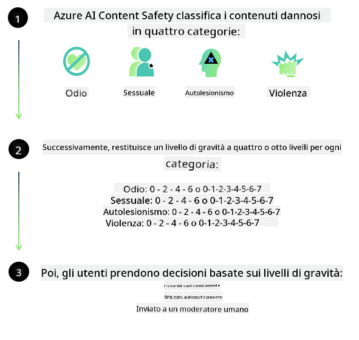

<!--
CO_OP_TRANSLATOR_METADATA:
{
  "original_hash": "839ccc4b3886ef10cfd4e64977f5792d",
  "translation_date": "2026-01-05T03:14:47+00:00",
  "source_file": "md/01.Introduction/01/01.AISafety.md",
  "language_code": "it"
}
-->
# Sicurezza dell'IA per i modelli Phi
La famiglia di modelli Phi è stata sviluppata in conformità con lo [Microsoft Responsible AI Standard](https://www.microsoft.com/ai/principles-and-approach#responsible-ai-standard), che è un insieme di requisiti a livello aziendale basato sui seguenti sei principi: responsabilità, trasparenza, equità, affidabilità e sicurezza, privacy e sicurezza e inclusività che costituiscono [Microsoft’s Responsible AI principles](https://www.microsoft.com/ai/responsible-ai). 

Come per i precedenti modelli Phi, è stato adottato un approccio di valutazione della sicurezza e di post-addestramento della sicurezza a più livelli, con misure aggiuntive adottate per tenere conto delle capacità multilingue di questa release. Il nostro approccio alla formazione sulla sicurezza e alle valutazioni, inclusi i test in più lingue e categorie di rischio, è descritto nel [Phi Safety Post-Training Paper](https://arxiv.org/abs/2407.13833). Sebbene i modelli Phi traggano beneficio da questo approccio, gli sviluppatori dovrebbero applicare le migliori pratiche di IA responsabile, inclusa la mappatura, la misurazione e la mitigazione dei rischi associati al loro caso d'uso specifico e al contesto culturale e linguistico.

## Best Practices

Come altri modelli, la famiglia di modelli Phi può potenzialmente comportarsi in modi che sono ingiusti, inaffidabili o offensivi.

Alcuni dei comportamenti limitanti di SLM e LLM di cui essere consapevoli includono:

- **Quality of Service:** I modelli Phi sono addestrati principalmente su testi in inglese. Le lingue diverse dall'inglese avranno prestazioni peggiori; le varietà della lingua inglese meno rappresentate nei dati di addestramento potrebbero avere prestazioni peggiori rispetto all'inglese americano standard.
- **Representation of Harms & Perpetuation of Stereotypes:** Questi modelli possono sovra- o sotto-rappresentare gruppi di persone, cancellare la rappresentazione di alcuni gruppi o rafforzare stereotipi denigratori o negativi. Nonostante il post-addestramento per la sicurezza, queste limitazioni possono ancora essere presenti a causa di diversi livelli di rappresentazione di diversi gruppi o della prevalenza di esempi di stereotipi negativi nei dati di addestramento che riflettono modelli del mondo reale e bias sociali.
- **Inappropriate or Offensive Content:** Questi modelli possono produrre altri tipi di contenuti inappropriati o offensivi, il che potrebbe renderli inappropriati da distribuire in contesti sensibili senza ulteriori mitigazioni specifiche per il caso d'uso.
Information Reliability: I modelli di linguaggio possono generare contenuti senza senso o fabbricare contenuti che potrebbero sembrare ragionevoli ma che sono inaccurati o obsoleti.
- **Limited Scope for Code:** La maggior parte dei dati di addestramento di Phi-3 si basa su Python e utilizza pacchetti comuni come "typing, math, random, collections, datetime, itertools". Se il modello genera script Python che utilizzano altri pacchetti o script in altri linguaggi, raccomandiamo vivamente agli utenti di verificare manualmente tutti gli utilizzi delle API.

Gli sviluppatori dovrebbero applicare le migliori pratiche di IA responsabile e sono responsabili di garantire che un caso d'uso specifico sia conforme alle leggi e ai regolamenti applicabili (ad es. privacy, commercio, ecc.). 

## Considerazioni sull'IA responsabile

Come altri modelli di linguaggio, la serie di modelli Phi può potenzialmente comportarsi in modi che sono ingiusti, inaffidabili o offensivi. Alcuni dei comportamenti limitanti di cui essere consapevoli includono:

**Quality of Service:** I modelli Phi sono addestrati principalmente su testi in inglese. Le lingue diverse dall'inglese avranno prestazioni peggiori. Le varietà della lingua inglese meno rappresentate nei dati di addestramento potrebbero avere prestazioni peggiori rispetto all'inglese americano standard.

**Representation of Harms & Perpetuation of Stereotypes:** Questi modelli possono sovra- o sotto-rappresentare gruppi di persone, cancellare la rappresentazione di alcuni gruppi o rafforzare stereotipi denigratori o negativi. Nonostante il post-addestramento per la sicurezza, queste limitazioni possono ancora essere presenti a causa di diversi livelli di rappresentazione di diversi gruppi o della prevalenza di esempi di stereotipi negativi nei dati di addestramento che riflettono modelli del mondo reale e bias sociali.

**Inappropriate or Offensive Content:** Questi modelli possono produrre altri tipi di contenuti inappropriati o offensivi, il che potrebbe renderli inappropriati da distribuire in contesti sensibili senza ulteriori mitigazioni specifiche per il caso d'uso.
Information Reliability: I modelli di linguaggio possono generare contenuti senza senso o fabbricare contenuti che potrebbero sembrare ragionevoli ma che sono inaccurati o obsoleti.

**Limited Scope for Code:** La maggior parte dei dati di addestramento di Phi-3 si basa su Python e utilizza pacchetti comuni come "typing, math, random, collections, datetime, itertools". Se il modello genera script Python che utilizzano altri pacchetti o script in altri linguaggi, raccomandiamo vivamente agli utenti di verificare manualmente tutti gli utilizzi delle API.

Gli sviluppatori dovrebbero applicare le migliori pratiche di IA responsabile e sono responsabili di garantire che un caso d'uso specifico sia conforme alle leggi e ai regolamenti applicabili (ad es. privacy, commercio, ecc.). Le aree importanti da considerare includono:

**Allocation:** I modelli potrebbero non essere adatti per scenari che potrebbero avere un impatto consequenziale sullo status legale o sull'allocazione di risorse o opportunità di vita (es.: abitazione, lavoro, credito, ecc.) senza ulteriori valutazioni e tecniche di debiasing aggiuntive.

**High-Risk Scenarios:** Gli sviluppatori dovrebbero valutare l'idoneità dell'uso dei modelli in scenari ad alto rischio in cui output ingiusti, inaffidabili o offensivi potrebbero essere estremamente costosi o portare a danni. Questo include fornire consulenza in domini sensibili o esperti dove accuratezza e affidabilità sono critiche (es.: consulenza legale o sanitaria). Ulteriori salvaguardie dovrebbero essere implementate a livello applicativo in base al contesto di distribuzione.

**Misinformation:** I modelli possono produrre informazioni inaccurate. Gli sviluppatori dovrebbero seguire le migliori pratiche di trasparenza e informare gli utenti finali che stanno interagendo con un sistema di IA. A livello applicativo, gli sviluppatori possono costruire meccanismi di feedback e pipeline per ancorare le risposte a informazioni contestuali specifiche del caso d'uso, una tecnica nota come Retrieval Augmented Generation (RAG).

**Generation of Harmful Content:** Gli sviluppatori dovrebbero valutare gli output nel loro contesto e utilizzare classificatori di sicurezza disponibili o soluzioni personalizzate appropriate per il loro caso d'uso.

**Misuse:** Altre forme di uso improprio come frodi, spam o produzione di malware potrebbero essere possibili, e gli sviluppatori dovrebbero assicurarsi che le loro applicazioni non violino leggi e regolamenti applicabili.

### Finetuning and AI Content Safety

Dopo il fine-tuning di un modello, raccomandiamo vivamente di sfruttare le misure di [Azure AI Content Safety](https://learn.microsoft.com/azure/ai-services/content-safety/overview) per monitorare i contenuti generati dai modelli, identificare e bloccare potenziali rischi, minacce e problemi di qualità.

[Azure AI Content Safety](https://learn.microsoft.com/azure/ai-services/content-safety/overview) supporta sia contenuti testuali che immagini. Può essere distribuito nel cloud, in contenitori disconnessi e su dispositivi edge/embedded.

- **Azure AI Content Safety**
- **Microsoft Developer**
- **5 videos**

Il servizio Azure AI Content Safety rileva contenuti dannosi generati dagli utenti e dall'IA in applicazioni e servizi. Include API per testo e immagini che consentono di rilevare materiale dannoso o inappropriato.

[AI Content Safety Playlist](https://www.youtube.com/playlist?list=PLlrxD0HtieHjaQ9bJjyp1T7FeCbmVcPkQ)

---

<!-- CO-OP TRANSLATOR DISCLAIMER START -->
**Dichiarazione di non responsabilità**:
Questo documento è stato tradotto utilizzando il servizio di traduzione con intelligenza artificiale [Co-op Translator](https://github.com/Azure/co-op-translator). Pur facendo del nostro meglio per garantire l'accuratezza, si prega di notare che le traduzioni automatiche possono contenere errori o imprecisioni. Il documento originale nella sua lingua originale deve essere considerato la fonte autorevole. Per informazioni critiche, si raccomanda una traduzione professionale effettuata da un traduttore umano. Non siamo responsabili per eventuali incomprensioni o interpretazioni errate derivanti dall'uso di questa traduzione.
<!-- CO-OP TRANSLATOR DISCLAIMER END -->