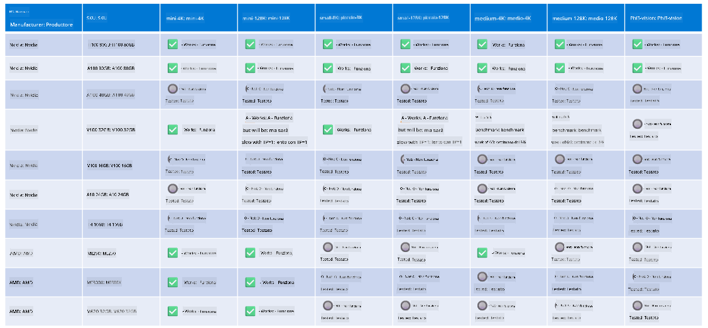

<!--
CO_OP_TRANSLATOR_METADATA:
{
  "original_hash": "8cdc17ce0f10535da30b53d23fe1a795",
  "translation_date": "2025-05-09T07:48:48+00:00",
  "source_file": "md/01.Introduction/01/01.Hardwaresupport.md",
  "language_code": "it"
}
-->
# Supporto Hardware Phi

Microsoft Phi è stato ottimizzato per ONNX Runtime e supporta Windows DirectML. Funziona bene su diversi tipi di hardware, inclusi GPU, CPU e persino dispositivi mobili.

## Hardware del dispositivo  
In particolare, l'hardware supportato include:

- GPU SKU: RTX 4090 (DirectML)
- GPU SKU: 1 A100 80GB (CUDA)
- CPU SKU: Standard F64s v2 (64 vCPU, 128 GiB di memoria)

## SKU Mobile

- Android - Samsung Galaxy S21
- Apple iPhone 14 o superiore con processore A16/A17

## Specifiche hardware Phi

- Configurazione minima richiesta.
- Windows: GPU compatibile con DirectX 12 e almeno 4GB di RAM combinata

CUDA: GPU NVIDIA con Compute Capability >= 7.02



## Esecuzione di onnxruntime su più GPU

Attualmente i modelli Phi ONNX disponibili supportano solo 1 GPU. È possibile supportare multi-GPU per il modello Phi, ma ORT con 2 GPU non garantisce un throughput superiore rispetto a 2 istanze separate di ORT. Per gli ultimi aggiornamenti, consulta [ONNX Runtime](https://onnxruntime.ai/).

Al [Build 2024 il team GenAI ONNX](https://youtu.be/WLW4SE8M9i8?si=EtG04UwDvcjunyfC) ha annunciato di aver abilitato l’uso di multi-instance invece di multi-GPU per i modelli Phi.

Attualmente questo permette di eseguire un’istanza di onnxruntime o onnxruntime-genai usando la variabile d’ambiente CUDA_VISIBLE_DEVICES in questo modo.

```Python
CUDA_VISIBLE_DEVICES=0 python infer.py
CUDA_VISIBLE_DEVICES=1 python infer.py
```

Sentiti libero di esplorare ulteriormente Phi su [Azure AI Foundry](https://ai.azure.com)

**Avvertenza**:  
Questo documento è stato tradotto utilizzando il servizio di traduzione automatica AI [Co-op Translator](https://github.com/Azure/co-op-translator). Pur impegnandoci per garantire accuratezza, si prega di considerare che le traduzioni automatiche possono contenere errori o imprecisioni. Il documento originale nella sua lingua nativa deve essere considerato la fonte autorevole. Per informazioni critiche, si raccomanda una traduzione professionale effettuata da un umano. Non ci assumiamo alcuna responsabilità per eventuali incomprensioni o interpretazioni errate derivanti dall’uso di questa traduzione.