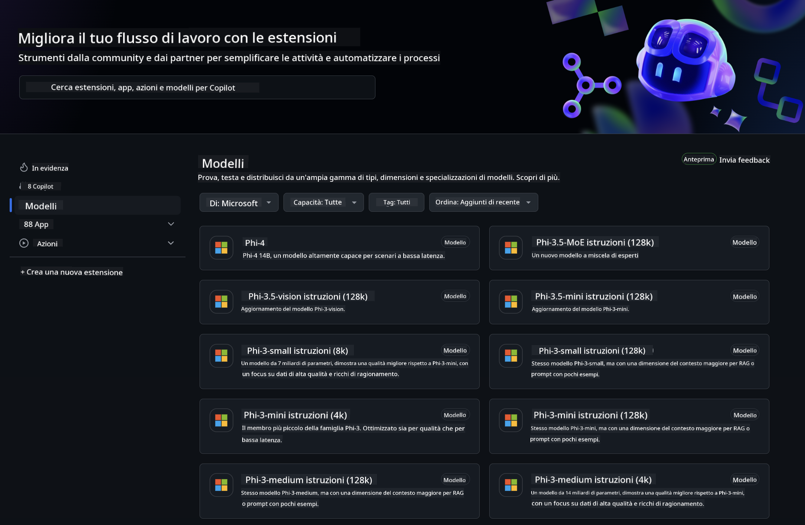
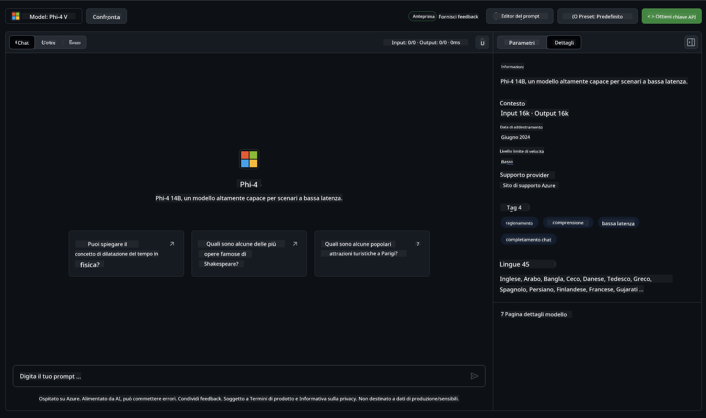
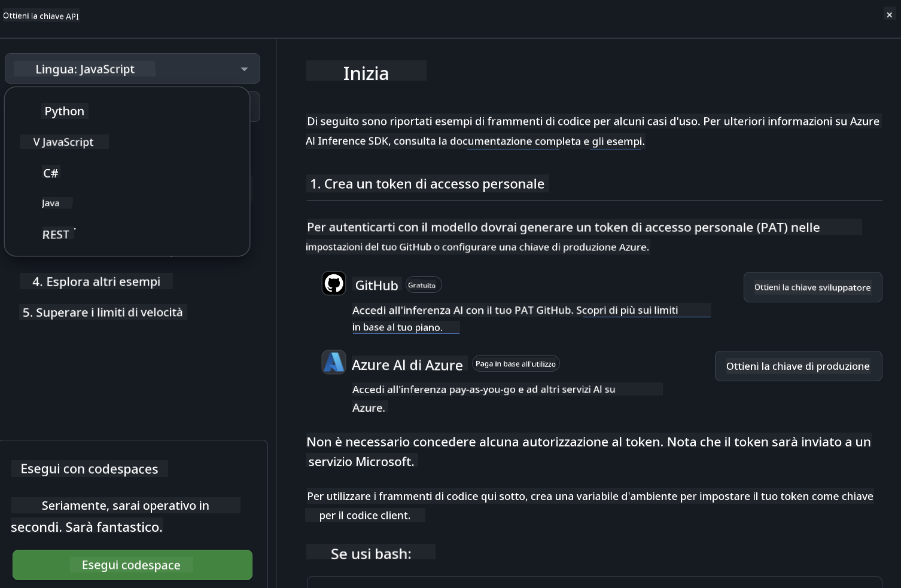
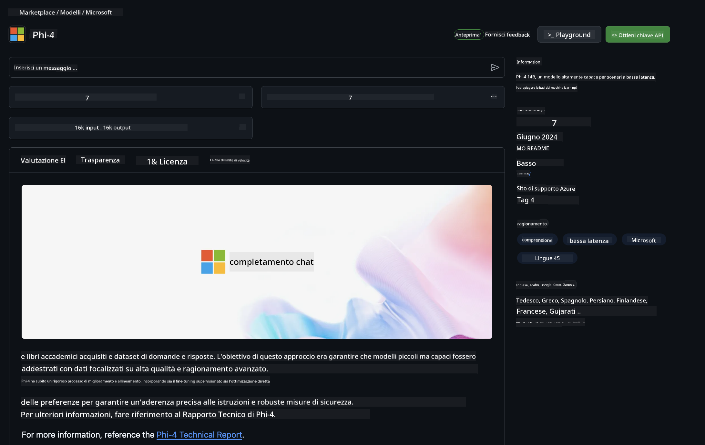

<!--
CO_OP_TRANSLATOR_METADATA:
{
  "original_hash": "fb67a08b9fc911a10ed58081fadef416",
  "translation_date": "2025-07-16T19:00:29+00:00",
  "source_file": "md/01.Introduction/02/02.GitHubModel.md",
  "language_code": "it"
}
-->
## Famiglia Phi nei Modelli GitHub

Benvenuto su [GitHub Models](https://github.com/marketplace/models)! Abbiamo tutto pronto per farti esplorare i modelli AI ospitati su Azure AI.



Per maggiori informazioni sui modelli disponibili su GitHub Models, visita il [GitHub Model Marketplace](https://github.com/marketplace/models)

## Modelli Disponibili

Ogni modello ha un playground dedicato e codice di esempio



### Famiglia Phi nel Catalogo Modelli GitHub

- [Phi-4](https://github.com/marketplace/models/azureml/Phi-4)

- [Phi-3.5-MoE instruct (128k)](https://github.com/marketplace/models/azureml/Phi-3-5-MoE-instruct)

- [Phi-3.5-vision instruct (128k)](https://github.com/marketplace/models/azureml/Phi-3-5-vision-instruct)

- [Phi-3.5-mini instruct (128k)](https://github.com/marketplace/models/azureml/Phi-3-5-mini-instruct)

- [Phi-3-Medium-128k-Instruct](https://github.com/marketplace/models/azureml/Phi-3-medium-128k-instruct)

- [Phi-3-medium-4k-instruct](https://github.com/marketplace/models/azureml/Phi-3-medium-4k-instruct)

- [Phi-3-mini-128k-instruct](https://github.com/marketplace/models/azureml/Phi-3-mini-128k-instruct)

- [Phi-3-mini-4k-instruct](https://github.com/marketplace/models/azureml/Phi-3-mini-4k-instruct)

- [Phi-3-small-128k-instruct](https://github.com/marketplace/models/azureml/Phi-3-small-128k-instruct)

- [Phi-3-small-8k-instruct](https://github.com/marketplace/models/azureml/Phi-3-small-8k-instruct)

## Per Iniziare

Ci sono alcuni esempi base pronti per essere eseguiti. Li puoi trovare nella cartella samples. Se vuoi passare direttamente al tuo linguaggio preferito, gli esempi sono disponibili nei seguenti linguaggi:

- Python
- JavaScript
- C#
- Java
- cURL

È disponibile anche un ambiente Codespaces dedicato per eseguire gli esempi e i modelli.



## Codice di Esempio

Di seguito alcuni snippet di codice per diversi casi d’uso. Per ulteriori informazioni sull’Azure AI Inference SDK, consulta la documentazione completa e gli esempi.

## Configurazione

1. Crea un token di accesso personale  
Non è necessario assegnare permessi al token. Nota che il token verrà inviato a un servizio Microsoft.

Per usare gli snippet di codice qui sotto, crea una variabile d’ambiente impostando il token come chiave per il codice client.

Se usi bash:  
```
export GITHUB_TOKEN="<your-github-token-goes-here>"
```  
Se usi powershell:  

```
$Env:GITHUB_TOKEN="<your-github-token-goes-here>"
```  

Se usi il prompt dei comandi di Windows:  

```
set GITHUB_TOKEN=<your-github-token-goes-here>
```  

## Esempio Python

### Installa le dipendenze  
Installa Azure AI Inference SDK usando pip (Richiede: Python >=3.8):

```
pip install azure-ai-inference
```  
### Esegui un esempio base di codice

Questo esempio mostra una chiamata base all’API di completamento chat. Utilizza l’endpoint di inferenza del modello AI di GitHub e il tuo token GitHub. La chiamata è sincrona.

```python
import os
from azure.ai.inference import ChatCompletionsClient
from azure.ai.inference.models import SystemMessage, UserMessage
from azure.core.credentials import AzureKeyCredential

endpoint = "https://models.inference.ai.azure.com"
model_name = "Phi-4"
token = os.environ["GITHUB_TOKEN"]

client = ChatCompletionsClient(
    endpoint=endpoint,
    credential=AzureKeyCredential(token),
)

response = client.complete(
    messages=[
        UserMessage(content="I have $20,000 in my savings account, where I receive a 4% profit per year and payments twice a year. Can you please tell me how long it will take for me to become a millionaire? Also, can you please explain the math step by step as if you were explaining it to an uneducated person?"),
    ],
    temperature=0.4,
    top_p=1.0,
    max_tokens=2048,
    model=model_name
)

print(response.choices[0].message.content)
```

### Esegui una conversazione multi-turno

Questo esempio mostra una conversazione multi-turno con l’API di completamento chat. Quando usi il modello per un’app di chat, devi gestire la cronologia della conversazione e inviare al modello i messaggi più recenti.

```
import os
from azure.ai.inference import ChatCompletionsClient
from azure.ai.inference.models import AssistantMessage, SystemMessage, UserMessage
from azure.core.credentials import AzureKeyCredential

token = os.environ["GITHUB_TOKEN"]
endpoint = "https://models.inference.ai.azure.com"
# Replace Model_Name
model_name = "Phi-4"

client = ChatCompletionsClient(
    endpoint=endpoint,
    credential=AzureKeyCredential(token),
)

messages = [
    SystemMessage(content="You are a helpful assistant."),
    UserMessage(content="What is the capital of France?"),
    AssistantMessage(content="The capital of France is Paris."),
    UserMessage(content="What about Spain?"),
]

response = client.complete(messages=messages, model=model_name)

print(response.choices[0].message.content)
```

### Stream dell’output

Per un’esperienza utente migliore, puoi trasmettere la risposta del modello in streaming così che il primo token appaia subito, evitando di aspettare risposte lunghe.

```
import os
from azure.ai.inference import ChatCompletionsClient
from azure.ai.inference.models import SystemMessage, UserMessage
from azure.core.credentials import AzureKeyCredential

token = os.environ["GITHUB_TOKEN"]
endpoint = "https://models.inference.ai.azure.com"
# Replace Model_Name
model_name = "Phi-4"

client = ChatCompletionsClient(
    endpoint=endpoint,
    credential=AzureKeyCredential(token),
)

response = client.complete(
    stream=True,
    messages=[
        SystemMessage(content="You are a helpful assistant."),
        UserMessage(content="Give me 5 good reasons why I should exercise every day."),
    ],
    model=model_name,
)

for update in response:
    if update.choices:
        print(update.choices[0].delta.content or "", end="")

client.close()
```

## Uso GRATUITO e Limiti di Velocità per i Modelli GitHub



I [limiti di velocità per il playground e l’uso gratuito dell’API](https://docs.github.com/en/github-models/prototyping-with-ai-models#rate-limits) sono pensati per aiutarti a sperimentare con i modelli e prototipare la tua applicazione AI. Per un utilizzo oltre questi limiti, e per portare la tua applicazione a scala, devi allocare risorse da un account Azure e autenticarti da lì invece che con il token personale GitHub. Non è necessario modificare altro nel codice. Usa questo link per scoprire come superare i limiti del piano gratuito in Azure AI.

### Avvertenze

Ricorda che interagendo con un modello stai sperimentando con l’AI, quindi possono esserci errori nei contenuti.

La funzionalità è soggetta a vari limiti (inclusi richieste al minuto, richieste al giorno, token per richiesta e richieste concorrenti) e non è pensata per casi d’uso in produzione.

GitHub Models utilizza Azure AI Content Safety. Questi filtri non possono essere disattivati nell’esperienza GitHub Models. Se decidi di usare i modelli tramite un servizio a pagamento, configura i filtri di contenuto in base alle tue esigenze.

Questo servizio è soggetto ai Termini di Pre-release di GitHub.

**Disclaimer**:  
Questo documento è stato tradotto utilizzando il servizio di traduzione automatica [Co-op Translator](https://github.com/Azure/co-op-translator). Pur impegnandoci per garantire l’accuratezza, si prega di notare che le traduzioni automatiche possono contenere errori o imprecisioni. Il documento originale nella sua lingua nativa deve essere considerato la fonte autorevole. Per informazioni critiche, si raccomanda una traduzione professionale effettuata da un umano. Non ci assumiamo alcuna responsabilità per eventuali malintesi o interpretazioni errate derivanti dall’uso di questa traduzione.