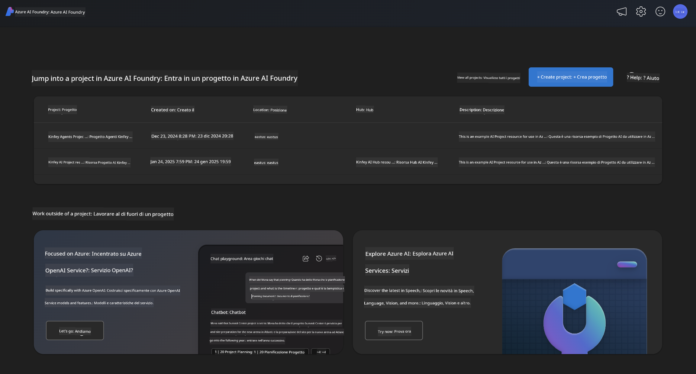
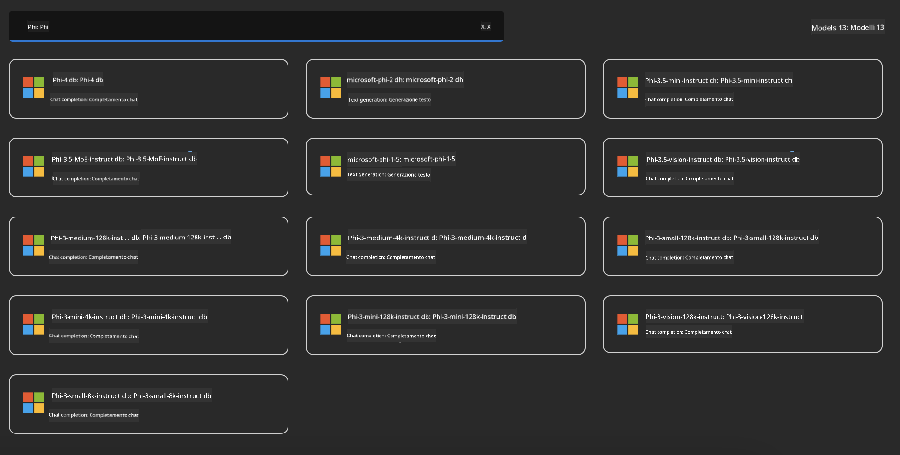
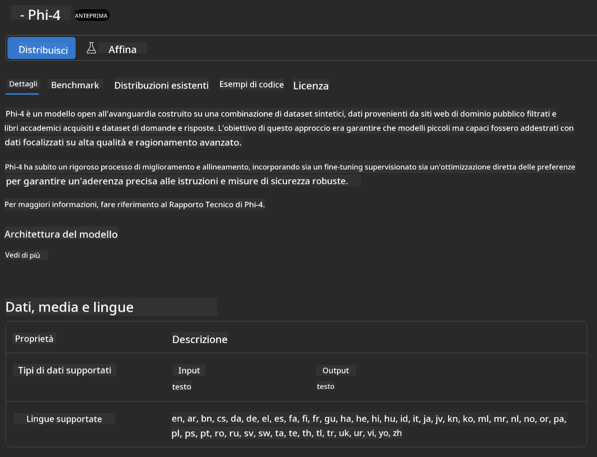
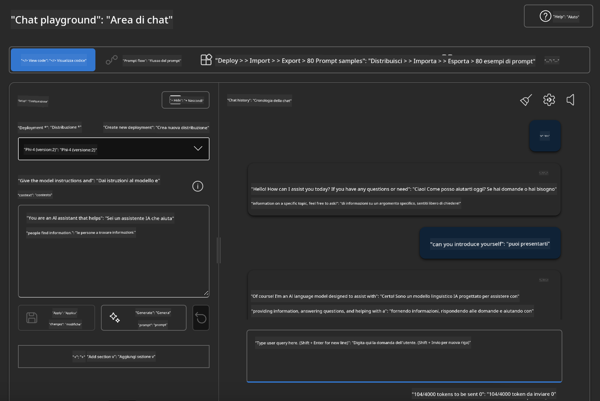

<!--
CO_OP_TRANSLATOR_METADATA:
{
  "original_hash": "3ae21dc5554e888defbe57946ee995ee",
  "translation_date": "2025-05-09T09:04:03+00:00",
  "source_file": "md/01.Introduction/02/03.AzureAIFoundry.md",
  "language_code": "it"
}
-->
## Famiglia Phi in Azure AI Foundry

[Azure AI Foundry](https://ai.azure.com) è una piattaforma affidabile che permette agli sviluppatori di guidare l'innovazione e plasmare il futuro con l'AI in modo sicuro, protetto e responsabile.

[Azure AI Foundry](https://ai.azure.com) è pensata per gli sviluppatori per:

- Creare applicazioni di AI generativa su una piattaforma di livello enterprise.
- Esplorare, costruire, testare e distribuire utilizzando strumenti AI all’avanguardia e modelli ML, basati su pratiche di AI responsabile.
- Collaborare in team durante l’intero ciclo di vita dello sviluppo dell’applicazione.

Con Azure AI Foundry, puoi esplorare una vasta gamma di modelli, servizi e funzionalità, e iniziare a costruire applicazioni AI che rispondono al meglio ai tuoi obiettivi. La piattaforma Azure AI Foundry facilita la scalabilità per trasformare rapidamente proof of concept in applicazioni di produzione complete. Il monitoraggio continuo e la raffinazione supportano il successo a lungo termine.



Oltre a usare il servizio Azure AOAI in Azure AI Foundry, puoi anche utilizzare modelli di terze parti nel Model Catalog di Azure AI Foundry. Questa è una buona scelta se vuoi utilizzare Azure AI Foundry come piattaforma per la tua soluzione AI.

Possiamo distribuire rapidamente i modelli della Famiglia Phi tramite il Model Catalog in Azure AI Foundry

[Microsoft Phi Models in Azure AI Foundry Models](https://ai.azure.com/explore/models/?selectedCollection=phi)



### **Distribuire Phi-4 in Azure AI Foundry**



### **Testare Phi-4 nel Playground di Azure AI Foundry**



### **Esecuzione di codice Python per chiamare Azure AI Foundry Phi-4**

```python

import os  
import base64
from openai import AzureOpenAI  
from azure.identity import DefaultAzureCredential, get_bearer_token_provider  
        
endpoint = os.getenv("ENDPOINT_URL", "Your Azure AOAI Service Endpoint")  
deployment = os.getenv("DEPLOYMENT_NAME", "Phi-4")  
      
token_provider = get_bearer_token_provider(  
    DefaultAzureCredential(),  
    "https://cognitiveservices.azure.com/.default"  
)  
  
client = AzureOpenAI(  
    azure_endpoint=endpoint,  
    azure_ad_token_provider=token_provider,  
    api_version="2024-05-01-preview",  
)  
  

chat_prompt = [
    {
        "role": "system",
        "content": "You are an AI assistant that helps people find information."
    },
    {
        "role": "user",
        "content": "can you introduce yourself"
    }
] 
    
# Include speech result if speech is enabled  
messages = chat_prompt 

completion = client.chat.completions.create(  
    model=deployment,  
    messages=messages,
    max_tokens=800,  
    temperature=0.7,  
    top_p=0.95,  
    frequency_penalty=0,  
    presence_penalty=0,
    stop=None,  
    stream=False  
)  
  
print(completion.to_json())  

```

**Disclaimer**:  
Questo documento è stato tradotto utilizzando il servizio di traduzione automatica AI [Co-op Translator](https://github.com/Azure/co-op-translator). Pur impegnandoci per garantire l’accuratezza, si prega di notare che le traduzioni automatiche possono contenere errori o inesattezze. Il documento originale nella sua lingua madre deve essere considerato la fonte autorevole. Per informazioni critiche, si raccomanda una traduzione professionale effettuata da un umano. Non ci assumiamo alcuna responsabilità per eventuali malintesi o interpretazioni errate derivanti dall’uso di questa traduzione.