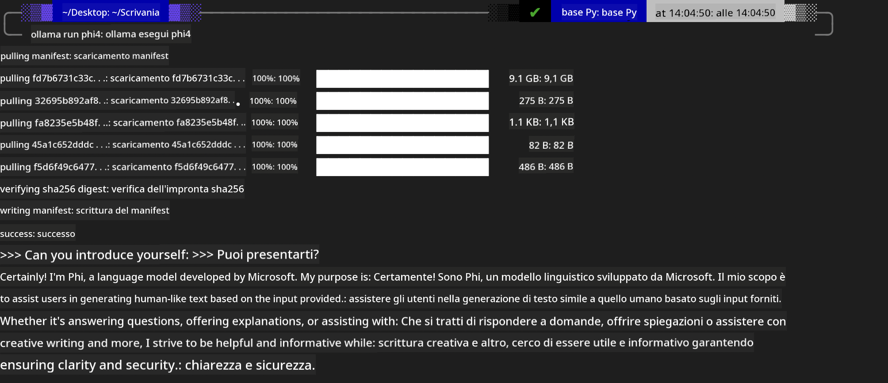
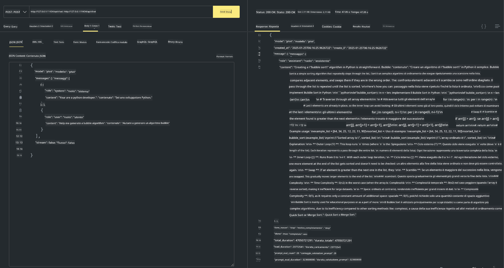

<!--
CO_OP_TRANSLATOR_METADATA:
{
  "original_hash": "0b38834693bb497f96bf53f0d941f9a1",
  "translation_date": "2025-05-09T09:14:14+00:00",
  "source_file": "md/01.Introduction/02/04.Ollama.md",
  "language_code": "it"
}
-->
## Famiglia Phi in Ollama


[Ollama](https://ollama.com) permette a più persone di distribuire direttamente modelli LLM o SLM open source tramite semplici script, e può anche creare API per supportare scenari di applicazioni Copilot locali.

## **1. Installazione**

Ollama supporta l'esecuzione su Windows, macOS e Linux. Puoi installare Ollama tramite questo link ([https://ollama.com/download](https://ollama.com/download)). Dopo l'installazione riuscita, puoi utilizzare direttamente lo script Ollama per chiamare Phi-3 tramite una finestra del terminale. Puoi vedere tutte le [librerie disponibili in Ollama](https://ollama.com/library). Se apri questo repository in un Codespace, Ollama sarà già installato.

```bash

ollama run phi4

```

> [!NOTE]
> Il modello verrà scaricato la prima volta che lo esegui. Naturalmente, puoi anche specificare direttamente il modello Phi-4 già scaricato. Prendiamo WSL come esempio per eseguire il comando. Dopo il download riuscito del modello, puoi interagire direttamente dal terminale.



## **2. Chiamare l'API phi-4 da Ollama**

Se vuoi chiamare l'API Phi-4 generata da Ollama, puoi usare questo comando nel terminale per avviare il server Ollama.

```bash

ollama serve

```

> [!NOTE]
> Se usi macOS o Linux, potresti incontrare il seguente errore **"Error: listen tcp 127.0.0.1:11434: bind: address already in use"**. Potresti vedere questo errore durante l'esecuzione del comando. Puoi ignorarlo, poiché di solito indica che il server è già in esecuzione, oppure puoi fermare e riavviare Ollama:

**macOS**

```bash

brew services restart ollama

```

**Linux**

```bash

sudo systemctl stop ollama

```

Ollama supporta due API: generate e chat. Puoi chiamare l'API del modello fornita da Ollama in base alle tue esigenze, inviando richieste al servizio locale in esecuzione sulla porta 11434.

**Chat**

```bash

curl http://127.0.0.1:11434/api/chat -d '{
  "model": "phi3",
  "messages": [
    {
      "role": "system",
      "content": "Your are a python developer."
    },
    {
      "role": "user",
      "content": "Help me generate a bubble algorithm"
    }
  ],
  "stream": false
  
}'

This is the result in Postman



## Additional Resources

Check the list of available models in Ollama in [their library](https://ollama.com/library).

Pull your model from the Ollama server using this command

```bash
ollama pull phi4
```

Run the model using this command

```bash
ollama run phi4
```

***Note:*** Visit this link [https://github.com/ollama/ollama/blob/main/docs/api.md](https://github.com/ollama/ollama/blob/main/docs/api.md) to learn more

## Calling Ollama from Python

You can use `requests` or `urllib3` to make requests to the local server endpoints used above. However, a popular way to use Ollama in Python is via the [openai](https://pypi.org/project/openai/) SDK, since Ollama provides OpenAI-compatible server endpoints as well.

Here is an example for phi3-mini:

```python
import openai

client = openai.OpenAI(
    base_url="http://localhost:11434/v1",
    api_key="nokeyneeded",
)

response = client.chat.completions.create(
    model="phi4",
    temperature=0.7,
    n=1,
    messages=[
        {"role": "system", "content": "You are a helpful assistant."},
        {"role": "user", "content": "Write a haiku about a hungry cat"},
    ],
)

print("Response:")
print(response.choices[0].message.content)
```

## Calling Ollama from JavaScript 

```javascript
// Esempio di sintesi di un file con Phi-4
script({
    model: "ollama:phi4",
    title: "Sintesi con Phi-4",
    system: ["system"],
})

// Esempio di sintesi
const file = def("FILE", env.files)
$`Summarize ${file} in a single paragraph.`
```

## Calling Ollama from C#

Create a new C# Console application and add the following NuGet package:

```bash
dotnet add package Microsoft.SemanticKernel --version 1.34.0
```

Then replace this code in the `Program.cs` file

```csharp
using Microsoft.SemanticKernel;
using Microsoft.SemanticKernel.ChatCompletion;

// aggiungi il servizio di chat completion usando l'endpoint locale del server ollama
#pragma warning disable SKEXP0001, SKEXP0003, SKEXP0010, SKEXP0011, SKEXP0050, SKEXP0052
builder.AddOpenAIChatCompletion(
    modelId: "phi4",
    endpoint: new Uri("http://localhost:11434/"),
    apiKey: "non required");

// invoca un prompt semplice al servizio chat
string prompt = "Write a joke about kittens";
var response = await kernel.InvokePromptAsync(prompt);
Console.WriteLine(response.GetValue<string>());
```

Run the app with the command:

```bash
dotnet run

**Disclaimer**:  
Questo documento è stato tradotto utilizzando il servizio di traduzione automatica AI [Co-op Translator](https://github.com/Azure/co-op-translator). Pur impegnandoci per garantire accuratezza, si prega di notare che le traduzioni automatiche possono contenere errori o inesattezze. Il documento originale nella sua lingua nativa deve essere considerato la fonte autorevole. Per informazioni critiche, si raccomanda la traduzione professionale effettuata da un umano. Non ci assumiamo alcuna responsabilità per malintesi o interpretazioni errate derivanti dall’uso di questa traduzione.