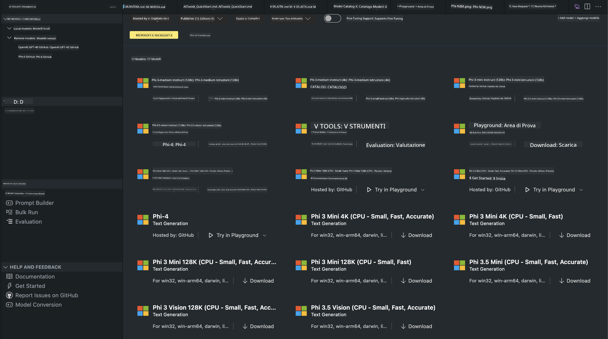
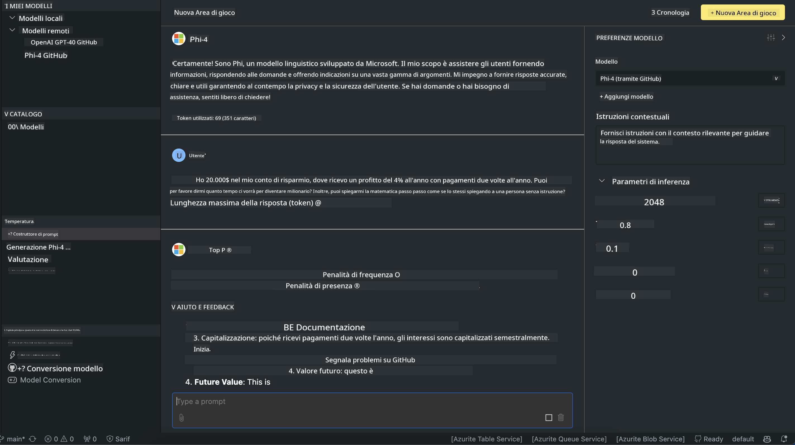

<!--
CO_OP_TRANSLATOR_METADATA:
{
  "original_hash": "4951d458c0b60c02cd1e751b40903877",
  "translation_date": "2025-05-09T09:32:06+00:00",
  "source_file": "md/01.Introduction/02/05.AITK.md",
  "language_code": "it"
}
-->
# Famiglia Phi in AITK

[AI Toolkit per VS Code](https://marketplace.visualstudio.com/items?itemName=ms-windows-ai-studio.windows-ai-studio) semplifica lo sviluppo di app basate su AI generativa riunendo strumenti e modelli all'avanguardia dal catalogo Azure AI Foundry e da altri cataloghi come Hugging Face. Potrai esplorare il catalogo di modelli AI alimentato da GitHub Models e Azure AI Foundry Model Catalogs, scaricarli localmente o da remoto, effettuare il fine-tuning, testarli e usarli nella tua applicazione.

La versione preview di AI Toolkit viene eseguita localmente. L'inferenza locale o il fine-tuning dipendono dal modello scelto, e potresti aver bisogno di una GPU come NVIDIA CUDA GPU. Puoi eseguire direttamente i modelli GitHub anche con AITK.

## Iniziare

[Scopri come installare il Windows Subsystem for Linux](https://learn.microsoft.com/windows/wsl/install?WT.mc_id=aiml-137032-kinfeylo)

e [come cambiare la distribuzione predefinita](https://learn.microsoft.com/windows/wsl/install#change-the-default-linux-distribution-installed).

[Repository GitHub AI Toolkit](https://github.com/microsoft/vscode-ai-toolkit/)

- Windows, Linux, macOS
  
- Per il fine-tuning sia su Windows che su Linux, è necessaria una GPU Nvidia. Inoltre, **Windows** richiede il sottosistema Linux con distribuzione Ubuntu 18.4 o superiore. [Scopri come installare il Windows Subsystem for Linux](https://learn.microsoft.com/windows/wsl/install) e [come cambiare la distribuzione predefinita](https://learn.microsoft.com/windows/wsl/install#change-the-default-linux-distribution-installed).

### Installare AI Toolkit

AI Toolkit viene distribuito come [estensione di Visual Studio Code](https://code.visualstudio.com/docs/setup/additional-components#_vs-code-extensions), quindi devi prima installare [VS Code](https://code.visualstudio.com/docs/setup/windows?WT.mc_id=aiml-137032-kinfeylo) e scaricare AI Toolkit dal [VS Marketplace](https://marketplace.visualstudio.com/items?itemName=ms-windows-ai-studio.windows-ai-studio).
L'[AI Toolkit è disponibile nel Visual Studio Marketplace](https://marketplace.visualstudio.com/items?itemName=ms-windows-ai-studio.windows-ai-studio) e può essere installato come qualsiasi altra estensione di VS Code.

Se non hai mai installato estensioni per VS Code, segui questi passaggi:

### Effettua il login

1. Nella barra delle attività di VS Code seleziona **Extensions**
1. Nella barra di ricerca delle estensioni digita "AI Toolkit"
1. Seleziona "AI Toolkit for Visual Studio code"
1. Clicca su **Install**

Ora sei pronto per usare l'estensione!

Ti verrà chiesto di effettuare l’accesso a GitHub, quindi clicca su "Allow" per continuare. Verrai reindirizzato alla pagina di login di GitHub.

Effettua l’accesso e segui i passaggi indicati. Al termine con successo, verrai riportato a VS Code.

Una volta installata l’estensione, vedrai comparire l’icona di AI Toolkit nella barra delle attività.

Esploriamo le azioni disponibili!

### Azioni disponibili

La barra laterale principale di AI Toolkit è organizzata in  

- **Models**
- **Resources**
- **Playground**  
- **Fine-tuning**
- **Evaluation**

Sono disponibili nella sezione Resources. Per iniziare seleziona **Model Catalog**.

### Scaricare un modello dal catalogo

Avviando AI Toolkit dalla barra laterale di VS Code, puoi scegliere tra le seguenti opzioni:



- Trova un modello supportato nel **Model Catalog** e scaricalo localmente
- Testa l'inferenza del modello nel **Model Playground**
- Effettua il fine-tuning localmente o da remoto in **Model Fine-tuning**
- Distribuisci modelli fine-tuned nel cloud tramite la command palette di AI Toolkit
- Valuta i modelli

> [!NOTE]
>
> **GPU Vs CPU**
>
> Noterai che le schede dei modelli mostrano la dimensione del modello, la piattaforma e il tipo di acceleratore (CPU, GPU). Per prestazioni ottimizzate su **dispositivi Windows con almeno una GPU**, scegli versioni di modelli pensate solo per Windows.
>
> Questo garantisce un modello ottimizzato per l’acceleratore DirectML.
>
> I nomi dei modelli sono nel formato
>
> - `{model_name}-{accelerator}-{quantization}-{format}`.
>
>Per verificare se il tuo dispositivo Windows ha una GPU, apri **Task Manager** e seleziona la scheda **Performance**. Se hai GPU, saranno elencate con nomi come "GPU 0" o "GPU 1".

### Eseguire il modello nel playground

Dopo aver impostato tutti i parametri, clicca su **Generate Project**.

Una volta scaricato il modello, seleziona **Load in Playground** sulla scheda del modello nel catalogo:

- Avvia il download del modello
- Installa tutti i prerequisiti e le dipendenze
- Crea l’area di lavoro in VS Code



### Usare la REST API nella tua applicazione

AI Toolkit include un server web REST API locale **sulla porta 5272** che utilizza il [formato OpenAI chat completions](https://platform.openai.com/docs/api-reference/chat/create).

Questo ti permette di testare l’applicazione localmente senza dipendere da un servizio AI cloud. Per esempio, il seguente file JSON mostra come configurare il corpo della richiesta:

```json
{
    "model": "Phi-4",
    "messages": [
        {
            "role": "user",
            "content": "what is the golden ratio?"
        }
    ],
    "temperature": 0.7,
    "top_p": 1,
    "top_k": 10,
    "max_tokens": 100,
    "stream": true
}
```

Puoi testare la REST API usando (ad esempio) [Postman](https://www.postman.com/) o l’utility CURL (Client URL):

```bash
curl -vX POST http://127.0.0.1:5272/v1/chat/completions -H 'Content-Type: application/json' -d @body.json
```

### Usare la libreria client OpenAI per Python

```python
from openai import OpenAI

client = OpenAI(
    base_url="http://127.0.0.1:5272/v1/", 
    api_key="x" # required for the API but not used
)

chat_completion = client.chat.completions.create(
    messages=[
        {
            "role": "user",
            "content": "what is the golden ratio?",
        }
    ],
    model="Phi-4",
)

print(chat_completion.choices[0].message.content)
```

### Usare la libreria client Azure OpenAI per .NET

Aggiungi la [libreria client Azure OpenAI per .NET](https://www.nuget.org/packages/Azure.AI.OpenAI/) al tuo progetto tramite NuGet:

```bash
dotnet add {project_name} package Azure.AI.OpenAI --version 1.0.0-beta.17
```

Aggiungi un file C# chiamato **OverridePolicy.cs** al progetto e incolla il seguente codice:

```csharp
// OverridePolicy.cs
using Azure.Core.Pipeline;
using Azure.Core;

internal partial class OverrideRequestUriPolicy(Uri overrideUri)
    : HttpPipelineSynchronousPolicy
{
    private readonly Uri _overrideUri = overrideUri;

    public override void OnSendingRequest(HttpMessage message)
    {
        message.Request.Uri.Reset(_overrideUri);
    }
}
```

Poi incolla questo codice nel file **Program.cs**:

```csharp
// Program.cs
using Azure.AI.OpenAI;

Uri localhostUri = new("http://localhost:5272/v1/chat/completions");

OpenAIClientOptions clientOptions = new();
clientOptions.AddPolicy(
    new OverrideRequestUriPolicy(localhostUri),
    Azure.Core.HttpPipelinePosition.BeforeTransport);
OpenAIClient client = new(openAIApiKey: "unused", clientOptions);

ChatCompletionsOptions options = new()
{
    DeploymentName = "Phi-4",
    Messages =
    {
        new ChatRequestSystemMessage("You are a helpful assistant. Be brief and succinct."),
        new ChatRequestUserMessage("What is the golden ratio?"),
    }
};

StreamingResponse<StreamingChatCompletionsUpdate> streamingChatResponse
    = await client.GetChatCompletionsStreamingAsync(options);

await foreach (StreamingChatCompletionsUpdate chatChunk in streamingChatResponse)
{
    Console.Write(chatChunk.ContentUpdate);
}
```


## Fine Tuning con AI Toolkit

- Inizia con la scoperta dei modelli e il playground.
- Fine-tuning e inferenza usando risorse di calcolo locali.
- Fine-tuning e inferenza da remoto usando risorse Azure.

[Fine Tuning con AI Toolkit](../../03.FineTuning/Finetuning_VSCodeaitoolkit.md)

## Risorse Q&A di AI Toolkit

Consulta la nostra [pagina Q&A](https://github.com/microsoft/vscode-ai-toolkit/blob/main/archive/QA.md) per le problematiche più comuni e le relative soluzioni

**Disclaimer**:  
Questo documento è stato tradotto utilizzando il servizio di traduzione automatica AI [Co-op Translator](https://github.com/Azure/co-op-translator). Pur impegnandoci per garantire accuratezza, si prega di notare che le traduzioni automatiche possono contenere errori o imprecisioni. Il documento originale nella sua lingua nativa deve essere considerato la fonte autorevole. Per informazioni critiche, si raccomanda una traduzione professionale effettuata da un traduttore umano. Non ci assumiamo alcuna responsabilità per eventuali fraintendimenti o interpretazioni errate derivanti dall’uso di questa traduzione.