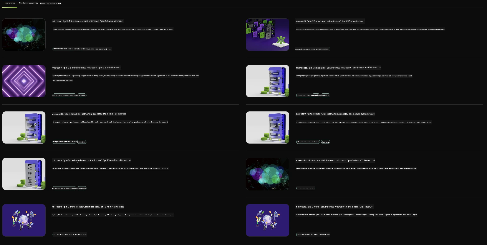

## Famiglia Phi in NVIDIA NIM

NVIDIA NIM è un insieme di microservizi facili da usare progettati per accelerare il deployment di modelli di intelligenza artificiale generativa su cloud, data center e workstation. I NIM sono categorizzati per famiglia di modelli e per singolo modello. Ad esempio, NVIDIA NIM per i modelli di linguaggio di grandi dimensioni (LLM) porta la potenza degli LLM all’avanguardia nelle applicazioni aziendali, offrendo capacità di elaborazione e comprensione del linguaggio naturale senza pari.

NIM facilita per i team IT e DevOps l’hosting autonomo di modelli di linguaggio di grandi dimensioni (LLM) nei propri ambienti gestiti, fornendo allo stesso tempo agli sviluppatori API standard di settore che permettono di costruire potenti copiloti, chatbot e assistenti AI in grado di trasformare il loro business. Sfruttando l’accelerazione GPU all’avanguardia di NVIDIA e un deployment scalabile, NIM offre il percorso più veloce verso l’inferenza con prestazioni impareggiabili.

Puoi usare NVIDIA NIM per inferire i modelli della Famiglia Phi



### **Esempi - Phi-3-Vision in NVIDIA NIM**

Immagina di avere un’immagine (`demo.png`) e di voler generare codice Python che elabori questa immagine e salvi una nuova versione (`phi-3-vision.jpg`).

Il codice sopra automatizza questo processo:

1. Configura l’ambiente e le impostazioni necessarie.
2. Crea un prompt che istruisce il modello a generare il codice Python richiesto.
3. Invia il prompt al modello e raccoglie il codice generato.
4. Estrae ed esegue il codice generato.
5. Mostra le immagini originale e processata.

Questo approccio sfrutta la potenza dell’AI per automatizzare i compiti di elaborazione delle immagini, rendendo più semplice e veloce raggiungere i tuoi obiettivi.

[Soluzione Codice Esempio](../../../../../code/06.E2E/E2E_Nvidia_NIM_Phi3_Vision.ipynb)

Analizziamo passo passo cosa fa l’intero codice:

1. **Installa il Pacchetto Richiesto**:  
    ```python
    !pip install langchain_nvidia_ai_endpoints -U
    ```  
    Questo comando installa il pacchetto `langchain_nvidia_ai_endpoints`, assicurandosi che sia l’ultima versione.

2. **Importa i Moduli Necessari**:  
    ```python
    from langchain_nvidia_ai_endpoints import ChatNVIDIA
    import getpass
    import os
    import base64
    ```  
    Questi import includono i moduli necessari per interagire con gli endpoint NVIDIA AI, gestire le password in modo sicuro, interagire con il sistema operativo e codificare/decodificare dati in formato base64.

3. **Configura la Chiave API**:  
    ```python
    if not os.getenv("NVIDIA_API_KEY"):
        os.environ["NVIDIA_API_KEY"] = getpass.getpass("Enter your NVIDIA API key: ")
    ```  
    Questo codice verifica se la variabile d’ambiente `NVIDIA_API_KEY` è impostata. In caso contrario, chiede all’utente di inserire la chiave API in modo sicuro.

4. **Definisci Modello e Percorso Immagine**:  
    ```python
    model = 'microsoft/phi-3-vision-128k-instruct'
    chat = ChatNVIDIA(model=model)
    img_path = './imgs/demo.png'
    ```  
    Qui si imposta il modello da usare, si crea un’istanza di `ChatNVIDIA` con il modello specificato e si definisce il percorso del file immagine.

5. **Crea il Prompt Testuale**:  
    ```python
    text = "Please create Python code for image, and use plt to save the new picture under imgs/ and name it phi-3-vision.jpg."
    ```  
    Questo definisce un prompt testuale che istruisce il modello a generare codice Python per elaborare un’immagine.

6. **Codifica l’Immagine in Base64**:  
    ```python
    with open(img_path, "rb") as f:
        image_b64 = base64.b64encode(f.read()).decode()
    image = f''
    ```  
    Questo codice legge il file immagine, lo codifica in base64 e crea un tag HTML `` con i dati codificati.

7. **Combina Testo e Immagine nel Prompt**:  
    ```python
    prompt = f"{text} {image}"
    ```  
    Qui si uniscono il prompt testuale e il tag immagine HTML in un’unica stringa.

8. **Genera il Codice Usando ChatNVIDIA**:  
    ```python
    code = ""
    for chunk in chat.stream(prompt):
        print(chunk.content, end="")
        code += chunk.content
    ```  
    Questo codice invia il prompt al modello `ChatNVIDIA` e raccoglie il codice generato a pezzi, stampando e aggiungendo ogni parte alla stringa `code`.

9. **Estrai il Codice Python dal Contenuto Generato**:  
    ```python
    begin = code.index('```python') + 9  
    code = code[begin:]  
    end = code.index('```')
    code = code[:end]
    ```  
    Questo estrae il codice Python vero e proprio dal contenuto generato, rimuovendo la formattazione markdown.

10. **Esegui il Codice Generato**:  
    ```python
    import subprocess
    result = subprocess.run(["python", "-c", code], capture_output=True)
    ```  
    Questo esegue il codice Python estratto come subprocess e cattura il suo output.

11. **Mostra le Immagini**:  
    ```python
    from IPython.display import Image, display
    display(Image(filename='./imgs/phi-3-vision.jpg'))
    display(Image(filename='./imgs/demo.png'))
    ```  
    Queste righe mostrano le immagini usando il modulo `IPython.display`.

**Disclaimer**:  
Questo documento è stato tradotto utilizzando il servizio di traduzione automatica [Co-op Translator](https://github.com/Azure/co-op-translator). Pur impegnandoci per garantire l’accuratezza, si prega di notare che le traduzioni automatiche possono contenere errori o imprecisioni. Il documento originale nella sua lingua nativa deve essere considerato la fonte autorevole. Per informazioni critiche, si raccomanda una traduzione professionale effettuata da un umano. Non ci assumiamo alcuna responsabilità per eventuali malintesi o interpretazioni errate derivanti dall’uso di questa traduzione.