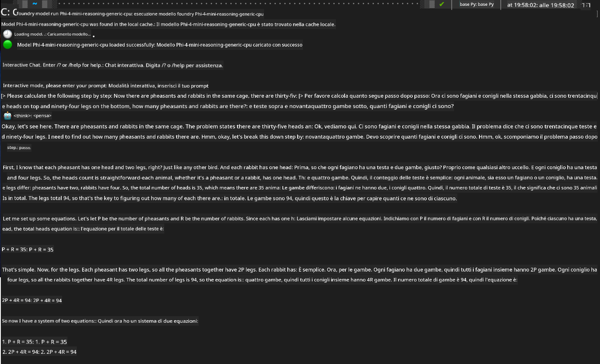

<!--
CO_OP_TRANSLATOR_METADATA:
{
  "original_hash": "52973a5680a65a810aa80b7036afd31f",
  "translation_date": "2025-07-16T19:46:10+00:00",
  "source_file": "md/01.Introduction/02/07.FoundryLocal.md",
  "language_code": "it"
}
-->
## Iniziare con i modelli Phi-Family in Foundry Local

### Introduzione a Foundry Local

Foundry Local è una potente soluzione di inferenza AI on-device che porta capacità AI di livello enterprise direttamente sul tuo hardware locale. Questo tutorial ti guiderà nella configurazione e nell’uso dei modelli Phi-Family con Foundry Local, offrendoti il pieno controllo sui tuoi carichi di lavoro AI, mantenendo la privacy e riducendo i costi.

Foundry Local offre vantaggi in termini di prestazioni, privacy, personalizzazione e costi eseguendo i modelli AI localmente sul tuo dispositivo. Si integra perfettamente nei tuoi flussi di lavoro e applicazioni esistenti tramite un’interfaccia CLI intuitiva, SDK e REST API.


### Perché scegliere Foundry Local?

Comprendere i vantaggi di Foundry Local ti aiuterà a prendere decisioni informate sulla tua strategia di deployment AI:

- **Inferenza On-Device:** Esegui i modelli localmente sul tuo hardware, riducendo i costi e mantenendo tutti i dati sul dispositivo.

- **Personalizzazione del Modello:** Scegli tra modelli preimpostati o usa i tuoi per soddisfare requisiti e casi d’uso specifici.

- **Efficienza dei Costi:** Elimina i costi ricorrenti dei servizi cloud utilizzando l’hardware esistente, rendendo l’AI più accessibile.

- **Integrazione Semplice:** Collegati alle tue applicazioni tramite SDK, endpoint API o CLI, con facile scalabilità verso Azure AI Foundry man mano che le tue esigenze crescono.

> **Nota per l’inizio:** Questo tutorial si concentra sull’uso di Foundry Local tramite interfacce CLI e SDK. Imparerai entrambi gli approcci per aiutarti a scegliere il metodo migliore per il tuo caso d’uso.

## Parte 1: Configurare Foundry Local CLI

### Passo 1: Installazione

La CLI di Foundry Local è la tua porta d’accesso per gestire ed eseguire modelli AI localmente. Iniziamo installandola sul tuo sistema.

**Piattaforme supportate:** Windows e macOS

Per istruzioni dettagliate sull’installazione, consulta la [documentazione ufficiale di Foundry Local](https://github.com/microsoft/Foundry-Local/blob/main/README.md).

### Passo 2: Esplorare i modelli disponibili

Una volta installata la CLI di Foundry Local, puoi scoprire quali modelli sono disponibili per il tuo caso d’uso. Questo comando ti mostrerà tutti i modelli supportati:


```bash
foundry model list
```

### Passo 3: Comprendere i modelli Phi Family

La Phi Family offre una gamma di modelli ottimizzati per diversi casi d’uso e configurazioni hardware. Ecco i modelli Phi disponibili in Foundry Local:

**Modelli Phi disponibili:** 

- **phi-3.5-mini** - Modello compatto per compiti base
- **phi-3-mini-128k** - Versione con contesto esteso per conversazioni più lunghe
- **phi-3-mini-4k** - Modello con contesto standard per uso generale
- **phi-4** - Modello avanzato con capacità migliorate
- **phi-4-mini** - Versione leggera di Phi-4
- **phi-4-mini-reasoning** - Specializzato in compiti di ragionamento complesso

> **Compatibilità hardware:** Ogni modello può essere configurato per diverse accelerazioni hardware (CPU, GPU) a seconda delle capacità del tuo sistema.

### Passo 4: Eseguire il tuo primo modello Phi

Iniziamo con un esempio pratico. Eseguiremo il modello `phi-4-mini-reasoning`, che eccelle nel risolvere problemi complessi passo dopo passo.


**Comando per eseguire il modello:**

```bash
foundry model run Phi-4-mini-reasoning-generic-cpu
```

> **Configurazione iniziale:** Quando esegui un modello per la prima volta, Foundry Local lo scaricherà automaticamente sul tuo dispositivo locale. Il tempo di download varia in base alla velocità della tua rete, quindi ti chiediamo di avere pazienza durante la configurazione iniziale.

### Passo 5: Testare il modello con un problema reale

Ora testiamo il nostro modello con un classico problema di logica per vedere come esegue il ragionamento passo dopo passo:

**Esempio di problema:**

```txt
Please calculate the following step by step: Now there are pheasants and rabbits in the same cage, there are thirty-five heads on top and ninety-four legs on the bottom, how many pheasants and rabbits are there?
```

**Comportamento atteso:** Il modello dovrebbe scomporre il problema in passaggi logici, utilizzando il fatto che le pernici hanno 2 zampe e i conigli 4 per risolvere il sistema di equazioni.

**Risultati:**



## Parte 2: Costruire applicazioni con Foundry Local SDK

### Perché usare l’SDK?

Mentre la CLI è perfetta per test e interazioni rapide, l’SDK ti permette di integrare Foundry Local nelle tue applicazioni in modo programmatico. Questo apre possibilità per:

- Creare applicazioni personalizzate basate su AI
- Realizzare flussi di lavoro automatizzati
- Integrare capacità AI in sistemi esistenti
- Sviluppare chatbot e strumenti interattivi

### Linguaggi di programmazione supportati

Foundry Local offre supporto SDK per diversi linguaggi di programmazione per adattarsi alle tue preferenze di sviluppo:

**📦 SDK disponibili:**

- **C# (.NET):** [Documentazione & Esempi SDK](https://github.com/microsoft/Foundry-Local/tree/main/sdk/cs)
- **Python:** [Documentazione & Esempi SDK](https://github.com/microsoft/Foundry-Local/tree/main/sdk/python)
- **JavaScript:** [Documentazione & Esempi SDK](https://github.com/microsoft/Foundry-Local/tree/main/sdk/js)
- **Rust:** [Documentazione & Esempi SDK](https://github.com/microsoft/Foundry-Local/tree/main/sdk/rust)

### Passi successivi

1. **Scegli l’SDK preferito** in base al tuo ambiente di sviluppo
2. **Segui la documentazione specifica dell’SDK** per guide dettagliate all’implementazione
3. **Inizia con esempi semplici** prima di costruire applicazioni complesse
4. **Esplora il codice di esempio** fornito in ogni repository SDK

## Conclusione

Ora hai imparato a:
- ✅ Installare e configurare Foundry Local CLI
- ✅ Scoprire ed eseguire modelli Phi Family
- ✅ Testare i modelli con problemi reali
- ✅ Comprendere le opzioni SDK per lo sviluppo di applicazioni

Foundry Local offre una solida base per portare le capacità AI direttamente nel tuo ambiente locale, garantendoti controllo su prestazioni, privacy e costi, mantenendo la flessibilità di scalare verso soluzioni cloud quando necessario.

**Disclaimer**:  
Questo documento è stato tradotto utilizzando il servizio di traduzione automatica [Co-op Translator](https://github.com/Azure/co-op-translator). Pur impegnandoci per garantire l’accuratezza, si prega di notare che le traduzioni automatiche possono contenere errori o imprecisioni. Il documento originale nella sua lingua nativa deve essere considerato la fonte autorevole. Per informazioni critiche, si raccomanda una traduzione professionale effettuata da un umano. Non ci assumiamo alcuna responsabilità per eventuali malintesi o interpretazioni errate derivanti dall’uso di questa traduzione.