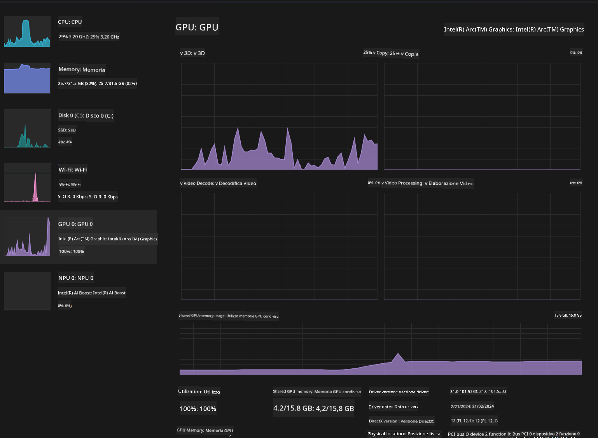

<!--
CO_OP_TRANSLATOR_METADATA:
{
  "original_hash": "e08ce816e23ad813244a09ca34ebb8ac",
  "translation_date": "2025-05-09T10:13:34+00:00",
  "source_file": "md/01.Introduction/03/AIPC_Inference.md",
  "language_code": "it"
}
-->
# **Inferenza Phi-3 su AI PC**

Con l’avanzamento dell’AI generativa e il miglioramento delle capacità hardware dei dispositivi edge, un numero crescente di modelli di AI generativa può ora essere integrato nei dispositivi Bring Your Own Device (BYOD) degli utenti. Gli AI PC sono tra questi modelli. A partire dal 2024, Intel, AMD e Qualcomm hanno collaborato con i produttori di PC per introdurre AI PC che facilitano il deployment di modelli di AI generativa localizzati tramite modifiche hardware. In questa discussione, ci concentreremo sugli AI PC Intel e esploreremo come distribuire Phi-3 su un AI PC Intel.

### Cos’è una NPU

Una NPU (Neural Processing Unit) è un processore dedicato o un’unità di elaborazione integrata in un SoC più grande, progettata specificamente per accelerare le operazioni di reti neurali e i compiti di AI. A differenza delle CPU e GPU generiche, le NPU sono ottimizzate per un calcolo parallelo basato sui dati, rendendole molto efficienti nell’elaborazione di grandi quantità di dati multimediali come video e immagini, oltre che nell’elaborazione di dati per reti neurali. Sono particolarmente abili nel gestire compiti legati all’AI, come il riconoscimento vocale, lo sfocamento dello sfondo nelle videochiamate e processi di editing foto o video come il rilevamento degli oggetti.

## NPU vs GPU

Sebbene molti carichi di lavoro di AI e machine learning girino su GPU, c’è una distinzione importante tra GPU e NPU.  
Le GPU sono note per le loro capacità di calcolo parallelo, ma non tutte le GPU sono ugualmente efficienti al di fuori dell’elaborazione grafica. Le NPU, invece, sono costruite appositamente per i calcoli complessi coinvolti nelle operazioni delle reti neurali, risultando quindi molto efficaci per i compiti di AI.

In sintesi, le NPU sono gli esperti matematici che potenziano i calcoli AI, e giocano un ruolo chiave nell’era emergente degli AI PC!

***Questo esempio si basa sull’ultimo processore Intel Core Ultra***

## **1. Usare la NPU per eseguire il modello Phi-3**

Il dispositivo Intel® NPU è un acceleratore di inferenza AI integrato con le CPU client Intel, a partire dalla generazione Intel® Core™ Ultra (precedentemente nota come Meteor Lake). Permette l’esecuzione energeticamente efficiente di compiti di reti neurali artificiali.


**Intel NPU Acceleration Library**

La Intel NPU Acceleration Library [https://github.com/intel/intel-npu-acceleration-library](https://github.com/intel/intel-npu-acceleration-library) è una libreria Python progettata per aumentare l’efficienza delle tue applicazioni sfruttando la potenza della Neural Processing Unit (NPU) Intel per eseguire calcoli ad alta velocità su hardware compatibile.

Esempio di Phi-3-mini su AI PC alimentato da processori Intel® Core™ Ultra.


Installa la libreria Python con pip

```bash

   pip install intel-npu-acceleration-library

```

***Nota*** Il progetto è ancora in fase di sviluppo, ma il modello di riferimento è già molto completo.

### **Eseguire Phi-3 con Intel NPU Acceleration Library**

Usando l’accelerazione Intel NPU, questa libreria non modifica il processo di encoding tradizionale. Devi solo usare questa libreria per quantizzare il modello Phi-3 originale, ad esempio in FP16, INT8, INT4, come

```python
from transformers import AutoTokenizer, pipeline,TextStreamer
from intel_npu_acceleration_library import NPUModelForCausalLM, int4
from intel_npu_acceleration_library.compiler import CompilerConfig
import warnings

model_id = "microsoft/Phi-3-mini-4k-instruct"

compiler_conf = CompilerConfig(dtype=int4)
model = NPUModelForCausalLM.from_pretrained(
    model_id, use_cache=True, config=compiler_conf, attn_implementation="sdpa"
).eval()

tokenizer = AutoTokenizer.from_pretrained(model_id)

text_streamer = TextStreamer(tokenizer, skip_prompt=True)
```

Dopo che la quantizzazione è avvenuta con successo, continua l’esecuzione chiamando la NPU per eseguire il modello Phi-3.

```python
generation_args = {
   "max_new_tokens": 1024,
   "return_full_text": False,
   "temperature": 0.3,
   "do_sample": False,
   "streamer": text_streamer,
}

pipe = pipeline(
   "text-generation",
   model=model,
   tokenizer=tokenizer,
)

query = "<|system|>You are a helpful AI assistant.<|end|><|user|>Can you introduce yourself?<|end|><|assistant|>"

with warnings.catch_warnings():
    warnings.simplefilter("ignore")
    pipe(query, **generation_args)
```

Durante l’esecuzione del codice, possiamo monitorare lo stato di funzionamento della NPU tramite il Task Manager


***Esempi*** : [AIPC_NPU_DEMO.ipynb](../../../../../code/03.Inference/AIPC/AIPC_NPU_DEMO.ipynb)

## **2. Usare DirectML + ONNX Runtime per eseguire il modello Phi-3**

### **Cos’è DirectML**

[DirectML](https://github.com/microsoft/DirectML) è una libreria DirectX 12 ad alte prestazioni e accelerata hardware per il machine learning. DirectML fornisce accelerazione GPU per i comuni compiti di machine learning su un’ampia gamma di hardware e driver supportati, incluse tutte le GPU compatibili con DirectX 12 di vendor come AMD, Intel, NVIDIA e Qualcomm.

Quando usata da sola, l’API DirectML è una libreria DirectX 12 a basso livello ed è adatta per applicazioni ad alte prestazioni e bassa latenza come framework, giochi e altre applicazioni in tempo reale. L’interoperabilità fluida di DirectML con Direct3D 12, il suo basso overhead e la conformità su diversi hardware rendono DirectML ideale per accelerare il machine learning quando si desidera alte prestazioni e al contempo affidabilità e prevedibilità dei risultati su vari dispositivi.

***Nota*** : L’ultima versione di DirectML supporta già NPU (https://devblogs.microsoft.com/directx/introducing-neural-processor-unit-npu-support-in-directml-developer-preview/)

### DirectML e CUDA in termini di capacità e prestazioni:

**DirectML** è una libreria di machine learning sviluppata da Microsoft. È progettata per accelerare i carichi di lavoro di machine learning su dispositivi Windows, inclusi desktop, laptop e dispositivi edge.  
- Basata su DX12: DirectML è costruita sopra DirectX 12 (DX12), che offre un ampio supporto hardware per GPU, incluse NVIDIA e AMD.  
- Supporto più ampio: sfruttando DX12, DirectML può funzionare con qualsiasi GPU che supporta DX12, comprese le GPU integrate.  
- Elaborazione immagini: DirectML elabora immagini e altri dati usando reti neurali, risultando adatta a compiti come riconoscimento immagini, rilevamento oggetti e altro.  
- Facilità di configurazione: configurare DirectML è semplice e non richiede SDK o librerie specifiche dai produttori di GPU.  
- Prestazioni: in alcuni casi, DirectML offre buone prestazioni e può essere più veloce di CUDA, specialmente per certi carichi di lavoro.  
- Limitazioni: tuttavia, ci sono situazioni in cui DirectML può essere più lento, in particolare con batch di grandi dimensioni in float16.

**CUDA** è la piattaforma di calcolo parallelo e modello di programmazione di NVIDIA. Permette agli sviluppatori di sfruttare la potenza delle GPU NVIDIA per il calcolo generale, inclusi machine learning e simulazioni scientifiche.  
- Specifico NVIDIA: CUDA è strettamente integrato con le GPU NVIDIA ed è progettato specificamente per esse.  
- Altamente ottimizzato: offre prestazioni eccellenti per compiti accelerati su GPU, specialmente con GPU NVIDIA.  
- Ampiamente usato: molti framework e librerie di machine learning (come TensorFlow e PyTorch) supportano CUDA.  
- Personalizzazione: gli sviluppatori possono ottimizzare le impostazioni CUDA per compiti specifici, ottenendo prestazioni ottimali.  
- Limitazioni: tuttavia, la dipendenza da hardware NVIDIA può limitare la compatibilità con GPU di altri produttori.

### Scegliere tra DirectML e CUDA

La scelta tra DirectML e CUDA dipende dal caso d’uso specifico, dalla disponibilità hardware e dalle preferenze.  
Se cerchi compatibilità più ampia e facilità di configurazione, DirectML può essere una buona scelta. Se invece disponi di GPU NVIDIA e necessiti di prestazioni altamente ottimizzate, CUDA rimane una scelta forte. In sintesi, entrambi hanno punti di forza e debolezze, quindi valuta i tuoi requisiti e l’hardware disponibile prima di decidere.

### **AI generativa con ONNX Runtime**

Nell’era dell’AI, la portabilità dei modelli AI è molto importante. ONNX Runtime consente di distribuire facilmente modelli addestrati su dispositivi diversi. Gli sviluppatori non devono preoccuparsi del framework di inferenza e possono usare un’API unificata per completare l’inferenza del modello. Nell’era dell’AI generativa, ONNX Runtime ha anche effettuato ottimizzazioni del codice (https://onnxruntime.ai/docs/genai/). Grazie all’ONNX Runtime ottimizzato, il modello di AI generativa quantizzato può essere inferito su terminali differenti. Con Generative AI con ONNX Runtime, puoi utilizzare l’API di inferenza del modello AI tramite Python, C#, C/C++. Naturalmente, il deployment su iPhone può sfruttare l’API Generative AI con ONNX Runtime in C++.

[Sample Code](https://github.com/Azure-Samples/Phi-3MiniSamples/tree/main/onnx)

***Compilare la libreria generative AI con ONNX Runtime***

```bash

winget install --id=Kitware.CMake  -e

git clone https://github.com/microsoft/onnxruntime.git

cd .\onnxruntime\

./build.bat --build_shared_lib --skip_tests --parallel --use_dml --config Release

cd ../

git clone https://github.com/microsoft/onnxruntime-genai.git

cd .\onnxruntime-genai\

mkdir ort

cd ort

mkdir include

mkdir lib

copy ..\onnxruntime\include\onnxruntime\core\providers\dml\dml_provider_factory.h ort\include

copy ..\onnxruntime\include\onnxruntime\core\session\onnxruntime_c_api.h ort\include

copy ..\onnxruntime\build\Windows\Release\Release\*.dll ort\lib

copy ..\onnxruntime\build\Windows\Release\Release\onnxruntime.lib ort\lib

python build.py --use_dml


```

**Installare la libreria**

```bash

pip install .\onnxruntime_genai_directml-0.3.0.dev0-cp310-cp310-win_amd64.whl

```

Questo è il risultato dell’esecuzione


***Esempi*** : [AIPC_DirectML_DEMO.ipynb](../../../../../code/03.Inference/AIPC/AIPC_DirectML_DEMO.ipynb)

## **3. Usare Intel OpenVino per eseguire il modello Phi-3**

### **Cos’è OpenVINO**

[OpenVINO](https://github.com/openvinotoolkit/openvino) è un toolkit open source per ottimizzare e distribuire modelli di deep learning. Offre prestazioni accelerate per modelli di visione, audio e linguaggio provenienti da framework popolari come TensorFlow, PyTorch e altri. Inizia con OpenVINO. OpenVINO può essere utilizzato anche in combinazione con CPU e GPU per eseguire il modello Phi-3.

***Nota***: Attualmente OpenVINO non supporta la NPU.

### **Installare la libreria OpenVINO**

```bash

 pip install git+https://github.com/huggingface/optimum-intel.git

 pip install git+https://github.com/openvinotoolkit/nncf.git

 pip install openvino-nightly

```

### **Eseguire Phi-3 con OpenVINO**

Come per la NPU, OpenVINO completa la chiamata ai modelli di AI generativa eseguendo modelli quantizzati. È necessario quantizzare prima il modello Phi-3 e completare la quantizzazione tramite la riga di comando con optimum-cli

**INT4**

```bash

optimum-cli export openvino --model "microsoft/Phi-3-mini-4k-instruct" --task text-generation-with-past --weight-format int4 --group-size 128 --ratio 0.6  --sym  --trust-remote-code ./openvinomodel/phi3/int4

```

**FP16**

```bash

optimum-cli export openvino --model "microsoft/Phi-3-mini-4k-instruct" --task text-generation-with-past --weight-format fp16 --trust-remote-code ./openvinomodel/phi3/fp16

```

il formato convertito, come questo


Carica i percorsi del modello (model_dir), le configurazioni correlate (ov_config = {"PERFORMANCE_HINT": "LATENCY", "NUM_STREAMS": "1", "CACHE_DIR": ""}) e i dispositivi hardware accelerati (GPU.0) tramite OVModelForCausalLM

```python

ov_model = OVModelForCausalLM.from_pretrained(
     model_dir,
     device='GPU.0',
     ov_config=ov_config,
     config=AutoConfig.from_pretrained(model_dir, trust_remote_code=True),
     trust_remote_code=True,
)

```

Durante l’esecuzione del codice, possiamo monitorare lo stato di funzionamento della GPU tramite il Task Manager



***Esempi*** : [AIPC_OpenVino_Demo.ipynb](../../../../../code/03.Inference/AIPC/AIPC_OpenVino_Demo.ipynb)

### ***Nota*** : I tre metodi sopra hanno ciascuno i loro vantaggi, ma si consiglia di usare l’accelerazione NPU per l’inferenza su AI PC.

**Disclaimer**:  
Questo documento è stato tradotto utilizzando il servizio di traduzione automatica AI [Co-op Translator](https://github.com/Azure/co-op-translator). Pur impegnandoci per l’accuratezza, si prega di notare che le traduzioni automatiche possono contenere errori o inesattezze. Il documento originale nella sua lingua nativa deve essere considerato la fonte autorevole. Per informazioni critiche, si raccomanda la traduzione professionale effettuata da un esperto umano. Non siamo responsabili per eventuali malintesi o interpretazioni errate derivanti dall’uso di questa traduzione.