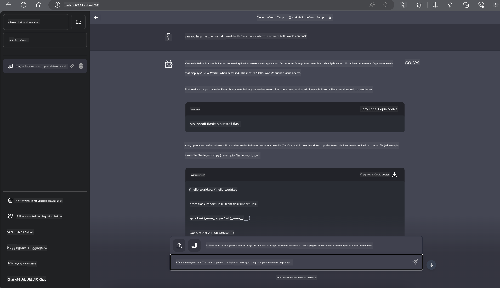

<!--
CO_OP_TRANSLATOR_METADATA:
{
  "original_hash": "be4101a30d98e95a71d42c276e8bcd37",
  "translation_date": "2025-07-16T20:42:00+00:00",
  "source_file": "md/01.Introduction/03/Jetson_Inference.md",
  "language_code": "it"
}
-->
# **Inferenza Phi-3 su Nvidia Jetson**

Nvidia Jetson è una serie di schede di calcolo embedded di Nvidia. I modelli Jetson TK1, TX1 e TX2 montano tutti un processore Tegra (o SoC) di Nvidia che integra una CPU basata su architettura ARM. Jetson è un sistema a basso consumo progettato per accelerare applicazioni di machine learning. Nvidia Jetson è utilizzato da sviluppatori professionisti per creare prodotti AI innovativi in tutti i settori, e da studenti e appassionati per apprendere l’AI in modo pratico e realizzare progetti straordinari. SLM viene distribuito su dispositivi edge come Jetson, permettendo una migliore implementazione di scenari applicativi industriali di AI generativa.

## Distribuzione su NVIDIA Jetson:
Gli sviluppatori che lavorano su robotica autonoma e dispositivi embedded possono sfruttare Phi-3 Mini. Le dimensioni relativamente contenute di Phi-3 lo rendono ideale per il deployment edge. I parametri sono stati accuratamente ottimizzati durante l’addestramento, garantendo risposte ad alta precisione.

### Ottimizzazione TensorRT-LLM:
La [libreria TensorRT-LLM di NVIDIA](https://github.com/NVIDIA/TensorRT-LLM?WT.mc_id=aiml-138114-kinfeylo) ottimizza l’inferenza di grandi modelli linguistici. Supporta la lunga finestra contestuale di Phi-3 Mini, migliorando sia la velocità che la latenza. Le ottimizzazioni includono tecniche come LongRoPE, FP8 e inflight batching.

### Disponibilità e distribuzione:
Gli sviluppatori possono esplorare Phi-3 Mini con la finestra contestuale da 128K su [NVIDIA AI](https://www.nvidia.com/en-us/ai-data-science/generative-ai/). È confezionato come NVIDIA NIM, un microservizio con API standard che può essere distribuito ovunque. Inoltre, sono disponibili le [implementazioni TensorRT-LLM su GitHub](https://github.com/NVIDIA/TensorRT-LLM).

## **1. Preparazione**

a. Jetson Orin NX / Jetson NX

b. JetPack 5.1.2+

c. Cuda 11.8

d. Python 3.8+

## **2. Esecuzione di Phi-3 su Jetson**

Possiamo scegliere tra [Ollama](https://ollama.com) o [LlamaEdge](https://llamaedge.com)

Se vuoi usare gguf sia nel cloud che su dispositivi edge contemporaneamente, LlamaEdge può essere inteso come WasmEdge (WasmEdge è un runtime WebAssembly leggero, ad alte prestazioni e scalabile, adatto per applicazioni cloud native, edge e decentralizzate. Supporta applicazioni serverless, funzioni embedded, microservizi, smart contract e dispositivi IoT). Puoi distribuire il modello quantitativo gguf sia su dispositivi edge che nel cloud tramite LlamaEdge.


Ecco i passaggi per l’utilizzo

1. Installare e scaricare le librerie e i file correlati

```bash

curl -sSf https://raw.githubusercontent.com/WasmEdge/WasmEdge/master/utils/install.sh | bash -s -- --plugin wasi_nn-ggml

curl -LO https://github.com/LlamaEdge/LlamaEdge/releases/latest/download/llama-api-server.wasm

curl -LO https://github.com/LlamaEdge/chatbot-ui/releases/latest/download/chatbot-ui.tar.gz

tar xzf chatbot-ui.tar.gz

```

**Nota**: llama-api-server.wasm e chatbot-ui devono trovarsi nella stessa cartella

2. Eseguire gli script nel terminale

```bash

wasmedge --dir .:. --nn-preload default:GGML:AUTO:{Your gguf path} llama-api-server.wasm -p phi-3-chat

```

Ecco il risultato dell’esecuzione



***Codice di esempio*** [Phi-3 mini WASM Notebook Sample](https://github.com/Azure-Samples/Phi-3MiniSamples/tree/main/wasm)

In sintesi, Phi-3 Mini rappresenta un salto in avanti nella modellazione linguistica, combinando efficienza, consapevolezza del contesto e l’esperienza di ottimizzazione di NVIDIA. Che tu stia costruendo robot o applicazioni edge, Phi-3 Mini è uno strumento potente da conoscere.

**Disclaimer**:  
Questo documento è stato tradotto utilizzando il servizio di traduzione automatica [Co-op Translator](https://github.com/Azure/co-op-translator). Pur impegnandoci per garantire l’accuratezza, si prega di notare che le traduzioni automatiche possono contenere errori o imprecisioni. Il documento originale nella sua lingua nativa deve essere considerato la fonte autorevole. Per informazioni critiche, si raccomanda una traduzione professionale effettuata da un umano. Non ci assumiamo alcuna responsabilità per eventuali malintesi o interpretazioni errate derivanti dall’uso di questa traduzione.