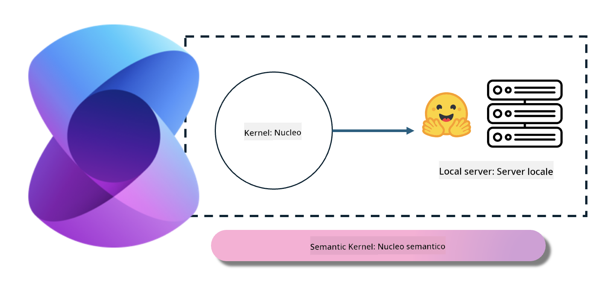
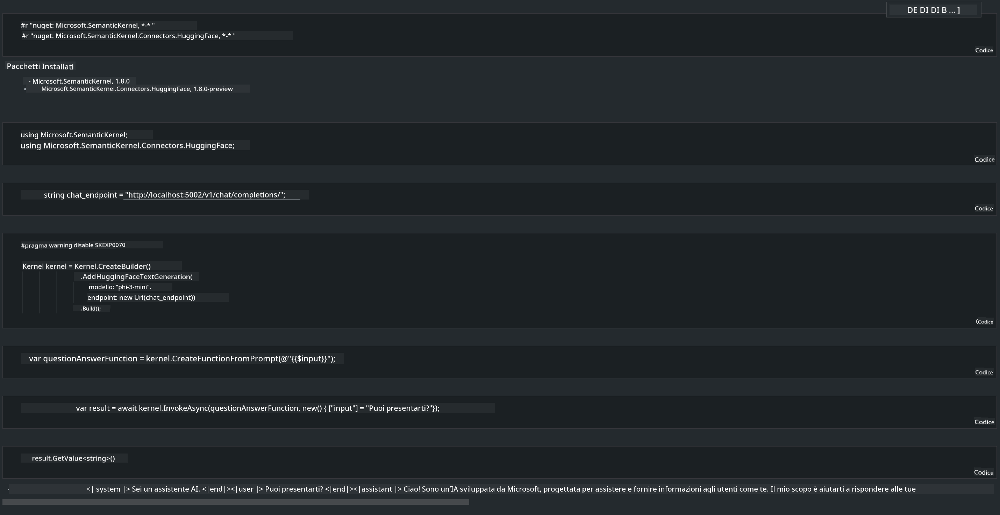

<!--
CO_OP_TRANSLATOR_METADATA:
{
  "original_hash": "bcf5dd7031db0031abdb9dd0c05ba118",
  "translation_date": "2025-05-09T12:03:42+00:00",
  "source_file": "md/01.Introduction/03/Local_Server_Inference.md",
  "language_code": "it"
}
-->
# **Inferenza di Phi-3 su Server Locale**

Possiamo distribuire Phi-3 su un server locale. Gli utenti possono scegliere soluzioni come [Ollama](https://ollama.com) o [LM Studio](https://llamaedge.com), oppure scrivere il proprio codice. È possibile connettere i servizi locali di Phi-3 tramite [Semantic Kernel](https://github.com/microsoft/semantic-kernel?WT.mc_id=aiml-138114-kinfeylo) o [Langchain](https://www.langchain.com/) per creare applicazioni Copilot.

## **Usare Semantic Kernel per accedere a Phi-3-mini**

Nell’applicazione Copilot, creiamo applicazioni tramite Semantic Kernel / LangChain. Questo tipo di framework applicativo è generalmente compatibile con Azure OpenAI Service / modelli OpenAI, e può anche supportare modelli open source su Hugging Face e modelli locali. Cosa fare se vogliamo usare Semantic Kernel per accedere a Phi-3-mini? Prendendo .NET come esempio, possiamo combinarlo con l’Hugging Face Connector in Semantic Kernel. Di default, corrisponde all’id del modello su Hugging Face (la prima volta che lo si usa, il modello viene scaricato da Hugging Face, il che richiede tempo). È anche possibile connettersi al servizio locale creato in proprio. Tra le due opzioni, consigliamo quest’ultima perché offre maggiore autonomia, soprattutto nelle applicazioni aziendali.

Dalla figura, accedere ai servizi locali tramite Semantic Kernel permette di collegarsi facilmente al server modello Phi-3-mini auto-gestito. Ecco il risultato dell’esecuzione:

***Sample Code*** https://github.com/kinfey/Phi3MiniSamples/tree/main/semantickernel

**Disclaimer**:  
Questo documento è stato tradotto utilizzando il servizio di traduzione AI [Co-op Translator](https://github.com/Azure/co-op-translator). Pur impegnandoci per garantire accuratezza, si prega di notare che le traduzioni automatiche possono contenere errori o imprecisioni. Il documento originale nella sua lingua nativa deve essere considerato la fonte autorevole. Per informazioni critiche, si raccomanda una traduzione professionale effettuata da un essere umano. Non ci assumiamo responsabilità per eventuali fraintendimenti o interpretazioni errate derivanti dall’uso di questa traduzione.