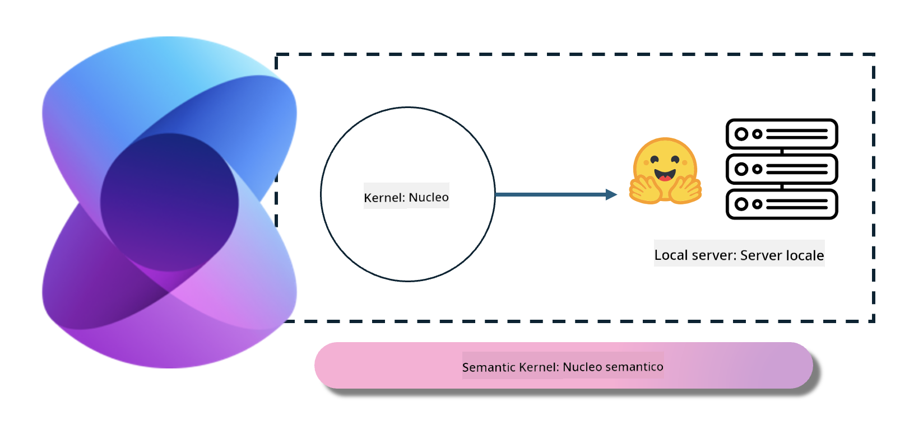

<!--
CO_OP_TRANSLATOR_METADATA:
{
  "original_hash": "bcf5dd7031db0031abdb9dd0c05ba118",
  "translation_date": "2025-07-16T20:57:00+00:00",
  "source_file": "md/01.Introduction/03/Local_Server_Inference.md",
  "language_code": "it"
}
-->
# **Inferenza Phi-3 su Server Locale**

Possiamo distribuire Phi-3 su un server locale. Gli utenti possono scegliere soluzioni come [Ollama](https://ollama.com) o [LM Studio](https://llamaedge.com), oppure scrivere il proprio codice. È possibile collegare i servizi locali di Phi-3 tramite [Semantic Kernel](https://github.com/microsoft/semantic-kernel?WT.mc_id=aiml-138114-kinfeylo) o [Langchain](https://www.langchain.com/) per creare applicazioni Copilot.

## **Usare Semantic Kernel per accedere a Phi-3-mini**

Nell’applicazione Copilot, creiamo applicazioni tramite Semantic Kernel / LangChain. Questo tipo di framework applicativo è generalmente compatibile con Azure OpenAI Service / modelli OpenAI, e può supportare anche modelli open source su Hugging Face e modelli locali. Cosa fare se vogliamo usare Semantic Kernel per accedere a Phi-3-mini? Prendendo .NET come esempio, possiamo combinarlo con il Connector di Hugging Face in Semantic Kernel. Di default, corrisponde all’id del modello su Hugging Face (la prima volta che lo si usa, il modello verrà scaricato da Hugging Face, operazione che richiede tempo). È anche possibile collegarsi al servizio locale creato in proprio. Tra le due opzioni, consigliamo quest’ultima perché offre un maggior grado di autonomia, soprattutto nelle applicazioni aziendali.

Dalla figura, accedere ai servizi locali tramite Semantic Kernel permette di collegarsi facilmente al server del modello Phi-3-mini auto-costruito. Ecco il risultato dell’esecuzione

***Codice di esempio*** https://github.com/kinfey/Phi3MiniSamples/tree/main/semantickernel

**Disclaimer**:  
Questo documento è stato tradotto utilizzando il servizio di traduzione automatica [Co-op Translator](https://github.com/Azure/co-op-translator). Pur impegnandoci per garantire l’accuratezza, si prega di notare che le traduzioni automatiche possono contenere errori o imprecisioni. Il documento originale nella sua lingua nativa deve essere considerato la fonte autorevole. Per informazioni critiche, si raccomanda una traduzione professionale effettuata da un umano. Non ci assumiamo alcuna responsabilità per eventuali malintesi o interpretazioni errate derivanti dall’uso di questa traduzione.