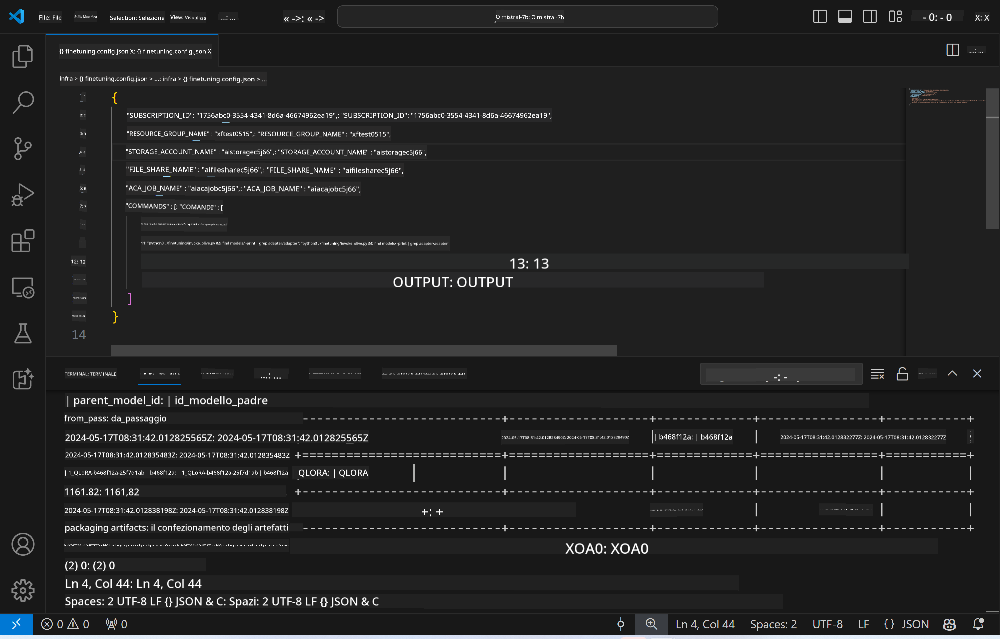
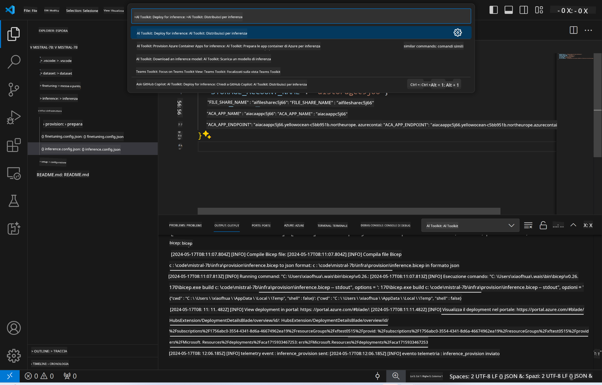
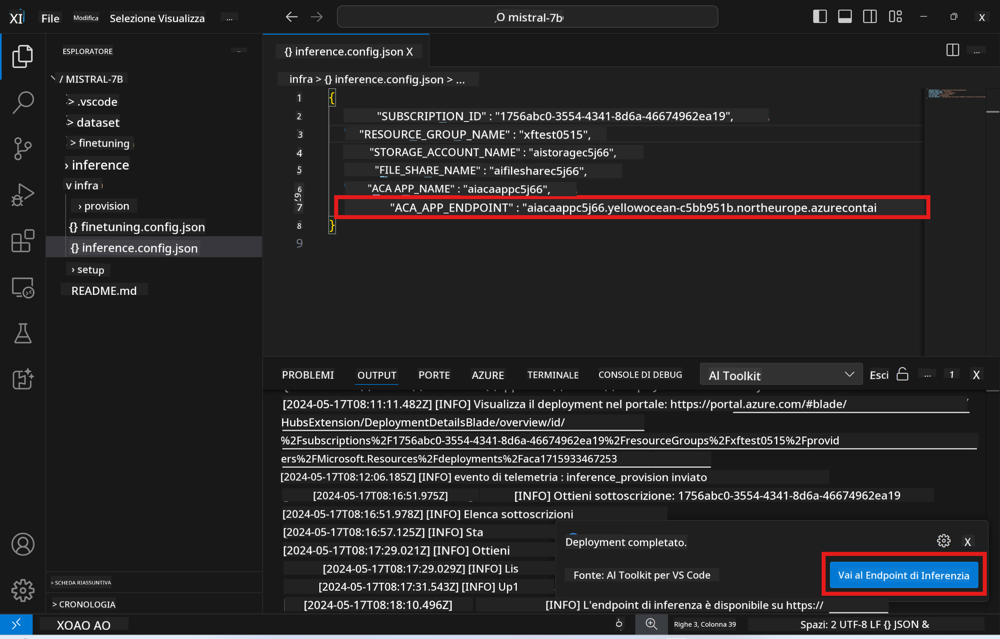

<!--
CO_OP_TRANSLATOR_METADATA:
{
  "original_hash": "a54cd3d65b6963e4e8ce21e143c3ab04",
  "translation_date": "2025-05-09T12:38:17+00:00",
  "source_file": "md/01.Introduction/03/Remote_Interence.md",
  "language_code": "it"
}
-->
# Inferenza remota con il modello fine-tuned

Dopo che gli adapter sono stati addestrati nell'ambiente remoto, utilizza una semplice applicazione Gradio per interagire con il modello.



### Provisionare le risorse Azure  
Devi configurare le risorse Azure per l'inferenza remota eseguendo il comando `AI Toolkit: Provision Azure Container Apps for inference` dalla command palette. Durante questa procedura ti verrà chiesto di selezionare la tua sottoscrizione Azure e il gruppo di risorse.  

   
Di default, la sottoscrizione e il gruppo di risorse per l'inferenza dovrebbero corrispondere a quelli usati per il fine-tuning. L'inferenza utilizzerà lo stesso Azure Container App Environment e accederà al modello e all'adapter del modello archiviati in Azure Files, generati durante la fase di fine-tuning.

## Uso di AI Toolkit

### Deployment per l'inferenza  
Se desideri modificare il codice di inferenza o ricaricare il modello di inferenza, esegui il comando `AI Toolkit: Deploy for inference`. Questo sincronizzerà il codice più recente con ACA e riavvierà la replica.



Al termine del deployment, il modello sarà pronto per essere valutato tramite questo endpoint.

### Accesso all'API di inferenza

Puoi accedere all'API di inferenza cliccando sul pulsante "*Go to Inference Endpoint*" mostrato nella notifica di VSCode. In alternativa, l'endpoint web API si trova sotto `ACA_APP_ENDPOINT` in `./infra/inference.config.json` e nel pannello di output.



> **Nota:** L'endpoint di inferenza potrebbe impiegare qualche minuto prima di essere completamente operativo.

## Componenti di inferenza inclusi nel template

| Cartella | Contenuti |
| -------- | --------- |
| `infra` | Contiene tutte le configurazioni necessarie per le operazioni remote. |
| `infra/provision/inference.parameters.json` | Contiene i parametri per i template bicep, usati per il provisioning delle risorse Azure per l'inferenza. |
| `infra/provision/inference.bicep` | Contiene i template per il provisioning delle risorse Azure per l'inferenza. |
| `infra/inference.config.json` | Il file di configurazione, generato dal comando `AI Toolkit: Provision Azure Container Apps for inference`. Viene usato come input per altri comandi della command palette remota. |

### Usare AI Toolkit per configurare il provisioning delle risorse Azure  
Configura [AI Toolkit](https://marketplace.visualstudio.com/items?itemName=ms-windows-ai-studio.windows-ai-studio)

Provisiona Azure Container Apps per l'inferenza modificando il file ` command.

You can find configuration parameters in `./infra/provision/inference.parameters.json` file. Here are the details:
| Parameter | Description |
| --------- |------------ |
| `defaultCommands` | This is the commands to initiate a web API. |
| `maximumInstanceCount` | This parameter sets the maximum capacity of GPU instances. |
| `location` | This is the location where Azure resources are provisioned. The default value is the same as the chosen resource group's location. |
| `storageAccountName`, `fileShareName` `acaEnvironmentName`, `acaEnvironmentStorageName`, `acaAppName`,  `acaLogAnalyticsName` | These parameters are used to name the Azure resources for provision. By default, they will be same to the fine-tuning resource name. You can input a new, unused resource name to create your own custom-named resources, or you can input the name of an already existing Azure resource if you'd prefer to use that. For details, refer to the section [Using existing Azure Resources](../../../../../md/01.Introduction/03). |

### Using Existing Azure Resources

By default, the inference provision use the same Azure Container App Environment, Storage Account, Azure File Share, and Azure Log Analytics that were used for fine-tuning. A separate Azure Container App is created solely for the inference API. 

If you have customized the Azure resources during the fine-tuning step or want to use your own existing Azure resources for inference, specify their names in the `./infra/inference.parameters.json. Poi esegui il comando `AI Toolkit: Provision Azure Container Apps for inference` dalla command palette. Questo aggiorna le risorse specificate e crea quelle mancanti.

Ad esempio, se hai già un ambiente Azure container esistente, il tuo file `./infra/finetuning.parameters.json` dovrebbe essere simile a questo:

```json
{
    "$schema": "https://schema.management.azure.com/schemas/2019-04-01/deploymentParameters.json#",
    "contentVersion": "1.0.0.0",
    "parameters": {
      ...
      "acaEnvironmentName": {
        "value": "<your-aca-env-name>"
      },
      "acaEnvironmentStorageName": {
        "value": null
      },
      ...
    }
  }
```

### Provision manuale  
Se preferisci configurare manualmente le risorse Azure, puoi usare i file bicep forniti nella cartella `./infra/provision` e il file `` folders. If you have already set up and configured all the Azure resources without using the AI Toolkit command palette, you can simply enter the resource names in the `inference.config.json`.

Per esempio:

```json
{
  "SUBSCRIPTION_ID": "<your-subscription-id>",
  "RESOURCE_GROUP_NAME": "<your-resource-group-name>",
  "STORAGE_ACCOUNT_NAME": "<your-storage-account-name>",
  "FILE_SHARE_NAME": "<your-file-share-name>",
  "ACA_APP_NAME": "<your-aca-name>",
  "ACA_APP_ENDPOINT": "<your-aca-endpoint>"
}
```

**Disclaimer**:  
Questo documento è stato tradotto utilizzando il servizio di traduzione automatica [Co-op Translator](https://github.com/Azure/co-op-translator). Pur impegnandoci per garantire accuratezza, si prega di notare che le traduzioni automatiche possono contenere errori o imprecisioni. Il documento originale nella sua lingua nativa deve essere considerato la fonte autorevole. Per informazioni critiche, si raccomanda una traduzione professionale effettuata da un umano. Non siamo responsabili per eventuali malintesi o interpretazioni errate derivanti dall’uso di questa traduzione.