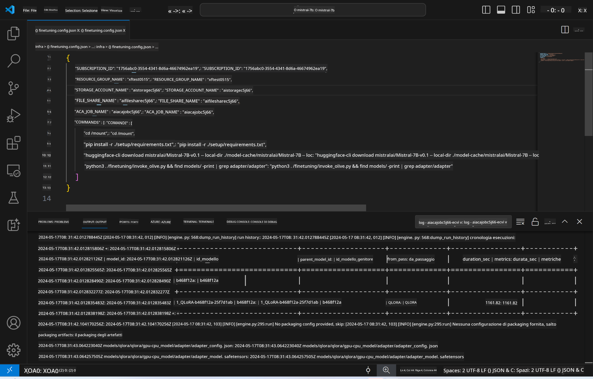
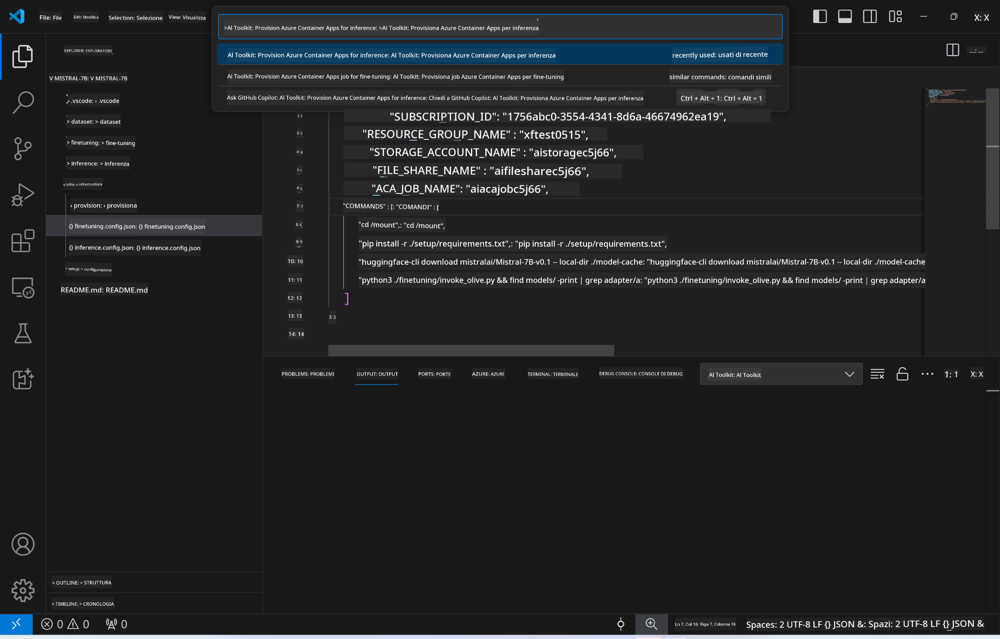
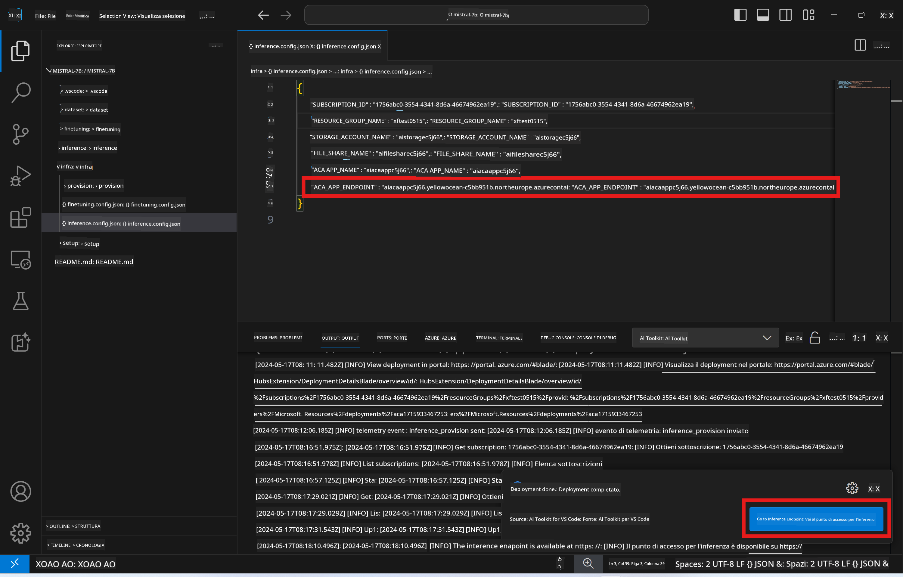

<!--
CO_OP_TRANSLATOR_METADATA:
{
  "original_hash": "a54cd3d65b6963e4e8ce21e143c3ab04",
  "translation_date": "2025-07-16T21:18:24+00:00",
  "source_file": "md/01.Introduction/03/Remote_Interence.md",
  "language_code": "it"
}
-->
# Inferenza remota con il modello fine-tuned

Dopo che gli adapter sono stati addestrati nell'ambiente remoto, utilizza una semplice applicazione Gradio per interagire con il modello.



### Provisionare le risorse Azure  
Devi configurare le risorse Azure per l'inferenza remota eseguendo il comando `AI Toolkit: Provision Azure Container Apps for inference` dalla command palette. Durante questa configurazione, ti verrà chiesto di selezionare la tua sottoscrizione Azure e il gruppo di risorse.  

   
Di default, la sottoscrizione e il gruppo di risorse per l'inferenza dovrebbero corrispondere a quelli usati per il fine-tuning. L'inferenza utilizzerà lo stesso Azure Container App Environment e accederà al modello e all'adapter del modello memorizzati in Azure Files, generati durante la fase di fine-tuning.

## Uso di AI Toolkit

### Deployment per l'inferenza  
Se desideri modificare il codice di inferenza o ricaricare il modello di inferenza, esegui il comando `AI Toolkit: Deploy for inference`. Questo sincronizzerà il tuo codice più recente con ACA e riavvierà la replica.


Al termine con successo del deployment, il modello sarà pronto per la valutazione tramite questo endpoint.

### Accesso all'API di inferenza

Puoi accedere all'API di inferenza cliccando sul pulsante "*Go to Inference Endpoint*" mostrato nella notifica di VSCode. In alternativa, l'endpoint web API si trova sotto `ACA_APP_ENDPOINT` in `./infra/inference.config.json` e nel pannello output.



> **Note:** L'endpoint di inferenza potrebbe impiegare qualche minuto prima di essere completamente operativo.

## Componenti di inferenza inclusi nel template

| Cartella | Contenuti |
| -------- | --------- |
| `infra` | Contiene tutte le configurazioni necessarie per le operazioni remote. |
| `infra/provision/inference.parameters.json` | Contiene i parametri per i template bicep, usati per il provisioning delle risorse Azure per l'inferenza. |
| `infra/provision/inference.bicep` | Contiene i template per il provisioning delle risorse Azure per l'inferenza. |
| `infra/inference.config.json` | Il file di configurazione, generato dal comando `AI Toolkit: Provision Azure Container Apps for inference`. Viene usato come input per altri comandi remoti nella command palette. |

### Uso di AI Toolkit per configurare il provisioning delle risorse Azure  
Configura [AI Toolkit](https://marketplace.visualstudio.com/items?itemName=ms-windows-ai-studio.windows-ai-studio)

Esegui il comando `Provision Azure Container Apps for inference`.

Puoi trovare i parametri di configurazione nel file `./infra/provision/inference.parameters.json`. Ecco i dettagli:  
| Parametro | Descrizione |
| --------- | ----------- |
| `defaultCommands` | Comandi per avviare una web API. |
| `maximumInstanceCount` | Imposta la capacità massima di istanze GPU. |
| `location` | Località in cui vengono provisionate le risorse Azure. Il valore di default è lo stesso della località del gruppo di risorse scelto. |
| `storageAccountName`, `fileShareName`, `acaEnvironmentName`, `acaEnvironmentStorageName`, `acaAppName`, `acaLogAnalyticsName` | Questi parametri servono per nominare le risorse Azure da provisionare. Di default, corrisponderanno ai nomi delle risorse usate per il fine-tuning. Puoi inserire un nuovo nome non utilizzato per creare risorse personalizzate, oppure il nome di una risorsa Azure già esistente se preferisci usarla. Per maggiori dettagli, consulta la sezione [Using existing Azure Resources](../../../../../md/01.Introduction/03). |

### Uso di risorse Azure esistenti

Di default, il provisioning per l'inferenza utilizza lo stesso Azure Container App Environment, Storage Account, Azure File Share e Azure Log Analytics usati per il fine-tuning. Viene creato un Azure Container App separato esclusivamente per l'API di inferenza.

Se hai personalizzato le risorse Azure durante il fine-tuning o vuoi usare risorse Azure esistenti per l'inferenza, specifica i loro nomi nel file `./infra/inference.parameters.json`. Poi esegui il comando `AI Toolkit: Provision Azure Container Apps for inference` dalla command palette. Questo aggiornerà le risorse specificate e ne creerà eventuali mancanti.

Ad esempio, se hai un ambiente container Azure esistente, il tuo file `./infra/finetuning.parameters.json` dovrebbe essere simile a questo:

```json
{
    "$schema": "https://schema.management.azure.com/schemas/2019-04-01/deploymentParameters.json#",
    "contentVersion": "1.0.0.0",
    "parameters": {
      ...
      "acaEnvironmentName": {
        "value": "<your-aca-env-name>"
      },
      "acaEnvironmentStorageName": {
        "value": null
      },
      ...
    }
  }
```

### Provision manuale  
Se preferisci configurare manualmente le risorse Azure, puoi usare i file bicep forniti nelle cartelle `./infra/provision`. Se hai già configurato tutte le risorse Azure senza usare la command palette di AI Toolkit, puoi semplicemente inserire i nomi delle risorse nel file `inference.config.json`.

Ad esempio:

```json
{
  "SUBSCRIPTION_ID": "<your-subscription-id>",
  "RESOURCE_GROUP_NAME": "<your-resource-group-name>",
  "STORAGE_ACCOUNT_NAME": "<your-storage-account-name>",
  "FILE_SHARE_NAME": "<your-file-share-name>",
  "ACA_APP_NAME": "<your-aca-name>",
  "ACA_APP_ENDPOINT": "<your-aca-endpoint>"
}
```

**Disclaimer**:  
Questo documento è stato tradotto utilizzando il servizio di traduzione automatica [Co-op Translator](https://github.com/Azure/co-op-translator). Pur impegnandoci per garantire accuratezza, si prega di notare che le traduzioni automatiche possono contenere errori o imprecisioni. Il documento originale nella sua lingua nativa deve essere considerato la fonte autorevole. Per informazioni critiche, si raccomanda una traduzione professionale effettuata da un umano. Non ci assumiamo alcuna responsabilità per eventuali malintesi o interpretazioni errate derivanti dall’uso di questa traduzione.