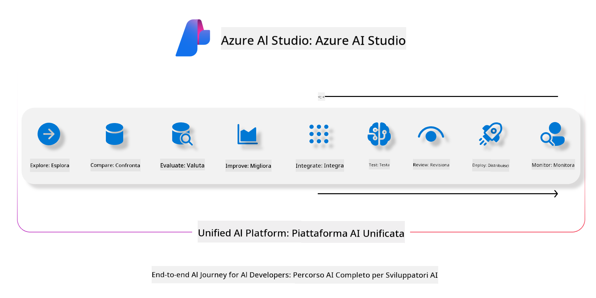
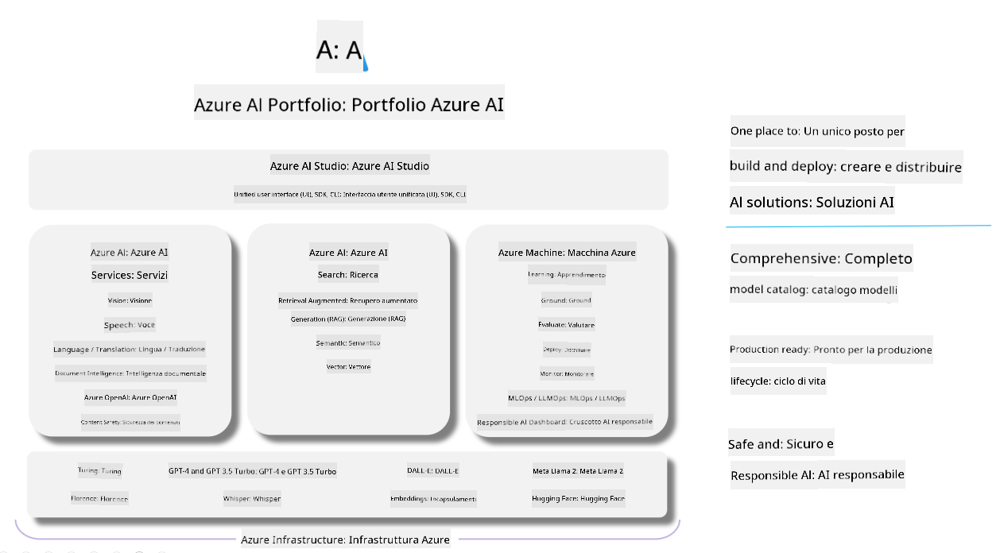

<!--
CO_OP_TRANSLATOR_METADATA:
{
  "original_hash": "7b4235159486df4000e16b7b46ddfec3",
  "translation_date": "2025-05-09T14:56:23+00:00",
  "source_file": "md/01.Introduction/05/AIFoundry.md",
  "language_code": "it"
}
-->
# **Utilizzo di Azure AI Foundry per la valutazione**

Come valutare la tua applicazione di intelligenza artificiale generativa usando [Azure AI Foundry](https://ai.azure.com?WT.mc_id=aiml-138114-kinfeylo). Che tu stia analizzando conversazioni a turno singolo o multi-turno, Azure AI Foundry offre strumenti per valutare le prestazioni e la sicurezza del modello.

## Come valutare le app di intelligenza artificiale generativa con Azure AI Foundry
Per istruzioni più dettagliate consulta la [documentazione di Azure AI Foundry](https://learn.microsoft.com/azure/ai-studio/how-to/evaluate-generative-ai-app?WT.mc_id=aiml-138114-kinfeylo)

Ecco i passaggi per iniziare:

## Valutazione dei modelli di intelligenza artificiale generativa in Azure AI Foundry

**Prerequisiti**

- Un dataset di test in formato CSV o JSON.
- Un modello di intelligenza artificiale generativa distribuito (come Phi-3, GPT 3.5, GPT 4 o modelli Davinci).
- Un runtime con un'istanza di calcolo per eseguire la valutazione.

## Metriche di valutazione integrate

Azure AI Foundry consente di valutare sia conversazioni a turno singolo che conversazioni complesse multi-turno.
Per scenari di Retrieval Augmented Generation (RAG), in cui il modello si basa su dati specifici, è possibile valutare le prestazioni utilizzando le metriche di valutazione integrate.
Inoltre, puoi valutare scenari generali di domande a turno singolo (non RAG).

## Creazione di una sessione di valutazione

Dall'interfaccia di Azure AI Foundry, vai alla pagina Evaluate o alla pagina Prompt Flow.
Segui la procedura guidata per creare una sessione di valutazione. Puoi assegnare un nome opzionale alla tua valutazione.
Seleziona lo scenario che corrisponde agli obiettivi della tua applicazione.
Scegli una o più metriche di valutazione per analizzare l'output del modello.

## Flusso di valutazione personalizzato (opzionale)

Per una maggiore flessibilità, puoi creare un flusso di valutazione personalizzato. Personalizza il processo di valutazione in base alle tue esigenze specifiche.

## Visualizzazione dei risultati

Dopo aver eseguito la valutazione, registra, visualizza e analizza le metriche dettagliate in Azure AI Foundry. Ottieni informazioni sulle capacità e i limiti della tua applicazione.

**Nota** Azure AI Foundry è attualmente in anteprima pubblica, quindi utilizzalo per scopi di sperimentazione e sviluppo. Per carichi di lavoro in produzione, considera altre opzioni. Consulta la documentazione ufficiale [AI Foundry](https://learn.microsoft.com/azure/ai-studio/?WT.mc_id=aiml-138114-kinfeylo) per ulteriori dettagli e istruzioni passo passo.

**Disclaimer**:  
Questo documento è stato tradotto utilizzando il servizio di traduzione automatica AI [Co-op Translator](https://github.com/Azure/co-op-translator). Pur impegnandoci per garantire l’accuratezza, si prega di considerare che le traduzioni automatiche possono contenere errori o inesattezze. Il documento originale nella sua lingua nativa deve essere considerato la fonte autorevole. Per informazioni critiche, si raccomanda la traduzione professionale effettuata da un esperto umano. Non ci assumiamo alcuna responsabilità per malintesi o interpretazioni errate derivanti dall’uso di questa traduzione.