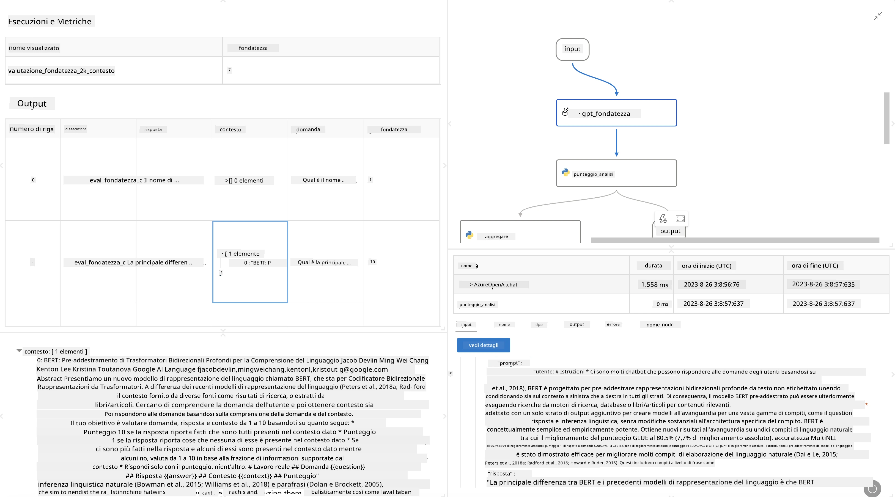

# **Introduzione a Promptflow**

[Microsoft Prompt Flow](https://microsoft.github.io/promptflow/index.html?WT.mc_id=aiml-138114-kinfeylo) è uno strumento di automazione dei flussi di lavoro visivo che consente agli utenti di creare flussi di lavoro automatizzati utilizzando modelli predefiniti e connettori personalizzati. È progettato per permettere a sviluppatori e analisti aziendali di costruire rapidamente processi automatizzati per attività come la gestione dei dati, la collaborazione e l’ottimizzazione dei processi. Con Prompt Flow, gli utenti possono facilmente collegare diversi servizi, applicazioni e sistemi, automatizzando processi aziendali complessi.

Microsoft Prompt Flow è pensato per semplificare l’intero ciclo di sviluppo delle applicazioni AI basate su Large Language Models (LLM). Che tu stia ideando, prototipando, testando, valutando o distribuendo applicazioni basate su LLM, Prompt Flow rende il processo più semplice e ti permette di creare app LLM con qualità da produzione.

## Ecco le principali caratteristiche e vantaggi di Microsoft Prompt Flow:

**Esperienza di creazione interattiva**

Prompt Flow offre una rappresentazione visiva della struttura del tuo flusso, rendendo facile comprendere e navigare nei tuoi progetti.  
Fornisce un’esperienza di codifica simile a un notebook per uno sviluppo e debug efficienti del flusso.

**Varianti di prompt e ottimizzazione**

Crea e confronta più varianti di prompt per facilitare un processo iterativo di perfezionamento. Valuta le prestazioni di diversi prompt e scegli quelli più efficaci.

**Flussi di valutazione integrati**  
Valuta la qualità e l’efficacia dei tuoi prompt e flussi utilizzando strumenti di valutazione integrati.  
Comprendi quanto bene stanno performando le tue applicazioni basate su LLM.

**Risorse complete**

Prompt Flow include una libreria di strumenti, esempi e modelli integrati. Queste risorse fungono da punto di partenza per lo sviluppo, ispirano la creatività e accelerano il processo.

**Collaborazione e preparazione aziendale**

Supporta la collaborazione di team permettendo a più utenti di lavorare insieme su progetti di prompt engineering.  
Mantieni il controllo delle versioni e condividi efficacemente le conoscenze. Snellisci l’intero processo di prompt engineering, dallo sviluppo e valutazione fino alla distribuzione e al monitoraggio.

## Valutazione in Prompt Flow

In Microsoft Prompt Flow, la valutazione gioca un ruolo cruciale nel misurare le prestazioni dei tuoi modelli AI. Vediamo come personalizzare i flussi di valutazione e le metriche all’interno di Prompt Flow:

**Comprendere la valutazione in Prompt Flow**

In Prompt Flow, un flusso rappresenta una sequenza di nodi che elaborano input e generano output. I flussi di valutazione sono tipi speciali di flussi progettati per misurare le prestazioni di una esecuzione basandosi su criteri e obiettivi specifici.

**Caratteristiche principali dei flussi di valutazione**

Di solito vengono eseguiti dopo il flusso testato, utilizzandone gli output. Calcolano punteggi o metriche per misurare le prestazioni del flusso testato. Le metriche possono includere accuratezza, punteggi di rilevanza o altre misure pertinenti.

### Personalizzare i flussi di valutazione

**Definizione degli input**

I flussi di valutazione devono ricevere in input gli output dell’esecuzione testata. Definisci gli input come nei flussi standard.  
Ad esempio, se stai valutando un flusso QnA, chiama un input "answer". Se valuti un flusso di classificazione, chiama un input "category". Potrebbero essere necessari anche input di ground truth (ad esempio etichette reali).

**Output e metriche**

I flussi di valutazione producono risultati che misurano le prestazioni del flusso testato. Le metriche possono essere calcolate usando Python o LLM. Usa la funzione log_metric() per registrare le metriche rilevanti.

**Utilizzo di flussi di valutazione personalizzati**

Sviluppa un flusso di valutazione su misura per i tuoi compiti e obiettivi specifici. Personalizza le metriche in base ai tuoi scopi di valutazione.  
Applica questo flusso di valutazione personalizzato a esecuzioni batch per test su larga scala.

## Metodi di valutazione integrati

Prompt Flow offre anche metodi di valutazione integrati.  
Puoi inviare esecuzioni batch e utilizzare questi metodi per valutare le prestazioni del tuo flusso con grandi dataset.  
Visualizza i risultati della valutazione, confronta le metriche e iterare secondo necessità.  
Ricorda, la valutazione è fondamentale per garantire che i tuoi modelli AI soddisfino i criteri e gli obiettivi desiderati. Consulta la documentazione ufficiale per istruzioni dettagliate sullo sviluppo e l’uso dei flussi di valutazione in Microsoft Prompt Flow.

In sintesi, Microsoft Prompt Flow consente agli sviluppatori di creare applicazioni LLM di alta qualità semplificando il prompt engineering e offrendo un ambiente di sviluppo robusto. Se lavori con LLM, Prompt Flow è uno strumento prezioso da esplorare. Consulta i [Prompt Flow Evaluation Documents](https://learn.microsoft.com/azure/machine-learning/prompt-flow/how-to-develop-an-evaluation-flow?view=azureml-api-2?WT.mc_id=aiml-138114-kinfeylo) per istruzioni dettagliate sullo sviluppo e l’uso dei flussi di valutazione in Microsoft Prompt Flow.

**Disclaimer**:  
Questo documento è stato tradotto utilizzando il servizio di traduzione automatica [Co-op Translator](https://github.com/Azure/co-op-translator). Pur impegnandoci per garantire accuratezza, si prega di notare che le traduzioni automatiche possono contenere errori o imprecisioni. Il documento originale nella sua lingua nativa deve essere considerato la fonte autorevole. Per informazioni critiche, si raccomanda una traduzione professionale effettuata da un umano. Non ci assumiamo alcuna responsabilità per eventuali malintesi o interpretazioni errate derivanti dall’uso di questa traduzione.