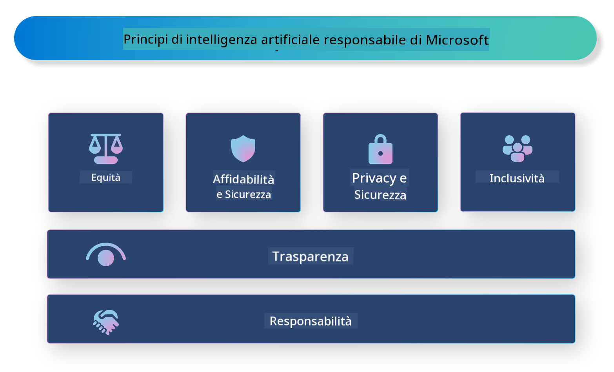

<!--
CO_OP_TRANSLATOR_METADATA:
{
  "original_hash": "805b96b20152936d8f4c587d90d6e06e",
  "translation_date": "2025-07-16T22:52:18+00:00",
  "source_file": "md/01.Introduction/05/ResponsibleAI.md",
  "language_code": "it"
}
-->
# **Introduzione a Responsible AI**

[Microsoft Responsible AI](https://www.microsoft.com/ai/responsible-ai?WT.mc_id=aiml-138114-kinfeylo) è un’iniziativa che mira ad aiutare sviluppatori e organizzazioni a creare sistemi di intelligenza artificiale trasparenti, affidabili e responsabili. L’iniziativa offre linee guida e risorse per sviluppare soluzioni di AI responsabile che rispettino principi etici come la privacy, l’equità e la trasparenza. Esploreremo anche alcune delle sfide e delle migliori pratiche associate alla costruzione di sistemi di AI responsabile.

## Panoramica di Microsoft Responsible AI

**Principi etici**

Microsoft Responsible AI si basa su un insieme di principi etici, come privacy, equità, trasparenza, responsabilità e sicurezza. Questi principi sono pensati per garantire che i sistemi di AI vengano sviluppati in modo etico e responsabile.

**AI trasparente**

Microsoft Responsible AI sottolinea l’importanza della trasparenza nei sistemi di AI. Ciò include fornire spiegazioni chiare su come funzionano i modelli di AI, oltre a garantire che le fonti dei dati e gli algoritmi siano accessibili pubblicamente.

**AI responsabile**

[Microsoft Responsible AI](https://www.microsoft.com/ai/responsible-ai?WT.mc_id=aiml-138114-kinfeylo) promuove lo sviluppo di sistemi di AI responsabili, in grado di fornire informazioni su come i modelli di AI prendono decisioni. Questo aiuta gli utenti a comprendere e fidarsi dei risultati prodotti dai sistemi di AI.

**Inclusività**

I sistemi di AI dovrebbero essere progettati per beneficiare tutti. Microsoft punta a creare un’AI inclusiva che consideri prospettive diverse ed eviti pregiudizi o discriminazioni.

**Affidabilità e sicurezza**

Garantire che i sistemi di AI siano affidabili e sicuri è fondamentale. Microsoft si concentra sulla costruzione di modelli robusti che offrano prestazioni costanti e prevengano risultati dannosi.

**Equità nell’AI**

Microsoft Responsible AI riconosce che i sistemi di AI possono perpetuare pregiudizi se addestrati su dati o algoritmi parziali. L’iniziativa fornisce indicazioni per sviluppare sistemi di AI equi che non discriminino in base a fattori come razza, genere o età.

**Privacy e sicurezza**

Microsoft Responsible AI sottolinea l’importanza di proteggere la privacy degli utenti e la sicurezza dei dati nei sistemi di AI. Ciò include l’implementazione di una forte crittografia dei dati e controlli di accesso, oltre a effettuare regolari audit per individuare vulnerabilità.

**Responsabilità e rendicontabilità**

Microsoft Responsible AI promuove la responsabilità nello sviluppo e nell’implementazione dell’AI. Ciò significa assicurarsi che sviluppatori e organizzazioni siano consapevoli dei rischi potenziali associati ai sistemi di AI e adottino misure per mitigarli.

## Migliori pratiche per costruire sistemi di AI responsabile

**Sviluppare modelli di AI utilizzando set di dati diversificati**

Per evitare pregiudizi nei sistemi di AI, è importante utilizzare set di dati diversificati che rappresentino una varietà di prospettive ed esperienze.

**Utilizzare tecniche di AI spiegabile**

Le tecniche di AI spiegabile aiutano gli utenti a comprendere come i modelli di AI prendono decisioni, aumentando così la fiducia nel sistema.

**Effettuare regolarmente audit dei sistemi di AI per individuare vulnerabilità**

Audit regolari dei sistemi di AI possono aiutare a identificare rischi e vulnerabilità che devono essere affrontati.

**Implementare una forte crittografia dei dati e controlli di accesso**

La crittografia dei dati e i controlli di accesso contribuiscono a proteggere la privacy e la sicurezza degli utenti nei sistemi di AI.

**Seguire i principi etici nello sviluppo dell’AI**

Seguire principi etici come equità, trasparenza e responsabilità aiuta a costruire fiducia nei sistemi di AI e a garantire che vengano sviluppati in modo responsabile.

## Utilizzo di AI Foundry per Responsible AI

[Azure AI Foundry](https://ai.azure.com?WT.mc_id=aiml-138114-kinfeylo) è una piattaforma potente che consente a sviluppatori e organizzazioni di creare rapidamente applicazioni intelligenti, all’avanguardia, pronte per il mercato e responsabili. Ecco alcune caratteristiche e funzionalità chiave di Azure AI Foundry:

**API e modelli pronti all’uso**

Azure AI Foundry offre API e modelli predefiniti e personalizzabili. Coprono un’ampia gamma di compiti di AI, tra cui AI generativa, elaborazione del linguaggio naturale per conversazioni, ricerca, monitoraggio, traduzione, riconoscimento vocale, visione e supporto alle decisioni.

**Prompt Flow**

Prompt flow in Azure AI Foundry permette di creare esperienze di AI conversazionale. Consente di progettare e gestire flussi conversazionali, facilitando la costruzione di chatbot, assistenti virtuali e altre applicazioni interattive.

**Retrieval Augmented Generation (RAG)**

RAG è una tecnica che combina approcci basati sul recupero di informazioni e sulla generazione creativa. Migliora la qualità delle risposte generate sfruttando sia conoscenze preesistenti (recupero) sia la generazione creativa (generazione).

**Metriche di valutazione e monitoraggio per AI generativa**

Azure AI Foundry fornisce strumenti per valutare e monitorare i modelli di AI generativa. È possibile analizzare le loro prestazioni, equità e altre metriche importanti per garantire un’implementazione responsabile. Inoltre, se hai creato una dashboard, puoi utilizzare l’interfaccia no-code in Azure Machine Learning Studio per personalizzare e generare una Responsible AI Dashboard e la relativa scorecard basata sulle librerie Python del [Responsible AI Toolbox](https://responsibleaitoolbox.ai/?WT.mc_id=aiml-138114-kinfeylo). Questa scorecard aiuta a condividere con stakeholder tecnici e non tecnici informazioni chiave relative a equità, importanza delle caratteristiche e altre considerazioni per un’implementazione responsabile.

Per utilizzare AI Foundry con un approccio responsabile, puoi seguire queste migliori pratiche:

**Definire il problema e gli obiettivi del sistema di AI**

Prima di iniziare lo sviluppo, è importante definire chiaramente il problema o l’obiettivo che il sistema di AI intende risolvere. Questo aiuta a identificare i dati, gli algoritmi e le risorse necessari per costruire un modello efficace.

**Raccogliere e preprocessare dati rilevanti**

La qualità e la quantità dei dati utilizzati per addestrare un sistema di AI influenzano significativamente le sue prestazioni. È quindi fondamentale raccogliere dati pertinenti, pulirli, preprocessarli e assicurarsi che rappresentino la popolazione o il problema da affrontare.

**Scegliere la valutazione appropriata**

Esistono diversi algoritmi di valutazione disponibili. È importante selezionare quello più adatto in base ai dati e al problema specifico.

**Valutare e interpretare il modello**

Dopo aver costruito un modello di AI, è essenziale valutarne le prestazioni con metriche appropriate e interpretare i risultati in modo trasparente. Questo aiuta a individuare eventuali pregiudizi o limiti del modello e a migliorarlo quando necessario.

**Garantire trasparenza e spiegabilità**

I sistemi di AI devono essere trasparenti e spiegabili, in modo che gli utenti possano capire come funzionano e come vengono prese le decisioni. Questo è particolarmente importante per applicazioni che hanno un impatto significativo sulla vita delle persone, come sanità, finanza e sistemi legali.

**Monitorare e aggiornare il modello**

I sistemi di AI devono essere monitorati e aggiornati continuamente per mantenere accuratezza ed efficacia nel tempo. Ciò richiede manutenzione, test e riaddestramento costanti del modello.

In conclusione, Microsoft Responsible AI è un’iniziativa che aiuta sviluppatori e organizzazioni a costruire sistemi di AI trasparenti, affidabili e responsabili. Ricorda che l’implementazione responsabile dell’AI è fondamentale, e Azure AI Foundry mira a renderla pratica per le organizzazioni. Seguendo principi etici e migliori pratiche, possiamo garantire che i sistemi di AI vengano sviluppati e utilizzati in modo responsabile, a beneficio della società nel suo complesso.

**Disclaimer**:  
Questo documento è stato tradotto utilizzando il servizio di traduzione automatica [Co-op Translator](https://github.com/Azure/co-op-translator). Pur impegnandoci per garantire l’accuratezza, si prega di notare che le traduzioni automatiche possono contenere errori o imprecisioni. Il documento originale nella sua lingua nativa deve essere considerato la fonte autorevole. Per informazioni critiche, si raccomanda una traduzione professionale effettuata da un umano. Non ci assumiamo alcuna responsabilità per eventuali malintesi o interpretazioni errate derivanti dall’uso di questa traduzione.