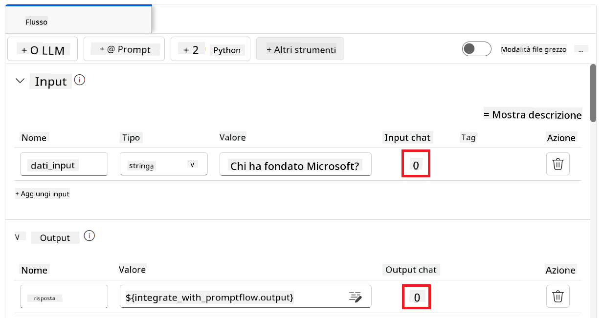

<!--
CO_OP_TRANSLATOR_METADATA:
{
  "original_hash": "80a853c08e4ee25ef9b4bfcedd8990da",
  "translation_date": "2025-05-09T16:23:19+00:00",
  "source_file": "md/02.Application/01.TextAndChat/Phi3/E2E_Phi-3-Evaluation_AIFoundry.md",
  "language_code": "it"
}
-->
# Valutare il modello Phi-3 / Phi-3.5 fine-tuned in Azure AI Foundry con un focus sui principi di Responsible AI di Microsoft

Questo esempio end-to-end (E2E) si basa sulla guida "[Evaluate Fine-tuned Phi-3 / 3.5 Models in Azure AI Foundry Focusing on Microsoft's Responsible AI](https://techcommunity.microsoft.com/blog/educatordeveloperblog/evaluate-fine-tuned-phi-3--3-5-models-in-azure-ai-studio-focusing-on-microsofts-/4227850?WT.mc_id=aiml-137032-kinfeylo)" della Microsoft Tech Community.

## Panoramica

### Come valutare la sicurezza e le prestazioni di un modello Phi-3 / Phi-3.5 fine-tuned in Azure AI Foundry?

Il fine-tuning di un modello può a volte portare a risposte indesiderate o non intenzionali. Per garantire che il modello rimanga sicuro ed efficace, è importante valutarne il potenziale di generare contenuti dannosi e la capacità di fornire risposte accurate, pertinenti e coerenti. In questo tutorial imparerai come valutare la sicurezza e le prestazioni di un modello Phi-3 / Phi-3.5 fine-tuned integrato con Prompt flow in Azure AI Foundry.

Ecco il processo di valutazione di Azure AI Foundry.


*Fonte immagine: [Evaluation of generative AI applications](https://learn.microsoft.com/azure/ai-studio/concepts/evaluation-approach-gen-ai?wt.mc_id%3Dstudentamb_279723)*

> [!NOTE]
>
> Per informazioni più dettagliate ed esplorare ulteriori risorse su Phi-3 / Phi-3.5, visita il [Phi-3CookBook](https://github.com/microsoft/Phi-3CookBook?wt.mc_id=studentamb_279723).

### Prerequisiti

- [Python](https://www.python.org/downloads)
- [Sottoscrizione Azure](https://azure.microsoft.com/free?wt.mc_id=studentamb_279723)
- [Visual Studio Code](https://code.visualstudio.com)
- Modello Phi-3 / Phi-3.5 fine-tuned

### Indice

1. [**Scenario 1: Introduzione alla valutazione con Prompt flow di Azure AI Foundry**](../../../../../../md/02.Application/01.TextAndChat/Phi3)

    - [Introduzione alla valutazione della sicurezza](../../../../../../md/02.Application/01.TextAndChat/Phi3)
    - [Introduzione alla valutazione delle prestazioni](../../../../../../md/02.Application/01.TextAndChat/Phi3)

1. [**Scenario 2: Valutazione del modello Phi-3 / Phi-3.5 in Azure AI Foundry**](../../../../../../md/02.Application/01.TextAndChat/Phi3)

    - [Prima di iniziare](../../../../../../md/02.Application/01.TextAndChat/Phi3)
    - [Distribuire Azure OpenAI per valutare il modello Phi-3 / Phi-3.5](../../../../../../md/02.Application/01.TextAndChat/Phi3)
    - [Valutare il modello Phi-3 / Phi-3.5 fine-tuned con la valutazione Prompt flow di Azure AI Foundry](../../../../../../md/02.Application/01.TextAndChat/Phi3)

1. [Congratulazioni!](../../../../../../md/02.Application/01.TextAndChat/Phi3)

## **Scenario 1: Introduzione alla valutazione con Prompt flow di Azure AI Foundry**

### Introduzione alla valutazione della sicurezza

Per garantire che il tuo modello AI sia etico e sicuro, è fondamentale valutarlo in base ai principi di Responsible AI di Microsoft. In Azure AI Foundry, le valutazioni di sicurezza ti permettono di analizzare la vulnerabilità del modello ad attacchi di jailbreak e la sua potenzialità di generare contenuti dannosi, in linea con questi principi.


*Fonte immagine: [Evaluation of generative AI applications](https://learn.microsoft.com/azure/ai-studio/concepts/evaluation-approach-gen-ai?wt.mc_id%3Dstudentamb_279723)*

#### I principi di Responsible AI di Microsoft

Prima di iniziare con i passaggi tecnici, è essenziale comprendere i principi di Responsible AI di Microsoft, un quadro etico progettato per guidare lo sviluppo, la distribuzione e l’operatività responsabile dei sistemi AI. Questi principi guidano la progettazione, lo sviluppo e la distribuzione responsabile dei sistemi AI, assicurando che le tecnologie AI siano costruite in modo equo, trasparente e inclusivo. Sono la base per valutare la sicurezza dei modelli AI.

I principi di Responsible AI di Microsoft includono:

- **Equità e Inclusività**: I sistemi AI devono trattare tutti in modo equo ed evitare di influenzare diversamente gruppi simili di persone. Per esempio, quando i sistemi AI forniscono indicazioni su trattamenti medici, domande di prestito o assunzioni, dovrebbero dare le stesse raccomandazioni a chi ha sintomi, condizioni finanziarie o qualifiche professionali simili.

- **Affidabilità e Sicurezza**: Per costruire fiducia, è fondamentale che i sistemi AI operino in modo affidabile, sicuro e coerente. Questi sistemi devono funzionare come progettato, rispondere in sicurezza a condizioni impreviste e resistere a manipolazioni dannose. Il loro comportamento e la varietà di condizioni che possono gestire riflettono le situazioni e circostanze previste dagli sviluppatori durante la progettazione e i test.

- **Trasparenza**: Quando i sistemi AI aiutano a prendere decisioni con un grande impatto sulla vita delle persone, è fondamentale che queste comprendano come tali decisioni sono state prese. Per esempio, una banca potrebbe usare un sistema AI per decidere se una persona è affidabile creditiziamente. Un’azienda potrebbe usarlo per selezionare i candidati più qualificati da assumere.

- **Privacy e Sicurezza**: Con la crescente diffusione dell’AI, proteggere la privacy e la sicurezza delle informazioni personali e aziendali diventa sempre più importante e complesso. Con l’AI, privacy e sicurezza dei dati richiedono particolare attenzione perché l’accesso ai dati è essenziale per permettere ai sistemi AI di fare previsioni e decisioni accurate e informate sulle persone.

- **Responsabilità**: Chi progetta e distribuisce sistemi AI deve essere responsabile del loro funzionamento. Le organizzazioni dovrebbero basarsi su standard di settore per sviluppare norme di responsabilità. Queste norme assicurano che i sistemi AI non siano l’autorità finale in decisioni che influenzano la vita delle persone e che gli esseri umani mantengano un controllo significativo su sistemi AI altrimenti altamente autonomi.


*Fonte immagine: [What is Responsible AI?](https://learn.microsoft.com/azure/machine-learning/concept-responsible-ai?view=azureml-api-2&viewFallbackFrom=azureml-api-2%253fwt.mc_id%3Dstudentamb_279723)*

> [!NOTE]
> Per approfondire i principi di Responsible AI di Microsoft, visita [What is Responsible AI?](https://learn.microsoft.com/azure/machine-learning/concept-responsible-ai?view=azureml-api-2?wt.mc_id=studentamb_279723).

#### Metriche di sicurezza

In questo tutorial valuterai la sicurezza del modello Phi-3 fine-tuned usando le metriche di sicurezza di Azure AI Foundry. Queste metriche ti aiutano a valutare il potenziale del modello di generare contenuti dannosi e la sua vulnerabilità ad attacchi di jailbreak. Le metriche di sicurezza includono:

- **Contenuti legati all’autolesionismo**: Valuta se il modello tende a produrre contenuti relativi all’autolesionismo.
- **Contenuti d’odio e ingiusti**: Valuta se il modello tende a produrre contenuti d’odio o ingiusti.
- **Contenuti violenti**: Valuta se il modello tende a produrre contenuti violenti.
- **Contenuti sessuali**: Valuta se il modello tende a produrre contenuti sessuali inappropriati.

Valutare questi aspetti assicura che il modello AI non produca contenuti dannosi o offensivi, allineandolo ai valori sociali e agli standard normativi.


### Introduzione alla valutazione delle prestazioni

Per garantire che il modello AI stia funzionando come previsto, è importante valutarne le prestazioni secondo specifiche metriche. In Azure AI Foundry, le valutazioni delle prestazioni ti permettono di analizzare l’efficacia del modello nel generare risposte accurate, pertinenti e coerenti.


*Fonte immagine: [Evaluation of generative AI applications](https://learn.microsoft.com/azure/ai-studio/concepts/evaluation-approach-gen-ai?wt.mc_id%3Dstudentamb_279723)*

#### Metriche di prestazione

In questo tutorial valuterai le prestazioni del modello Phi-3 / Phi-3.5 fine-tuned usando le metriche di prestazione di Azure AI Foundry. Queste metriche ti aiutano a valutare l’efficacia del modello nel generare risposte accurate, pertinenti e coerenti. Le metriche di prestazione includono:

- **Groundedness**: Valuta quanto le risposte generate siano allineate con le informazioni provenienti dalla fonte di input.
- **Pertinenza**: Valuta la pertinenza delle risposte generate rispetto alle domande fornite.
- **Coerenza**: Valuta quanto il testo generato scorra fluidamente, sia naturale e somigli al linguaggio umano.
- **Fluidità**: Valuta la competenza linguistica del testo generato.
- **Similarità GPT**: Confronta la risposta generata con il ground truth per similarità.
- **F1 Score**: Calcola il rapporto di parole condivise tra la risposta generata e i dati di origine.

Queste metriche ti aiutano a valutare l’efficacia del modello nel produrre risposte accurate, pertinenti e coerenti.


## **Scenario 2: Valutazione del modello Phi-3 / Phi-3.5 in Azure AI Foundry**

### Prima di iniziare

Questo tutorial è un seguito ai post precedenti, "[Fine-Tune and Integrate Custom Phi-3 Models with Prompt Flow: Step-by-Step Guide](https://techcommunity.microsoft.com/t5/educator-developer-blog/fine-tune-and-integrate-custom-phi-3-models-with-prompt-flow/ba-p/4178612?wt.mc_id=studentamb_279723)" e "[Fine-Tune and Integrate Custom Phi-3 Models with Prompt Flow in Azure AI Foundry](https://techcommunity.microsoft.com/t5/educator-developer-blog/fine-tune-and-integrate-custom-phi-3-models-with-prompt-flow-in/ba-p/4191726?wt.mc_id=studentamb_279723)." In questi post abbiamo visto il processo di fine-tuning di un modello Phi-3 / Phi-3.5 in Azure AI Foundry e la sua integrazione con Prompt flow.

In questo tutorial distribuirai un modello Azure OpenAI come valutatore in Azure AI Foundry e lo utilizzerai per valutare il tuo modello Phi-3 / Phi-3.5 fine-tuned.

Prima di iniziare, assicurati di avere i seguenti prerequisiti, come descritto nei tutorial precedenti:

1. Un dataset pronto per valutare il modello Phi-3 / Phi-3.5 fine-tuned.
1. Un modello Phi-3 / Phi-3.5 fine-tuned e distribuito su Azure Machine Learning.
1. Un Prompt flow integrato con il tuo modello Phi-3 / Phi-3.5 fine-tuned in Azure AI Foundry.

> [!NOTE]
> Userai il file *test_data.jsonl*, presente nella cartella data del dataset **ULTRACHAT_200k** scaricato nei post precedenti, come dataset per valutare il modello Phi-3 / Phi-3.5 fine-tuned.

#### Integrare il modello Phi-3 / Phi-3.5 personalizzato con Prompt flow in Azure AI Foundry (approccio code first)

> [!NOTE]
> Se hai seguito l’approccio low-code descritto in "[Fine-Tune and Integrate Custom Phi-3 Models with Prompt Flow in Azure AI Foundry](https://techcommunity.microsoft.com/t5/educator-developer-blog/fine-tune-and-integrate-custom-phi-3-models-with-prompt-flow-in/ba-p/4191726?wt.mc_id=studentamb_279723)", puoi saltare questo esercizio e passare al successivo.
> Tuttavia, se hai seguito l’approccio code-first descritto in "[Fine-Tune and Integrate Custom Phi-3 Models with Prompt Flow: Step-by-Step Guide](https://techcommunity.microsoft.com/t5/educator-developer-blog/fine-tune-and-integrate-custom-phi-3-models-with-prompt-flow/ba-p/4178612?wt.mc_id=studentamb_279723)" per fine-tuning e distribuzione del tuo modello Phi-3 / Phi-3.5, il processo di collegamento del modello a Prompt flow è leggermente diverso. Imparerai questo processo in questo esercizio.

Per procedere, devi integrare il tuo modello Phi-3 / Phi-3.5 fine-tuned in Prompt flow in Azure AI Foundry.

#### Creare un Hub in Azure AI Foundry

Devi creare un Hub prima di creare un Progetto. Un Hub funziona come un Resource Group, permettendoti di organizzare e gestire più Progetti all’interno di Azure AI Foundry.

1. Accedi a [Azure AI Foundry](https://ai.azure.com/?wt.mc_id=studentamb_279723).

1. Seleziona **All hubs** dal menu laterale sinistro.

1. Seleziona **+ New hub** dal menu di navigazione.

    

1. Esegui le seguenti operazioni:

    - Inserisci il **Nome Hub**. Deve essere un valore univoco.
    - Seleziona la tua **Subscription** Azure.
    - Seleziona il **Resource group** da usare (creane uno nuovo se necessario).
    - Seleziona la **Location** che desideri utilizzare.
    - Seleziona il **Connect Azure AI Services** da usare (creane uno nuovo se necessario).
    - Seleziona **Connect Azure AI Search** su **Skip connecting**.


1. Seleziona **Next**.

#### Crea un progetto Azure AI Foundry

1. Nel Hub che hai creato, seleziona **All projects** dalla scheda a sinistra.

1. Seleziona **+ New project** dal menu di navigazione.

    

1. Inserisci il **Project name**. Deve essere un valore univoco.

    

1. Seleziona **Create a project**.

#### Aggiungi una connessione personalizzata per il modello fine-tuned Phi-3 / Phi-3.5

Per integrare il tuo modello personalizzato Phi-3 / Phi-3.5 con Prompt flow, devi salvare l'endpoint e la chiave del modello in una connessione personalizzata. Questa configurazione garantisce l'accesso al tuo modello personalizzato Phi-3 / Phi-3.5 in Prompt flow.

#### Imposta la chiave API e l'URI dell'endpoint del modello fine-tuned Phi-3 / Phi-3.5

1. Visita [Azure ML Studio](https://ml.azure.com/home?wt.mc_id=studentamb_279723).

1. Vai al workspace di Azure Machine learning che hai creato.

1. Seleziona **Endpoints** dalla scheda a sinistra.

    

1. Seleziona l'endpoint che hai creato.

    

1. Seleziona **Consume** dal menu di navigazione.

1. Copia il tuo **REST endpoint** e la **Primary key**.

    

#### Aggiungi la connessione personalizzata

1. Visita [Azure AI Foundry](https://ai.azure.com/?wt.mc_id=studentamb_279723).

1. Vai al progetto Azure AI Foundry che hai creato.

1. Nel progetto che hai creato, seleziona **Settings** dalla scheda a sinistra.

1. Seleziona **+ New connection**.

    

1. Seleziona **Custom keys** dal menu di navigazione.

    

1. Esegui le seguenti operazioni:

    - Seleziona **+ Add key value pairs**.
    - Per il nome della chiave, inserisci **endpoint** e incolla l'endpoint copiato da Azure ML Studio nel campo valore.
    - Seleziona nuovamente **+ Add key value pairs**.
    - Per il nome della chiave, inserisci **key** e incolla la chiave copiata da Azure ML Studio nel campo valore.
    - Dopo aver aggiunto le chiavi, seleziona **is secret** per evitare che la chiave venga esposta.

    

1. Seleziona **Add connection**.

#### Crea Prompt flow

Hai aggiunto una connessione personalizzata in Azure AI Foundry. Ora, creiamo un Prompt flow seguendo i passaggi seguenti. Successivamente, collegherai questo Prompt flow alla connessione personalizzata per utilizzare il modello fine-tuned all'interno del Prompt flow.

1. Vai al progetto Azure AI Foundry che hai creato.

1. Seleziona **Prompt flow** dalla scheda a sinistra.

1. Seleziona **+ Create** dal menu di navigazione.

    

1. Seleziona **Chat flow** dal menu di navigazione.

    

1. Inserisci il **Folder name** da utilizzare.

    

1. Seleziona **Create**.

#### Configura Prompt flow per chattare con il tuo modello personalizzato Phi-3 / Phi-3.5

Devi integrare il modello fine-tuned Phi-3 / Phi-3.5 in un Prompt flow. Tuttavia, il Prompt flow esistente non è progettato per questo scopo. Pertanto, devi riprogettare il Prompt flow per abilitare l'integrazione del modello personalizzato.

1. Nel Prompt flow, esegui le seguenti operazioni per ricostruire il flusso esistente:

    - Seleziona **Raw file mode**.
    - Cancella tutto il codice esistente nel file *flow.dag.yml*.
    - Aggiungi il codice seguente in *flow.dag.yml*.

        ```yml
        inputs:
          input_data:
            type: string
            default: "Who founded Microsoft?"

        outputs:
          answer:
            type: string
            reference: ${integrate_with_promptflow.output}

        nodes:
        - name: integrate_with_promptflow
          type: python
          source:
            type: code
            path: integrate_with_promptflow.py
          inputs:
            input_data: ${inputs.input_data}
        ```

    - Seleziona **Save**.

    

1. Aggiungi il codice seguente in *integrate_with_promptflow.py* per usare il modello personalizzato Phi-3 / Phi-3.5 in Prompt flow.

    ```python
    import logging
    import requests
    from promptflow import tool
    from promptflow.connections import CustomConnection

    # Logging setup
    logging.basicConfig(
        format="%(asctime)s - %(levelname)s - %(name)s - %(message)s",
        datefmt="%Y-%m-%d %H:%M:%S",
        level=logging.DEBUG
    )
    logger = logging.getLogger(__name__)

    def query_phi3_model(input_data: str, connection: CustomConnection) -> str:
        """
        Send a request to the Phi-3 / Phi-3.5 model endpoint with the given input data using Custom Connection.
        """

        # "connection" is the name of the Custom Connection, "endpoint", "key" are the keys in the Custom Connection
        endpoint_url = connection.endpoint
        api_key = connection.key

        headers = {
            "Content-Type": "application/json",
            "Authorization": f"Bearer {api_key}"
        }
    data = {
        "input_data": [input_data],
        "params": {
            "temperature": 0.7,
            "max_new_tokens": 128,
            "do_sample": True,
            "return_full_text": True
            }
        }
        try:
            response = requests.post(endpoint_url, json=data, headers=headers)
            response.raise_for_status()
            
            # Log the full JSON response
            logger.debug(f"Full JSON response: {response.json()}")

            result = response.json()["output"]
            logger.info("Successfully received response from Azure ML Endpoint.")
            return result
        except requests.exceptions.RequestException as e:
            logger.error(f"Error querying Azure ML Endpoint: {e}")
            raise

    @tool
    def my_python_tool(input_data: str, connection: CustomConnection) -> str:
        """
        Tool function to process input data and query the Phi-3 / Phi-3.5 model.
        """
        return query_phi3_model(input_data, connection)

    ```

    

> [!NOTE]
> Per informazioni più dettagliate sull'uso di Prompt flow in Azure AI Foundry, puoi consultare [Prompt flow in Azure AI Foundry](https://learn.microsoft.com/azure/ai-studio/how-to/prompt-flow).

1. Seleziona **Chat input**, **Chat output** per abilitare la chat con il tuo modello.

    

1. Ora sei pronto per chattare con il tuo modello personalizzato Phi-3 / Phi-3.5. Nel prossimo esercizio imparerai come avviare Prompt flow e usarlo per chattare con il modello fine-tuned Phi-3 / Phi-3.5.

> [!NOTE]
>
> Il flusso ricostruito dovrebbe apparire come nell'immagine sottostante:
>
> 
>

#### Avvia Prompt flow

1. Seleziona **Start compute sessions** per avviare Prompt flow.

    

1. Seleziona **Validate and parse input** per aggiornare i parametri.

    

1. Seleziona il **Value** della **connection** alla connessione personalizzata che hai creato. Per esempio, *connection*.

    

#### Chatta con il tuo modello personalizzato Phi-3 / Phi-3.5

1. Seleziona **Chat**.

    

1. Ecco un esempio dei risultati: ora puoi chattare con il tuo modello personalizzato Phi-3 / Phi-3.5. Si consiglia di porre domande basate sui dati usati per il fine-tuning.

    

### Distribuisci Azure OpenAI per valutare il modello Phi-3 / Phi-3.5

Per valutare il modello Phi-3 / Phi-3.5 in Azure AI Foundry, devi distribuire un modello Azure OpenAI. Questo modello sarà usato per valutare le prestazioni del modello Phi-3 / Phi-3.5.

#### Distribuisci Azure OpenAI

1. Accedi a [Azure AI Foundry](https://ai.azure.com/?wt.mc_id=studentamb_279723).

1. Vai al progetto Azure AI Foundry che hai creato.

    

1. Nel progetto che hai creato, seleziona **Deployments** dalla scheda a sinistra.

1. Seleziona **+ Deploy model** dal menu di navigazione.

1. Seleziona **Deploy base model**.

    

1. Seleziona il modello Azure OpenAI che vuoi usare. Per esempio, **gpt-4o**.

    

1. Seleziona **Confirm**.

### Valuta il modello fine-tuned Phi-3 / Phi-3.5 usando la valutazione Prompt flow di Azure AI Foundry

### Avvia una nuova valutazione

1. Visita [Azure AI Foundry](https://ai.azure.com/?wt.mc_id=studentamb_279723).

1. Vai al progetto Azure AI Foundry che hai creato.

    

1. Nel progetto che hai creato, seleziona **Evaluation** dalla scheda a sinistra.

1. Seleziona **+ New evaluation** dal menu di navigazione.


1. Seleziona la valutazione **Prompt flow**.

    

1. Esegui le seguenti operazioni:

    - Inserisci il nome della valutazione. Deve essere un valore univoco.
    - Seleziona **Question and answer without context** come tipo di attività, poiché il dataset **UlTRACHAT_200k** utilizzato in questo tutorial non contiene contesto.
    - Seleziona il prompt flow che desideri valutare.

    

1. Seleziona **Next**.

1. Esegui le seguenti operazioni:

    - Seleziona **Add your dataset** per caricare il dataset. Ad esempio, puoi caricare il file del dataset di test, come *test_data.json1*, incluso nel download del dataset **ULTRACHAT_200k**.
    - Seleziona la colonna **Dataset column** appropriata che corrisponde al tuo dataset. Ad esempio, se stai usando il dataset **ULTRACHAT_200k**, seleziona **${data.prompt}** come colonna del dataset.

    

1. Seleziona **Next**.

1. Esegui le seguenti operazioni per configurare le metriche di performance e qualità:

    - Seleziona le metriche di performance e qualità che desideri utilizzare.
    - Seleziona il modello Azure OpenAI creato per la valutazione. Ad esempio, seleziona **gpt-4o**.

    

1. Esegui le seguenti operazioni per configurare le metriche di rischio e sicurezza:

    - Seleziona le metriche di rischio e sicurezza che desideri utilizzare.
    - Seleziona la soglia per calcolare il tasso di difetto che desideri utilizzare. Ad esempio, seleziona **Medium**.
    - Per **question**, seleziona **Data source** su **{$data.prompt}**.
    - Per **answer**, seleziona **Data source** su **{$run.outputs.answer}**.
    - Per **ground_truth**, seleziona **Data source** su **{$data.message}**.

    

1. Seleziona **Next**.

1. Seleziona **Submit** per avviare la valutazione.

1. La valutazione richiederà un po' di tempo per completarsi. Puoi monitorare l'avanzamento nella scheda **Evaluation**.

### Rivedi i risultati della valutazione

> [!NOTE]
> I risultati mostrati qui sotto servono a illustrare il processo di valutazione. In questo tutorial abbiamo utilizzato un modello fine-tuned su un dataset relativamente piccolo, il che può portare a risultati non ottimali. I risultati effettivi possono variare significativamente in base alla dimensione, qualità e diversità del dataset utilizzato, oltre che alla configurazione specifica del modello.

Una volta completata la valutazione, puoi esaminare i risultati sia per le metriche di performance sia per quelle di sicurezza.

1. Metriche di performance e qualità:

    - valuta l’efficacia del modello nel generare risposte coerenti, fluide e pertinenti.

    

1. Metriche di rischio e sicurezza:

    - Assicura che le risposte del modello siano sicure e in linea con i Principi di Responsible AI, evitando contenuti dannosi o offensivi.

    

1. Puoi scorrere verso il basso per visualizzare i **Detailed metrics result**.

    

1. Valutando il tuo modello personalizzato Phi-3 / Phi-3.5 sia con metriche di performance sia di sicurezza, puoi confermare che il modello non è solo efficace, ma aderisce anche alle pratiche di Responsible AI, rendendolo pronto per il deployment nel mondo reale.

## Congratulazioni!

### Hai completato questo tutorial

Hai valutato con successo il modello Phi-3 fine-tuned integrato con Prompt flow in Azure AI Foundry. Questo è un passaggio importante per garantire che i tuoi modelli AI non solo abbiano buone prestazioni, ma rispettino anche i principi di Responsible AI di Microsoft, aiutandoti a costruire applicazioni AI affidabili e di fiducia.


## Pulisci le risorse di Azure

Pulisci le risorse di Azure per evitare addebiti aggiuntivi sul tuo account. Vai al portale Azure ed elimina le seguenti risorse:

- La risorsa Azure Machine learning.
- L’endpoint modello di Azure Machine learning.
- La risorsa Azure AI Foundry Project.
- La risorsa Azure AI Foundry Prompt flow.

### Passi successivi

#### Documentazione

- [Assess AI systems by using the Responsible AI dashboard](https://learn.microsoft.com/azure/machine-learning/concept-responsible-ai-dashboard?view=azureml-api-2&source=recommendations?wt.mc_id=studentamb_279723)
- [Evaluation and monitoring metrics for generative AI](https://learn.microsoft.com/azure/ai-studio/concepts/evaluation-metrics-built-in?tabs=definition?wt.mc_id=studentamb_279723)
- [Azure AI Foundry documentation](https://learn.microsoft.com/azure/ai-studio/?wt.mc_id=studentamb_279723)
- [Prompt flow documentation](https://microsoft.github.io/promptflow/?wt.mc_id=studentamb_279723)

#### Contenuti di formazione

- [Introduction to Microsoft's Responsible AI Approach](https://learn.microsoft.com/training/modules/introduction-to-microsofts-responsible-ai-approach/?source=recommendations?wt.mc_id=studentamb_279723)
- [Introduction to Azure AI Foundry](https://learn.microsoft.com/training/modules/introduction-to-azure-ai-studio/?wt.mc_id=studentamb_279723)

### Riferimenti

- [What is Responsible AI?](https://learn.microsoft.com/azure/machine-learning/concept-responsible-ai?view=azureml-api-2?wt.mc_id=studentamb_279723)
- [Announcing new tools in Azure AI to help you build more secure and trustworthy generative AI applications](https://azure.microsoft.com/blog/announcing-new-tools-in-azure-ai-to-help-you-build-more-secure-and-trustworthy-generative-ai-applications/?wt.mc_id=studentamb_279723)
- [Evaluation of generative AI applications](https://learn.microsoft.com/azure/ai-studio/concepts/evaluation-approach-gen-ai?wt.mc_id%3Dstudentamb_279723)

**Disclaimer**:  
Questo documento è stato tradotto utilizzando il servizio di traduzione AI [Co-op Translator](https://github.com/Azure/co-op-translator). Pur impegnandoci per garantire accuratezza, si prega di considerare che le traduzioni automatiche possono contenere errori o imprecisioni. Il documento originale nella sua lingua nativa deve essere considerato la fonte autorevole. Per informazioni critiche, si raccomanda la traduzione professionale effettuata da un umano. Non ci assumiamo alcuna responsabilità per eventuali fraintendimenti o interpretazioni errate derivanti dall’uso di questa traduzione.