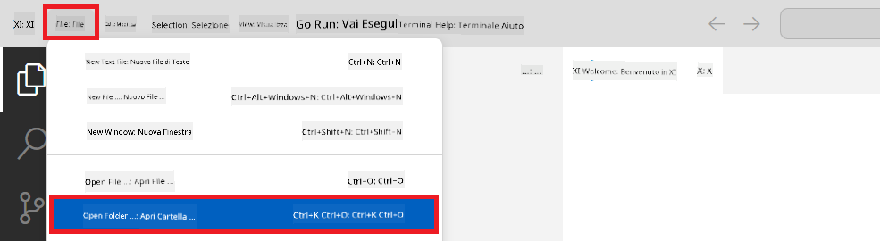
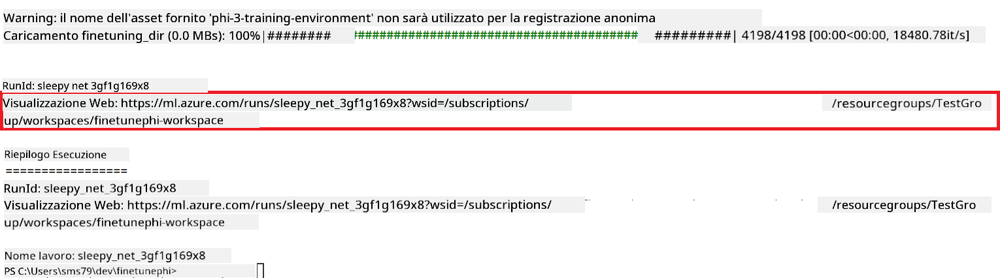

<!--
CO_OP_TRANSLATOR_METADATA:
{
  "original_hash": "7ca2c30fdb802664070e9cfbf92e24fe",
  "translation_date": "2026-01-05T14:16:54+00:00",
  "source_file": "md/02.Application/01.TextAndChat/Phi3/E2E_Phi-3-FineTuning_PromptFlow_Integration.md",
  "language_code": "it"
}
-->
# Ottimizzare e integrare modelli Phi-3 personalizzati con Prompt flow

Questo esempio end-to-end (E2E) si basa sulla guida "[Fine-Tune and Integrate Custom Phi-3 Models with Prompt Flow: Step-by-Step Guide](https://techcommunity.microsoft.com/t5/educator-developer-blog/fine-tune-and-integrate-custom-phi-3-models-with-prompt-flow/ba-p/4178612?WT.mc_id=aiml-137032-kinfeylo)" della Microsoft Tech Community. Introduce i processi di ottimizzazione, distribuzione e integrazione di modelli Phi-3 personalizzati con Prompt flow.

## Panoramica

In questo esempio E2E imparerai come ottimizzare il modello Phi-3 e integrarlo con Prompt flow. Sfruttando Azure Machine Learning e Prompt flow stabilirai un flusso di lavoro per distribuire e utilizzare modelli AI personalizzati. Questo esempio E2E è suddiviso in tre scenari:

**Scenario 1: Configurare le risorse Azure e prepararsi per l'ottimizzazione**

**Scenario 2: Ottimizzare il modello Phi-3 e distribuire in Azure Machine Learning Studio**

**Scenario 3: Integrare con Prompt flow e chattare con il tuo modello personalizzato**

Ecco una panoramica di questo esempio E2E.


### Indice

1. **[Scenario 1: Configurare le risorse Azure e prepararsi per l'ottimizzazione](../../../../../../md/02.Application/01.TextAndChat/Phi3)**
    - [Creare un workspace di Azure Machine Learning](../../../../../../md/02.Application/01.TextAndChat/Phi3)
    - [Richiedere quote GPU nell'abbonamento Azure](../../../../../../md/02.Application/01.TextAndChat/Phi3)
    - [Aggiungere assegnazione di ruolo](../../../../../../md/02.Application/01.TextAndChat/Phi3)
    - [Configurare il progetto](../../../../../../md/02.Application/01.TextAndChat/Phi3)
    - [Preparare il dataset per l'ottimizzazione](../../../../../../md/02.Application/01.TextAndChat/Phi3)

1. **[Scenario 2: Ottimizzare il modello Phi-3 e distribuire in Azure Machine Learning Studio](../../../../../../md/02.Application/01.TextAndChat/Phi3)**
    - [Configurare Azure CLI](../../../../../../md/02.Application/01.TextAndChat/Phi3)
    - [Ottimizzare il modello Phi-3](../../../../../../md/02.Application/01.TextAndChat/Phi3)
    - [Distribuire il modello ottimizzato](../../../../../../md/02.Application/01.TextAndChat/Phi3)

1. **[Scenario 3: Integrare con Prompt flow e chattare con il tuo modello personalizzato](../../../../../../md/02.Application/01.TextAndChat/Phi3)**
    - [Integrare il modello Phi-3 personalizzato con Prompt flow](../../../../../../md/02.Application/01.TextAndChat/Phi3)
    - [Chattare con il tuo modello personalizzato](../../../../../../md/02.Application/01.TextAndChat/Phi3)

## Scenario 1: Configurare le risorse Azure e prepararsi per l'ottimizzazione

### Creare un workspace di Azure Machine Learning

1. Digita *azure machine learning* nella **barra di ricerca** in alto nella pagina del portale e seleziona **Azure Machine Learning** tra le opzioni che appaiono.

    

1. Seleziona **+ Create** dal menu di navigazione.

1. Seleziona **New workspace** dal menu di navigazione.

    

1. Esegui le seguenti operazioni:

    - Seleziona il tuo **Abbonamento** Azure.
    - Seleziona il **Gruppo di risorse** da usare (creane uno nuovo se necessario).
    - Inserisci il **Nome del workspace**. Deve essere un valore univoco.
    - Seleziona la **Regione** che vuoi usare.
    - Seleziona il **Conto di archiviazione** da usare (creane uno nuovo se necessario).
    - Seleziona la **Key vault** da usare (creane uno nuovo se necessario).
    - Seleziona gli **Application insights** da usare (creane uno nuovo se necessario).
    - Seleziona il **Container registry** da usare (creane uno nuovo se necessario).

    

1. Seleziona **Review + Create**.

1. Seleziona **Create**.

### Richiedere quote GPU nell'abbonamento Azure

In questo esempio E2E userai la *GPU Standard_NC24ads_A100_v4* per l'ottimizzazione, che richiede una richiesta di quota, e la CPU *Standard_E4s_v3* per la distribuzione, che non richiede richiesta di quota.

> [!NOTE]
>
> Solo gli abbonamenti Pay-As-You-Go (tipo abbonamento standard) sono idonei per l’assegnazione di GPU; gli abbonamenti benefit non sono attualmente supportati.
>
> Per chi usa abbonamenti benefit (come Visual Studio Enterprise Subscription) o vuole testare rapidamente processo di ottimizzazione e distribuzione, questo tutorial offre anche indicazioni per ottimizzare con un dataset minimo usando una CPU. Tuttavia, è importante notare che i risultati di ottimizzazione sono molto migliori usando una GPU con dataset più grandi.

1. Visita [Azure ML Studio](https://ml.azure.com/home?wt.mc_id=studentamb_279723).

1. Esegui le seguenti operazioni per richiedere la quota *Standard NCADSA100v4 Family*:

    - Seleziona **Quota** nella tab laterale sinistra.
    - Seleziona la **famiglia di macchine virtuali** da usare. Ad esempio, seleziona **Standard NCADSA100v4 Family Cluster Dedicated vCPUs**, che include la GPU *Standard_NC24ads_A100_v4*.
    - Seleziona **Request quota** dal menu di navigazione.

        

    - Nella pagina Request quota, inserisci il **Nuovo limite di core** che vuoi usare. Ad esempio, 24.
    - Nella pagina Request quota, seleziona **Submit** per richiedere la quota GPU.

> [!NOTE]
> Puoi selezionare la GPU o CPU appropriata per le tue esigenze consultando il documento [Sizes for Virtual Machines in Azure](https://learn.microsoft.com/azure/virtual-machines/sizes/overview?tabs=breakdownseries%2Cgeneralsizelist%2Ccomputesizelist%2Cmemorysizelist%2Cstoragesizelist%2Cgpusizelist%2Cfpgasizelist%2Chpcsizelist).

### Aggiungere assegnazione di ruolo

Per ottimizzare e distribuire i modelli, devi prima creare un'identità gestita assegnata all'utente (User Assigned Managed Identity, UAI) e assegnargli le autorizzazioni appropriate. Questa UAI sarà utilizzata per l'autenticazione durante la distribuzione.

#### Creare User Assigned Managed Identity (UAI)

1. Digita *managed identities* nella **barra di ricerca** in alto nella pagina del portale e seleziona **Managed Identities** tra le opzioni che appaiono.

    

1. Seleziona **+ Create**.

    

1. Esegui le seguenti operazioni:

    - Seleziona il tuo **Abbonamento** Azure.
    - Seleziona il **Gruppo di risorse** da usare (creane uno nuovo se necessario).
    - Seleziona la **Regione** che vuoi usare.
    - Inserisci il **Nome**. Deve essere un valore univoco.

1. Seleziona **Review + create**.

1. Seleziona **+ Create**.

#### Aggiungere assegnazione ruolo Contributor a Managed Identity

1. Vai alla risorsa Managed Identity che hai creato.

1. Seleziona **Azure role assignments** nella tab laterale sinistra.

1. Seleziona **+Add role assignment** dal menu di navigazione.

1. Nella pagina Add role assignment, esegui le seguenti operazioni:
    - Seleziona l'**ambito (Scope)** a **Resource group**.
    - Seleziona il tuo **Abbonamento** Azure.
    - Seleziona il **Gruppo di risorse** da usare.
    - Seleziona il **Ruolo (Role)** a **Contributor**.

    

1. Seleziona **Save**.

#### Aggiungere assegnazione ruolo Storage Blob Data Reader a Managed Identity

1. Digita *storage accounts* nella **barra di ricerca** in alto nella pagina del portale e seleziona **Storage accounts** tra le opzioni che appaiono.

    

1. Seleziona il conto di archiviazione associato al workspace di Azure Machine Learning che hai creato. Ad esempio, *finetunephistorage*.

1. Esegui le seguenti operazioni per navigare alla pagina Add role assignment:

    - Naviga al conto di archiviazione Azure che hai creato.
    - Seleziona **Access Control (IAM)** nella tab laterale sinistra.
    - Seleziona **+ Add** dal menu di navigazione.
    - Seleziona **Add role assignment** dal menu di navigazione.

    

1. Nella pagina Add role assignment, esegui le seguenti operazioni:

    - Nella pagina Role, digita *Storage Blob Data Reader* nella **barra di ricerca** e seleziona **Storage Blob Data Reader** tra le opzioni che appaiono.
    - Nella pagina Role, seleziona **Next**.
    - Nella pagina Members, seleziona **Assign access to** **Managed identity**.
    - Nella pagina Members, seleziona **+ Select members**.
    - Nella pagina Select managed identities, seleziona il tuo **Abbonamento** Azure.
    - Nella pagina Select managed identities, seleziona la **Managed identity** a **Manage Identity**.
    - Nella pagina Select managed identities, seleziona la Manage Identity che hai creato. Ad esempio, *finetunephi-managedidentity*.
    - Nella pagina Select managed identities, seleziona **Select**.

    

1. Seleziona **Review + assign**.

#### Aggiungere assegnazione ruolo AcrPull a Managed Identity

1. Digita *container registries* nella **barra di ricerca** in alto nella pagina del portale e seleziona **Container registries** tra le opzioni che appaiono.

    

1. Seleziona il container registry associato al workspace Azure Machine Learning. Ad esempio, *finetunephicontainerregistries*

1. Esegui le seguenti operazioni per navigare alla pagina Add role assignment:

    - Seleziona **Access Control (IAM)** nella tab laterale sinistra.
    - Seleziona **+ Add** dal menu di navigazione.
    - Seleziona **Add role assignment** dal menu di navigazione.

1. Nella pagina Add role assignment, esegui le seguenti operazioni:

    - Nella pagina Role, digita *AcrPull* nella **barra di ricerca** e seleziona **AcrPull** tra le opzioni che appaiono.
    - Nella pagina Role, seleziona **Next**.
    - Nella pagina Members, seleziona **Assign access to** **Managed identity**.
    - Nella pagina Members, seleziona **+ Select members**.
    - Nella pagina Select managed identities, seleziona il tuo **Abbonamento** Azure.
    - Nella pagina Select managed identities, seleziona la **Managed identity** a **Manage Identity**.
    - Nella pagina Select managed identities, seleziona la Manage Identity che hai creato. Ad esempio, *finetunephi-managedidentity*.
    - Nella pagina Select managed identities, seleziona **Select**.
    - Seleziona **Review + assign**.

### Configurare il progetto

Ora creerai una cartella in cui lavorare e configurerai un ambiente virtuale per sviluppare un programma che interagisca con gli utenti e utilizzi la cronologia chat memorizzata da Azure Cosmos DB per informare le risposte.

#### Creare una cartella in cui lavorare

1. Apri una finestra terminale e digita il seguente comando per creare una cartella chiamata *finetune-phi* nel percorso predefinito.

    ```console
    mkdir finetune-phi
    ```

1. Digita il seguente comando nel terminale per navigare nella cartella *finetune-phi* che hai creato.

    ```console
    cd finetune-phi
    ```

#### Creare un ambiente virtuale

1. Digita il seguente comando nel terminale per creare un ambiente virtuale chiamato *.venv*.

    ```console
    python -m venv .venv
    ```

1. Digita il seguente comando nel terminale per attivare l'ambiente virtuale.

    ```console
    .venv\Scripts\activate.bat
    ```

> [!NOTE]
>
> Se ha funzionato, dovresti vedere *(.venv)* prima del prompt del comando.

#### Installare i pacchetti necessari

1. Digita i seguenti comandi nel terminale per installare i pacchetti necessari.

    ```console
    pip install datasets==2.19.1
    pip install transformers==4.41.1
    pip install azure-ai-ml==1.16.0
    pip install torch==2.3.1
    pip install trl==0.9.4
    pip install promptflow==1.12.0
    ```

#### Creare i file del progetto
In questo esercizio, creerai i file essenziali per il nostro progetto. Questi file includono script per scaricare il dataset, configurare l'ambiente Azure Machine Learning, effettuare il fine-tuning del modello Phi-3 e distribuire il modello fine-tuned. Inoltre, creerai un file *conda.yml* per configurare l'ambiente di fine-tuning.

In questo esercizio, dovrai:

- Creare un file *download_dataset.py* per scaricare il dataset.
- Creare un file *setup_ml.py* per configurare l'ambiente Azure Machine Learning.
- Creare un file *fine_tune.py* nella cartella *finetuning_dir* per effettuare il fine-tuning del modello Phi-3 utilizzando il dataset.
- Creare un file *conda.yml* per configurare l'ambiente di fine-tuning.
- Creare un file *deploy_model.py* per distribuire il modello fine-tuned.
- Creare un file *integrate_with_promptflow.py* per integrare il modello fine-tuned ed eseguire il modello usando Prompt flow.
- Creare un file flow.dag.yml per configurare la struttura del workflow per Prompt flow.
- Creare un file *config.py* per inserire le informazioni di Azure.

> [!NOTE]
>
> Struttura completa delle cartelle:
>
> ```text
> └── YourUserName
> .    └── finetune-phi
> .        ├── finetuning_dir
> .        │      └── fine_tune.py
> .        ├── conda.yml
> .        ├── config.py
> .        ├── deploy_model.py
> .        ├── download_dataset.py
> .        ├── flow.dag.yml
> .        ├── integrate_with_promptflow.py
> .        └── setup_ml.py
> ```

1. Apri **Visual Studio Code**.

1. Seleziona **File** dalla barra del menu.

1. Seleziona **Apri cartella**.

1. Seleziona la cartella *finetune-phi* che hai creato, situata in *C:\Users\yourUserName\finetune-phi*.

    

1. Nel pannello a sinistra di Visual Studio Code, clicca con il tasto destro e seleziona **Nuovo file** per creare un nuovo file chiamato *download_dataset.py*.

1. Nel pannello a sinistra di Visual Studio Code, clicca con il tasto destro e seleziona **Nuovo file** per creare un nuovo file chiamato *setup_ml.py*.

1. Nel pannello a sinistra di Visual Studio Code, clicca con il tasto destro e seleziona **Nuovo file** per creare un nuovo file chiamato *deploy_model.py*.

    

1. Nel pannello a sinistra di Visual Studio Code, clicca con il tasto destro e seleziona **Nuova cartella** per creare una nuova cartella chiamata *finetuning_dir*.

1. Nella cartella *finetuning_dir*, crea un nuovo file chiamato *fine_tune.py*.

#### Crea e configura il file *conda.yml*

1. Nel pannello a sinistra di Visual Studio Code, clicca con il tasto destro e seleziona **Nuovo file** per creare un nuovo file chiamato *conda.yml*.

1. Aggiungi il seguente codice nel file *conda.yml* per configurare l'ambiente di fine-tuning per il modello Phi-3.

    ```yml
    name: phi-3-training-env
    channels:
      - defaults
      - conda-forge
    dependencies:
      - python=3.10
      - pip
      - numpy<2.0
      - pip:
          - torch==2.4.0
          - torchvision==0.19.0
          - trl==0.8.6
          - transformers==4.41
          - datasets==2.21.0
          - azureml-core==1.57.0
          - azure-storage-blob==12.19.0
          - azure-ai-ml==1.16
          - azure-identity==1.17.1
          - accelerate==0.33.0
          - mlflow==2.15.1
          - azureml-mlflow==1.57.0
    ```

#### Crea e configura il file *config.py*

1. Nel pannello a sinistra di Visual Studio Code, clicca con il tasto destro e seleziona **Nuovo file** per creare un nuovo file chiamato *config.py*.

1. Aggiungi il seguente codice nel file *config.py* per includere le tue informazioni di Azure.

    ```python
    # Impostazioni di Azure
    AZURE_SUBSCRIPTION_ID = "your_subscription_id"
    AZURE_RESOURCE_GROUP_NAME = "your_resource_group_name" # "TestGroup"

    # Impostazioni di Azure Machine Learning
    AZURE_ML_WORKSPACE_NAME = "your_workspace_name" # "finetunephi-workspace"

    # Impostazioni di Azure Managed Identity
    AZURE_MANAGED_IDENTITY_CLIENT_ID = "your_azure_managed_identity_client_id"
    AZURE_MANAGED_IDENTITY_NAME = "your_azure_managed_identity_name" # "finetunephi-mangedidentity"
    AZURE_MANAGED_IDENTITY_RESOURCE_ID = f"/subscriptions/{AZURE_SUBSCRIPTION_ID}/resourceGroups/{AZURE_RESOURCE_GROUP_NAME}/providers/Microsoft.ManagedIdentity/userAssignedIdentities/{AZURE_MANAGED_IDENTITY_NAME}"

    # Percorsi dei file del dataset
    TRAIN_DATA_PATH = "data/train_data.jsonl"
    TEST_DATA_PATH = "data/test_data.jsonl"

    # Impostazioni del modello fine-tuned
    AZURE_MODEL_NAME = "your_fine_tuned_model_name" # "finetune-phi-model"
    AZURE_ENDPOINT_NAME = "your_fine_tuned_model_endpoint_name" # "finetune-phi-endpoint"
    AZURE_DEPLOYMENT_NAME = "your_fine_tuned_model_deployment_name" # "finetune-phi-deployment"

    AZURE_ML_API_KEY = "your_fine_tuned_model_api_key"
    AZURE_ML_ENDPOINT = "your_fine_tuned_model_endpoint_uri" # "https://{your-endpoint-name}.{your-region}.inference.ml.azure.com/score"
    ```

#### Aggiungi le variabili d'ambiente di Azure

1. Esegui le seguenti operazioni per aggiungere l'ID della sottoscrizione Azure:

    - Digita *subscriptions* nella **barra di ricerca** in cima alla pagina del portale e seleziona **Subscriptions** dalle opzioni che appaiono.
    - Seleziona la sottoscrizione Azure che stai utilizzando.
    - Copia e incolla il tuo Subscription ID nel file *config.py*.

    

1. Esegui le seguenti operazioni per aggiungere il nome dell'Azure Workspace:

    - Naviga alla risorsa Azure Machine Learning che hai creato.
    - Copia e incolla il nome del tuo account nel file *config.py*.

    

1. Esegui le seguenti operazioni per aggiungere il nome del gruppo di risorse Azure:

    - Naviga alla risorsa Azure Machine Learning che hai creato.
    - Copia e incolla il nome del tuo Azure Resource Group nel file *config.py*.

    

2. Esegui le seguenti operazioni per aggiungere il nome dell'identità gestita Azure

    - Naviga alla risorsa Managed Identities che hai creato.
    - Copia e incolla il nome della tua Azure Managed Identity nel file *config.py*.

    

### Prepara il dataset per il fine-tuning

In questo esercizio, eseguirai il file *download_dataset.py* per scaricare i dataset *ULTRACHAT_200k* nel tuo ambiente locale. Successivamente, utilizzerai questi dataset per effettuare il fine-tuning del modello Phi-3 in Azure Machine Learning.

#### Scarica il tuo dataset utilizzando *download_dataset.py*

1. Apri il file *download_dataset.py* in Visual Studio Code.

1. Inserisci il seguente codice in *download_dataset.py*.

    ```python
    import json
    import os
    from datasets import load_dataset
    from config import (
        TRAIN_DATA_PATH,
        TEST_DATA_PATH)

    def load_and_split_dataset(dataset_name, config_name, split_ratio):
        """
        Load and split a dataset.
        """
        # Carica il dataset con il nome specificato, la configurazione e il rapporto di suddivisione
        dataset = load_dataset(dataset_name, config_name, split=split_ratio)
        print(f"Original dataset size: {len(dataset)}")
        
        # Suddividi il dataset in set di addestramento e test (80% addestramento, 20% test)
        split_dataset = dataset.train_test_split(test_size=0.2)
        print(f"Train dataset size: {len(split_dataset['train'])}")
        print(f"Test dataset size: {len(split_dataset['test'])}")
        
        return split_dataset

    def save_dataset_to_jsonl(dataset, filepath):
        """
        Save a dataset to a JSONL file.
        """
        # Crea la directory se non esiste
        os.makedirs(os.path.dirname(filepath), exist_ok=True)
        
        # Apri il file in modalità scrittura
        with open(filepath, 'w', encoding='utf-8') as f:
            # Itera su ogni record nel dataset
            for record in dataset:
                # Salva il record come oggetto JSON e scrivilo nel file
                json.dump(record, f)
                # Scrivi un carattere di nuova linea per separare i record
                f.write('\n')
        
        print(f"Dataset saved to {filepath}")

    def main():
        """
        Main function to load, split, and save the dataset.
        """
        # Carica e suddividi il dataset ULTRACHAT_200k con una configurazione specifica e il rapporto di suddivisione
        dataset = load_and_split_dataset("HuggingFaceH4/ultrachat_200k", 'default', 'train_sft[:1%]')
        
        # Estrai i dataset di addestramento e test dalla suddivisione
        train_dataset = dataset['train']
        test_dataset = dataset['test']

        # Salva il dataset di addestramento in un file JSONL
        save_dataset_to_jsonl(train_dataset, TRAIN_DATA_PATH)
        
        # Salva il dataset di test in un file JSONL separato
        save_dataset_to_jsonl(test_dataset, TEST_DATA_PATH)

    if __name__ == "__main__":
        main()

    ```

> [!TIP]
>
> **Guida per il fine-tuning con un dataset minimo usando una CPU**
>
> Se vuoi usare una CPU per il fine-tuning, questo approccio è ideale per chi ha sottoscrizioni benefit (come Visual Studio Enterprise Subscription) o per testare rapidamente il processo di fine-tuning e distribuzione.
>
> Sostituisci `dataset = load_and_split_dataset("HuggingFaceH4/ultrachat_200k", 'default', 'train_sft[:1%]')` con `dataset = load_and_split_dataset("HuggingFaceH4/ultrachat_200k", 'default', 'train_sft[:10]')`
>

1. Digita il seguente comando nel terminale per eseguire lo script e scaricare il dataset nel tuo ambiente locale.

    ```console
    python download_data.py
    ```

1. Verifica che i dataset siano stati salvati correttamente nella directory locale *finetune-phi/data*.

> [!NOTE]
>
> **Dimensione del dataset e tempo di fine-tuning**
>
> In questo esempio E2E, usi solo l'1% del dataset (`train_sft[:1%]`). Questo riduce significativamente la quantità di dati, accelerando sia il caricamento sia i processi di fine-tuning, permettendoti di bilanciare il tempo di addestramento e le prestazioni del modello. Usare un sottoinsieme più piccolo del dataset riduce il tempo necessario per il fine-tuning, rendendo il processo più gestibile per un esempio E2E.

## Scenario 2: Fine-tuning del modello Phi-3 e distribuzione in Azure Machine Learning Studio

### Configura Azure CLI

Devi configurare Azure CLI per autenticare il tuo ambiente. Azure CLI ti consente di gestire le risorse Azure direttamente dalla riga di comando e fornisce le credenziali necessarie ad Azure Machine Learning per accedere a queste risorse. Per iniziare, installa [Azure CLI](https://learn.microsoft.com/cli/azure/install-azure-cli)

1. Apri una finestra terminale e digita il seguente comando per effettuare il login al tuo account Azure.

    ```console
    az login
    ```

1. Seleziona l’account Azure da usare.

1. Seleziona la sottoscrizione Azure da usare.

    

> [!TIP]
>
> Se hai problemi ad accedere ad Azure, prova a usare un codice dispositivo. Apri una finestra terminale e digita il seguente comando per effettuare il login al tuo account Azure:
>
> ```console
> az login --use-device-code
> ```
>

### Effettua il fine-tuning del modello Phi-3

In questo esercizio, effettuerai il fine-tuning del modello Phi-3 utilizzando il dataset fornito. Prima definirai il processo di fine-tuning nel file *fine_tune.py*. Poi configurerai l'ambiente Azure Machine Learning e avvierai il processo di fine-tuning eseguendo il file *setup_ml.py*. Questo script assicura che il fine-tuning avvenga nell'ambiente Azure Machine Learning.

Eseguendo *setup_ml.py*, avvierai il processo di fine-tuning nell'ambiente Azure Machine Learning.

#### Aggiungi il codice nel file *fine_tune.py*

1. Naviga nella cartella *finetuning_dir* e apri il file *fine_tune.py* in Visual Studio Code.

1. Inserisci il seguente codice in *fine_tune.py*.

    ```python
    import argparse
    import sys
    import logging
    import os
    from datasets import load_dataset
    import torch
    import mlflow
    from transformers import AutoModelForCausalLM, AutoTokenizer, TrainingArguments
    from trl import SFTTrainer

    # Per evitare l'errore INVALID_PARAMETER_VALUE in MLflow, disabilitare l'integrazione MLflow
    os.environ["DISABLE_MLFLOW_INTEGRATION"] = "True"

    # Configurazione del logging
    logging.basicConfig(
        format="%(asctime)s - %(levelname)s - %(name)s - %(message)s",
        datefmt="%Y-%m-%d %H:%M:%S",
        handlers=[logging.StreamHandler(sys.stdout)],
        level=logging.WARNING
    )
    logger = logging.getLogger(__name__)

    def initialize_model_and_tokenizer(model_name, model_kwargs):
        """
        Initialize the model and tokenizer with the given pretrained model name and arguments.
        """
        model = AutoModelForCausalLM.from_pretrained(model_name, **model_kwargs)
        tokenizer = AutoTokenizer.from_pretrained(model_name)
        tokenizer.model_max_length = 2048
        tokenizer.pad_token = tokenizer.unk_token
        tokenizer.pad_token_id = tokenizer.convert_tokens_to_ids(tokenizer.pad_token)
        tokenizer.padding_side = 'right'
        return model, tokenizer

    def apply_chat_template(example, tokenizer):
        """
        Apply a chat template to tokenize messages in the example.
        """
        messages = example["messages"]
        if messages[0]["role"] != "system":
            messages.insert(0, {"role": "system", "content": ""})
        example["text"] = tokenizer.apply_chat_template(
            messages, tokenize=False, add_generation_prompt=False
        )
        return example

    def load_and_preprocess_data(train_filepath, test_filepath, tokenizer):
        """
        Load and preprocess the dataset.
        """
        train_dataset = load_dataset('json', data_files=train_filepath, split='train')
        test_dataset = load_dataset('json', data_files=test_filepath, split='train')
        column_names = list(train_dataset.features)

        train_dataset = train_dataset.map(
            apply_chat_template,
            fn_kwargs={"tokenizer": tokenizer},
            num_proc=10,
            remove_columns=column_names,
            desc="Applying chat template to train dataset",
        )

        test_dataset = test_dataset.map(
            apply_chat_template,
            fn_kwargs={"tokenizer": tokenizer},
            num_proc=10,
            remove_columns=column_names,
            desc="Applying chat template to test dataset",
        )

        return train_dataset, test_dataset

    def train_and_evaluate_model(train_dataset, test_dataset, model, tokenizer, output_dir):
        """
        Train and evaluate the model.
        """
        training_args = TrainingArguments(
            bf16=True,
            do_eval=True,
            output_dir=output_dir,
            eval_strategy="epoch",
            learning_rate=5.0e-06,
            logging_steps=20,
            lr_scheduler_type="cosine",
            num_train_epochs=3,
            overwrite_output_dir=True,
            per_device_eval_batch_size=4,
            per_device_train_batch_size=4,
            remove_unused_columns=True,
            save_steps=500,
            seed=0,
            gradient_checkpointing=True,
            gradient_accumulation_steps=1,
            warmup_ratio=0.2,
        )

        trainer = SFTTrainer(
            model=model,
            args=training_args,
            train_dataset=train_dataset,
            eval_dataset=test_dataset,
            max_seq_length=2048,
            dataset_text_field="text",
            tokenizer=tokenizer,
            packing=True
        )

        train_result = trainer.train()
        trainer.log_metrics("train", train_result.metrics)

        mlflow.transformers.log_model(
            transformers_model={"model": trainer.model, "tokenizer": tokenizer},
            artifact_path=output_dir,
        )

        tokenizer.padding_side = 'left'
        eval_metrics = trainer.evaluate()
        eval_metrics["eval_samples"] = len(test_dataset)
        trainer.log_metrics("eval", eval_metrics)

    def main(train_file, eval_file, model_output_dir):
        """
        Main function to fine-tune the model.
        """
        model_kwargs = {
            "use_cache": False,
            "trust_remote_code": True,
            "torch_dtype": torch.bfloat16,
            "device_map": None,
            "attn_implementation": "eager"
        }

        # pretrained_model_name = "microsoft/Phi-3-mini-4k-instruct"
        pretrained_model_name = "microsoft/Phi-3.5-mini-instruct"

        with mlflow.start_run():
            model, tokenizer = initialize_model_and_tokenizer(pretrained_model_name, model_kwargs)
            train_dataset, test_dataset = load_and_preprocess_data(train_file, eval_file, tokenizer)
            train_and_evaluate_model(train_dataset, test_dataset, model, tokenizer, model_output_dir)

    if __name__ == "__main__":
        parser = argparse.ArgumentParser()
        parser.add_argument("--train-file", type=str, required=True, help="Path to the training data")
        parser.add_argument("--eval-file", type=str, required=True, help="Path to the evaluation data")
        parser.add_argument("--model_output_dir", type=str, required=True, help="Directory to save the fine-tuned model")
        args = parser.parse_args()
        main(args.train_file, args.eval_file, args.model_output_dir)

    ```

1. Salva e chiudi il file *fine_tune.py*.

> [!TIP]
> **Puoi effettuare il fine-tuning del modello Phi-3.5**
>
> Nel file *fine_tune.py*, puoi cambiare `pretrained_model_name` da `"microsoft/Phi-3-mini-4k-instruct"` a qualunque modello tu voglia fine-tunare. Per esempio, se lo cambi in `"microsoft/Phi-3.5-mini-instruct"`, userai il modello Phi-3.5-mini-instruct per il fine-tuning. Per trovare e usare il nome del modello che preferisci, visita [Hugging Face](https://huggingface.co/), cerca il modello che ti interessa e poi copia e incolla il suo nome nel campo `pretrained_model_name` nel tuo script.
>
> <image type="content" src="../../../../imgs/02/FineTuning-PromptFlow/finetunephi3.5.png" alt-text="Fine-tuning Phi-3.5.">
>

#### Aggiungi il codice nel file *setup_ml.py*

1. Apri il file *setup_ml.py* in Visual Studio Code.

1. Inserisci il seguente codice in *setup_ml.py*.

    ```python
    import logging
    from azure.ai.ml import MLClient, command, Input
    from azure.ai.ml.entities import Environment, AmlCompute
    from azure.identity import AzureCliCredential
    from config import (
        AZURE_SUBSCRIPTION_ID,
        AZURE_RESOURCE_GROUP_NAME,
        AZURE_ML_WORKSPACE_NAME,
        TRAIN_DATA_PATH,
        TEST_DATA_PATH
    )

    # Costanti

    # Decommenta le seguenti righe per usare un'istanza CPU per l'addestramento
    # COMPUTE_INSTANCE_TYPE = "Standard_E16s_v3" # cpu
    # COMPUTE_NAME = "cpu-e16s-v3"
    # DOCKER_IMAGE_NAME = "mcr.microsoft.com/azureml/openmpi4.1.0-ubuntu20.04:latest"

    # Decommenta le seguenti righe per usare un'istanza GPU per l'addestramento
    COMPUTE_INSTANCE_TYPE = "Standard_NC24ads_A100_v4"
    COMPUTE_NAME = "gpu-nc24s-a100-v4"
    DOCKER_IMAGE_NAME = "mcr.microsoft.com/azureml/curated/acft-hf-nlp-gpu:59"

    CONDA_FILE = "conda.yml"
    LOCATION = "eastus2" # Sostituisci con la posizione del tuo cluster di calcolo
    FINETUNING_DIR = "./finetuning_dir" # Percorso allo script di fine-tuning
    TRAINING_ENV_NAME = "phi-3-training-environment" # Nome dell'ambiente di addestramento
    MODEL_OUTPUT_DIR = "./model_output" # Percorso alla directory di output del modello in Azure ML

    # Configurazione del logging per monitorare il processo
    logger = logging.getLogger(__name__)
    logging.basicConfig(
        format="%(asctime)s - %(levelname)s - %(name)s - %(message)s",
        datefmt="%Y-%m-%d %H:%M:%S",
        level=logging.WARNING
    )

    def get_ml_client():
        """
        Initialize the ML Client using Azure CLI credentials.
        """
        credential = AzureCliCredential()
        return MLClient(credential, AZURE_SUBSCRIPTION_ID, AZURE_RESOURCE_GROUP_NAME, AZURE_ML_WORKSPACE_NAME)

    def create_or_get_environment(ml_client):
        """
        Create or update the training environment in Azure ML.
        """
        env = Environment(
            image=DOCKER_IMAGE_NAME,  # Immagine Docker per l'ambiente
            conda_file=CONDA_FILE,  # File ambiente Conda
            name=TRAINING_ENV_NAME,  # Nome dell'ambiente
        )
        return ml_client.environments.create_or_update(env)

    def create_or_get_compute_cluster(ml_client, compute_name, COMPUTE_INSTANCE_TYPE, location):
        """
        Create or update the compute cluster in Azure ML.
        """
        try:
            compute_cluster = ml_client.compute.get(compute_name)
            logger.info(f"Compute cluster '{compute_name}' already exists. Reusing it for the current run.")
        except Exception:
            logger.info(f"Compute cluster '{compute_name}' does not exist. Creating a new one with size {COMPUTE_INSTANCE_TYPE}.")
            compute_cluster = AmlCompute(
                name=compute_name,
                size=COMPUTE_INSTANCE_TYPE,
                location=location,
                tier="Dedicated",  # Livello del cluster di calcolo
                min_instances=0,  # Numero minimo di istanze
                max_instances=1  # Numero massimo di istanze
            )
            ml_client.compute.begin_create_or_update(compute_cluster).wait()  # Attendere la creazione del cluster
        return compute_cluster

    def create_fine_tuning_job(env, compute_name):
        """
        Set up the fine-tuning job in Azure ML.
        """
        return command(
            code=FINETUNING_DIR,  # Percorso a fine_tune.py
            command=(
                "python fine_tune.py "
                "--train-file ${{inputs.train_file}} "
                "--eval-file ${{inputs.eval_file}} "
                "--model_output_dir ${{inputs.model_output}}"
            ),
            environment=env,  # Ambiente di addestramento
            compute=compute_name,  # Cluster di calcolo da utilizzare
            inputs={
                "train_file": Input(type="uri_file", path=TRAIN_DATA_PATH),  # Percorso al file dati di addestramento
                "eval_file": Input(type="uri_file", path=TEST_DATA_PATH),  # Percorso al file dati di valutazione
                "model_output": MODEL_OUTPUT_DIR
            }
        )

    def main():
        """
        Main function to set up and run the fine-tuning job in Azure ML.
        """
        # Inizializza ML Client
        ml_client = get_ml_client()

        # Crea Ambiente
        env = create_or_get_environment(ml_client)
        
        # Crea o ottieni cluster di calcolo esistente
        create_or_get_compute_cluster(ml_client, COMPUTE_NAME, COMPUTE_INSTANCE_TYPE, LOCATION)

        # Crea e invia Job di Fine-Tuning
        job = create_fine_tuning_job(env, COMPUTE_NAME)
        returned_job = ml_client.jobs.create_or_update(job)  # Invia il job
        ml_client.jobs.stream(returned_job.name)  # Flusso dei log del job
        
        # Cattura il nome del job
        job_name = returned_job.name
        print(f"Job name: {job_name}")

    if __name__ == "__main__":
        main()

    ```

1. Sostituisci `COMPUTE_INSTANCE_TYPE`, `COMPUTE_NAME` e `LOCATION` con i tuoi dettagli specifici.

    ```python
   # Decommenta le seguenti righe per usare un'istanza GPU per l'addestramento
    COMPUTE_INSTANCE_TYPE = "Standard_NC24ads_A100_v4"
    COMPUTE_NAME = "gpu-nc24s-a100-v4"
    ...
    LOCATION = "eastus2" # Sostituisci con la posizione del tuo cluster di calcolo
    ```

> [!TIP]
>
> **Guida per il fine-tuning con un dataset minimo usando una CPU**
>
> Se vuoi usare una CPU per il fine-tuning, questo approccio è ideale per chi ha sottoscrizioni benefit (come Visual Studio Enterprise Subscription) o per testare rapidamente il processo di fine-tuning e distribuzione.
>
> 1. Apri il file *setup_ml*.
> 1. Sostituisci `COMPUTE_INSTANCE_TYPE`, `COMPUTE_NAME` e `DOCKER_IMAGE_NAME` con i seguenti valori. Se non hai accesso a *Standard_E16s_v3*, puoi usare un’istanza CPU equivalente o richiedere una nuova quota.
> 1. Sostituisci `LOCATION` con i tuoi dettagli specifici.
>
>    ```python
>    # Uncomment the following lines to use a CPU instance for training
>    COMPUTE_INSTANCE_TYPE = "Standard_E16s_v3" # cpu
>    COMPUTE_NAME = "cpu-e16s-v3"
>    DOCKER_IMAGE_NAME = "mcr.microsoft.com/azureml/openmpi4.1.0-ubuntu20.04:latest"
>    LOCATION = "eastus2" # Replace with the location of your compute cluster
>    ```
>

1. Digita il seguente comando per eseguire lo script *setup_ml.py* e avviare il processo di fine-tuning in Azure Machine Learning.

    ```python
    python setup_ml.py
    ```

1. In questo esercizio, hai effettuato con successo il fine-tuning del modello Phi-3 utilizzando Azure Machine Learning. Eseguendo lo script *setup_ml.py*, hai configurato l’ambiente Azure Machine Learning e avviato il processo di fine-tuning definito nel file *fine_tune.py*. Nota che il processo di fine-tuning può richiedere un tempo considerevole. Dopo aver eseguito il comando `python setup_ml.py`, dovrai attendere che il processo si completi. Puoi monitorare lo stato del job di fine-tuning seguendo il link fornito nel terminale per il portale Azure Machine Learning.

    

### Distribuisci il modello fine-tuned

Per integrare il modello Phi-3 fine-tuned con Prompt Flow, devi distribuire il modello per renderlo accessibile all'inferenza in tempo reale. Questo processo prevede la registrazione del modello, la creazione di un endpoint online e la distribuzione del modello.

#### Imposta il nome del modello, nome dell’endpoint e nome della distribuzione per la distribuzione

1. Apri il file *config.py*.

1. Sostituisci `AZURE_MODEL_NAME = "your_fine_tuned_model_name"` con il nome desiderato per il tuo modello.

1. Sostituisci `AZURE_ENDPOINT_NAME = "your_fine_tuned_model_endpoint_name"` con il nome desiderato per il tuo endpoint.

1. Sostituisci `AZURE_DEPLOYMENT_NAME = "your_fine_tuned_model_deployment_name"` con il nome desiderato per la tua distribuzione.

#### Aggiungi il codice nel file *deploy_model.py*

Eseguendo il file *deploy_model.py* automatizzi l'intero processo di distribuzione. Registra il modello, crea un endpoint e gestisce la distribuzione in base alle impostazioni specificate nel file config.py, che include il nome del modello, nome dell’endpoint e nome della distribuzione.

1. Apri il file *deploy_model.py* in Visual Studio Code.

1. Inserisci il seguente codice in *deploy_model.py*.

    ```python
    import logging
    from azure.identity import AzureCliCredential
    from azure.ai.ml import MLClient
    from azure.ai.ml.entities import Model, ProbeSettings, ManagedOnlineEndpoint, ManagedOnlineDeployment, IdentityConfiguration, ManagedIdentityConfiguration, OnlineRequestSettings
    from azure.ai.ml.constants import AssetTypes

    # Importazioni di configurazione
    from config import (
        AZURE_SUBSCRIPTION_ID,
        AZURE_RESOURCE_GROUP_NAME,
        AZURE_ML_WORKSPACE_NAME,
        AZURE_MANAGED_IDENTITY_RESOURCE_ID,
        AZURE_MANAGED_IDENTITY_CLIENT_ID,
        AZURE_MODEL_NAME,
        AZURE_ENDPOINT_NAME,
        AZURE_DEPLOYMENT_NAME
    )

    # Costanti
    JOB_NAME = "your-job-name"
    COMPUTE_INSTANCE_TYPE = "Standard_E4s_v3"

    deployment_env_vars = {
        "SUBSCRIPTION_ID": AZURE_SUBSCRIPTION_ID,
        "RESOURCE_GROUP_NAME": AZURE_RESOURCE_GROUP_NAME,
        "UAI_CLIENT_ID": AZURE_MANAGED_IDENTITY_CLIENT_ID,
    }

    # Configurazione del logging
    logging.basicConfig(
        format="%(asctime)s - %(levelname)s - %(name)s - %(message)s",
        datefmt="%Y-%m-%d %H:%M:%S",
        level=logging.DEBUG
    )
    logger = logging.getLogger(__name__)

    def get_ml_client():
        """Initialize and return the ML Client."""
        credential = AzureCliCredential()
        return MLClient(credential, AZURE_SUBSCRIPTION_ID, AZURE_RESOURCE_GROUP_NAME, AZURE_ML_WORKSPACE_NAME)

    def register_model(ml_client, model_name, job_name):
        """Register a new model."""
        model_path = f"azureml://jobs/{job_name}/outputs/artifacts/paths/model_output"
        logger.info(f"Registering model {model_name} from job {job_name} at path {model_path}.")
        run_model = Model(
            path=model_path,
            name=model_name,
            description="Model created from run.",
            type=AssetTypes.MLFLOW_MODEL,
        )
        model = ml_client.models.create_or_update(run_model)
        logger.info(f"Registered model ID: {model.id}")
        return model

    def delete_existing_endpoint(ml_client, endpoint_name):
        """Delete existing endpoint if it exists."""
        try:
            endpoint_result = ml_client.online_endpoints.get(name=endpoint_name)
            logger.info(f"Deleting existing endpoint {endpoint_name}.")
            ml_client.online_endpoints.begin_delete(name=endpoint_name).result()
            logger.info(f"Deleted existing endpoint {endpoint_name}.")
        except Exception as e:
            logger.info(f"No existing endpoint {endpoint_name} found to delete: {e}")

    def create_or_update_endpoint(ml_client, endpoint_name, description=""):
        """Create or update an endpoint."""
        delete_existing_endpoint(ml_client, endpoint_name)
        logger.info(f"Creating new endpoint {endpoint_name}.")
        endpoint = ManagedOnlineEndpoint(
            name=endpoint_name,
            description=description,
            identity=IdentityConfiguration(
                type="user_assigned",
                user_assigned_identities=[ManagedIdentityConfiguration(resource_id=AZURE_MANAGED_IDENTITY_RESOURCE_ID)]
            )
        )
        endpoint_result = ml_client.online_endpoints.begin_create_or_update(endpoint).result()
        logger.info(f"Created new endpoint {endpoint_name}.")
        return endpoint_result

    def create_or_update_deployment(ml_client, endpoint_name, deployment_name, model):
        """Create or update a deployment."""

        logger.info(f"Creating deployment {deployment_name} for endpoint {endpoint_name}.")
        deployment = ManagedOnlineDeployment(
            name=deployment_name,
            endpoint_name=endpoint_name,
            model=model.id,
            instance_type=COMPUTE_INSTANCE_TYPE,
            instance_count=1,
            environment_variables=deployment_env_vars,
            request_settings=OnlineRequestSettings(
                max_concurrent_requests_per_instance=3,
                request_timeout_ms=180000,
                max_queue_wait_ms=120000
            ),
            liveness_probe=ProbeSettings(
                failure_threshold=30,
                success_threshold=1,
                period=100,
                initial_delay=500,
            ),
            readiness_probe=ProbeSettings(
                failure_threshold=30,
                success_threshold=1,
                period=100,
                initial_delay=500,
            ),
        )
        deployment_result = ml_client.online_deployments.begin_create_or_update(deployment).result()
        logger.info(f"Created deployment {deployment.name} for endpoint {endpoint_name}.")
        return deployment_result

    def set_traffic_to_deployment(ml_client, endpoint_name, deployment_name):
        """Set traffic to the specified deployment."""
        try:
            # Recupera i dettagli dell'endpoint corrente
            endpoint = ml_client.online_endpoints.get(name=endpoint_name)
            
            # Registra l'allocazione del traffico corrente per il debug
            logger.info(f"Current traffic allocation: {endpoint.traffic}")
            
            # Imposta l'allocazione del traffico per il deployment
            endpoint.traffic = {deployment_name: 100}
            
            # Aggiorna l'endpoint con la nuova allocazione del traffico
            endpoint_poller = ml_client.online_endpoints.begin_create_or_update(endpoint)
            updated_endpoint = endpoint_poller.result()
            
            # Registra l'allocazione del traffico aggiornata per il debug
            logger.info(f"Updated traffic allocation: {updated_endpoint.traffic}")
            logger.info(f"Set traffic to deployment {deployment_name} at endpoint {endpoint_name}.")
            return updated_endpoint
        except Exception as e:
            # Registra eventuali errori verificatisi durante il processo
            logger.error(f"Failed to set traffic to deployment: {e}")
            raise


    def main():
        ml_client = get_ml_client()

        registered_model = register_model(ml_client, AZURE_MODEL_NAME, JOB_NAME)
        logger.info(f"Registered model ID: {registered_model.id}")

        endpoint = create_or_update_endpoint(ml_client, AZURE_ENDPOINT_NAME, "Endpoint for finetuned Phi-3 model")
        logger.info(f"Endpoint {AZURE_ENDPOINT_NAME} is ready.")

        try:
            deployment = create_or_update_deployment(ml_client, AZURE_ENDPOINT_NAME, AZURE_DEPLOYMENT_NAME, registered_model)
            logger.info(f"Deployment {AZURE_DEPLOYMENT_NAME} is created for endpoint {AZURE_ENDPOINT_NAME}.")

            set_traffic_to_deployment(ml_client, AZURE_ENDPOINT_NAME, AZURE_DEPLOYMENT_NAME)
            logger.info(f"Traffic is set to deployment {AZURE_DEPLOYMENT_NAME} at endpoint {AZURE_ENDPOINT_NAME}.")
        except Exception as e:
            logger.error(f"Failed to create or update deployment: {e}")

    if __name__ == "__main__":
        main()

    ```

1. Esegui le seguenti operazioni per ottenere il `JOB_NAME`:

    - Naviga alla risorsa Azure Machine Learning che hai creato.
    - Seleziona **Studio web URL** per aprire l’area di lavoro Azure Machine Learning.
    - Seleziona **Jobs** dalla scheda a sinistra.
    - Seleziona l’esperimento per il fine-tuning. Per esempio, *finetunephi*.
    - Seleziona il job che hai creato.
- Copia e incolla il nome del tuo lavoro in `JOB_NAME = "your-job-name"` nel file *deploy_model.py*.

1. Sostituisci `COMPUTE_INSTANCE_TYPE` con i tuoi dettagli specifici.

1. Digita il comando seguente per eseguire lo script *deploy_model.py* e avviare il processo di distribuzione in Azure Machine Learning.

    ```python
    python deploy_model.py
    ```

> [!WARNING]
> Per evitare addebiti aggiuntivi sul tuo account, assicurati di eliminare l'endpoint creato nel workspace di Azure Machine Learning.
>

#### Verifica lo stato della distribuzione nel workspace di Azure Machine Learning

1. Visita [Azure ML Studio](https://ml.azure.com/home?wt.mc_id=studentamb_279723).

1. Naviga al workspace di Azure Machine Learning che hai creato.

1. Seleziona **Studio web URL** per aprire il workspace di Azure Machine Learning.

1. Seleziona **Endpoints** dalla scheda sul lato sinistro.

    

2. Seleziona l'endpoint che hai creato.

    

3. In questa pagina puoi gestire gli endpoint creati durante il processo di distribuzione.

## Scenario 3: Integra con Prompt flow e chatta con il tuo modello personalizzato

### Integra il modello Phi-3 personalizzato con Prompt flow

Dopo aver distribuito con successo il tuo modello fine-tuned, puoi ora integrarlo con Prompt flow per usarlo in applicazioni in tempo reale, abilitando una varietà di attività interattive con il tuo modello personalizzato Phi-3.

#### Imposta la chiave API e l'URI dell'endpoint del modello Phi-3 fine-tuned

1. Naviga al workspace di Azure Machine Learning che hai creato.
1. Seleziona **Endpoints** dalla scheda sul lato sinistro.
1. Seleziona l'endpoint che hai creato.
1. Seleziona **Consume** dal menu di navigazione.
1. Copia e incolla il tuo **REST endpoint** nel file *config.py*, sostituendo `AZURE_ML_ENDPOINT = "your_fine_tuned_model_endpoint_uri"` con il tuo **REST endpoint**.
1. Copia e incolla la tua **Primary key** nel file *config.py*, sostituendo `AZURE_ML_API_KEY = "your_fine_tuned_model_api_key"` con la tua **Primary key**.

    

#### Aggiungi il codice al file *flow.dag.yml*

1. Apri il file *flow.dag.yml* in Visual Studio Code.

1. Aggiungi il codice seguente in *flow.dag.yml*.

    ```yml
    inputs:
      input_data:
        type: string
        default: "Who founded Microsoft?"

    outputs:
      answer:
        type: string
        reference: ${integrate_with_promptflow.output}

    nodes:
    - name: integrate_with_promptflow
      type: python
      source:
        type: code
        path: integrate_with_promptflow.py
      inputs:
        input_data: ${inputs.input_data}
    ```

#### Aggiungi il codice al file *integrate_with_promptflow.py*

1. Apri il file *integrate_with_promptflow.py* in Visual Studio Code.

1. Aggiungi il codice seguente in *integrate_with_promptflow.py*.

    ```python
    import logging
    import requests
    from promptflow.core import tool
    import asyncio
    import platform
    from config import (
        AZURE_ML_ENDPOINT,
        AZURE_ML_API_KEY
    )

    # Configurazione del logging
    logging.basicConfig(
        format="%(asctime)s - %(levelname)s - %(name)s - %(message)s",
        datefmt="%Y-%m-%d %H:%M:%S",
        level=logging.DEBUG
    )
    logger = logging.getLogger(__name__)

    def query_azml_endpoint(input_data: list, endpoint_url: str, api_key: str) -> str:
        """
        Send a request to the Azure ML endpoint with the given input data.
        """
        headers = {
            "Content-Type": "application/json",
            "Authorization": f"Bearer {api_key}"
        }
        data = {
            "input_data": [input_data],
            "params": {
                "temperature": 0.7,
                "max_new_tokens": 128,
                "do_sample": True,
                "return_full_text": True
            }
        }
        try:
            response = requests.post(endpoint_url, json=data, headers=headers)
            response.raise_for_status()
            result = response.json()[0]
            logger.info("Successfully received response from Azure ML Endpoint.")
            return result
        except requests.exceptions.RequestException as e:
            logger.error(f"Error querying Azure ML Endpoint: {e}")
            raise

    def setup_asyncio_policy():
        """
        Setup asyncio event loop policy for Windows.
        """
        if platform.system() == 'Windows':
            asyncio.set_event_loop_policy(asyncio.WindowsSelectorEventLoopPolicy())
            logger.info("Set Windows asyncio event loop policy.")

    @tool
    def my_python_tool(input_data: str) -> str:
        """
        Tool function to process input data and query the Azure ML endpoint.
        """
        setup_asyncio_policy()
        return query_azml_endpoint(input_data, AZURE_ML_ENDPOINT, AZURE_ML_API_KEY)

    ```

### Chatta con il tuo modello personalizzato

1. Digita il comando seguente per eseguire lo script *deploy_model.py* e avviare il processo di distribuzione in Azure Machine Learning.

    ```python
    pf flow serve --source ./ --port 8080 --host localhost
    ```

1. Ecco un esempio dei risultati: ora puoi chatta con il tuo modello Phi-3 personalizzato. Si consiglia di fare domande basate sui dati utilizzati per il fine-tuning.

    

---

<!-- CO-OP TRANSLATOR DISCLAIMER START -->
**Disclaimers**:  
Questo documento è stato tradotto utilizzando il servizio di traduzione automatica AI [Co-op Translator](https://github.com/Azure/co-op-translator). Pur impegnandoci per garantire la massima accuratezza, si prega di notare che le traduzioni automatiche possono contenere errori o inesattezze. Il documento originale nella sua lingua nativa deve essere considerato la fonte autorevole. Per informazioni critiche, si raccomanda la traduzione professionale realizzata da un traduttore umano. Non ci assumiamo alcuna responsabilità per eventuali incomprensioni o interpretazioni errate derivanti dall'uso di questa traduzione.
<!-- CO-OP TRANSLATOR DISCLAIMER END -->