<!--
CO_OP_TRANSLATOR_METADATA:
{
  "original_hash": "0df910a227098303cc392b6ad204c271",
  "translation_date": "2026-01-06T04:34:51+00:00",
  "source_file": "md/02.Application/01.TextAndChat/Phi3/E2E_Phi-3-FineTuning_PromptFlow_Integration_AIFoundry.md",
  "language_code": "it"
}
-->
# Fine-tune e integra modelli personalizzati Phi-3 con Prompt flow in Azure AI Foundry

Questo esempio end-to-end (E2E) si basa sulla guida "[Fine-Tune and Integrate Custom Phi-3 Models with Prompt Flow in Azure AI Foundry](https://techcommunity.microsoft.com/t5/educator-developer-blog/fine-tune-and-integrate-custom-phi-3-models-with-prompt-flow-in/ba-p/4191726?WT.mc_id=aiml-137032-kinfeylo)" dalla Microsoft Tech Community. Introduce i processi di fine-tuning, distribuzione e integrazione di modelli personalizzati Phi-3 con Prompt flow in Azure AI Foundry.
A differenza dell'esempio E2E, "[Fine-Tune and Integrate Custom Phi-3 Models with Prompt Flow](./E2E_Phi-3-FineTuning_PromptFlow_Integration.md)", che prevedeva l'esecuzione del codice localmente, questo tutorial si concentra interamente sul fine-tuning e sull'integrazione del modello all'interno di Azure AI / ML Studio.

## Panoramica

In questo esempio E2E, imparerai come effettuare il fine-tuning del modello Phi-3 e integrarlo con Prompt flow in Azure AI Foundry. Sfruttando Azure AI / ML Studio, stabilirai un flusso di lavoro per distribuire e utilizzare modelli di intelligenza artificiale personalizzati. Questo esempio E2E è suddiviso in tre scenari:

**Scenario 1: Configurare le risorse Azure e prepararsi per il fine-tuning**

**Scenario 2: Effettuare il fine-tuning del modello Phi-3 e distribuirlo in Azure Machine Learning Studio**

**Scenario 3: Integrare con Prompt flow e chattare con il tuo modello personalizzato in Azure AI Foundry**

Ecco una panoramica di questo esempio E2E.

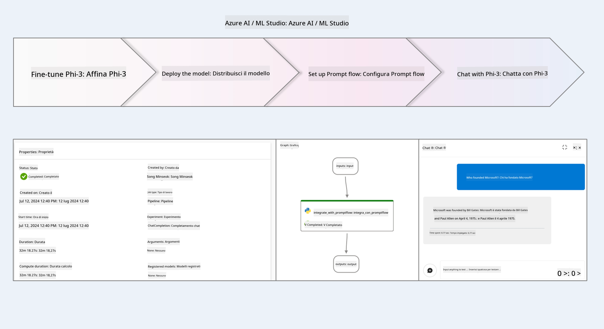

### Indice

1. **[Scenario 1: Configurare le risorse Azure e prepararsi per il fine-tuning](../../../../../../md/02.Application/01.TextAndChat/Phi3)**
    - [Creare un Azure Machine Learning Workspace](../../../../../../md/02.Application/01.TextAndChat/Phi3)
    - [Richiedere quote GPU nella sottoscrizione Azure](../../../../../../md/02.Application/01.TextAndChat/Phi3)
    - [Aggiungere assegnazione di ruolo](../../../../../../md/02.Application/01.TextAndChat/Phi3)
    - [Configurare il progetto](../../../../../../md/02.Application/01.TextAndChat/Phi3)
    - [Preparare il dataset per il fine-tuning](../../../../../../md/02.Application/01.TextAndChat/Phi3)

1. **[Scenario 2: Effettuare il fine-tuning del modello Phi-3 e distribuirlo in Azure Machine Learning Studio](../../../../../../md/02.Application/01.TextAndChat/Phi3)**
    - [Effettuare il fine-tuning del modello Phi-3](../../../../../../md/02.Application/01.TextAndChat/Phi3)
    - [Distribuire il modello Phi-3 con fine-tuning](../../../../../../md/02.Application/01.TextAndChat/Phi3)

1. **[Scenario 3: Integrare con Prompt flow e chattare con il tuo modello personalizzato in Azure AI Foundry](../../../../../../md/02.Application/01.TextAndChat/Phi3)**
    - [Integrare il modello Phi-3 personalizzato con Prompt flow](../../../../../../md/02.Application/01.TextAndChat/Phi3)
    - [Chattare con il modello Phi-3 personalizzato](../../../../../../md/02.Application/01.TextAndChat/Phi3)

## Scenario 1: Configurare le risorse Azure e prepararsi per il fine-tuning

### Creare un Azure Machine Learning Workspace

1. Digita *azure machine learning* nella **barra di ricerca** in alto alla pagina del portale e seleziona **Azure Machine Learning** dalle opzioni che appaiono.

    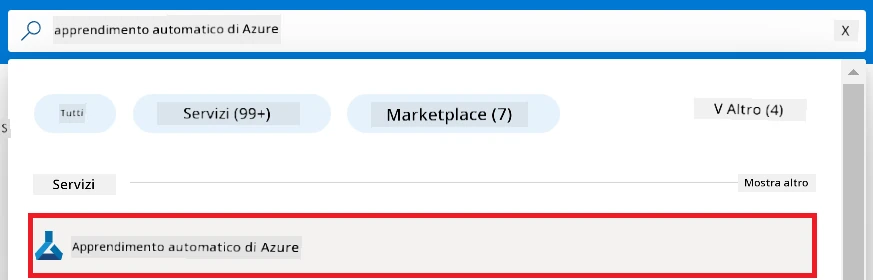

2. Seleziona **+ Create** dal menu di navigazione.

3. Seleziona **New workspace** dal menu di navigazione.

    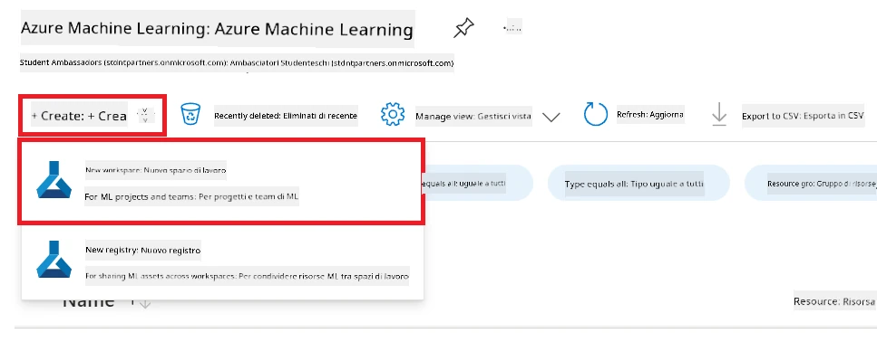

4. Esegui le seguenti operazioni:

    - Seleziona la tua **Sottoscrizione** Azure.
    - Seleziona il **Gruppo di risorse** da usare (creane uno nuovo se necessario).
    - Inserisci il **Nome Workspace**. Deve essere un valore univoco.
    - Seleziona la **Regione** che desideri usare.
    - Seleziona l'**Account di archiviazione** da utilizzare (creane uno nuovo se necessario).
    - Seleziona il **Key vault** da usare (creane uno nuovo se necessario).
    - Seleziona gli **Application insights** da usare (creane uno nuovo se necessario).
    - Seleziona il **Container registry** da usare (creane uno nuovo se necessario).

    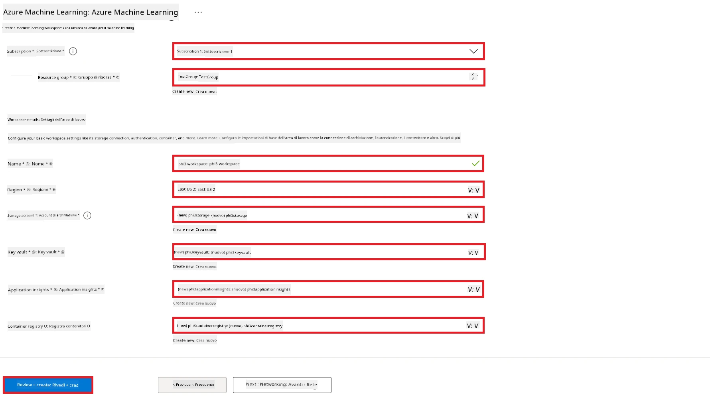

5. Seleziona **Review + Create**.

6. Seleziona **Create**.

### Richiedere quote GPU nella sottoscrizione Azure

In questo tutorial, imparerai come effettuare il fine-tuning e distribuire un modello Phi-3, utilizzando GPU. Per il fine-tuning, userai la GPU *Standard_NC24ads_A100_v4*, che richiede una richiesta di quota. Per la distribuzione, userai la GPU *Standard_NC6s_v3*, che richiede anch'essa una richiesta di quota.

> [!NOTE]
>
> Solo le sottoscrizioni Pay-As-You-Go (il tipo di sottoscrizione standard) sono idonee per l’allocazione GPU; le sottoscrizioni benefit non sono al momento supportate.
>

1. Visita [Azure ML Studio](https://ml.azure.com/home?wt.mc_id=studentamb_279723).

1. Esegui le seguenti operazioni per richiedere la quota *Standard NCADSA100v4 Family*:

    - Seleziona **Quota** dalla scheda a sinistra.
    - Seleziona la **famiglia di macchine virtuali** da utilizzare. Ad esempio, seleziona **Standard NCADSA100v4 Family Cluster Dedicated vCPUs**, che include la GPU *Standard_NC24ads_A100_v4*.
    - Seleziona **Request quota** dal menu di navigazione.

        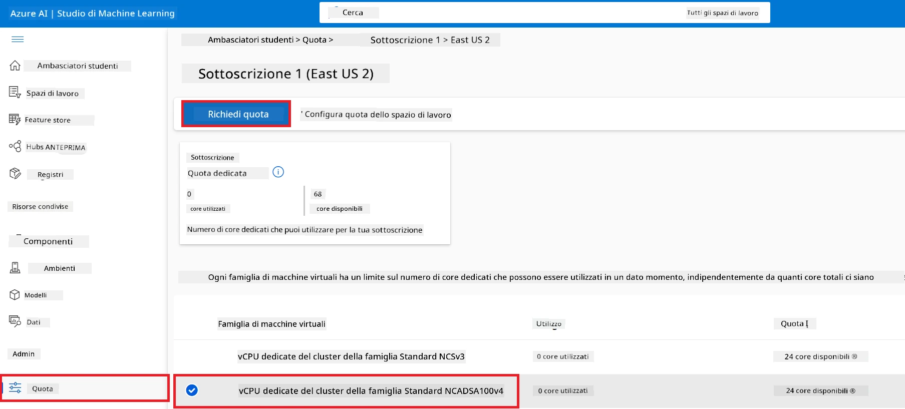

    - All’interno della pagina Request quota, inserisci il **Limite di nuovi core** che desideri utilizzare. Ad esempio, 24.
    - All’interno della pagina Request quota, seleziona **Submit** per richiedere la quota GPU.

1. Esegui le seguenti operazioni per richiedere la quota *Standard NCSv3 Family*:

    - Seleziona **Quota** dalla scheda a sinistra.
    - Seleziona la **famiglia di macchine virtuali** da utilizzare. Ad esempio, seleziona **Standard NCSv3 Family Cluster Dedicated vCPUs**, che include la GPU *Standard_NC6s_v3*.
    - Seleziona **Request quota** dal menu di navigazione.
    - All’interno della pagina Request quota, inserisci il **Limite di nuovi core** che desideri utilizzare. Ad esempio, 24.
    - All’interno della pagina Request quota, seleziona **Submit** per richiedere la quota GPU.

### Aggiungere assegnazione di ruolo

Per effettuare il fine-tuning e distribuire i tuoi modelli, devi prima creare un'Identità Gestita Assegnata all’Utente (UAI) e assegnargli le autorizzazioni appropriate. Questa UAI sarà usata per l'autenticazione durante la distribuzione

#### Creare un’Identità Gestita Assegnata all’Utente (UAI)

1. Digita *managed identities* nella **barra di ricerca** in alto alla pagina del portale e seleziona **Managed Identities** dalle opzioni che appaiono.

    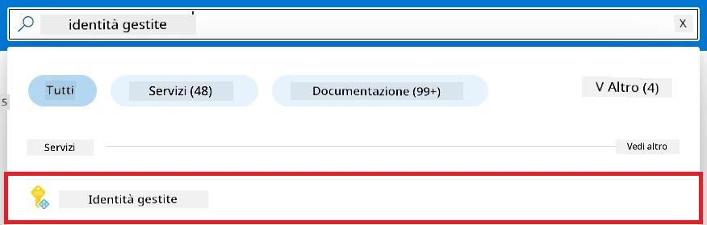

1. Seleziona **+ Create**.

    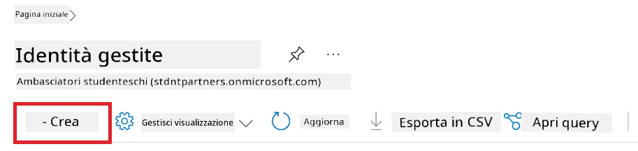

1. Esegui le seguenti operazioni:

    - Seleziona la tua **Sottoscrizione** Azure.
    - Seleziona il **Gruppo di risorse** da usare (creane uno nuovo se necessario).
    - Seleziona la **Regione** che desideri usare.
    - Inserisci il **Nome**. Deve essere un valore univoco.

    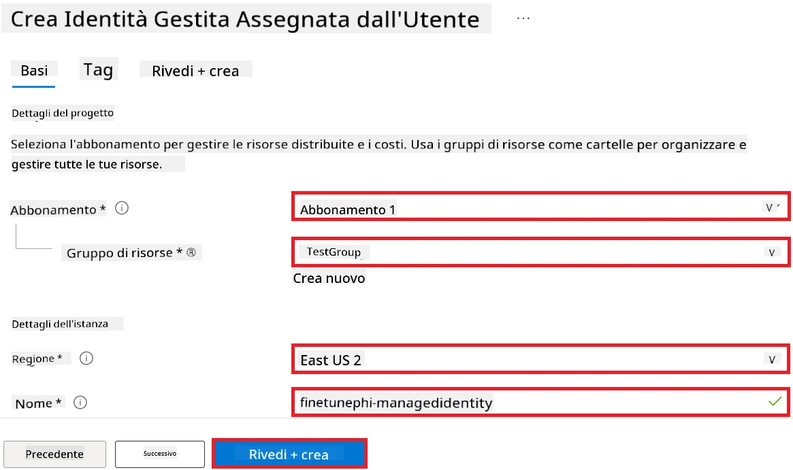

1. Seleziona **Review + create**.

1. Seleziona **+ Create**.

#### Aggiungere un’assegnazione di ruolo Contributor all’Identità Gestita

1. Vai alla risorsa dell’Identità Gestita che hai creato.

1. Seleziona **Azure role assignments** dalla scheda a sinistra.

1. Seleziona **+Add role assignment** dal menu di navigazione.

1. All’interno della pagina Aggiungi assegnazione di ruolo, esegui le seguenti operazioni:
    - Seleziona l’**Ambito** su **Resource group**.
    - Seleziona la tua **Sottoscrizione** Azure.
    - Seleziona il **Gruppo di risorse** da usare.
    - Seleziona il **Ruolo** su **Contributor**.

    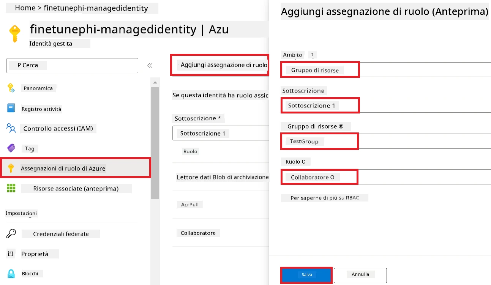

2. Seleziona **Save**.

#### Aggiungere un’assegnazione di ruolo Storage Blob Data Reader all’Identità Gestita

1. Digita *storage accounts* nella **barra di ricerca** in alto alla pagina del portale e seleziona **Storage accounts** dalle opzioni che appaiono.

    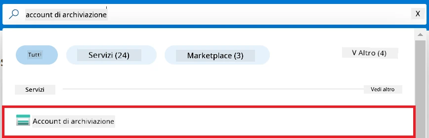

1. Seleziona l'account di archiviazione associato al workspace Azure Machine Learning che hai creato. Ad esempio, *finetunephistorage*.

1. Esegui le seguenti operazioni per navigare alla pagina Aggiungi assegnazione di ruolo:

    - Vai all'account di archiviazione Azure che hai creato.
    - Seleziona **Access Control (IAM)** dalla scheda a sinistra.
    - Seleziona **+ Add** dal menu di navigazione.
    - Seleziona **Add role assignment** dal menu di navigazione.

    

1. All’interno della pagina Aggiungi assegnazione di ruolo, esegui le seguenti operazioni:

    - All’interno della pagina Ruolo, digita *Storage Blob Data Reader* nella **barra di ricerca** e seleziona **Storage Blob Data Reader** dalle opzioni che appaiono.
    - All’interno della pagina Ruolo, seleziona **Next**.
    - All’interno della pagina Membri, seleziona **Assign access to** **Managed identity**.
    - All’interno della pagina Membri, seleziona **+ Select members**.
    - All’interno della pagina Seleziona identità gestite, seleziona la tua **Sottoscrizione** Azure.
    - All’interno della pagina Seleziona identità gestite, seleziona l’**Identità gestita** su **Manage Identity**.
    - All’interno della pagina Seleziona identità gestite, seleziona l’identità gestita che hai creato. Ad esempio, *finetunephi-managedidentity*.
    - All’interno della pagina Seleziona identità gestite, seleziona **Select**.

    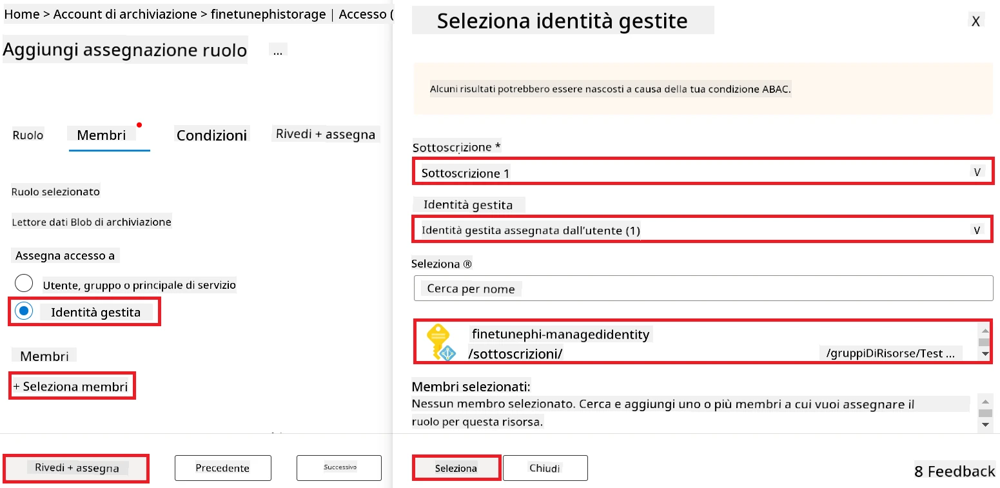

1. Seleziona **Review + assign**.

#### Aggiungere un’assegnazione di ruolo AcrPull all’Identità Gestita

1. Digita *container registries* nella **barra di ricerca** in alto alla pagina del portale e seleziona **Container registries** dalle opzioni che appaiono.

    

1. Seleziona il container registry associato al workspace Azure Machine Learning. Ad esempio, *finetunephicontainerregistry*

1. Esegui le seguenti operazioni per navigare alla pagina Aggiungi assegnazione di ruolo:

    - Seleziona **Access Control (IAM)** dalla scheda a sinistra.
    - Seleziona **+ Add** dal menu di navigazione.
    - Seleziona **Add role assignment** dal menu di navigazione.

1. All’interno della pagina Aggiungi assegnazione di ruolo, esegui le seguenti operazioni:

    - All’interno della pagina Ruolo, digita *AcrPull* nella **barra di ricerca** e seleziona **AcrPull** dalle opzioni che appaiono.
    - All’interno della pagina Ruolo, seleziona **Next**.
    - All’interno della pagina Membri, seleziona **Assign access to** **Managed identity**.
    - All’interno della pagina Membri, seleziona **+ Select members**.
    - All’interno della pagina Seleziona identità gestite, seleziona la tua **Sottoscrizione** Azure.
    - All’interno della pagina Seleziona identità gestite, seleziona l’**Identità gestita** su **Manage Identity**.
    - All’interno della pagina Seleziona identità gestite, seleziona l’identità gestita che hai creato. Ad esempio, *finetunephi-managedidentity*.
    - All’interno della pagina Seleziona identità gestite, seleziona **Select**.
    - Seleziona **Review + assign**.

### Configurare il progetto

Per scaricare i dataset necessari per il fine-tuning, configurerai un ambiente locale.

In questo esercizio, dovrai

- Creare una cartella in cui lavorare.
- Creare un ambiente virtuale.
- Installare i pacchetti richiesti.
- Creare un file *download_dataset.py* per scaricare il dataset.

#### Creare una cartella in cui lavorare

1. Apri una finestra del terminale e digita il seguente comando per creare una cartella chiamata *finetune-phi* nel percorso predefinito.

    ```console
    mkdir finetune-phi
    ```

2. Digita il seguente comando nel terminale per navigare nella cartella *finetune-phi* che hai creato.

    ```console
    cd finetune-phi
    ```

#### Crea un ambiente virtuale

1. Digita il seguente comando nel terminale per creare un ambiente virtuale chiamato *.venv*.

    ```console
    python -m venv .venv
    ```

2. Digita il seguente comando nel terminale per attivare l'ambiente virtuale.

    ```console
    .venv\Scripts\activate.bat
    ```

> [!NOTE]
> Se ha funzionato, dovresti vedere *(.venv)* prima del prompt dei comandi.

#### Installa i pacchetti richiesti

1. Digita i seguenti comandi nel terminale per installare i pacchetti richiesti.

    ```console
    pip install datasets==2.19.1
    ```

#### Crea `donload_dataset.py`

> [!NOTE]
> Struttura completa della cartella:
>
> ```text
> └── YourUserName
> .    └── finetune-phi
> .        └── download_dataset.py
> ```

1. Apri **Visual Studio Code**.

1. Seleziona **File** dalla barra del menu.

1. Seleziona **Apri cartella**.

1. Seleziona la cartella *finetune-phi* che hai creato, che si trova in *C:\Users\yourUserName\finetune-phi*.

    

1. Nel riquadro a sinistra di Visual Studio Code, fai clic con il tasto destro e seleziona **Nuovo file** per creare un nuovo file chiamato *download_dataset.py*.

    

### Prepara il dataset per il fine-tuning

In questo esercizio, eseguirai il file *download_dataset.py* per scaricare i dataset *ultrachat_200k* nel tuo ambiente locale. Successivamente utilizzerai questi dataset per effettuare il fine-tuning del modello Phi-3 in Azure Machine Learning.

In questo esercizio:

- Aggiungerai codice al file *download_dataset.py* per scaricare i dataset.
- Eseguirai il file *download_dataset.py* per scaricare i dataset nel tuo ambiente locale.

#### Scarica il tuo dataset usando *download_dataset.py*

1. Apri il file *download_dataset.py* in Visual Studio Code.

1. Aggiungi il seguente codice nel file *download_dataset.py*.

    ```python
    import json
    import os
    from datasets import load_dataset

    def load_and_split_dataset(dataset_name, config_name, split_ratio):
        """
        Load and split a dataset.
        """
        # Carica il dataset con il nome specificato, la configurazione e il rapporto di suddivisione
        dataset = load_dataset(dataset_name, config_name, split=split_ratio)
        print(f"Original dataset size: {len(dataset)}")
        
        # Suddividi il dataset in set di addestramento e test (80% addestramento, 20% test)
        split_dataset = dataset.train_test_split(test_size=0.2)
        print(f"Train dataset size: {len(split_dataset['train'])}")
        print(f"Test dataset size: {len(split_dataset['test'])}")
        
        return split_dataset

    def save_dataset_to_jsonl(dataset, filepath):
        """
        Save a dataset to a JSONL file.
        """
        # Crea la directory se non esiste
        os.makedirs(os.path.dirname(filepath), exist_ok=True)
        
        # Apri il file in modalità scrittura
        with open(filepath, 'w', encoding='utf-8') as f:
            # Itera su ogni record nel dataset
            for record in dataset:
                # Salva il record come oggetto JSON e scrivilo nel file
                json.dump(record, f)
                # Scrivi un carattere di nuova linea per separare i record
                f.write('\n')
        
        print(f"Dataset saved to {filepath}")

    def main():
        """
        Main function to load, split, and save the dataset.
        """
        # Carica e suddividi il dataset ULTRACHAT_200k con una configurazione specifica e rapporto di suddivisione
        dataset = load_and_split_dataset("HuggingFaceH4/ultrachat_200k", 'default', 'train_sft[:1%]')
        
        # Estrai i dataset di addestramento e test dalla suddivisione
        train_dataset = dataset['train']
        test_dataset = dataset['test']

        # Salva il dataset di addestramento in un file JSONL
        save_dataset_to_jsonl(train_dataset, "data/train_data.jsonl")
        
        # Salva il dataset di test in un file JSONL separato
        save_dataset_to_jsonl(test_dataset, "data/test_data.jsonl")

    if __name__ == "__main__":
        main()

    ```

1. Digita il seguente comando nel terminale per eseguire lo script e scaricare il dataset nel tuo ambiente locale.

    ```console
    python download_dataset.py
    ```

1. Verifica che i dataset siano stati salvati correttamente nella directory locale *finetune-phi/data*.

> [!NOTE]
>
> #### Nota sulla dimensione del dataset e sul tempo di fine-tuning
>
> In questo tutorial, utilizzi solo l'1% del dataset (`split='train[:1%]'`). Questo riduce significativamente la quantità di dati, accelerando sia il caricamento che il processo di fine-tuning. Puoi regolare la percentuale per trovare il giusto equilibrio tra tempo di addestramento e prestazioni del modello. Usare un sottoinsieme più piccolo del dataset riduce il tempo necessario per il fine-tuning, rendendo il processo più gestibile per un tutorial.

## Scenario 2: Fine-tuning del modello Phi-3 e distribuzione in Azure Machine Learning Studio

### Effettua il fine-tuning del modello Phi-3

In questo esercizio effettuerai il fine-tuning del modello Phi-3 in Azure Machine Learning Studio.

In questo esercizio:

- Creerai un cluster di calcolo per il fine-tuning.
- Effettuerai il fine-tuning del modello Phi-3 in Azure Machine Learning Studio.

#### Crea un cluster di calcolo per il fine-tuning

1. Visita [Azure ML Studio](https://ml.azure.com/home?wt.mc_id=studentamb_279723).

1. Seleziona **Compute** dal tab a sinistra.

1. Seleziona **Compute clusters** dal menu di navigazione.

1. Seleziona **+ New**.

    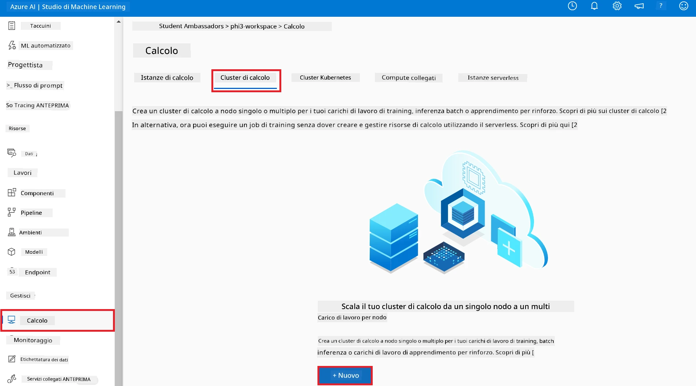

1. Esegui le seguenti azioni:

    - Seleziona la **Regione** che vuoi utilizzare.
    - Seleziona il **Tier della macchina virtuale** su **Dedicated**.
    - Seleziona il **Tipo di macchina virtuale** su **GPU**.
    - Seleziona il filtro **Dimensione macchina virtuale** su **Select from all options**.
    - Seleziona la **Dimensione macchina virtuale** su **Standard_NC24ads_A100_v4**.

    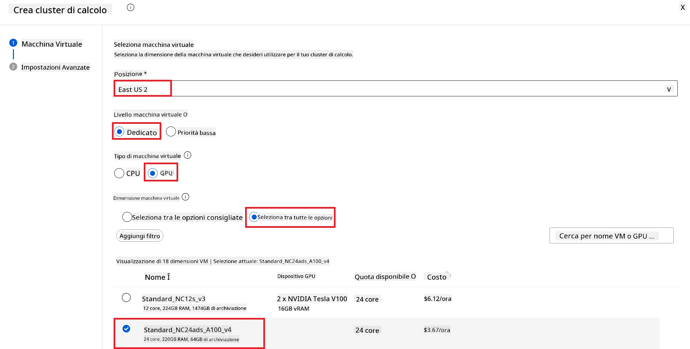

1. Seleziona **Next**.

1. Esegui le seguenti azioni:

    - Inserisci **Nome del cluster**. Deve essere un valore univoco.
    - Seleziona il **Numero minimo di nodi** su **0**.
    - Seleziona il **Numero massimo di nodi** su **1**.
    - Seleziona il tempo di inattività **Idle seconds before scale down** su **120**.

    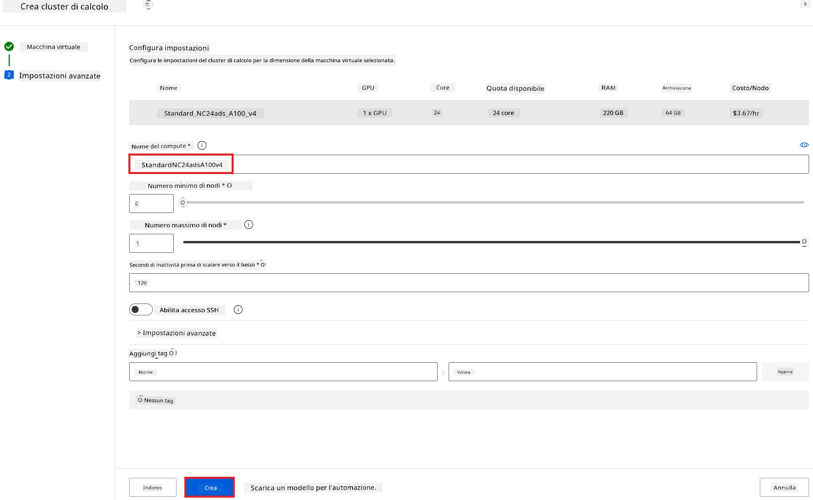

1. Seleziona **Create**.

#### Effettua il fine-tuning del modello Phi-3

1. Visita [Azure ML Studio](https://ml.azure.com/home?wt.mc_id=studentamb_279723).

1. Seleziona lo spazio di lavoro di Azure Machine Learning che hai creato.

    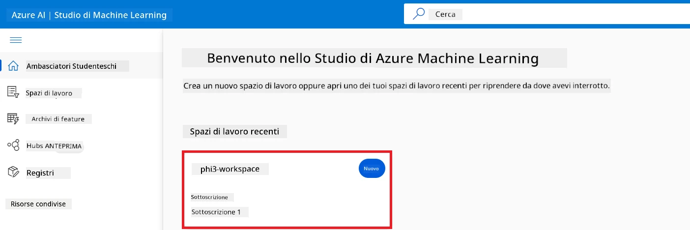

1. Esegui le seguenti azioni:

    - Seleziona **Catalogo modelli** dal tab a sinistra.
    - Digita *phi-3-mini-4k* nella **barra di ricerca** e seleziona **Phi-3-mini-4k-instruct** tra le opzioni che appaiono.

    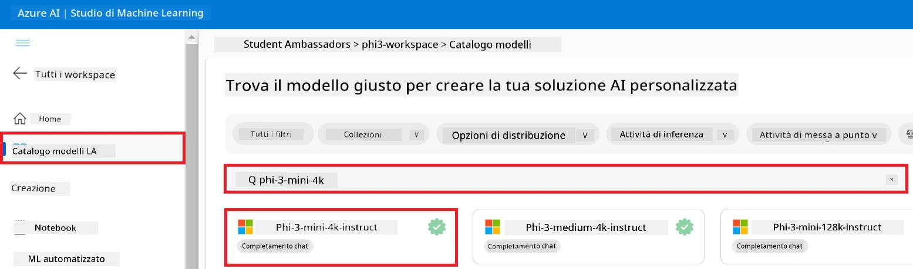

1. Seleziona **Fine-tune** dal menu di navigazione.

    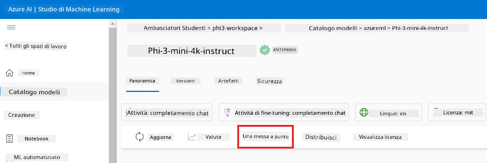

1. Esegui le seguenti azioni:

    - Seleziona **Select task type** su **Chat completion**.
    - Seleziona **+ Select data** per caricare i **Dati di training**.
    - Seleziona il tipo di caricamento dei dati di validazione su **Provide different validation data**.
    - Seleziona **+ Select data** per caricare i **Dati di validazione**.

    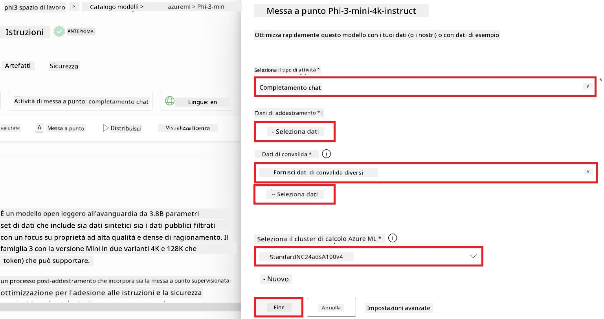

> [!TIP]
>
> Puoi selezionare **Impostazioni avanzate** per personalizzare configurazioni come **learning_rate** e **lr_scheduler_type** per ottimizzare il processo di fine-tuning secondo le tue esigenze specifiche.

1. Seleziona **Finish**.

1. In questo esercizio, hai effettuato con successo il fine-tuning del modello Phi-3 utilizzando Azure Machine Learning. Nota che il processo di fine-tuning può richiedere un tempo considerevole. Dopo aver avviato il lavoro di fine-tuning, dovrai attendere il suo completamento. Puoi monitorare lo stato del lavoro navigando alla scheda Jobs nel lato sinistro del tuo spazio di lavoro Azure Machine Learning. Nella serie successiva, distribuirai il modello fine-tuned e lo integrerai con Prompt flow.

    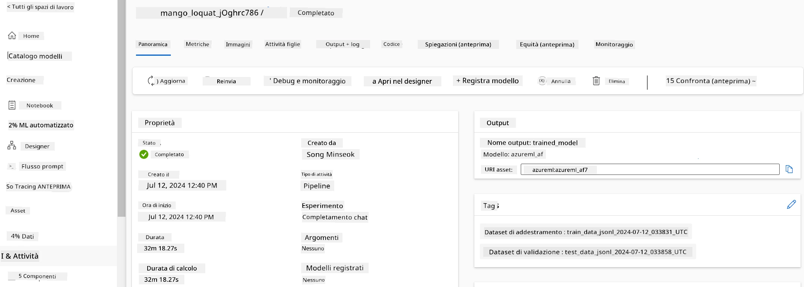

### Distribuisci il modello Phi-3 fine-tuned

Per integrare il modello Phi-3 fine-tuned con Prompt flow, devi distribuire il modello per renderlo accessibile per inferenza in tempo reale. Questo processo include la registrazione del modello, la creazione di un endpoint online e la distribuzione del modello.

In questo esercizio:

- Registrerai il modello fine-tuned nello spazio di lavoro Azure Machine Learning.
- Creerai un endpoint online.
- Distribuirai il modello Phi-3 fine-tuned registrato.

#### Registra il modello fine-tuned

1. Visita [Azure ML Studio](https://ml.azure.com/home?wt.mc_id=studentamb_279723).

1. Seleziona lo spazio di lavoro di Azure Machine Learning che hai creato.

    

1. Seleziona **Models** dal tab a sinistra.
1. Seleziona **+ Register**.
1. Seleziona **From a job output**.

    

1. Seleziona il job che hai creato.

    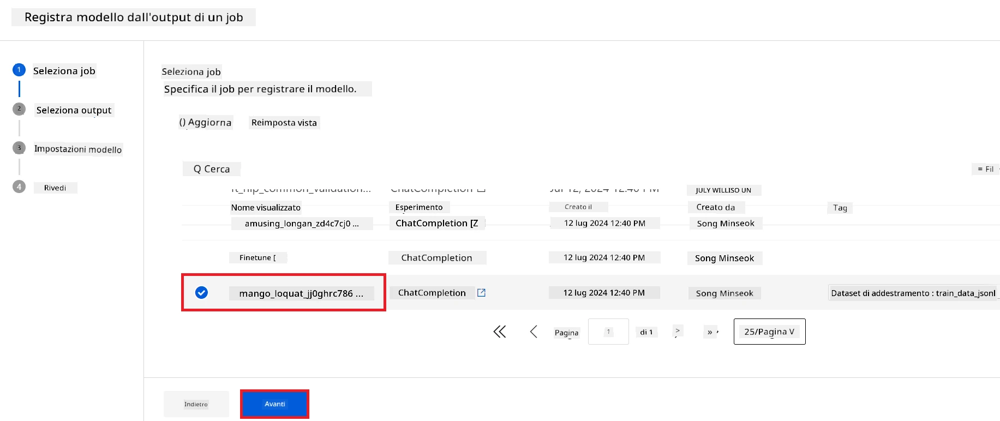

1. Seleziona **Next**.

1. Seleziona **Model type** su **MLflow**.

1. Assicurati che **Job output** sia selezionato; dovrebbe essere selezionato automaticamente.

    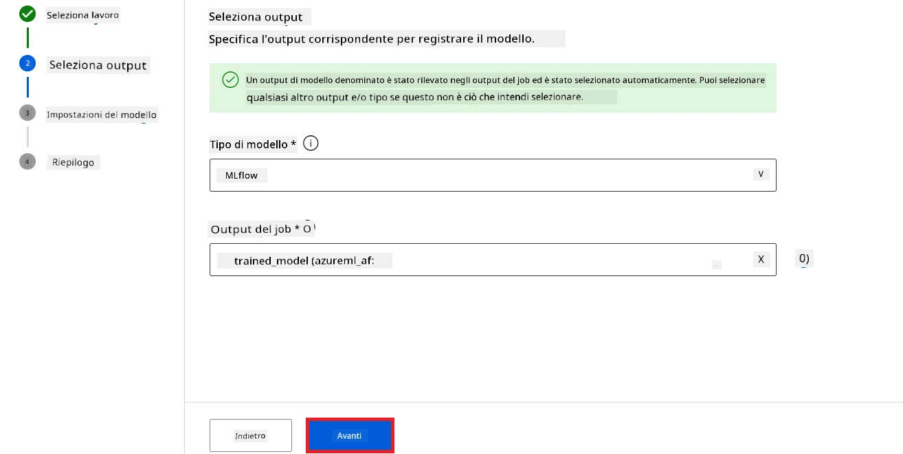

2. Seleziona **Next**.

3. Seleziona **Register**.

    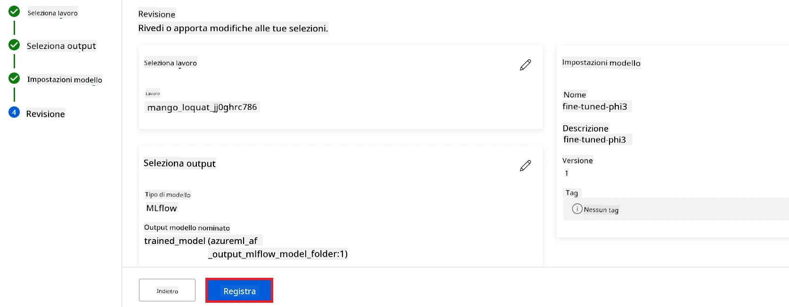

4. Puoi visualizzare il modello registrato navigando nel menu **Models** dal tab a sinistra.

    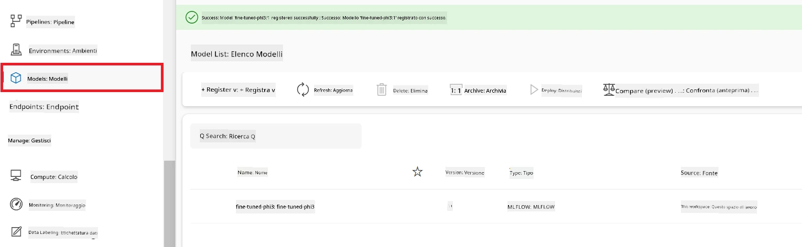

#### Distribuisci il modello fine-tuned

1. Naviga allo spazio di lavoro Azure Machine Learning che hai creato.

1. Seleziona **Endpoints** dal tab a sinistra.

1. Seleziona **Real-time endpoints** dal menu di navigazione.

    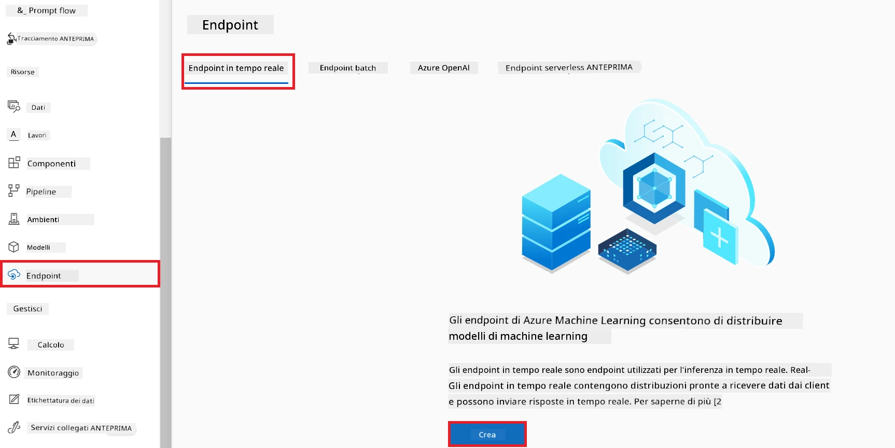

1. Seleziona **Create**.

1. Seleziona il modello registrato che hai creato.

    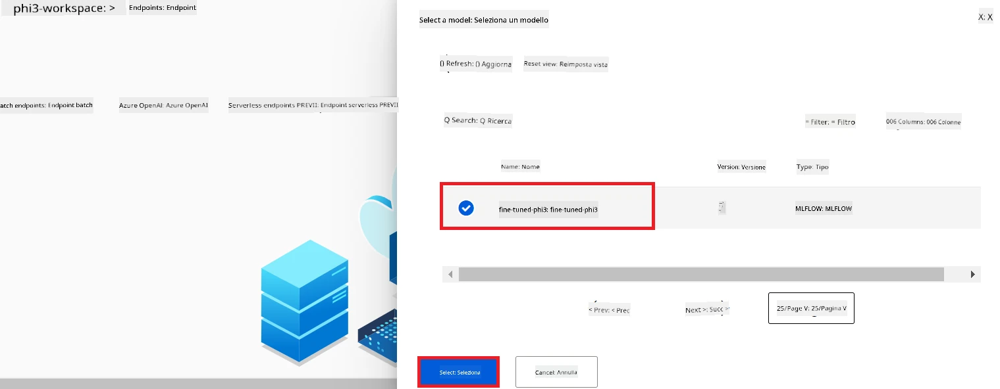

1. Seleziona **Select**.

1. Esegui le seguenti azioni:

    - Seleziona **Macchina virtuale** su *Standard_NC6s_v3*.
    - Seleziona il **Numero di istanze** che vuoi utilizzare. Per esempio, *1*.
    - Seleziona **Endpoint** su **New** per creare un endpoint.
    - Inserisci **Nome endpoint**. Deve essere un valore univoco.
    - Inserisci **Nome deployment**. Deve essere un valore univoco.

    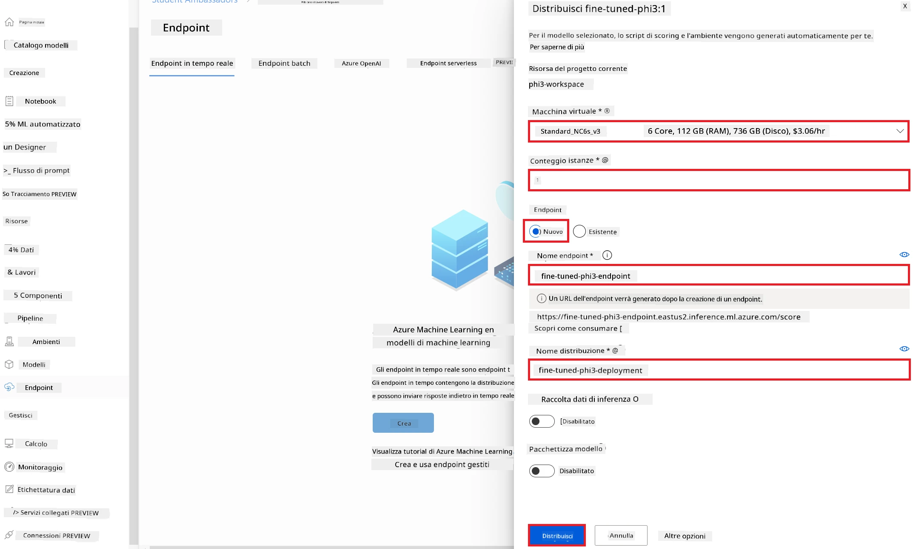

1. Seleziona **Deploy**.

> [!WARNING]
> Per evitare costi aggiuntivi sul tuo account, assicurati di eliminare l'endpoint creato nello spazio di lavoro Azure Machine Learning.
>

#### Controlla lo stato del deployment in Azure Machine Learning Workspace

1. Naviga allo spazio di lavoro Azure Machine Learning che hai creato.

1. Seleziona **Endpoints** dal tab a sinistra.

1. Seleziona l'endpoint che hai creato.

    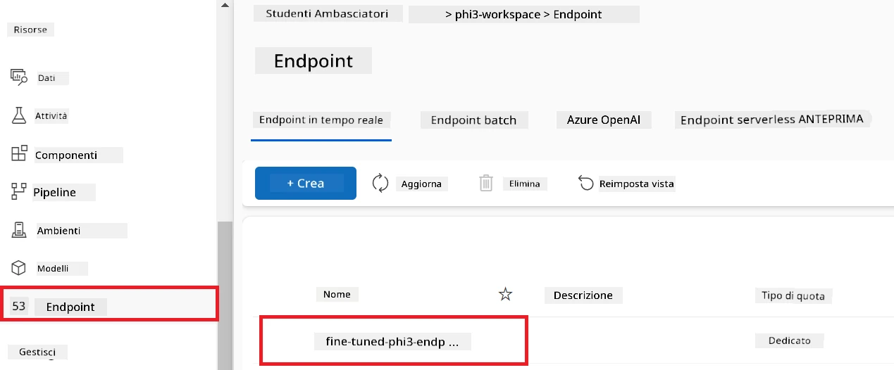

1. In questa pagina puoi gestire gli endpoint durante il processo di deployment.

> [!NOTE]
> Una volta che il deployment è completo, assicurati che **Live traffic** sia impostato al **100%**. Se non è così, seleziona **Update traffic** per regolare le impostazioni di traffico. Nota che non puoi testare il modello se il traffico è impostato a 0%.
>
> 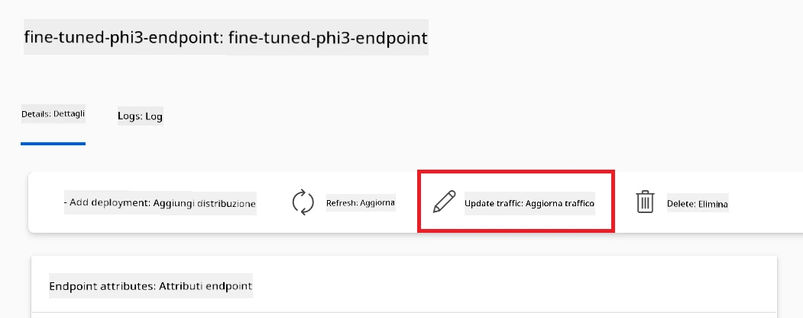
>

## Scenario 3: Integra con Prompt flow e Chatta con il tuo modello personalizzato in Azure AI Foundry

### Integra il modello Phi-3 personalizzato con Prompt flow

Dopo aver distribuito con successo il modello fine-tuned, puoi ora integrarlo con Prompt Flow per utilizzare il modello in applicazioni in tempo reale, abilitando una varietà di task interattivi con il tuo modello Phi-3 personalizzato.

In questo esercizio:

- Creerai Azure AI Foundry Hub.
- Creerai un progetto Azure AI Foundry.
- Creerai Prompt flow.
- Aggiungerai una connessione personalizzata per il modello Phi-3 fine-tuned.
- Configurerai Prompt flow per chattare con il tuo modello Phi-3 personalizzato.

> [!NOTE]
> Puoi anche integrare con Promptflow usando Azure ML Studio. Lo stesso processo di integrazione può essere applicato ad Azure ML Studio.

#### Crea Azure AI Foundry Hub

Devi creare un Hub prima di creare il Progetto. Un Hub funziona come un Gruppo di risorse, permettendoti di organizzare e gestire più progetti all’interno di Azure AI Foundry.

1. Visita [Azure AI Foundry](https://ai.azure.com/?WT.mc_id=aiml-137032-kinfeylo).

1. Seleziona **Tutti gli hub** dal tab a sinistra.

1. Seleziona **+ Nuovo hub** dal menu di navigazione.
    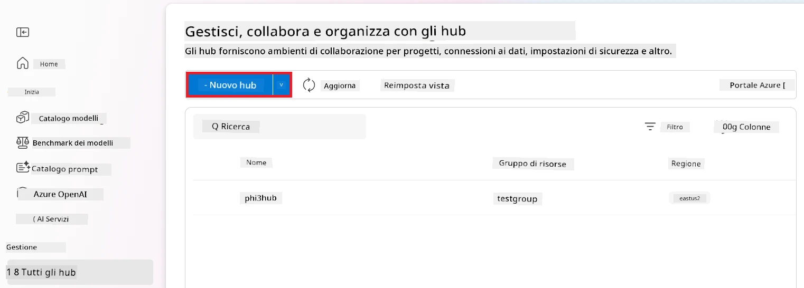

1. Esegui le seguenti operazioni:

    - Inserisci **Nome hub**. Deve essere un valore univoco.
    - Seleziona la tua **Sottoscrizione** Azure.
    - Seleziona il **Gruppo di risorse** da utilizzare (creane uno nuovo se necessario).
    - Seleziona la **Posizione** che desideri utilizzare.
    - Seleziona **Connetti servizi Azure AI** da utilizzare (creane uno nuovo se necessario).
    - Seleziona **Connetti Azure AI Search** su **Salta la connessione**.

    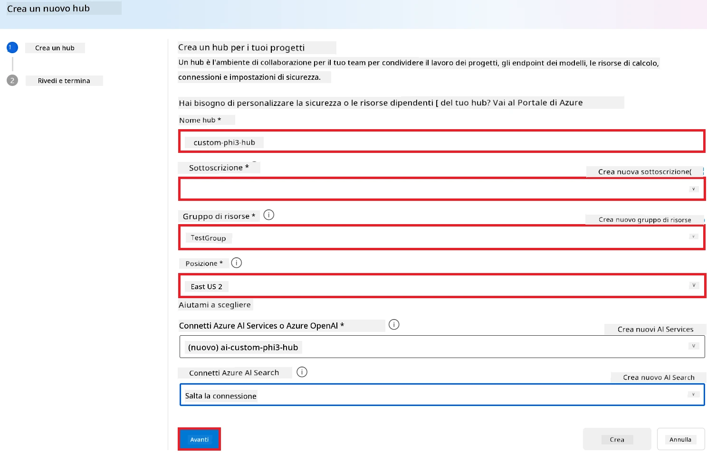

1. Seleziona **Avanti**.

#### Crea progetto Azure AI Foundry

1. Nell'Hub che hai creato, seleziona **Tutti i progetti** dalla scheda a sinistra.

1. Seleziona **+ Nuovo progetto** dal menu di navigazione.

    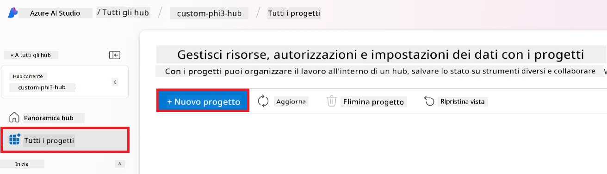

1. Inserisci **Nome progetto**. Deve essere un valore univoco.

    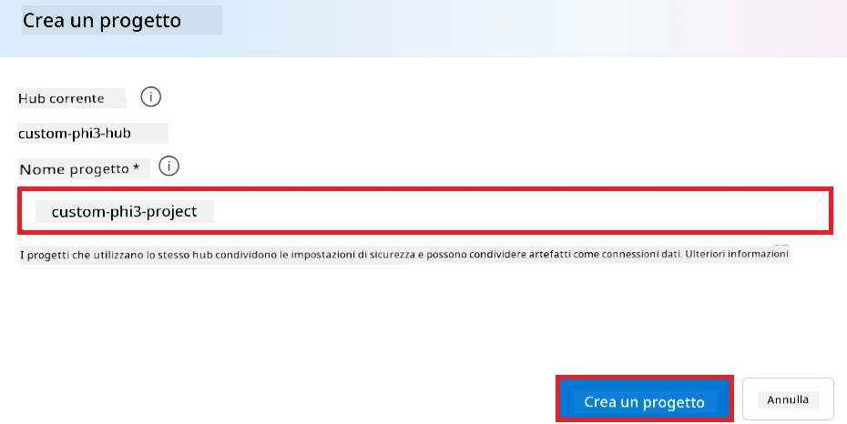

1. Seleziona **Crea un progetto**.

#### Aggiungi una connessione personalizzata per il modello Phi-3 fine-tuned

Per integrare il tuo modello Phi-3 personalizzato con Prompt flow, devi salvare l'endpoint e la chiave del modello in una connessione personalizzata. Questa configurazione garantisce l'accesso al tuo modello Phi-3 personalizzato in Prompt flow.

#### Imposta la chiave API e l'URI endpoint del modello Phi-3 fine-tuned

1. Visita [Azure ML Studio](https://ml.azure.com/home?WT.mc_id=aiml-137032-kinfeylo).

1. Naviga allo spazio di lavoro Azure Machine Learning che hai creato.

1. Seleziona **Endpoint** dalla scheda a sinistra.

    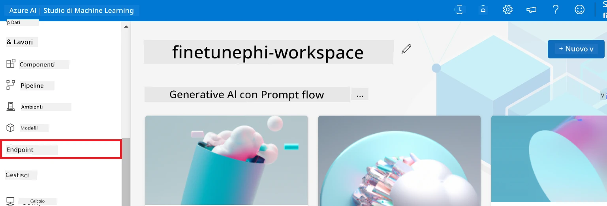

1. Seleziona l'endpoint che hai creato.

    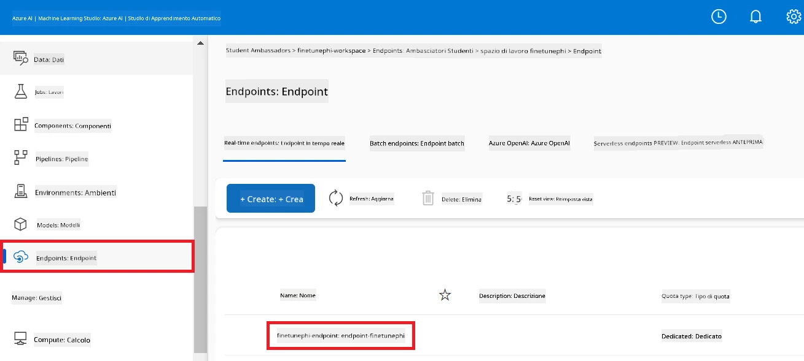

1. Seleziona **Consuma** dal menu di navigazione.

1. Copia il tuo **endpoint REST** e la **Chiave primaria**.

    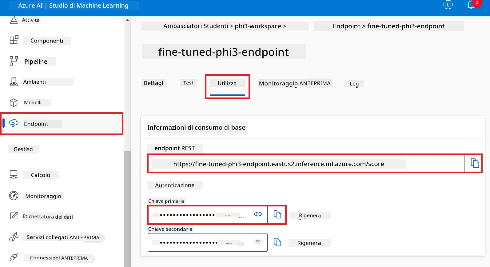

#### Aggiungi la Connessione Personalizzata

1. Visita [Azure AI Foundry](https://ai.azure.com/?WT.mc_id=aiml-137032-kinfeylo).

1. Naviga al progetto Azure AI Foundry che hai creato.

1. Nel Progetto che hai creato, seleziona **Impostazioni** dalla scheda a sinistra.

1. Seleziona **+ Nuova connessione**.

    

1. Seleziona **Chiavi personalizzate** dal menu di navigazione.

    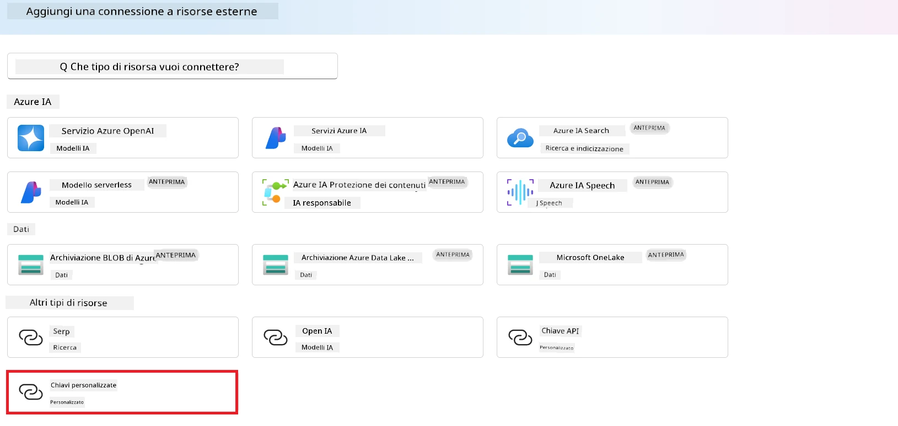

1. Esegui le seguenti operazioni:

    - Seleziona **+ Aggiungi coppie chiave valore**.
    - Per il nome della chiave, inserisci **endpoint** e incolla l'endpoint copiato da Azure ML Studio nel campo valore.
    - Seleziona di nuovo **+ Aggiungi coppie chiave valore**.
    - Per il nome della chiave, inserisci **key** e incolla la chiave copiata da Azure ML Studio nel campo valore.
    - Dopo aver aggiunto le chiavi, seleziona **è segreto** per evitare che la chiave venga esposta.

    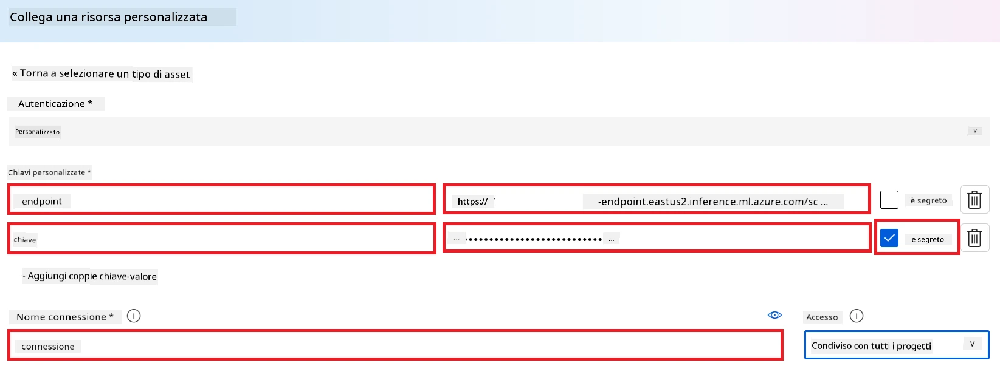

1. Seleziona **Aggiungi connessione**.

#### Crea Prompt flow

Hai aggiunto una connessione personalizzata in Azure AI Foundry. Ora, creiamo un Prompt flow seguendo i passaggi seguenti. Poi, collegherai questo Prompt flow alla connessione personalizzata in modo da poter utilizzare il modello fine-tuned all'interno del Prompt flow.

1. Naviga al progetto Azure AI Foundry che hai creato.

1. Seleziona **Prompt flow** dalla scheda a sinistra.

1. Seleziona **+ Crea** dal menu di navigazione.

    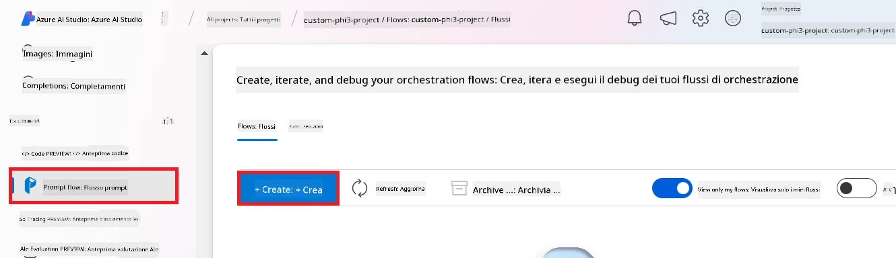

1. Seleziona **Chat flow** dal menu di navigazione.

    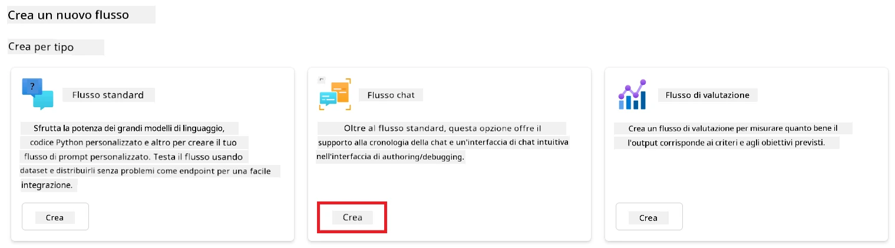

1. Inserisci **Nome cartella** da utilizzare.

    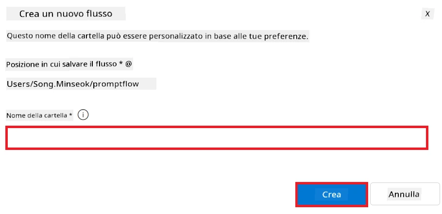

2. Seleziona **Crea**.

#### Configura Prompt flow per chattare con il tuo modello Phi-3 personalizzato

Devi integrare il modello Phi-3 fine-tuned in un Prompt flow. Tuttavia, il Prompt flow esistente fornito non è progettato per questo scopo. Pertanto, devi riprogettare il Prompt flow per consentire l'integrazione del modello personalizzato.

1. Nel Prompt flow, esegui le seguenti operazioni per ricostruire il flusso esistente:

    - Seleziona **Modalità file grezzo**.
    - Elimina tutto il codice esistente nel file *flow.dag.yml*.
    - Aggiungi il seguente codice al file *flow.dag.yml*.

        ```yml
        inputs:
          input_data:
            type: string
            default: "Who founded Microsoft?"

        outputs:
          answer:
            type: string
            reference: ${integrate_with_promptflow.output}

        nodes:
        - name: integrate_with_promptflow
          type: python
          source:
            type: code
            path: integrate_with_promptflow.py
          inputs:
            input_data: ${inputs.input_data}
        ```

    - Seleziona **Salva**.

    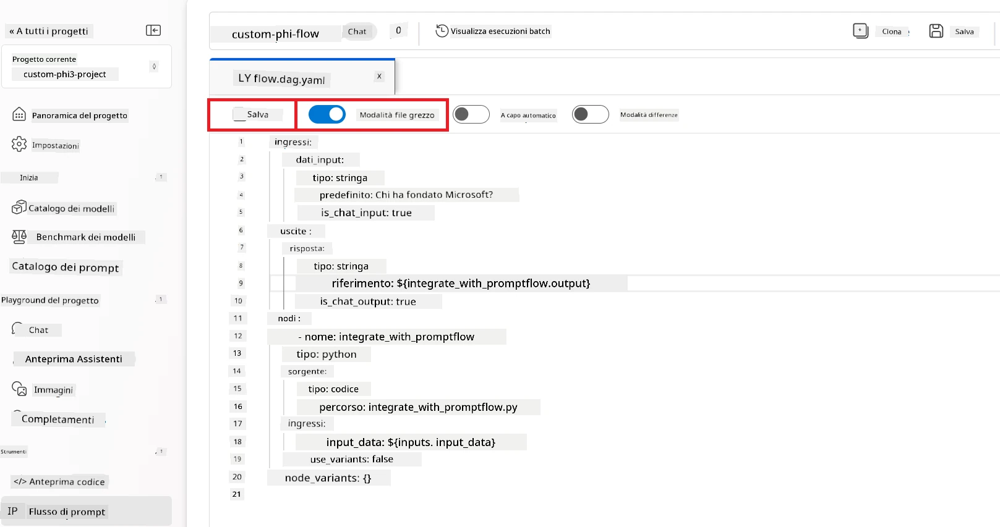

1. Aggiungi il seguente codice al file *integrate_with_promptflow.py* per utilizzare il modello Phi-3 personalizzato in Prompt flow.

    ```python
    import logging
    import requests
    from promptflow import tool
    from promptflow.connections import CustomConnection

    # Configurazione del logging
    logging.basicConfig(
        format="%(asctime)s - %(levelname)s - %(name)s - %(message)s",
        datefmt="%Y-%m-%d %H:%M:%S",
        level=logging.DEBUG
    )
    logger = logging.getLogger(__name__)

    def query_phi3_model(input_data: str, connection: CustomConnection) -> str:
        """
        Send a request to the Phi-3 model endpoint with the given input data using Custom Connection.
        """

        # "connection" è il nome della Connessione Personalizzata, "endpoint", "key" sono le chiavi nella Connessione Personalizzata
        endpoint_url = connection.endpoint
        api_key = connection.key

        headers = {
            "Content-Type": "application/json",
            "Authorization": f"Bearer {api_key}"
        }
        data = {
            "input_data": {
                "input_string": [
                    {"role": "user", "content": input_data}
                ],
                "parameters": {
                    "temperature": 0.7,
                    "max_new_tokens": 128
                }
            }
        }
        try:
            response = requests.post(endpoint_url, json=data, headers=headers)
            response.raise_for_status()
            
            # Registra la risposta JSON completa
            logger.debug(f"Full JSON response: {response.json()}")

            result = response.json()["output"]
            logger.info("Successfully received response from Azure ML Endpoint.")
            return result
        except requests.exceptions.RequestException as e:
            logger.error(f"Error querying Azure ML Endpoint: {e}")
            raise

    @tool
    def my_python_tool(input_data: str, connection: CustomConnection) -> str:
        """
        Tool function to process input data and query the Phi-3 model.
        """
        return query_phi3_model(input_data, connection)

    ```

    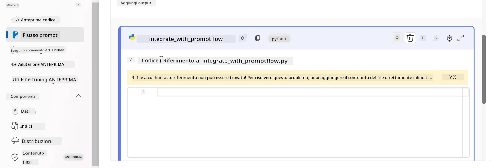

> [!NOTE]
> Per informazioni più dettagliate sull'uso di Prompt flow in Azure AI Foundry, puoi fare riferimento a [Prompt flow in Azure AI Foundry](https://learn.microsoft.com/azure/ai-studio/how-to/prompt-flow).

1. Seleziona **Chat input**, **Chat output** per abilitare la chat con il tuo modello.

    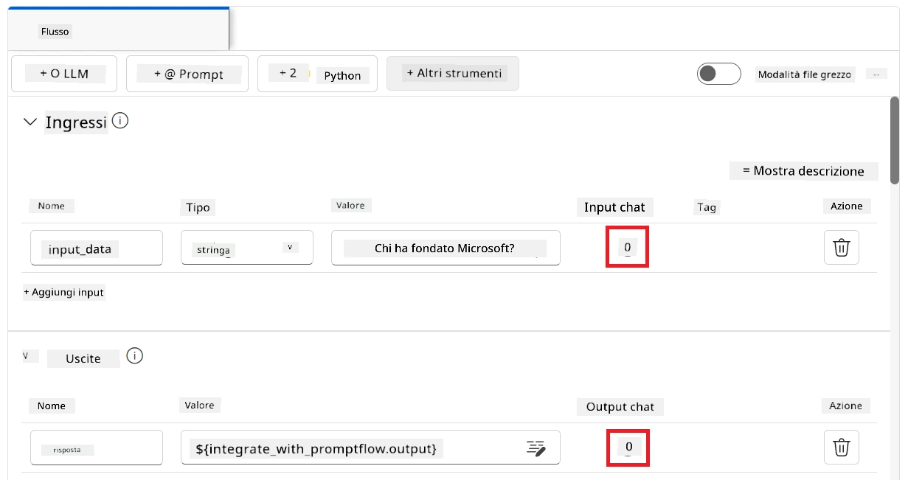

1. Ora sei pronto per chattare con il tuo modello Phi-3 personalizzato. Nel prossimo esercizio, imparerai come avviare Prompt flow e usarlo per chattare con il tuo modello Phi-3 fine-tuned.

> [!NOTE]
>
> Il flusso ricostruito dovrebbe assomigliare all'immagine seguente:
>
> 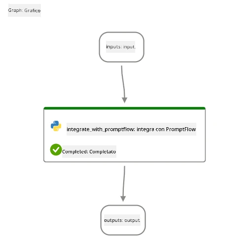
>

### Chatta con il tuo modello Phi-3 personalizzato

Ora che hai fine-tuned e integrato il tuo modello Phi-3 personalizzato con Prompt flow, sei pronto per iniziare a interagire con esso. Questo esercizio ti guiderà attraverso il processo di configurazione e avvio di una chat con il tuo modello usando Prompt flow. Seguendo questi passaggi, potrai sfruttare appieno le capacità del tuo modello Phi-3 fine-tuned per vari compiti e conversazioni.

- Chatta con il tuo modello Phi-3 personalizzato usando Prompt flow.

#### Avvia Prompt flow

1. Seleziona **Avvia sessioni di calcolo** per avviare Prompt flow.

    

1. Seleziona **Convalida e analizza input** per rinnovare i parametri.

    

1. Seleziona il **Valore** della **connessione** corrispondente alla connessione personalizzata che hai creato. Per esempio, *connection*.

    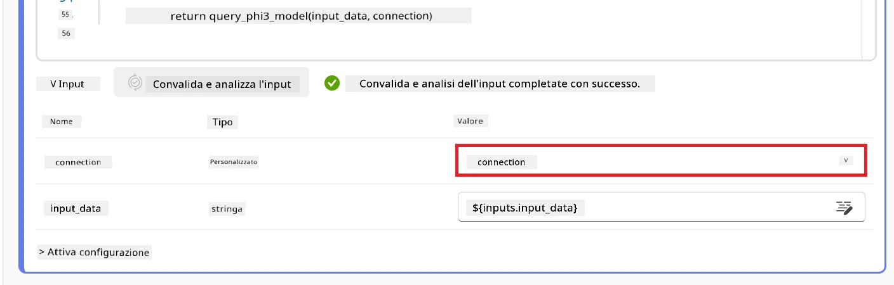

#### Chatta con il tuo modello personalizzato

1. Seleziona **Chat**.

    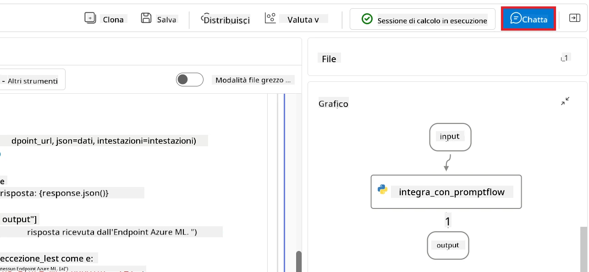

1. Ecco un esempio dei risultati: ora puoi chattare con il tuo modello Phi-3 personalizzato. Si consiglia di fare domande basate sui dati utilizzati per il fine-tuning.

    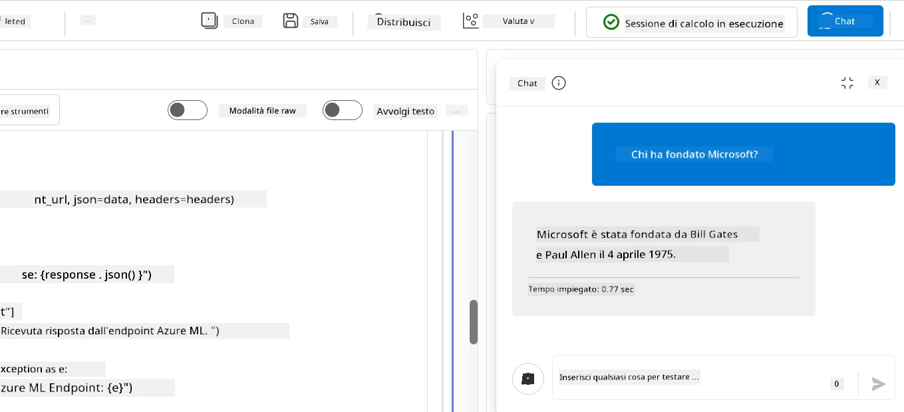

---

<!-- CO-OP TRANSLATOR DISCLAIMER START -->
**Disclaimer**:  
Questo documento è stato tradotto utilizzando il servizio di traduzione automatica AI [Co-op Translator](https://github.com/Azure/co-op-translator). Pur impegnandoci per garantire l’accuratezza, si prega di notare che le traduzioni automatizzate possono contenere errori o imprecisioni. Il documento originale nella sua lingua madre deve essere considerato la fonte autorevole. Per informazioni critiche si raccomanda la traduzione professionale effettuata da un esperto umano. Non ci assumiamo alcuna responsabilità per eventuali malintesi o interpretazioni errate derivanti dall’uso di questa traduzione.
<!-- CO-OP TRANSLATOR DISCLAIMER END -->