<!--
CO_OP_TRANSLATOR_METADATA:
{
  "original_hash": "ecbd9179a21edbaafaf114d47f09f3e3",
  "translation_date": "2025-05-09T18:03:23+00:00",
  "source_file": "md/02.Application/01.TextAndChat/Phi3/E2E_Phi-3-FineTuning_PromptFlow_Integration_AIFoundry.md",
  "language_code": "it"
}
-->
# Fine-tune e integra modelli Phi-3 personalizzati con Prompt flow in Azure AI Foundry

Questo esempio end-to-end (E2E) si basa sulla guida "[Fine-Tune and Integrate Custom Phi-3 Models with Prompt Flow in Azure AI Foundry](https://techcommunity.microsoft.com/t5/educator-developer-blog/fine-tune-and-integrate-custom-phi-3-models-with-prompt-flow-in/ba-p/4191726?WT.mc_id=aiml-137032-kinfeylo)" della Microsoft Tech Community. Introduce i processi di fine-tuning, deployment e integrazione di modelli Phi-3 personalizzati con Prompt flow in Azure AI Foundry.  
A differenza dell'esempio E2E, "[Fine-Tune and Integrate Custom Phi-3 Models with Prompt Flow](./E2E_Phi-3-FineTuning_PromptFlow_Integration.md)", che prevedeva l'esecuzione del codice in locale, questo tutorial si concentra interamente sul fine-tuning e sull'integrazione del modello all’interno di Azure AI / ML Studio.

## Panoramica

In questo esempio E2E imparerai come effettuare il fine-tuning del modello Phi-3 e integrarlo con Prompt flow in Azure AI Foundry. Sfruttando Azure AI / ML Studio, stabilirai un flusso di lavoro per il deployment e l’utilizzo di modelli AI personalizzati. Questo esempio E2E è suddiviso in tre scenari:

**Scenario 1: Configurare le risorse Azure e prepararsi al fine-tuning**

**Scenario 2: Effettuare il fine-tuning del modello Phi-3 e il deployment in Azure Machine Learning Studio**

**Scenario 3: Integrare con Prompt flow e chattare con il modello personalizzato in Azure AI Foundry**

Ecco una panoramica di questo esempio E2E.


### Indice

1. **[Scenario 1: Configurare le risorse Azure e prepararsi al fine-tuning](../../../../../../md/02.Application/01.TextAndChat/Phi3)**
    - [Creare un Azure Machine Learning Workspace](../../../../../../md/02.Application/01.TextAndChat/Phi3)
    - [Richiedere quote GPU nella sottoscrizione Azure](../../../../../../md/02.Application/01.TextAndChat/Phi3)
    - [Aggiungere assegnazione di ruolo](../../../../../../md/02.Application/01.TextAndChat/Phi3)
    - [Configurare il progetto](../../../../../../md/02.Application/01.TextAndChat/Phi3)
    - [Preparare il dataset per il fine-tuning](../../../../../../md/02.Application/01.TextAndChat/Phi3)

1. **[Scenario 2: Effettuare il fine-tuning del modello Phi-3 e fare il deployment in Azure Machine Learning Studio](../../../../../../md/02.Application/01.TextAndChat/Phi3)**
    - [Effettuare il fine-tuning del modello Phi-3](../../../../../../md/02.Application/01.TextAndChat/Phi3)
    - [Fare il deployment del modello Phi-3 fine-tuned](../../../../../../md/02.Application/01.TextAndChat/Phi3)

1. **[Scenario 3: Integrare con Prompt flow e chattare con il modello personalizzato in Azure AI Foundry](../../../../../../md/02.Application/01.TextAndChat/Phi3)**
    - [Integrare il modello Phi-3 personalizzato con Prompt flow](../../../../../../md/02.Application/01.TextAndChat/Phi3)
    - [Chattare con il modello Phi-3 personalizzato](../../../../../../md/02.Application/01.TextAndChat/Phi3)

## Scenario 1: Configurare le risorse Azure e prepararsi al fine-tuning

### Creare un Azure Machine Learning Workspace

1. Digita *azure machine learning* nella **barra di ricerca** in alto nella pagina del portale e seleziona **Azure Machine Learning** tra le opzioni che appaiono.

    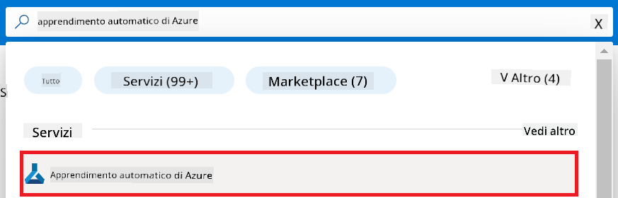

2. Seleziona **+ Create** dal menu di navigazione.

3. Seleziona **New workspace** dal menu di navigazione.

    

4. Esegui le seguenti operazioni:

    - Seleziona la tua **Subscription** Azure.
    - Seleziona il **Resource group** da utilizzare (creane uno nuovo se necessario).
    - Inserisci il **Workspace Name**. Deve essere un valore univoco.
    - Seleziona la **Region** che desideri utilizzare.
    - Seleziona l’**Storage account** da utilizzare (creane uno nuovo se necessario).
    - Seleziona il **Key vault** da utilizzare (creane uno nuovo se necessario).
    - Seleziona gli **Application insights** da utilizzare (creane uno nuovo se necessario).
    - Seleziona il **Container registry** da utilizzare (creane uno nuovo se necessario).

    

5. Seleziona **Review + Create**.

6. Seleziona **Create**.

### Richiedere quote GPU nella sottoscrizione Azure

In questo tutorial imparerai come fare il fine-tuning e il deployment di un modello Phi-3 utilizzando GPU. Per il fine-tuning userai la GPU *Standard_NC24ads_A100_v4*, che richiede una richiesta di quota. Per il deployment userai la GPU *Standard_NC6s_v3*, che richiede anch’essa una richiesta di quota.

> [!NOTE]
>
> Solo le sottoscrizioni Pay-As-You-Go (il tipo standard di sottoscrizione) sono idonee all’allocazione GPU; le sottoscrizioni benefit non sono attualmente supportate.
>

1. Visita [Azure ML Studio](https://ml.azure.com/home?wt.mc_id=studentamb_279723).

1. Esegui le seguenti operazioni per richiedere la quota *Standard NCADSA100v4 Family*:

    - Seleziona **Quota** dalla scheda laterale sinistra.
    - Seleziona la **Virtual machine family** da utilizzare. Ad esempio, seleziona **Standard NCADSA100v4 Family Cluster Dedicated vCPUs**, che include la GPU *Standard_NC24ads_A100_v4*.
    - Seleziona **Request quota** dal menu di navigazione.

        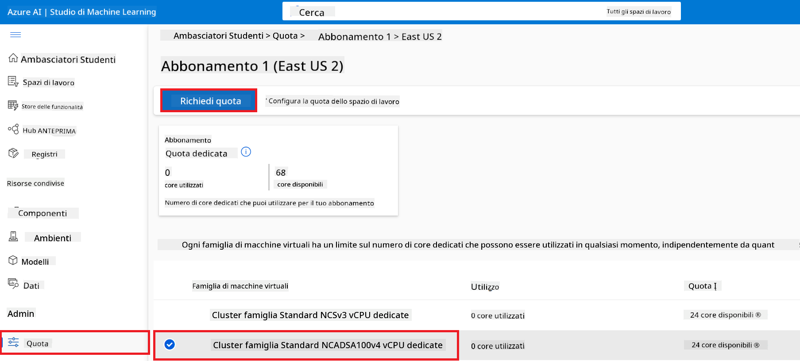

    - Nella pagina Request quota, inserisci il **New cores limit** che desideri utilizzare. Ad esempio, 24.
    - Nella pagina Request quota, seleziona **Submit** per richiedere la quota GPU.

1. Esegui le seguenti operazioni per richiedere la quota *Standard NCSv3 Family*:

    - Seleziona **Quota** dalla scheda laterale sinistra.
    - Seleziona la **Virtual machine family** da utilizzare. Ad esempio, seleziona **Standard NCSv3 Family Cluster Dedicated vCPUs**, che include la GPU *Standard_NC6s_v3*.
    - Seleziona **Request quota** dal menu di navigazione.
    - Nella pagina Request quota, inserisci il **New cores limit** che desideri utilizzare. Ad esempio, 24.
    - Nella pagina Request quota, seleziona **Submit** per richiedere la quota GPU.

### Aggiungere assegnazione di ruolo

Per fare il fine-tuning e il deployment dei tuoi modelli, devi prima creare un User Assigned Managed Identity (UAI) e assegnargli i permessi appropriati. Questa UAI sarà utilizzata per l’autenticazione durante il deployment.

#### Creare User Assigned Managed Identity (UAI)

1. Digita *managed identities* nella **barra di ricerca** in alto nella pagina del portale e seleziona **Managed Identities** tra le opzioni che appaiono.

    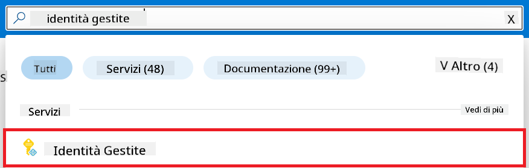

1. Seleziona **+ Create**.

    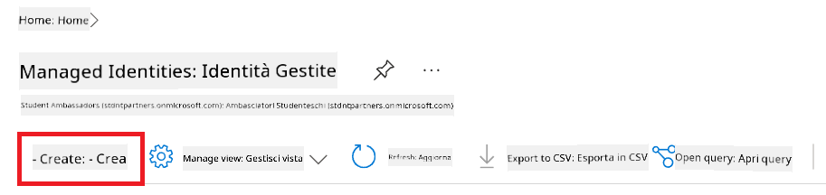

1. Esegui le seguenti operazioni:

    - Seleziona la tua **Subscription** Azure.
    - Seleziona il **Resource group** da utilizzare (creane uno nuovo se necessario).
    - Seleziona la **Region** che desideri utilizzare.
    - Inserisci il **Name**. Deve essere un valore univoco.

    

1. Seleziona **Review + create**.

1. Seleziona **+ Create**.

#### Aggiungere assegnazione ruolo Contributor a Managed Identity

1. Naviga alla risorsa Managed Identity che hai creato.

1. Seleziona **Azure role assignments** dalla scheda laterale sinistra.

1. Seleziona **+Add role assignment** dal menu di navigazione.

1. Nella pagina Add role assignment, esegui le seguenti operazioni:
    - Seleziona **Scope** su **Resource group**.
    - Seleziona la tua **Subscription** Azure.
    - Seleziona il **Resource group** da utilizzare.
    - Seleziona il **Role** su **Contributor**.

    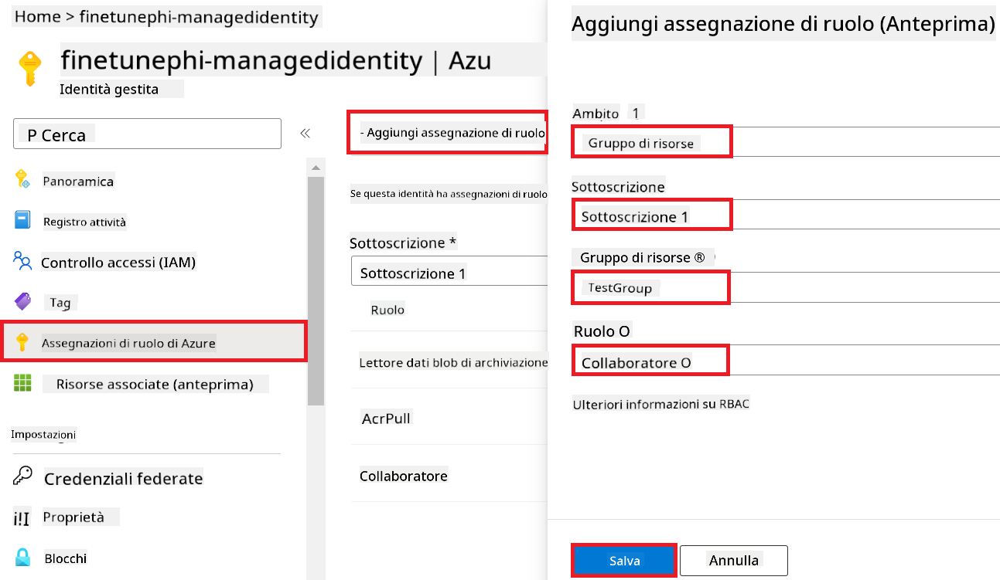

2. Seleziona **Save**.

#### Aggiungere assegnazione ruolo Storage Blob Data Reader a Managed Identity

1. Digita *storage accounts* nella **barra di ricerca** in alto nella pagina del portale e seleziona **Storage accounts** tra le opzioni che appaiono.

    

1. Seleziona l’account di storage associato all’Azure Machine Learning workspace che hai creato. Ad esempio, *finetunephistorage*.

1. Esegui le seguenti operazioni per navigare alla pagina Add role assignment:

    - Naviga all’account di Azure Storage che hai creato.
    - Seleziona **Access Control (IAM)** dalla scheda laterale sinistra.
    - Seleziona **+ Add** dal menu di navigazione.
    - Seleziona **Add role assignment** dal menu di navigazione.

    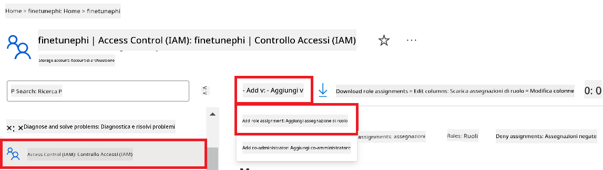

1. Nella pagina Add role assignment, esegui le seguenti operazioni:

    - Nella pagina Role, digita *Storage Blob Data Reader* nella **barra di ricerca** e seleziona **Storage Blob Data Reader** tra le opzioni che appaiono.
    - Nella pagina Role, seleziona **Next**.
    - Nella pagina Members, seleziona **Assign access to** **Managed identity**.
    - Nella pagina Members, seleziona **+ Select members**.
    - Nella pagina Select managed identities, seleziona la tua **Subscription** Azure.
    - Nella pagina Select managed identities, seleziona il **Managed identity** su **Manage Identity**.
    - Nella pagina Select managed identities, seleziona la Manage Identity che hai creato. Ad esempio, *finetunephi-managedidentity*.
    - Nella pagina Select managed identities, seleziona **Select**.

    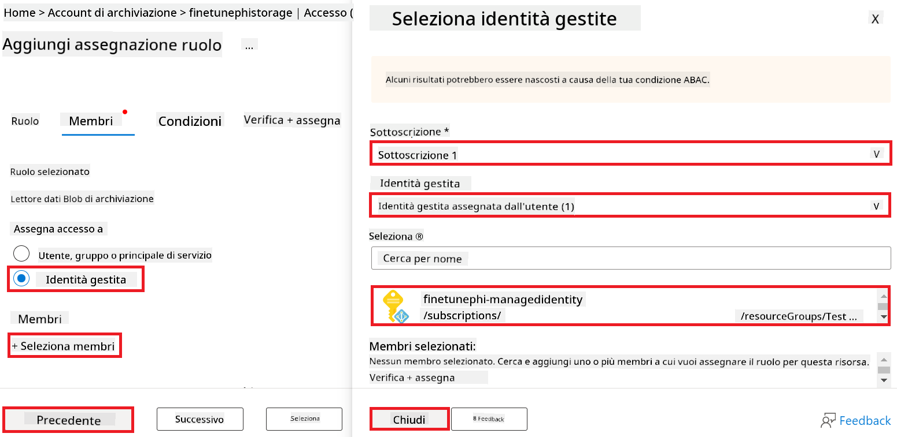

1. Seleziona **Review + assign**.

#### Aggiungere assegnazione ruolo AcrPull a Managed Identity

1. Digita *container registries* nella **barra di ricerca** in alto nella pagina del portale e seleziona **Container registries** tra le opzioni che appaiono.

    

1. Seleziona il container registry associato all’Azure Machine Learning workspace. Ad esempio, *finetunephicontainerregistry*

1. Esegui le seguenti operazioni per navigare alla pagina Add role assignment:

    - Seleziona **Access Control (IAM)** dalla scheda laterale sinistra.
    - Seleziona **+ Add** dal menu di navigazione.
    - Seleziona **Add role assignment** dal menu di navigazione.

1. Nella pagina Add role assignment, esegui le seguenti operazioni:

    - Nella pagina Role, digita *AcrPull* nella **barra di ricerca** e seleziona **AcrPull** tra le opzioni che appaiono.
    - Nella pagina Role, seleziona **Next**.
    - Nella pagina Members, seleziona **Assign access to** **Managed identity**.
    - Nella pagina Members, seleziona **+ Select members**.
    - Nella pagina Select managed identities, seleziona la tua **Subscription** Azure.
    - Nella pagina Select managed identities, seleziona il **Managed identity** su **Manage Identity**.
    - Nella pagina Select managed identities, seleziona la Manage Identity che hai creato. Ad esempio, *finetunephi-managedidentity*.
    - Nella pagina Select managed identities, seleziona **Select**.
    - Seleziona **Review + assign**.

### Configurare il progetto

Per scaricare i dataset necessari al fine-tuning, configurerai un ambiente locale.

In questo esercizio:

- Creerai una cartella in cui lavorare.
- Creerai un ambiente virtuale.
- Installerai i pacchetti richiesti.
- Creerai un file *download_dataset.py* per scaricare il dataset.

#### Creare una cartella in cui lavorare

1. Apri una finestra terminale e digita il comando seguente per creare una cartella chiamata *finetune-phi* nel percorso predefinito.

    ```console
    mkdir finetune-phi
    ```

2. Digita il comando seguente nel terminale per navigare nella cartella *finetune-phi* che hai creato.

    ```console
    cd finetune-phi
    ```

#### Creare un ambiente virtuale

1. Digita il comando seguente nel terminale per creare un ambiente virtuale chiamato *.venv*.

    ```console
    python -m venv .venv
    ```

2. Digita il comando seguente nel terminale per attivare l’ambiente virtuale.

    ```console
    .venv\Scripts\activate.bat
    ```

> [!NOTE]
> Se ha funzionato, dovresti vedere *(.venv)* prima del prompt dei comandi.

#### Installare i pacchetti richiesti

1. Digita i seguenti comandi nel terminale per installare i pacchetti necessari.

    ```console
    pip install datasets==2.19.1
    ```

#### Creare `download_dataset.py`

> [!NOTE]
> Struttura completa della cartella:
>
> ```text
> └── YourUserName
> .    └── finetune-phi
> .        └── download_dataset.py
> ```

1. Apri **Visual Studio Code**.

1. Seleziona **File** nella barra del menu.

1. Seleziona **Open Folder**.

1. Seleziona la cartella *finetune-phi* che hai creato, situata in *C:\Users\yourUserName\finetune-phi*.

    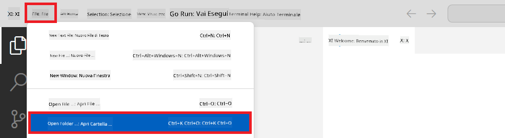

1. Nel pannello a sinistra di Visual Studio Code, clicca con il tasto destro e seleziona **New File** per creare un nuovo file chiamato *download_dataset.py*.

    

### Preparare il dataset per il fine-tuning

In questo esercizio eseguirai il file *download_dataset.py* per scaricare i dataset *ultrachat_200k* nel tuo ambiente locale. Userai poi questi dataset per fare il fine-tuning del modello Phi-3 in Azure Machine Learning.

In questo esercizio:

- Aggiungerai il codice nel file *download_dataset.py* per scaricare i dataset.
- Eseguirai il file *download_dataset.py* per scaricare i dataset nel tuo ambiente locale.

#### Scaricare il dataset usando *download_dataset.py*

1. Apri il file *download_dataset.py* in Visual Studio Code.

1. Aggiungi il codice seguente nel file *download_dataset.py*.

    ```python
    import json
    import os
    from datasets import load_dataset

    def load_and_split_dataset(dataset_name, config_name, split_ratio):
        """
        Load and split a dataset.
        """
        # Load the dataset with the specified name, configuration, and split ratio
        dataset = load_dataset(dataset_name, config_name, split=split_ratio)
        print(f"Original dataset size: {len(dataset)}")
        
        # Split the dataset into train and test sets (80% train, 20% test)
        split_dataset = dataset.train_test_split(test_size=0.2)
        print(f"Train dataset size: {len(split_dataset['train'])}")
        print(f"Test dataset size: {len(split_dataset['test'])}")
        
        return split_dataset

    def save_dataset_to_jsonl(dataset, filepath):
        """
        Save a dataset to a JSONL file.
        """
        # Create the directory if it does not exist
        os.makedirs(os.path.dirname(filepath), exist_ok=True)
        
        # Open the file in write mode
        with open(filepath, 'w', encoding='utf-8') as f:
            # Iterate over each record in the dataset
            for record in dataset:
                # Dump the record as a JSON object and write it to the file
                json.dump(record, f)
                # Write a newline character to separate records
                f.write('\n')
        
        print(f"Dataset saved to {filepath}")

    def main():
        """
        Main function to load, split, and save the dataset.
        """
        # Load and split the ULTRACHAT_200k dataset with a specific configuration and split ratio
        dataset = load_and_split_dataset("HuggingFaceH4/ultrachat_200k", 'default', 'train_sft[:1%]')
        
        # Extract the train and test datasets from the split
        train_dataset = dataset['train']
        test_dataset = dataset['test']

        # Save the train dataset to a JSONL file
        save_dataset_to_jsonl(train_dataset, "data/train_data.jsonl")
        
        # Save the test dataset to a separate JSONL file
        save_dataset_to_jsonl(test_dataset, "data/test_data.jsonl")

    if __name__ == "__main__":
        main()

    ```

1. Digita il comando seguente nel terminale per eseguire lo script e scaricare il dataset nel tuo ambiente locale.

    ```console
    python download_dataset.py
    ```

1. Verifica che i dataset siano stati salvati correttamente nella directory locale *finetune-phi/data*.

> [!NOTE]
>
> #### Nota sulla dimensione del dataset e sul tempo di fine-tuning
>
> In questo tutorial usi solo l’1% del dataset (`split='train[:1%]'`). Questo riduce significativamente la quantità di dati, accelerando sia il caricamento sia il processo di fine-tuning. Puoi regolare la percentuale per trovare il giusto equilibrio tra tempo di addestramento e prestazioni del modello. Usare un sottoinsieme più piccolo del dataset riduce il tempo necessario per il fine-tuning, rendendo il processo più gestibile per un tutorial.

## Scenario 2: Effettuare il fine-tuning del modello Phi-3 e fare il deployment in Azure Machine Learning Studio

### Effettuare il fine-tuning del modello Phi-3

In questo esercizio farai il fine-tuning del modello Phi-3 in Azure Machine Learning Studio.

In questo esercizio:

- Creerai un cluster di calcolo per il fine-tuning.
- Effettuerai il fine-tuning del modello Phi-3 in Azure Machine Learning Studio.

#### Creare un cluster di calcolo per il fine-tuning
1. Visita [Azure ML Studio](https://ml.azure.com/home?wt.mc_id=studentamb_279723).

1. Selecciona **Compute** en la pestaña lateral izquierda.

1. Selecciona **Compute clusters** en el menú de navegación.

1. Selecciona **+ New**.

    

1. Realiza las siguientes tareas:

    - Selecciona la **Region** que deseas usar.
    - Selecciona el **Virtual machine tier** a **Dedicated**.
    - Selecciona el **Virtual machine type** a **GPU**.
    - Filtra el **Virtual machine size** a **Select from all options**.
    - Selecciona el **Virtual machine size** a **Standard_NC24ads_A100_v4**.

    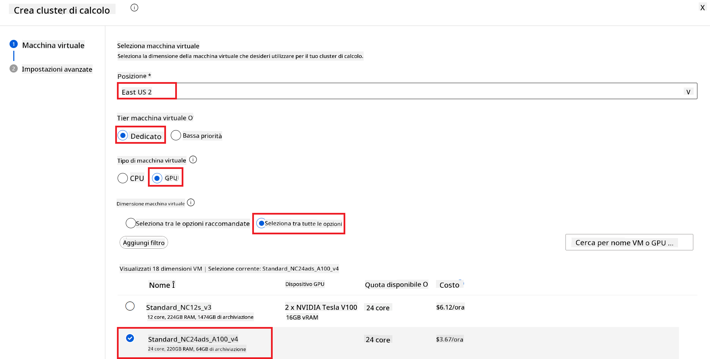

1. Selecciona **Next**.

1. Realiza las siguientes tareas:

    - Introduce el **Compute name**. Debe ser un valor único.
    - Selecciona el **Minimum number of nodes** a **0**.
    - Selecciona el **Maximum number of nodes** a **1**.
    - Selecciona el **Idle seconds before scale down** a **120**.

    

1. Selecciona **Create**.

#### Ajusta finamente el modelo Phi-3

1. Visita [Azure ML Studio](https://ml.azure.com/home?wt.mc_id=studentamb_279723).

1. Selecciona el espacio de trabajo de Azure Machine Learning que creaste.

    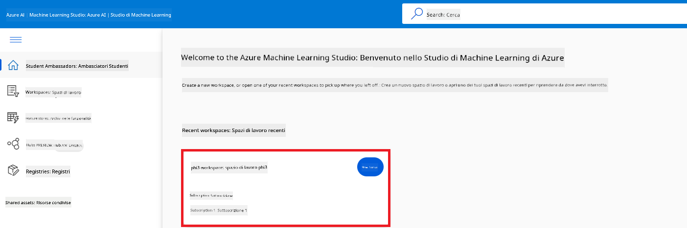

1. Realiza las siguientes tareas:

    - Selecciona **Model catalog** en la pestaña lateral izquierda.
    - Escribe *phi-3-mini-4k* en la **barra de búsqueda** y selecciona **Phi-3-mini-4k-instruct** de las opciones que aparecen.

    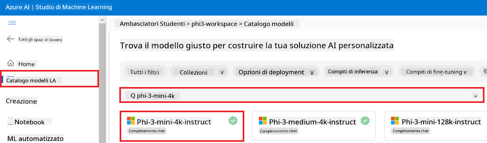

1. Selecciona **Fine-tune** en el menú de navegación.

    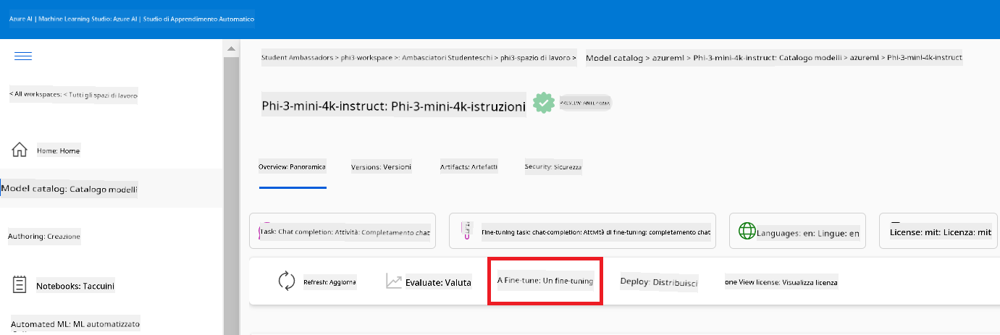

1. Realiza las siguientes tareas:

    - Selecciona **Select task type** a **Chat completion**.
    - Selecciona **+ Select data** para subir los **Traning data**.
    - Selecciona el tipo de subida de datos de validación a **Provide different validation data**.
    - Selecciona **+ Select data** para subir los **Validation data**.

    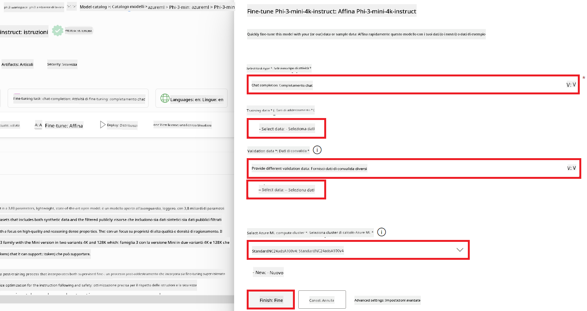

    > [!TIP]
    >
    > Puedes seleccionar **Advanced settings** para personalizar configuraciones como **learning_rate** y **lr_scheduler_type** y optimizar el proceso de fine-tuning según tus necesidades específicas.

1. Selecciona **Finish**.

1. En este ejercicio, ajustaste finamente el modelo Phi-3 usando Azure Machine Learning. Ten en cuenta que el proceso de fine-tuning puede tomar bastante tiempo. Después de iniciar el trabajo de fine-tuning, debes esperar a que finalice. Puedes monitorear el estado del trabajo navegando a la pestaña Jobs en el lado izquierdo de tu espacio de trabajo de Azure Machine Learning. En la siguiente serie, desplegarás el modelo ajustado e integrarás Prompt flow.

    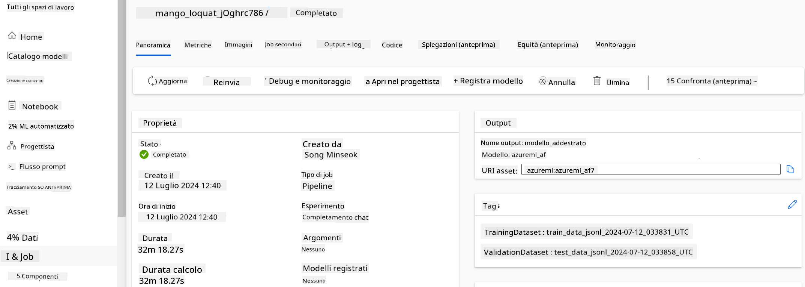

### Despliega el modelo Phi-3 ajustado

Para integrar el modelo Phi-3 ajustado con Prompt flow, necesitas desplegar el modelo para que esté disponible para inferencias en tiempo real. Este proceso incluye registrar el modelo, crear un endpoint online y desplegar el modelo.

En este ejercicio, harás lo siguiente:

- Registrar el modelo ajustado en el espacio de trabajo de Azure Machine Learning.
- Crear un endpoint online.
- Desplegar el modelo Phi-3 ajustado registrado.

#### Registra el modelo ajustado

1. Visita [Azure ML Studio](https://ml.azure.com/home?wt.mc_id=studentamb_279723).

1. Selecciona el espacio de trabajo de Azure Machine Learning que creaste.

    

1. Selecciona **Models** en la pestaña lateral izquierda.
1. Selecciona **+ Register**.
1. Selecciona **From a job output**.

    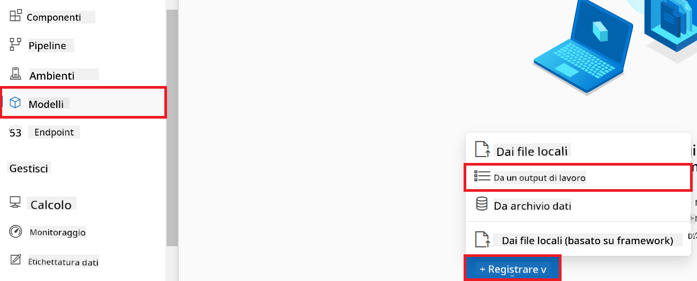

1. Selecciona el job que creaste.

    

1. Selecciona **Next**.

1. Selecciona **Model type** a **MLflow**.

1. Asegúrate de que **Job output** esté seleccionado; debería estar seleccionado automáticamente.

    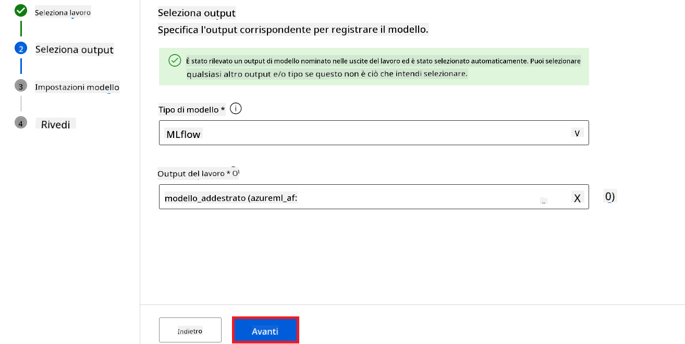

2. Selecciona **Next**.

3. Selecciona **Register**.

    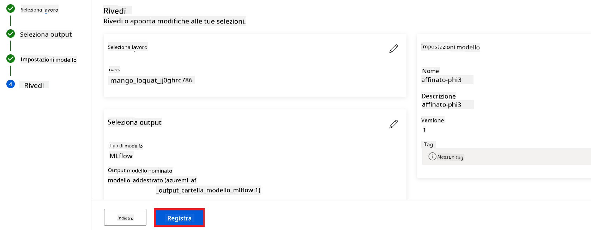

4. Puedes ver tu modelo registrado navegando al menú **Models** en la pestaña lateral izquierda.

    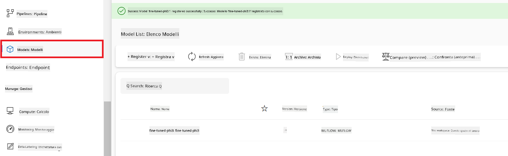

#### Despliega el modelo ajustado

1. Navega al espacio de trabajo de Azure Machine Learning que creaste.

1. Selecciona **Endpoints** en la pestaña lateral izquierda.

1. Selecciona **Real-time endpoints** en el menú de navegación.

    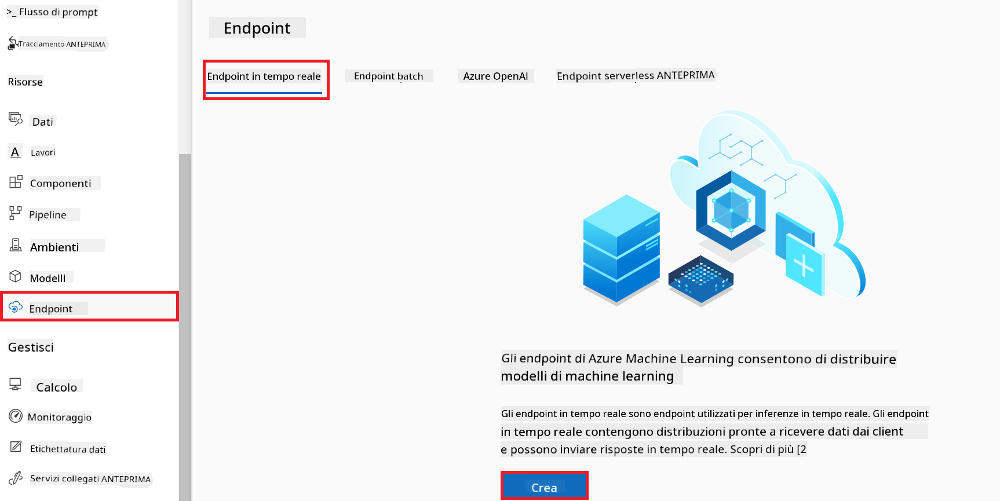

1. Selecciona **Create**.

1. Selecciona el modelo registrado que creaste.

    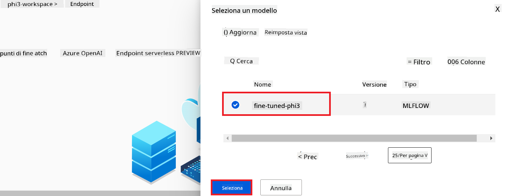

1. Selecciona **Select**.

1. Realiza las siguientes tareas:

    - Selecciona **Virtual machine** a *Standard_NC6s_v3*.
    - Selecciona la **Instance count** que deseas usar. Por ejemplo, *1*.
    - Selecciona **Endpoint** a **New** para crear un endpoint.
    - Introduce el **Endpoint name**. Debe ser un valor único.
    - Introduce el **Deployment name**. Debe ser un valor único.

    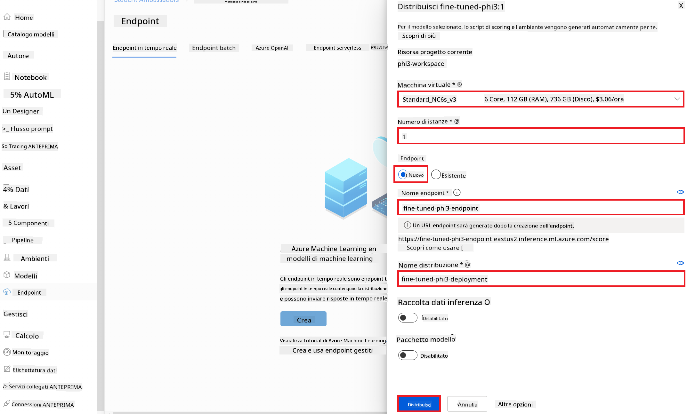

1. Selecciona **Deploy**.

> [!WARNING]
> Para evitar cargos adicionales en tu cuenta, asegúrate de eliminar el endpoint creado en el espacio de trabajo de Azure Machine Learning.
>

#### Verifica el estado del despliegue en Azure Machine Learning Workspace

1. Navega al espacio de trabajo de Azure Machine Learning que creaste.

1. Selecciona **Endpoints** en la pestaña lateral izquierda.

1. Selecciona el endpoint que creaste.

    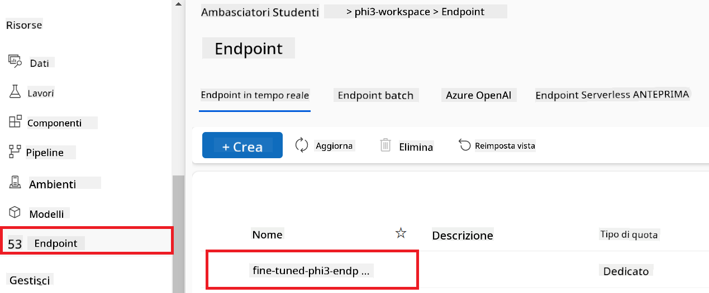

1. En esta página, puedes gestionar los endpoints durante el proceso de despliegue.

> [!NOTE]
> Una vez que el despliegue esté completo, asegúrate de que **Live traffic** esté configurado al **100%**. Si no es así, selecciona **Update traffic** para ajustar la configuración del tráfico. Ten en cuenta que no puedes probar el modelo si el tráfico está en 0%.
>
> 
>

## Escenario 3: Integrar con Prompt flow y chatear con tu modelo personalizado en Azure AI Foundry

### Integra el modelo personalizado Phi-3 con Prompt flow

Después de desplegar con éxito tu modelo ajustado, ahora puedes integrarlo con Prompt Flow para usarlo en aplicaciones en tiempo real, permitiendo una variedad de tareas interactivas con tu modelo personalizado Phi-3.

En este ejercicio, harás lo siguiente:

- Crear Azure AI Foundry Hub.
- Crear Azure AI Foundry Project.
- Crear Prompt flow.
- Añadir una conexión personalizada para el modelo Phi-3 ajustado.
- Configurar Prompt flow para chatear con tu modelo Phi-3 personalizado.

> [!NOTE]
> También puedes integrar con Promptflow usando Azure ML Studio. El mismo proceso de integración se puede aplicar en Azure ML Studio.

#### Crea Azure AI Foundry Hub

Necesitas crear un Hub antes de crear el Proyecto. Un Hub funciona como un Grupo de Recursos, permitiéndote organizar y gestionar múltiples Proyectos dentro de Azure AI Foundry.

1. Visita [Azure AI Foundry](https://ai.azure.com/?WT.mc_id=aiml-137032-kinfeylo).

1. Selecciona **All hubs** en la pestaña lateral izquierda.

1. Selecciona **+ New hub** en el menú de navegación.

    

1. Realiza las siguientes tareas:

    - Introduce el **Hub name**. Debe ser un valor único.
    - Selecciona tu **Subscription** de Azure.
    - Selecciona el **Resource group** que usarás (crea uno nuevo si es necesario).
    - Selecciona la **Location** que deseas usar.
    - Selecciona **Connect Azure AI Services** para usar (crea uno nuevo si es necesario).
    - Selecciona **Connect Azure AI Search** a **Skip connecting**.

    

1. Selecciona **Next**.

#### Crea Azure AI Foundry Project

1. En el Hub que creaste, selecciona **All projects** en la pestaña lateral izquierda.

1. Selecciona **+ New project** en el menú de navegación.

    

1. Introduce el **Project name**. Debe ser un valor único.

    

1. Selecciona **Create a project**.

#### Añade una conexión personalizada para el modelo Phi-3 ajustado

Para integrar tu modelo Phi-3 personalizado con Prompt flow, necesitas guardar el endpoint y la clave del modelo en una conexión personalizada. Esta configuración garantiza el acceso a tu modelo Phi-3 personalizado desde Prompt flow.

#### Configura la api key y el endpoint uri del modelo Phi-3 ajustado

1. Visita [Azure ML Studio](https://ml.azure.com/home?WT.mc_id=aiml-137032-kinfeylo).

1. Navega al espacio de trabajo de Azure Machine Learning que creaste.

1. Selecciona **Endpoints** en la pestaña lateral izquierda.

    

1. Selecciona el endpoint que creaste.

    

1. Selecciona **Consume** en el menú de navegación.

1. Copia tu **REST endpoint** y tu **Primary key**.


#### Aggiungi la Connessione Personalizzata

1. Visita [Azure AI Foundry](https://ai.azure.com/?WT.mc_id=aiml-137032-kinfeylo).

1. Vai al progetto Azure AI Foundry che hai creato.

1. Nel progetto che hai creato, seleziona **Settings** dal menu laterale a sinistra.

1. Seleziona **+ New connection**.

    

1. Seleziona **Custom keys** dal menu di navigazione.

    

1. Esegui le seguenti operazioni:

    - Seleziona **+ Add key value pairs**.
    - Per il nome della chiave, inserisci **endpoint** e incolla l'endpoint copiato da Azure ML Studio nel campo valore.
    - Seleziona di nuovo **+ Add key value pairs**.
    - Per il nome della chiave, inserisci **key** e incolla la chiave copiata da Azure ML Studio nel campo valore.
    - Dopo aver aggiunto le chiavi, seleziona **is secret** per evitare che la chiave venga esposta.

    

1. Seleziona **Add connection**.

#### Crea Prompt flow

Hai aggiunto una connessione personalizzata in Azure AI Foundry. Ora, creiamo un Prompt flow seguendo questi passaggi. Successivamente, collegherai questo Prompt flow alla connessione personalizzata per poter utilizzare il modello fine-tuned all’interno del Prompt flow.

1. Vai al progetto Azure AI Foundry che hai creato.

1. Seleziona **Prompt flow** dal menu laterale a sinistra.

1. Seleziona **+ Create** dal menu di navigazione.

    

1. Seleziona **Chat flow** dal menu di navigazione.

    

1. Inserisci il **Nome della cartella** da utilizzare.

    

2. Seleziona **Create**.

#### Configura Prompt flow per chattare con il tuo modello Phi-3 personalizzato

Devi integrare il modello Phi-3 fine-tuned in un Prompt flow. Tuttavia, il Prompt flow esistente non è progettato per questo scopo. Pertanto, è necessario riprogettare il Prompt flow per consentire l’integrazione del modello personalizzato.

1. Nel Prompt flow, esegui le seguenti operazioni per ricostruire il flusso esistente:

    - Seleziona **Raw file mode**.
    - Elimina tutto il codice esistente nel file *flow.dag.yml*.
    - Aggiungi il codice seguente nel file *flow.dag.yml*.

        ```yml
        inputs:
          input_data:
            type: string
            default: "Who founded Microsoft?"

        outputs:
          answer:
            type: string
            reference: ${integrate_with_promptflow.output}

        nodes:
        - name: integrate_with_promptflow
          type: python
          source:
            type: code
            path: integrate_with_promptflow.py
          inputs:
            input_data: ${inputs.input_data}
        ```

    - Seleziona **Save**.

    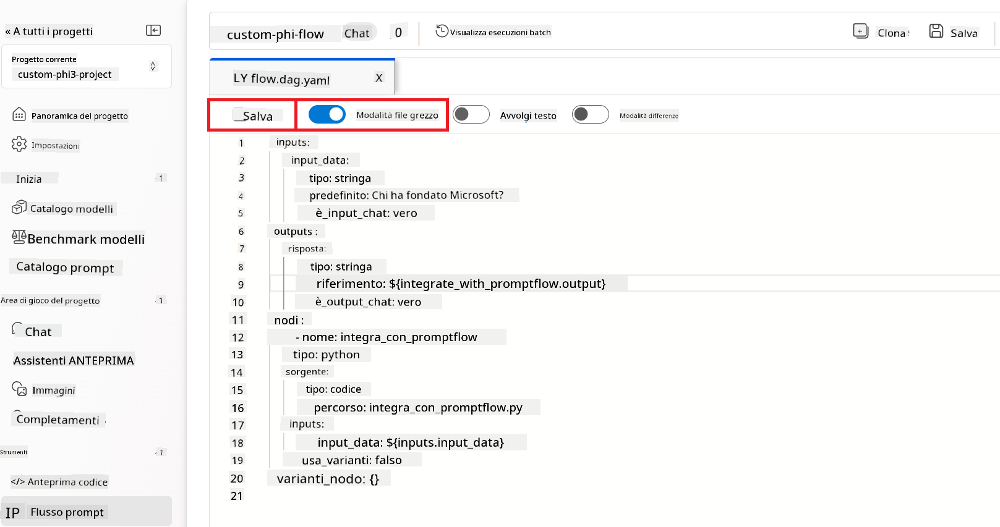

1. Aggiungi il codice seguente al file *integrate_with_promptflow.py* per usare il modello Phi-3 personalizzato nel Prompt flow.

    ```python
    import logging
    import requests
    from promptflow import tool
    from promptflow.connections import CustomConnection

    # Logging setup
    logging.basicConfig(
        format="%(asctime)s - %(levelname)s - %(name)s - %(message)s",
        datefmt="%Y-%m-%d %H:%M:%S",
        level=logging.DEBUG
    )
    logger = logging.getLogger(__name__)

    def query_phi3_model(input_data: str, connection: CustomConnection) -> str:
        """
        Send a request to the Phi-3 model endpoint with the given input data using Custom Connection.
        """

        # "connection" is the name of the Custom Connection, "endpoint", "key" are the keys in the Custom Connection
        endpoint_url = connection.endpoint
        api_key = connection.key

        headers = {
            "Content-Type": "application/json",
            "Authorization": f"Bearer {api_key}"
        }
        data = {
            "input_data": {
                "input_string": [
                    {"role": "user", "content": input_data}
                ],
                "parameters": {
                    "temperature": 0.7,
                    "max_new_tokens": 128
                }
            }
        }
        try:
            response = requests.post(endpoint_url, json=data, headers=headers)
            response.raise_for_status()
            
            # Log the full JSON response
            logger.debug(f"Full JSON response: {response.json()}")

            result = response.json()["output"]
            logger.info("Successfully received response from Azure ML Endpoint.")
            return result
        except requests.exceptions.RequestException as e:
            logger.error(f"Error querying Azure ML Endpoint: {e}")
            raise

    @tool
    def my_python_tool(input_data: str, connection: CustomConnection) -> str:
        """
        Tool function to process input data and query the Phi-3 model.
        """
        return query_phi3_model(input_data, connection)

    ```

    

> [!NOTE]
> Per informazioni più dettagliate sull’uso di Prompt flow in Azure AI Foundry, puoi consultare [Prompt flow in Azure AI Foundry](https://learn.microsoft.com/azure/ai-studio/how-to/prompt-flow).

1. Seleziona **Chat input**, **Chat output** per abilitare la chat con il tuo modello.

    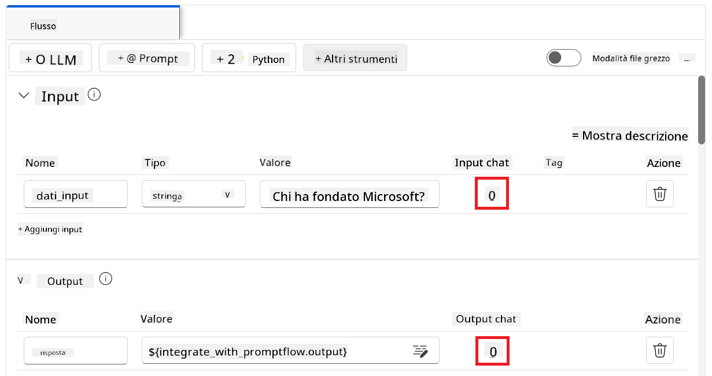

1. Ora sei pronto per chattare con il tuo modello Phi-3 personalizzato. Nel prossimo esercizio, imparerai come avviare Prompt flow e usarlo per interagire con il tuo modello Phi-3 fine-tuned.

> [!NOTE]
>
> Il flusso ricostruito dovrebbe apparire come nell’immagine sottostante:
>
> 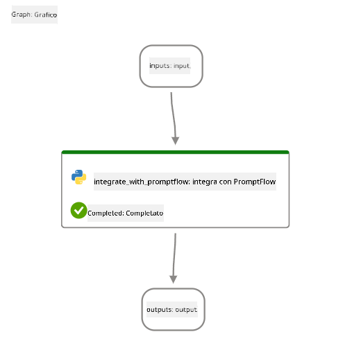
>

### Chatta con il tuo modello Phi-3 personalizzato

Ora che hai fine-tuned e integrato il tuo modello Phi-3 personalizzato con Prompt flow, sei pronto per iniziare a interagire con esso. Questo esercizio ti guiderà nel processo di configurazione e avvio di una chat con il tuo modello usando Prompt flow. Seguendo questi passaggi, potrai sfruttare appieno le capacità del tuo modello Phi-3 fine-tuned per vari compiti e conversazioni.

- Chatta con il tuo modello Phi-3 personalizzato usando Prompt flow.

#### Avvia Prompt flow

1. Seleziona **Start compute sessions** per avviare Prompt flow.

    

1. Seleziona **Validate and parse input** per aggiornare i parametri.

    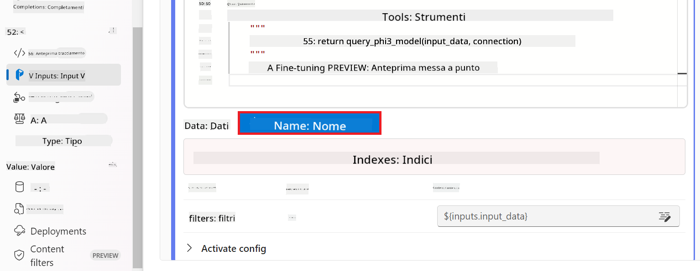

1. Seleziona il **Valore** della **connection** corrispondente alla connessione personalizzata che hai creato. Ad esempio, *connection*.

    

#### Chatta con il tuo modello personalizzato

1. Seleziona **Chat**.

    

1. Ecco un esempio dei risultati: ora puoi chattare con il tuo modello Phi-3 personalizzato. È consigliabile porre domande basate sui dati usati per il fine-tuning.

    

**Disclaimer**:  
Questo documento è stato tradotto utilizzando il servizio di traduzione automatica AI [Co-op Translator](https://github.com/Azure/co-op-translator). Pur impegnandoci per l’accuratezza, si prega di notare che le traduzioni automatiche possono contenere errori o inesattezze. Il documento originale nella sua lingua nativa deve essere considerato la fonte autorevole. Per informazioni critiche, si raccomanda una traduzione professionale effettuata da un umano. Non ci assumiamo responsabilità per eventuali incomprensioni o interpretazioni errate derivanti dall’uso di questa traduzione.