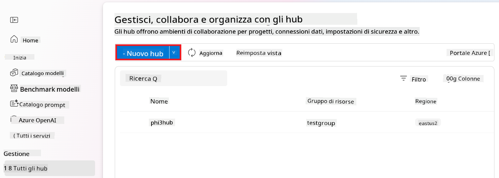
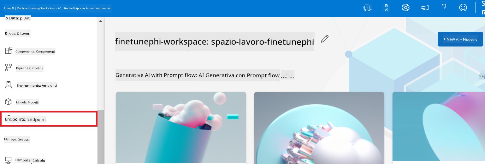
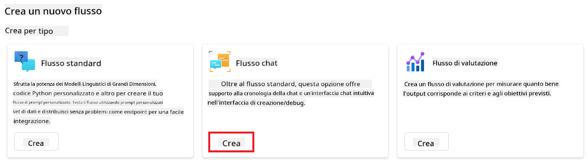

<!--
CO_OP_TRANSLATOR_METADATA:
{
  "original_hash": "ecbd9179a21edbaafaf114d47f09f3e3",
  "translation_date": "2025-07-17T01:25:01+00:00",
  "source_file": "md/02.Application/01.TextAndChat/Phi3/E2E_Phi-3-FineTuning_PromptFlow_Integration_AIFoundry.md",
  "language_code": "it"
}
-->
# Fine-tune e integra modelli Phi-3 personalizzati con Prompt flow in Azure AI Foundry

Questo esempio end-to-end (E2E) si basa sulla guida "[Fine-Tune and Integrate Custom Phi-3 Models with Prompt Flow in Azure AI Foundry](https://techcommunity.microsoft.com/t5/educator-developer-blog/fine-tune-and-integrate-custom-phi-3-models-with-prompt-flow-in/ba-p/4191726?WT.mc_id=aiml-137032-kinfeylo)" della Microsoft Tech Community. Introduce i processi di fine-tuning, distribuzione e integrazione di modelli Phi-3 personalizzati con Prompt flow in Azure AI Foundry.  
A differenza dell’esempio E2E, "[Fine-Tune and Integrate Custom Phi-3 Models with Prompt Flow](./E2E_Phi-3-FineTuning_PromptFlow_Integration.md)", che prevedeva l’esecuzione del codice in locale, questo tutorial si concentra interamente sul fine-tuning e sull’integrazione del modello all’interno di Azure AI / ML Studio.

## Panoramica

In questo esempio E2E imparerai come effettuare il fine-tuning del modello Phi-3 e integrarlo con Prompt flow in Azure AI Foundry. Sfruttando Azure AI / ML Studio, creerai un flusso di lavoro per distribuire e utilizzare modelli AI personalizzati. Questo esempio E2E è suddiviso in tre scenari:

**Scenario 1: Configurare le risorse Azure e prepararsi al fine-tuning**

**Scenario 2: Effettuare il fine-tuning del modello Phi-3 e distribuirlo in Azure Machine Learning Studio**

**Scenario 3: Integrare con Prompt flow e chattare con il modello personalizzato in Azure AI Foundry**

Ecco una panoramica di questo esempio E2E.


### Indice

1. **[Scenario 1: Configurare le risorse Azure e prepararsi al fine-tuning](../../../../../../md/02.Application/01.TextAndChat/Phi3)**
    - [Creare un Azure Machine Learning Workspace](../../../../../../md/02.Application/01.TextAndChat/Phi3)
    - [Richiedere quote GPU nella sottoscrizione Azure](../../../../../../md/02.Application/01.TextAndChat/Phi3)
    - [Aggiungere un’assegnazione di ruolo](../../../../../../md/02.Application/01.TextAndChat/Phi3)
    - [Configurare il progetto](../../../../../../md/02.Application/01.TextAndChat/Phi3)
    - [Preparare il dataset per il fine-tuning](../../../../../../md/02.Application/01.TextAndChat/Phi3)

1. **[Scenario 2: Effettuare il fine-tuning del modello Phi-3 e distribuirlo in Azure Machine Learning Studio](../../../../../../md/02.Application/01.TextAndChat/Phi3)**
    - [Effettuare il fine-tuning del modello Phi-3](../../../../../../md/02.Application/01.TextAndChat/Phi3)
    - [Distribuire il modello Phi-3 fine-tuned](../../../../../../md/02.Application/01.TextAndChat/Phi3)

1. **[Scenario 3: Integrare con Prompt flow e chattare con il modello personalizzato in Azure AI Foundry](../../../../../../md/02.Application/01.TextAndChat/Phi3)**
    - [Integrare il modello Phi-3 personalizzato con Prompt flow](../../../../../../md/02.Application/01.TextAndChat/Phi3)
    - [Chattare con il modello Phi-3 personalizzato](../../../../../../md/02.Application/01.TextAndChat/Phi3)

## Scenario 1: Configurare le risorse Azure e prepararsi al fine-tuning

### Creare un Azure Machine Learning Workspace

1. Digita *azure machine learning* nella **barra di ricerca** in alto nella pagina del portale e seleziona **Azure Machine Learning** tra le opzioni che appaiono.

    

2. Seleziona **+ Create** dal menu di navigazione.

3. Seleziona **New workspace** dal menu di navigazione.

    

4. Esegui le seguenti operazioni:

    - Seleziona la tua **Subscription** Azure.
    - Seleziona il **Resource group** da utilizzare (creane uno nuovo se necessario).
    - Inserisci il **Workspace Name**. Deve essere un valore univoco.
    - Seleziona la **Regione** che desideri utilizzare.
    - Seleziona il **Storage account** da utilizzare (creane uno nuovo se necessario).
    - Seleziona il **Key vault** da utilizzare (creane uno nuovo se necessario).
    - Seleziona gli **Application insights** da utilizzare (creane uno nuovo se necessario).
    - Seleziona il **Container registry** da utilizzare (creane uno nuovo se necessario).

    

5. Seleziona **Review + Create**.

6. Seleziona **Create**.

### Richiedere quote GPU nella sottoscrizione Azure

In questo tutorial imparerai come effettuare il fine-tuning e distribuire un modello Phi-3 utilizzando GPU. Per il fine-tuning userai la GPU *Standard_NC24ads_A100_v4*, che richiede una richiesta di quota. Per la distribuzione userai la GPU *Standard_NC6s_v3*, che richiede anch’essa una richiesta di quota.

> [!NOTE]
>
> Solo le sottoscrizioni Pay-As-You-Go (il tipo di sottoscrizione standard) sono idonee per l’allocazione GPU; le sottoscrizioni benefit non sono attualmente supportate.
>

1. Visita [Azure ML Studio](https://ml.azure.com/home?wt.mc_id=studentamb_279723).

1. Esegui le seguenti operazioni per richiedere la quota *Standard NCADSA100v4 Family*:

    - Seleziona **Quota** dalla scheda a sinistra.
    - Seleziona la **Virtual machine family** da utilizzare. Ad esempio, seleziona **Standard NCADSA100v4 Family Cluster Dedicated vCPUs**, che include la GPU *Standard_NC24ads_A100_v4*.
    - Seleziona **Request quota** dal menu di navigazione.

        

    - Nella pagina Request quota, inserisci il **New cores limit** che desideri utilizzare. Ad esempio, 24.
    - Nella pagina Request quota, seleziona **Submit** per richiedere la quota GPU.

1. Esegui le seguenti operazioni per richiedere la quota *Standard NCSv3 Family*:

    - Seleziona **Quota** dalla scheda a sinistra.
    - Seleziona la **Virtual machine family** da utilizzare. Ad esempio, seleziona **Standard NCSv3 Family Cluster Dedicated vCPUs**, che include la GPU *Standard_NC6s_v3*.
    - Seleziona **Request quota** dal menu di navigazione.
    - Nella pagina Request quota, inserisci il **New cores limit** che desideri utilizzare. Ad esempio, 24.
    - Nella pagina Request quota, seleziona **Submit** per richiedere la quota GPU.

### Aggiungere un’assegnazione di ruolo

Per effettuare il fine-tuning e distribuire i tuoi modelli, devi prima creare un’Identità Gestita Assegnata all’Utente (User Assigned Managed Identity, UAI) e assegnarle i permessi appropriati. Questa UAI sarà utilizzata per l’autenticazione durante la distribuzione.

#### Creare una User Assigned Managed Identity (UAI)

1. Digita *managed identities* nella **barra di ricerca** in alto nella pagina del portale e seleziona **Managed Identities** tra le opzioni che appaiono.

    

1. Seleziona **+ Create**.

    

1. Esegui le seguenti operazioni:

    - Seleziona la tua **Subscription** Azure.
    - Seleziona il **Resource group** da utilizzare (creane uno nuovo se necessario).
    - Seleziona la **Regione** che desideri utilizzare.
    - Inserisci il **Nome**. Deve essere un valore univoco.

    

1. Seleziona **Review + create**.

1. Seleziona **+ Create**.

#### Aggiungere l’assegnazione di ruolo Contributor alla Managed Identity

1. Vai alla risorsa Managed Identity che hai creato.

1. Seleziona **Azure role assignments** dalla scheda a sinistra.

1. Seleziona **+Add role assignment** dal menu di navigazione.

1. Nella pagina Add role assignment, esegui le seguenti operazioni:
    - Seleziona lo **Scope** su **Resource group**.
    - Seleziona la tua **Subscription** Azure.
    - Seleziona il **Resource group** da utilizzare.
    - Seleziona il **Role** su **Contributor**.

    

2. Seleziona **Save**.

#### Aggiungere l’assegnazione di ruolo Storage Blob Data Reader alla Managed Identity

1. Digita *storage accounts* nella **barra di ricerca** in alto nella pagina del portale e seleziona **Storage accounts** tra le opzioni che appaiono.

    

1. Seleziona l’account di archiviazione associato all’Azure Machine Learning workspace che hai creato. Ad esempio, *finetunephistorage*.

1. Esegui le seguenti operazioni per navigare alla pagina Add role assignment:

    - Vai all’account di archiviazione Azure che hai creato.
    - Seleziona **Access Control (IAM)** dalla scheda a sinistra.
    - Seleziona **+ Add** dal menu di navigazione.
    - Seleziona **Add role assignment** dal menu di navigazione.

    

1. Nella pagina Add role assignment, esegui le seguenti operazioni:

    - Nella pagina Role, digita *Storage Blob Data Reader* nella **barra di ricerca** e seleziona **Storage Blob Data Reader** tra le opzioni che appaiono.
    - Nella pagina Role, seleziona **Next**.
    - Nella pagina Members, seleziona **Assign access to** **Managed identity**.
    - Nella pagina Members, seleziona **+ Select members**.
    - Nella pagina Select managed identities, seleziona la tua **Subscription** Azure.
    - Nella pagina Select managed identities, seleziona la **Managed identity** su **Manage Identity**.
    - Nella pagina Select managed identities, seleziona la Managed Identity che hai creato. Ad esempio, *finetunephi-managedidentity*.
    - Nella pagina Select managed identities, seleziona **Select**.

    

1. Seleziona **Review + assign**.

#### Aggiungere l’assegnazione di ruolo AcrPull alla Managed Identity

1. Digita *container registries* nella **barra di ricerca** in alto nella pagina del portale e seleziona **Container registries** tra le opzioni che appaiono.

    

1. Seleziona il container registry associato all’Azure Machine Learning workspace. Ad esempio, *finetunephicontainerregistry*

1. Esegui le seguenti operazioni per navigare alla pagina Add role assignment:

    - Seleziona **Access Control (IAM)** dalla scheda a sinistra.
    - Seleziona **+ Add** dal menu di navigazione.
    - Seleziona **Add role assignment** dal menu di navigazione.

1. Nella pagina Add role assignment, esegui le seguenti operazioni:

    - Nella pagina Role, digita *AcrPull* nella **barra di ricerca** e seleziona **AcrPull** tra le opzioni che appaiono.
    - Nella pagina Role, seleziona **Next**.
    - Nella pagina Members, seleziona **Assign access to** **Managed identity**.
    - Nella pagina Members, seleziona **+ Select members**.
    - Nella pagina Select managed identities, seleziona la tua **Subscription** Azure.
    - Nella pagina Select managed identities, seleziona la **Managed identity** su **Manage Identity**.
    - Nella pagina Select managed identities, seleziona la Managed Identity che hai creato. Ad esempio, *finetunephi-managedidentity*.
    - Nella pagina Select managed identities, seleziona **Select**.
    - Seleziona **Review + assign**.

### Configurare il progetto

Per scaricare i dataset necessari al fine-tuning, configurerai un ambiente locale.

In questo esercizio:

- Creerai una cartella in cui lavorare.
- Creerai un ambiente virtuale.
- Installerai i pacchetti richiesti.
- Creerai un file *download_dataset.py* per scaricare il dataset.

#### Creare una cartella in cui lavorare

1. Apri una finestra del terminale e digita il comando seguente per creare una cartella chiamata *finetune-phi* nel percorso predefinito.

    ```console
    mkdir finetune-phi
    ```

2. Digita il comando seguente nel terminale per navigare nella cartella *finetune-phi* che hai creato.
#### Crea un ambiente virtuale

1. Digita il seguente comando nel terminale per creare un ambiente virtuale chiamato *.venv*.

    ```console
    python -m venv .venv
    ```

2. Digita il seguente comando nel terminale per attivare l'ambiente virtuale.

    ```console
    .venv\Scripts\activate.bat
    ```


> [!NOTE]
> Se ha funzionato, dovresti vedere *(.venv)* prima del prompt dei comandi.

#### Installa i pacchetti richiesti

1. Digita i seguenti comandi nel terminale per installare i pacchetti necessari.

    ```console
    pip install datasets==2.19.1
    ```

#### Crea `download_dataset.py`

> [!NOTE]
> Struttura completa della cartella:
>
> ```text
> └── YourUserName
> .    └── finetune-phi
> .        └── download_dataset.py
> ```

1. Apri **Visual Studio Code**.

1. Seleziona **File** dalla barra del menu.

1. Seleziona **Apri cartella**.

1. Seleziona la cartella *finetune-phi* che hai creato, situata in *C:\Users\yourUserName\finetune-phi*.

    

1. Nel pannello a sinistra di Visual Studio Code, clicca con il tasto destro e seleziona **Nuovo file** per creare un nuovo file chiamato *download_dataset.py*.

    

### Prepara il dataset per il fine-tuning

In questo esercizio eseguirai il file *download_dataset.py* per scaricare i dataset *ultrachat_200k* nel tuo ambiente locale. Successivamente utilizzerai questi dataset per effettuare il fine-tuning del modello Phi-3 in Azure Machine Learning.

In questo esercizio:

- Aggiungerai il codice al file *download_dataset.py* per scaricare i dataset.
- Eseguirai il file *download_dataset.py* per scaricare i dataset nel tuo ambiente locale.

#### Scarica il tuo dataset usando *download_dataset.py*

1. Apri il file *download_dataset.py* in Visual Studio Code.

1. Aggiungi il seguente codice nel file *download_dataset.py*.

    ```python
    import json
    import os
    from datasets import load_dataset

    def load_and_split_dataset(dataset_name, config_name, split_ratio):
        """
        Load and split a dataset.
        """
        # Load the dataset with the specified name, configuration, and split ratio
        dataset = load_dataset(dataset_name, config_name, split=split_ratio)
        print(f"Original dataset size: {len(dataset)}")
        
        # Split the dataset into train and test sets (80% train, 20% test)
        split_dataset = dataset.train_test_split(test_size=0.2)
        print(f"Train dataset size: {len(split_dataset['train'])}")
        print(f"Test dataset size: {len(split_dataset['test'])}")
        
        return split_dataset

    def save_dataset_to_jsonl(dataset, filepath):
        """
        Save a dataset to a JSONL file.
        """
        # Create the directory if it does not exist
        os.makedirs(os.path.dirname(filepath), exist_ok=True)
        
        # Open the file in write mode
        with open(filepath, 'w', encoding='utf-8') as f:
            # Iterate over each record in the dataset
            for record in dataset:
                # Dump the record as a JSON object and write it to the file
                json.dump(record, f)
                # Write a newline character to separate records
                f.write('\n')
        
        print(f"Dataset saved to {filepath}")

    def main():
        """
        Main function to load, split, and save the dataset.
        """
        # Load and split the ULTRACHAT_200k dataset with a specific configuration and split ratio
        dataset = load_and_split_dataset("HuggingFaceH4/ultrachat_200k", 'default', 'train_sft[:1%]')
        
        # Extract the train and test datasets from the split
        train_dataset = dataset['train']
        test_dataset = dataset['test']

        # Save the train dataset to a JSONL file
        save_dataset_to_jsonl(train_dataset, "data/train_data.jsonl")
        
        # Save the test dataset to a separate JSONL file
        save_dataset_to_jsonl(test_dataset, "data/test_data.jsonl")

    if __name__ == "__main__":
        main()

    ```

1. Digita il seguente comando nel terminale per eseguire lo script e scaricare il dataset nel tuo ambiente locale.

    ```console
    python download_dataset.py
    ```

1. Verifica che i dataset siano stati salvati correttamente nella directory locale *finetune-phi/data*.

> [!NOTE]
>
> #### Nota sulla dimensione del dataset e sul tempo di fine-tuning
>
> In questo tutorial utilizzi solo l'1% del dataset (`split='train[:1%]'`). Questo riduce significativamente la quantità di dati, accelerando sia il caricamento che il processo di fine-tuning. Puoi modificare la percentuale per trovare il giusto equilibrio tra tempo di addestramento e prestazioni del modello. Usare un sottoinsieme più piccolo del dataset riduce il tempo necessario per il fine-tuning, rendendo il processo più gestibile per un tutorial.

## Scenario 2: Fine-tuning del modello Phi-3 e distribuzione in Azure Machine Learning Studio

### Effettua il fine-tuning del modello Phi-3

In questo esercizio effettuerai il fine-tuning del modello Phi-3 in Azure Machine Learning Studio.

In questo esercizio:

- Creerai un cluster di calcolo per il fine-tuning.
- Effettuerai il fine-tuning del modello Phi-3 in Azure Machine Learning Studio.

#### Crea un cluster di calcolo per il fine-tuning

1. Visita [Azure ML Studio](https://ml.azure.com/home?wt.mc_id=studentamb_279723).

1. Seleziona **Compute** dalla scheda laterale sinistra.

1. Seleziona **Compute clusters** dal menu di navigazione.

1. Seleziona **+ Nuovo**.

    

1. Esegui le seguenti operazioni:

    - Seleziona la **Regione** che desideri utilizzare.
    - Seleziona il **Livello della macchina virtuale** su **Dedicato**.
    - Seleziona il **Tipo di macchina virtuale** su **GPU**.
    - Filtra la **Dimensione della macchina virtuale** su **Seleziona da tutte le opzioni**.
    - Seleziona la **Dimensione della macchina virtuale** su **Standard_NC24ads_A100_v4**.

    

1. Seleziona **Avanti**.

1. Esegui le seguenti operazioni:

    - Inserisci il **Nome del cluster**. Deve essere un valore univoco.
    - Imposta il **Numero minimo di nodi** su **0**.
    - Imposta il **Numero massimo di nodi** su **1**.
    - Imposta i **Secondi di inattività prima dello scale down** su **120**.

    

1. Seleziona **Crea**.

#### Effettua il fine-tuning del modello Phi-3

1. Visita [Azure ML Studio](https://ml.azure.com/home?wt.mc_id=studentamb_279723).

1. Seleziona lo spazio di lavoro Azure Machine Learning che hai creato.

    

1. Esegui le seguenti operazioni:

    - Seleziona **Catalogo modelli** dalla scheda laterale sinistra.
    - Digita *phi-3-mini-4k* nella **barra di ricerca** e seleziona **Phi-3-mini-4k-instruct** tra le opzioni che appaiono.

    

1. Seleziona **Fine-tune** dal menu di navigazione.

    

1. Esegui le seguenti operazioni:

    - Seleziona **Tipo di attività** su **Chat completion**.
    - Seleziona **+ Seleziona dati** per caricare i **Dati di training**.
    - Seleziona il tipo di caricamento dei dati di validazione su **Fornisci dati di validazione differenti**.
    - Seleziona **+ Seleziona dati** per caricare i **Dati di validazione**.

    

    > [!TIP]
    >
    > Puoi selezionare **Impostazioni avanzate** per personalizzare configurazioni come **learning_rate** e **lr_scheduler_type** per ottimizzare il processo di fine-tuning in base alle tue esigenze specifiche.

1. Seleziona **Fine**.

1. In questo esercizio hai effettuato con successo il fine-tuning del modello Phi-3 usando Azure Machine Learning. Tieni presente che il processo di fine-tuning può richiedere un tempo considerevole. Dopo aver avviato il lavoro di fine-tuning, dovrai attendere il completamento. Puoi monitorare lo stato del lavoro nella scheda Jobs sulla sinistra del tuo spazio di lavoro Azure Machine Learning. Nella prossima serie, distribuirai il modello fine-tuned e lo integrerai con Prompt flow.

    

### Distribuisci il modello Phi-3 fine-tuned

Per integrare il modello Phi-3 fine-tuned con Prompt flow, devi distribuire il modello per renderlo accessibile per inferenze in tempo reale. Questo processo include la registrazione del modello, la creazione di un endpoint online e la distribuzione del modello.

In questo esercizio:

- Registrerai il modello fine-tuned nello spazio di lavoro Azure Machine Learning.
- Creerai un endpoint online.
- Distribuirai il modello Phi-3 fine-tuned registrato.

#### Registra il modello fine-tuned

1. Visita [Azure ML Studio](https://ml.azure.com/home?wt.mc_id=studentamb_279723).

1. Seleziona lo spazio di lavoro Azure Machine Learning che hai creato.

    

1. Seleziona **Modelli** dalla scheda laterale sinistra.
1. Seleziona **+ Registra**.
1. Seleziona **Da output di un job**.

    

1. Seleziona il job che hai creato.

    

1. Seleziona **Avanti**.

1. Seleziona **Tipo di modello** su **MLflow**.

1. Assicurati che **Output del job** sia selezionato; dovrebbe essere selezionato automaticamente.

    

2. Seleziona **Avanti**.

3. Seleziona **Registra**.

    

4. Puoi visualizzare il modello registrato navigando nel menu **Modelli** dalla scheda laterale sinistra.

    

#### Distribuisci il modello fine-tuned

1. Naviga nello spazio di lavoro Azure Machine Learning che hai creato.

1. Seleziona **Endpoints** dalla scheda laterale sinistra.

1. Seleziona **Endpoints in tempo reale** dal menu di navigazione.

    

1. Seleziona **Crea**.

1. Seleziona il modello registrato che hai creato.

    

1. Seleziona **Seleziona**.

1. Esegui le seguenti operazioni:

    - Seleziona la **Macchina virtuale** su *Standard_NC6s_v3*.
    - Seleziona il **Numero di istanze** che desideri utilizzare. Ad esempio, *1*.
    - Seleziona l'**Endpoint** su **Nuovo** per creare un endpoint.
    - Inserisci il **Nome endpoint**. Deve essere un valore univoco.
    - Inserisci il **Nome distribuzione**. Deve essere un valore univoco.

    

1. Seleziona **Distribuisci**.

> [!WARNING]
> Per evitare costi aggiuntivi sul tuo account, assicurati di eliminare l'endpoint creato nello spazio di lavoro Azure Machine Learning.
>

#### Controlla lo stato della distribuzione in Azure Machine Learning Workspace

1. Naviga nello spazio di lavoro Azure Machine Learning che hai creato.

1. Seleziona **Endpoints** dalla scheda laterale sinistra.

1. Seleziona l'endpoint che hai creato.

    

1. In questa pagina puoi gestire gli endpoint durante il processo di distribuzione.

> [!NOTE]
> Una volta completata la distribuzione, assicurati che il **Traffico live** sia impostato al **100%**. Se non lo è, seleziona **Aggiorna traffico** per modificare le impostazioni del traffico. Nota che non puoi testare il modello se il traffico è impostato a 0%.
>
> 
>

## Scenario 3: Integra con Prompt flow e chatta con il tuo modello personalizzato in Azure AI Foundry

### Integra il modello Phi-3 personalizzato con Prompt flow

Dopo aver distribuito con successo il tuo modello fine-tuned, puoi ora integrarlo con Prompt Flow per utilizzare il modello in applicazioni in tempo reale, abilitando una varietà di attività interattive con il tuo modello Phi-3 personalizzato.

In questo esercizio:

- Creerai Azure AI Foundry Hub.
- Creerai un progetto Azure AI Foundry.
- Creerai un Prompt flow.
- Aggiungerai una connessione personalizzata per il modello Phi-3 fine-tuned.
- Configurerai Prompt flow per chattare con il tuo modello Phi-3 personalizzato.
> [!NOTE]
> Puoi anche integrare con Promptflow utilizzando Azure ML Studio. Lo stesso processo di integrazione può essere applicato ad Azure ML Studio.
#### Crea Azure AI Foundry Hub

Devi creare un Hub prima di creare il Progetto. Un Hub funziona come un Gruppo di Risorse, permettendoti di organizzare e gestire più Progetti all'interno di Azure AI Foundry.

1. Visita [Azure AI Foundry](https://ai.azure.com/?WT.mc_id=aiml-137032-kinfeylo).

1. Seleziona **All hubs** dalla scheda laterale sinistra.

1. Seleziona **+ New hub** dal menu di navigazione.

    

1. Esegui le seguenti operazioni:

    - Inserisci il **Nome Hub**. Deve essere un valore univoco.
    - Seleziona la tua **Subscription** di Azure.
    - Seleziona il **Resource group** da utilizzare (creane uno nuovo se necessario).
    - Seleziona la **Location** che desideri utilizzare.
    - Seleziona i **Connect Azure AI Services** da utilizzare (creane uno nuovo se necessario).
    - Seleziona **Connect Azure AI Search** su **Skip connecting**.

    

1. Seleziona **Next**.

#### Crea progetto Azure AI Foundry

1. Nell'Hub che hai creato, seleziona **All projects** dalla scheda laterale sinistra.

1. Seleziona **+ New project** dal menu di navigazione.

    

1. Inserisci il **Nome Progetto**. Deve essere un valore univoco.

    

1. Seleziona **Create a project**.

#### Aggiungi una connessione personalizzata per il modello Phi-3 fine-tuned

Per integrare il tuo modello Phi-3 personalizzato con Prompt flow, devi salvare l'endpoint e la chiave del modello in una connessione personalizzata. Questa configurazione garantisce l'accesso al tuo modello Phi-3 personalizzato in Prompt flow.

#### Imposta la chiave API e l'URI dell'endpoint del modello Phi-3 fine-tuned

1. Visita [Azure ML Studio](https://ml.azure.com/home?WT.mc_id=aiml-137032-kinfeylo).

1. Naviga al workspace di Azure Machine Learning che hai creato.

1. Seleziona **Endpoints** dalla scheda laterale sinistra.

    

1. Seleziona l'endpoint che hai creato.

    

1. Seleziona **Consume** dal menu di navigazione.

1. Copia il tuo **REST endpoint** e la **Primary key**.

    

#### Aggiungi la Connessione Personalizzata

1. Visita [Azure AI Foundry](https://ai.azure.com/?WT.mc_id=aiml-137032-kinfeylo).

1. Naviga al progetto Azure AI Foundry che hai creato.

1. Nel Progetto che hai creato, seleziona **Settings** dalla scheda laterale sinistra.

1. Seleziona **+ New connection**.

    

1. Seleziona **Custom keys** dal menu di navigazione.

    

1. Esegui le seguenti operazioni:

    - Seleziona **+ Add key value pairs**.
    - Per il nome della chiave, inserisci **endpoint** e incolla l'endpoint copiato da Azure ML Studio nel campo valore.
    - Seleziona di nuovo **+ Add key value pairs**.
    - Per il nome della chiave, inserisci **key** e incolla la chiave copiata da Azure ML Studio nel campo valore.
    - Dopo aver aggiunto le chiavi, seleziona **is secret** per evitare che la chiave venga esposta.

    

1. Seleziona **Add connection**.

#### Crea Prompt flow

Hai aggiunto una connessione personalizzata in Azure AI Foundry. Ora, creiamo un Prompt flow seguendo i passaggi seguenti. Successivamente, collegherai questo Prompt flow alla connessione personalizzata in modo da poter utilizzare il modello fine-tuned all'interno del Prompt flow.

1. Naviga al progetto Azure AI Foundry che hai creato.

1. Seleziona **Prompt flow** dalla scheda laterale sinistra.

1. Seleziona **+ Create** dal menu di navigazione.

    

1. Seleziona **Chat flow** dal menu di navigazione.

    

1. Inserisci il **Nome Cartella** da utilizzare.

    

2. Seleziona **Create**.

#### Configura Prompt flow per chattare con il tuo modello Phi-3 personalizzato

Devi integrare il modello Phi-3 fine-tuned in un Prompt flow. Tuttavia, il Prompt flow esistente fornito non è progettato per questo scopo. Pertanto, devi riprogettare il Prompt flow per abilitare l'integrazione del modello personalizzato.

1. Nel Prompt flow, esegui le seguenti operazioni per ricostruire il flusso esistente:

    - Seleziona **Raw file mode**.
    - Elimina tutto il codice esistente nel file *flow.dag.yml*.
    - Aggiungi il seguente codice al file *flow.dag.yml*.

        ```yml
        inputs:
          input_data:
            type: string
            default: "Who founded Microsoft?"

        outputs:
          answer:
            type: string
            reference: ${integrate_with_promptflow.output}

        nodes:
        - name: integrate_with_promptflow
          type: python
          source:
            type: code
            path: integrate_with_promptflow.py
          inputs:
            input_data: ${inputs.input_data}
        ```

    - Seleziona **Save**.

    

1. Aggiungi il seguente codice al file *integrate_with_promptflow.py* per utilizzare il modello Phi-3 personalizzato in Prompt flow.

    ```python
    import logging
    import requests
    from promptflow import tool
    from promptflow.connections import CustomConnection

    # Logging setup
    logging.basicConfig(
        format="%(asctime)s - %(levelname)s - %(name)s - %(message)s",
        datefmt="%Y-%m-%d %H:%M:%S",
        level=logging.DEBUG
    )
    logger = logging.getLogger(__name__)

    def query_phi3_model(input_data: str, connection: CustomConnection) -> str:
        """
        Send a request to the Phi-3 model endpoint with the given input data using Custom Connection.
        """

        # "connection" is the name of the Custom Connection, "endpoint", "key" are the keys in the Custom Connection
        endpoint_url = connection.endpoint
        api_key = connection.key

        headers = {
            "Content-Type": "application/json",
            "Authorization": f"Bearer {api_key}"
        }
        data = {
            "input_data": {
                "input_string": [
                    {"role": "user", "content": input_data}
                ],
                "parameters": {
                    "temperature": 0.7,
                    "max_new_tokens": 128
                }
            }
        }
        try:
            response = requests.post(endpoint_url, json=data, headers=headers)
            response.raise_for_status()
            
            # Log the full JSON response
            logger.debug(f"Full JSON response: {response.json()}")

            result = response.json()["output"]
            logger.info("Successfully received response from Azure ML Endpoint.")
            return result
        except requests.exceptions.RequestException as e:
            logger.error(f"Error querying Azure ML Endpoint: {e}")
            raise

    @tool
    def my_python_tool(input_data: str, connection: CustomConnection) -> str:
        """
        Tool function to process input data and query the Phi-3 model.
        """
        return query_phi3_model(input_data, connection)

    ```

    

> [!NOTE]
> Per informazioni più dettagliate sull'uso di Prompt flow in Azure AI Foundry, puoi consultare [Prompt flow in Azure AI Foundry](https://learn.microsoft.com/azure/ai-studio/how-to/prompt-flow).

1. Seleziona **Chat input**, **Chat output** per abilitare la chat con il tuo modello.

    

1. Ora sei pronto per chattare con il tuo modello Phi-3 personalizzato. Nel prossimo esercizio, imparerai come avviare Prompt flow e usarlo per chattare con il tuo modello Phi-3 fine-tuned.

> [!NOTE]
>
> Il flusso ricostruito dovrebbe apparire come nell'immagine sottostante:
>
> 
>

### Chatta con il tuo modello Phi-3 personalizzato

Ora che hai fine-tuned e integrato il tuo modello Phi-3 personalizzato con Prompt flow, sei pronto per iniziare a interagire con esso. Questo esercizio ti guiderà nel processo di configurazione e avvio di una chat con il tuo modello usando Prompt flow. Seguendo questi passaggi, potrai sfruttare appieno le capacità del tuo modello Phi-3 fine-tuned per vari compiti e conversazioni.

- Chatta con il tuo modello Phi-3 personalizzato usando Prompt flow.

#### Avvia Prompt flow

1. Seleziona **Start compute sessions** per avviare Prompt flow.

    

1. Seleziona **Validate and parse input** per aggiornare i parametri.

    

1. Seleziona il **Value** della **connection** alla connessione personalizzata che hai creato. Ad esempio, *connection*.

    

#### Chatta con il tuo modello personalizzato

1. Seleziona **Chat**.

    

1. Ecco un esempio dei risultati: ora puoi chattare con il tuo modello Phi-3 personalizzato. Si consiglia di porre domande basate sui dati usati per il fine-tuning.

    

**Disclaimer**:  
Questo documento è stato tradotto utilizzando il servizio di traduzione automatica [Co-op Translator](https://github.com/Azure/co-op-translator). Pur impegnandoci per garantire l’accuratezza, si prega di notare che le traduzioni automatiche possono contenere errori o imprecisioni. Il documento originale nella sua lingua nativa deve essere considerato la fonte autorevole. Per informazioni critiche, si raccomanda una traduzione professionale effettuata da un umano. Non ci assumiamo alcuna responsabilità per eventuali malintesi o interpretazioni errate derivanti dall’uso di questa traduzione.