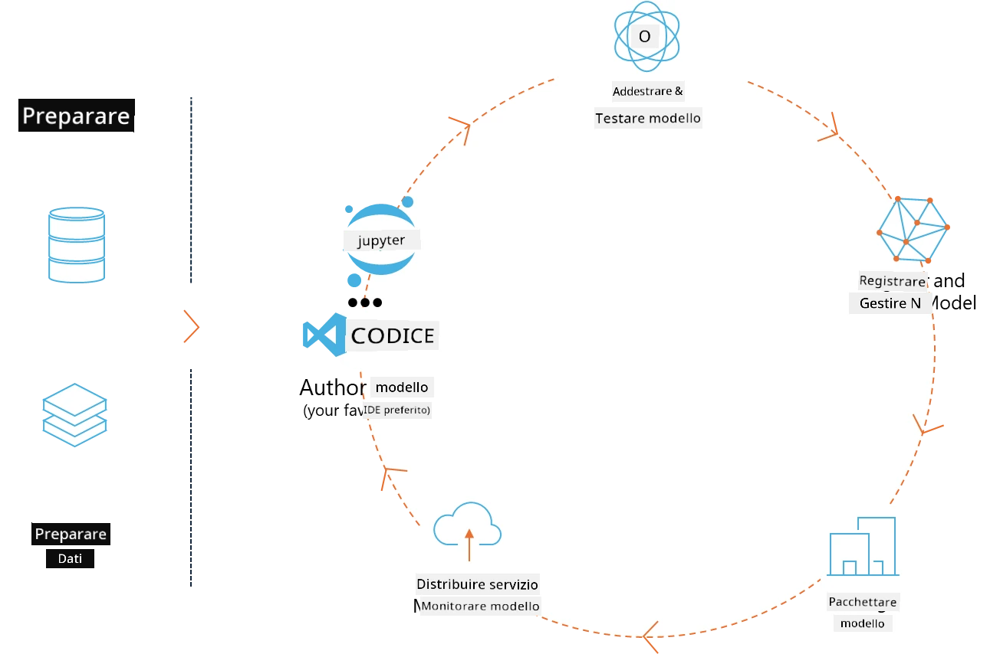
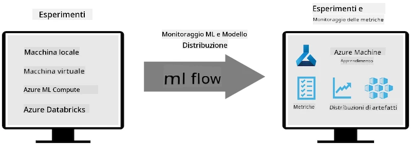
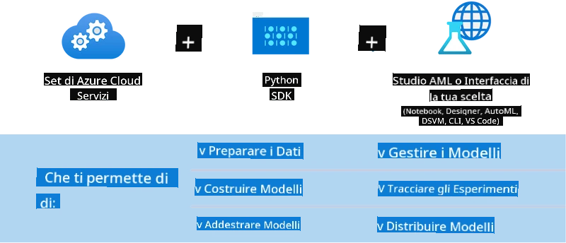

# MLflow

[MLflow](https://mlflow.org/) è una piattaforma open-source progettata per gestire l'intero ciclo di vita del machine learning.



MLFlow viene utilizzato per gestire il ciclo di vita del ML, inclusi sperimentazione, riproducibilità, deployment e un registro centrale dei modelli. Attualmente MLflow offre quattro componenti.

- **MLflow Tracking:** Registra e interroga esperimenti, codice, configurazioni dati e risultati.
- **MLflow Projects:** Impacchetta il codice di data science in un formato che permette di riprodurre le esecuzioni su qualsiasi piattaforma.
- **Mlflow Models:** Distribuisce modelli di machine learning in diversi ambienti di serving.
- **Model Registry:** Conserva, annota e gestisce i modelli in un repository centrale.

Include funzionalità per tracciare esperimenti, impacchettare codice in esecuzioni riproducibili e condividere e distribuire modelli. MLFlow è integrato in Databricks e supporta diverse librerie ML, risultando agnostico rispetto alla libreria utilizzata. Può essere usato con qualsiasi libreria di machine learning e in qualsiasi linguaggio di programmazione, grazie a un’API REST e a una CLI per comodità.



Le caratteristiche principali di MLFlow includono:

- **Experiment Tracking:** Registra e confronta parametri e risultati.
- **Model Management:** Distribuisce modelli su varie piattaforme di serving e inferenza.
- **Model Registry:** Gestisce in modo collaborativo il ciclo di vita dei modelli MLflow, inclusi versioning e annotazioni.
- **Projects:** Impacchetta codice ML per condivisione o uso in produzione.

MLFlow supporta anche il ciclo MLOps, che include la preparazione dei dati, la registrazione e gestione dei modelli, l’impacchettamento dei modelli per l’esecuzione, il deployment dei servizi e il monitoraggio dei modelli. Mira a semplificare il passaggio da un prototipo a un flusso di lavoro di produzione, specialmente in ambienti cloud e edge.

## Scenario E2E - Costruire un wrapper e usare Phi-3 come modello MLFlow

In questo esempio E2E dimostreremo due approcci diversi per costruire un wrapper attorno al modello di linguaggio piccolo Phi-3 (SLM) e poi eseguirlo come modello MLFlow, sia localmente che nel cloud, ad esempio in Azure Machine Learning workspace.



| Progetto | Descrizione | Posizione |
| ------------ | ----------- | -------- |
| Transformer Pipeline | Transformer Pipeline è l’opzione più semplice per costruire un wrapper se vuoi usare un modello HuggingFace con la flavour sperimentale transformers di MLFlow. | [**TransformerPipeline.ipynb**](../../../../../../code/06.E2E/E2E_Phi-3-MLflow_TransformerPipeline.ipynb) |
| Custom Python Wrapper | Al momento della scrittura, la transformer pipeline non supportava la generazione di wrapper MLFlow per modelli HuggingFace in formato ONNX, nemmeno con il pacchetto Python sperimentale optimum. In casi come questo, puoi costruire un wrapper Python personalizzato per MLFlow. | [**CustomPythonWrapper.ipynb**](../../../../../../code/06.E2E/E2E_Phi-3-MLflow_CustomPythonWrapper.ipynb) |

## Progetto: Transformer Pipeline

1. Avrai bisogno dei pacchetti Python rilevanti da MLFlow e HuggingFace:

    ``` Python
    import mlflow
    import transformers
    ```

2. Successivamente, dovresti inizializzare una transformer pipeline facendo riferimento al modello Phi-3 target nel registro HuggingFace. Come si vede dalla scheda modello di _Phi-3-mini-4k-instruct_, il suo compito è di tipo “Text Generation”:

    ``` Python
    pipeline = transformers.pipeline(
        task = "text-generation",
        model = "microsoft/Phi-3-mini-4k-instruct"
    )
    ```

3. Ora puoi salvare la transformer pipeline del modello Phi-3 in formato MLFlow e fornire dettagli aggiuntivi come il percorso degli artefatti target, configurazioni specifiche del modello e tipo di API di inferenza:

    ``` Python
    model_info = mlflow.transformers.log_model(
        transformers_model = pipeline,
        artifact_path = "phi3-mlflow-model",
        model_config = model_config,
        task = "llm/v1/chat"
    )
    ```

## Progetto: Custom Python Wrapper

1. Qui possiamo utilizzare l’API generate() di [ONNX Runtime](https://github.com/microsoft/onnxruntime-genai) di Microsoft per l’inferenza del modello ONNX e la codifica/decodifica dei token. Devi scegliere il pacchetto _onnxruntime_genai_ per il tuo compute target, con l’esempio qui sotto che punta alla CPU:

    ``` Python
    import mlflow
    from mlflow.models import infer_signature
    import onnxruntime_genai as og
    ```

1. La nostra classe personalizzata implementa due metodi: _load_context()_ per inizializzare il **modello ONNX** di Phi-3 Mini 4K Instruct, i **parametri del generatore** e il **tokenizer**; e _predict()_ per generare i token di output per il prompt fornito:

    ``` Python
    class Phi3Model(mlflow.pyfunc.PythonModel):
        def load_context(self, context):
            # Retrieving model from the artifacts
            model_path = context.artifacts["phi3-mini-onnx"]
            model_options = {
                 "max_length": 300,
                 "temperature": 0.2,         
            }
        
            # Defining the model
            self.phi3_model = og.Model(model_path)
            self.params = og.GeneratorParams(self.phi3_model)
            self.params.set_search_options(**model_options)
            
            # Defining the tokenizer
            self.tokenizer = og.Tokenizer(self.phi3_model)
    
        def predict(self, context, model_input):
            # Retrieving prompt from the input
            prompt = model_input["prompt"][0]
            self.params.input_ids = self.tokenizer.encode(prompt)
    
            # Generating the model's response
            response = self.phi3_model.generate(self.params)
    
            return self.tokenizer.decode(response[0][len(self.params.input_ids):])
    ```

1. Ora puoi usare la funzione _mlflow.pyfunc.log_model()_ per generare un wrapper Python personalizzato (in formato pickle) per il modello Phi-3, insieme al modello ONNX originale e alle dipendenze richieste:

    ``` Python
    model_info = mlflow.pyfunc.log_model(
        artifact_path = artifact_path,
        python_model = Phi3Model(),
        artifacts = {
            "phi3-mini-onnx": "cpu_and_mobile/cpu-int4-rtn-block-32-acc-level-4",
        },
        input_example = input_example,
        signature = infer_signature(input_example, ["Run"]),
        extra_pip_requirements = ["torch", "onnxruntime_genai", "numpy"],
    )
    ```

## Signature dei modelli MLFlow generati

1. Nel passo 3 del progetto Transformer Pipeline sopra, abbiamo impostato il task del modello MLFlow a “_llm/v1/chat_”. Questa istruzione genera un wrapper API del modello, compatibile con l’API Chat di OpenAI come mostrato di seguito:

    ``` Python
    {inputs: 
      ['messages': Array({content: string (required), name: string (optional), role: string (required)}) (required), 'temperature': double (optional), 'max_tokens': long (optional), 'stop': Array(string) (optional), 'n': long (optional), 'stream': boolean (optional)],
    outputs: 
      ['id': string (required), 'object': string (required), 'created': long (required), 'model': string (required), 'choices': Array({finish_reason: string (required), index: long (required), message: {content: string (required), name: string (optional), role: string (required)} (required)}) (required), 'usage': {completion_tokens: long (required), prompt_tokens: long (required), total_tokens: long (required)} (required)],
    params: 
      None}
    ```

1. Di conseguenza, puoi inviare il tuo prompt nel seguente formato:

    ``` Python
    messages = [{"role": "user", "content": "What is the capital of Spain?"}]
    ```

1. Poi, usa un post-processing compatibile con OpenAI API, ad esempio _response[0][‘choices’][0][‘message’][‘content’]_, per rendere il tuo output più leggibile, come questo:

    ``` JSON
    Question: What is the capital of Spain?
    
    Answer: The capital of Spain is Madrid. It is the largest city in Spain and serves as the political, economic, and cultural center of the country. Madrid is located in the center of the Iberian Peninsula and is known for its rich history, art, and architecture, including the Royal Palace, the Prado Museum, and the Plaza Mayor.
    
    Usage: {'prompt_tokens': 11, 'completion_tokens': 73, 'total_tokens': 84}
    ```

1. Nel passo 3 del progetto Custom Python Wrapper sopra, permettiamo al pacchetto MLFlow di generare la signature del modello a partire da un esempio di input fornito. La signature del nostro wrapper MLFlow sarà simile a questa:

    ``` Python
    {inputs: 
      ['prompt': string (required)],
    outputs: 
      [string (required)],
    params: 
      None}
    ```

1. Quindi, il nostro prompt dovrà contenere la chiave dizionario "prompt", simile a questa:

    ``` Python
    {"prompt": "<|system|>You are a stand-up comedian.<|end|><|user|>Tell me a joke about atom<|end|><|assistant|>",}
    ```

1. L’output del modello sarà poi fornito in formato stringa:

    ``` JSON
    Alright, here's a little atom-related joke for you!
    
    Why don't electrons ever play hide and seek with protons?
    
    Because good luck finding them when they're always "sharing" their electrons!
    
    Remember, this is all in good fun, and we're just having a little atomic-level humor!
    ```

**Disclaimer**:  
Questo documento è stato tradotto utilizzando il servizio di traduzione automatica [Co-op Translator](https://github.com/Azure/co-op-translator). Pur impegnandoci per garantire l’accuratezza, si prega di notare che le traduzioni automatiche possono contenere errori o imprecisioni. Il documento originale nella sua lingua nativa deve essere considerato la fonte autorevole. Per informazioni critiche, si raccomanda una traduzione professionale effettuata da un umano. Non ci assumiamo alcuna responsabilità per eventuali malintesi o interpretazioni errate derivanti dall’uso di questa traduzione.