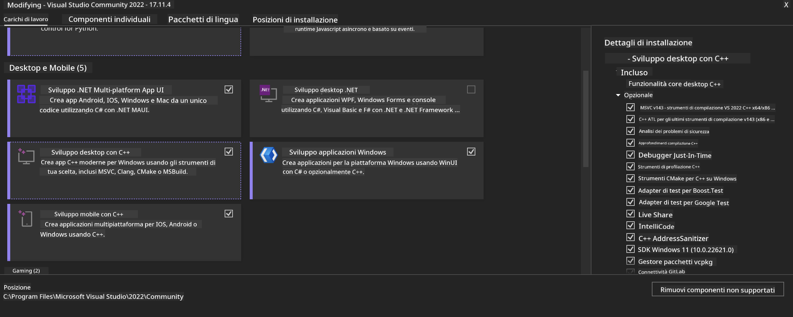
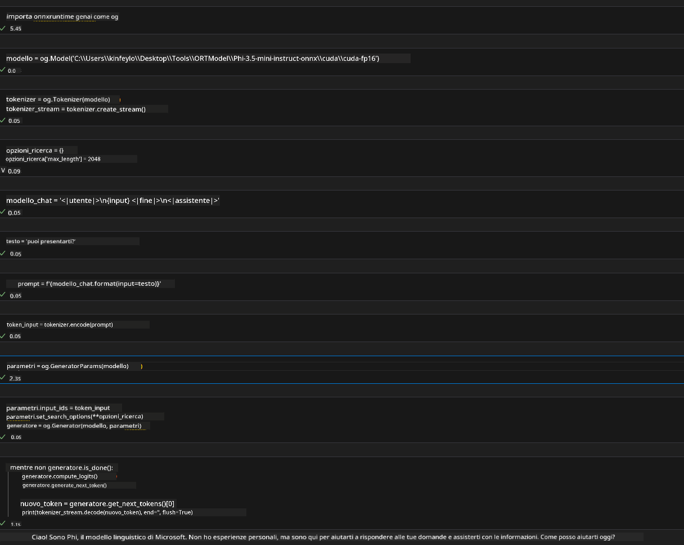
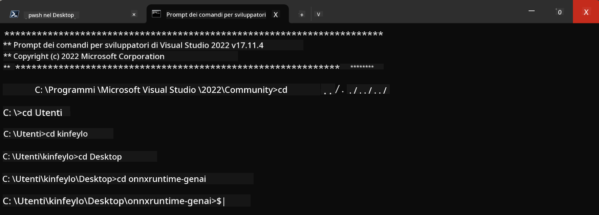

<!--
CO_OP_TRANSLATOR_METADATA:
{
  "original_hash": "b066fc29c1b2129df84e027cb75119ce",
  "translation_date": "2025-05-09T18:43:03+00:00",
  "source_file": "md/02.Application/01.TextAndChat/Phi3/ORTWindowGPUGuideline.md",
  "language_code": "it"
}
-->
# **Linee guida per OnnxRuntime GenAI Windows GPU**

Questa guida fornisce i passaggi per configurare e utilizzare ONNX Runtime (ORT) con GPU su Windows. È pensata per aiutarti a sfruttare l’accelerazione GPU per i tuoi modelli, migliorando prestazioni ed efficienza.

Il documento offre indicazioni su:

- Configurazione dell’ambiente: Istruzioni per installare le dipendenze necessarie come CUDA, cuDNN e ONNX Runtime.
- Configurazione: Come impostare l’ambiente e ONNX Runtime per utilizzare efficacemente le risorse GPU.
- Consigli di ottimizzazione: Suggerimenti su come ottimizzare le impostazioni GPU per ottenere le migliori prestazioni.

### **1. Python 3.10.x /3.11.8**

   ***Nota*** Si consiglia di usare [miniforge](https://github.com/conda-forge/miniforge/releases/latest/download/Miniforge3-Windows-x86_64.exe) come ambiente Python

   ```bash

   conda create -n pydev python==3.11.8

   conda activate pydev

   ```

   ***Promemoria*** Se hai installato qualche libreria Python ONNX, disinstallala

### **2. Installa CMake con winget**

   ```bash

   winget install -e --id Kitware.CMake

   ```

### **3. Installa Visual Studio 2022 - Desktop Development con C++**

   ***Nota*** Se non vuoi compilare puoi saltare questo passaggio



### **4. Installa il driver NVIDIA**

1. **Driver GPU NVIDIA**  [https://www.nvidia.com/en-us/drivers/](https://www.nvidia.com/en-us/drivers/)

2. **NVIDIA CUDA 12.4** [https://developer.nvidia.com/cuda-12-4-0-download-archive](https://developer.nvidia.com/cuda-12-4-0-download-archive)

3. **NVIDIA CUDNN 9.4**  [https://developer.nvidia.com/cudnn-downloads](https://developer.nvidia.com/cudnn-downloads)

***Promemoria*** Usa le impostazioni predefinite durante l’installazione

### **5. Configura l’ambiente NVIDIA**

Copia le cartelle lib, bin e include di NVIDIA CUDNN 9.4 dentro le corrispondenti cartelle di NVIDIA CUDA 12.4

- copia i file da *'C:\Program Files\NVIDIA\CUDNN\v9.4\bin\12.6'* a  *'C:\Program Files\NVIDIA GPU Computing Toolkit\CUDA\v12.4\bin'*

- copia i file da *'C:\Program Files\NVIDIA\CUDNN\v9.4\include\12.6'* a  *'C:\Program Files\NVIDIA GPU Computing Toolkit\CUDA\v12.4\include'*

- copia i file da *'C:\Program Files\NVIDIA\CUDNN\v9.4\lib\12.6'* a  *'C:\Program Files\NVIDIA GPU Computing Toolkit\CUDA\v12.4\lib\x64'*

### **6. Scarica Phi-3.5-mini-instruct-onnx**

   ```bash

   winget install -e --id Git.Git

   winget install -e --id GitHub.GitLFS

   git lfs install

   git clone https://huggingface.co/microsoft/Phi-3.5-mini-instruct-onnx

   ```

### **7. Esecuzione di InferencePhi35Instruct.ipynb**

   Apri il [Notebook](../../../../../../code/09.UpdateSamples/Aug/ortgpu-phi35-instruct.ipynb) ed eseguilo



### **8. Compilazione di ORT GenAI GPU**

   ***Nota*** 
   
   1. Disinstalla prima tutte le librerie relative a onnx, onnxruntime e onnxruntime-genai

   ```bash

   pip list 
   
   ```

   Poi disinstalla tutte le librerie onnxruntime, ad esempio:

   ```bash

   pip uninstall onnxruntime

   pip uninstall onnxruntime-genai

   pip uninstall onnxruntume-genai-cuda
   
   ```

   2. Controlla il supporto per l’estensione di Visual Studio

   Verifica che in C:\Program Files\NVIDIA GPU Computing Toolkit\CUDA\v12.4\extras sia presente la cartella C:\Program Files\NVIDIA GPU Computing Toolkit\CUDA\v12.4\extras\visual_studio_integration. 
   
   Se non la trovi, controlla nelle altre cartelle del toolkit CUDA e copia la cartella visual_studio_integration con i suoi contenuti in C:\Program Files\NVIDIA GPU Computing Toolkit\CUDA\v12.4\extras\visual_studio_integration

   - Se non vuoi compilare puoi saltare questo passaggio

   ```bash

   git clone https://github.com/microsoft/onnxruntime-genai

   ```

   - Scarica [https://github.com/microsoft/onnxruntime/releases/download/v1.19.2/onnxruntime-win-x64-gpu-1.19.2.zip](https://github.com/microsoft/onnxruntime/releases/download/v1.19.2/onnxruntime-win-x64-gpu-1.19.2.zip)

   - Estrai onnxruntime-win-x64-gpu-1.19.2.zip, rinominalo in **ort** e copia la cartella ort dentro onnxruntime-genai

   - Usando Windows Terminal, apri Developer Command Prompt per VS 2022 e vai nella cartella onnxruntime-genai



   - Compilalo con il tuo ambiente Python

   ```bash

   cd onnxruntime-genai

   python build.py --use_cuda  --cuda_home "C:\Program Files\NVIDIA GPU Computing Toolkit\CUDA\v12.4" --config Release
 

   cd build/Windows/Release/Wheel

   pip install .whl

   ```

**Disclaimer**:  
Questo documento è stato tradotto utilizzando il servizio di traduzione automatica AI [Co-op Translator](https://github.com/Azure/co-op-translator). Pur impegnandoci per l'accuratezza, si prega di notare che le traduzioni automatiche possono contenere errori o inesattezze. Il documento originale nella sua lingua nativa deve essere considerato la fonte autorevole. Per informazioni critiche, si raccomanda una traduzione professionale umana. Non siamo responsabili per eventuali malintesi o interpretazioni errate derivanti dall'uso di questa traduzione.