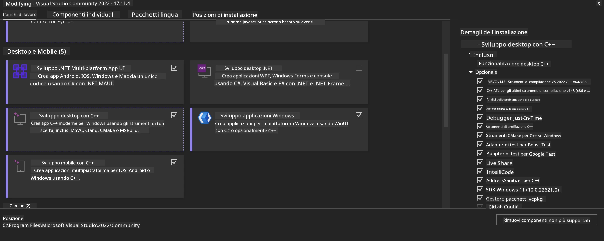
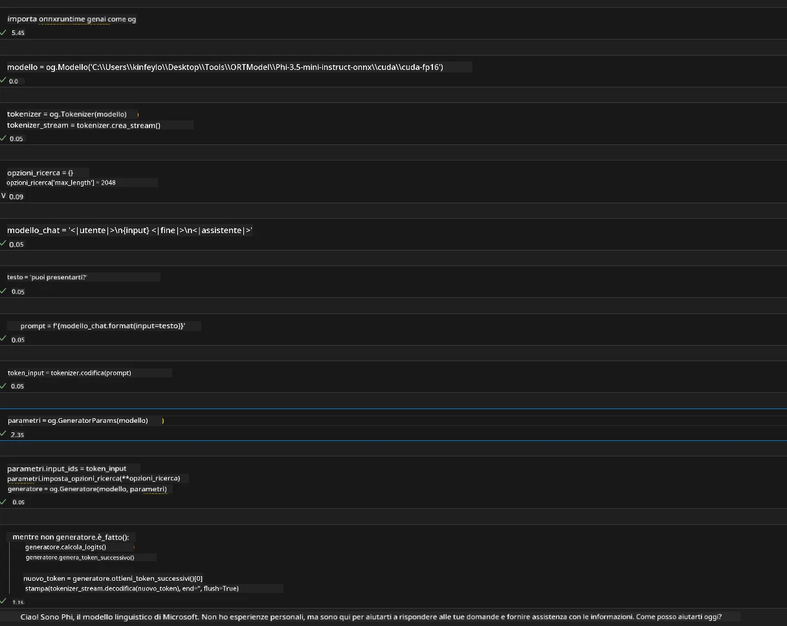
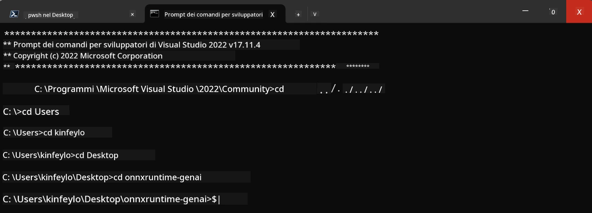

# **Linee guida per OnnxRuntime GenAI Windows GPU**

Questa linea guida fornisce i passaggi per configurare e utilizzare ONNX Runtime (ORT) con GPU su Windows. È progettata per aiutarti a sfruttare l'accelerazione GPU per i tuoi modelli, migliorando prestazioni ed efficienza.

Il documento fornisce indicazioni su:

- Configurazione dell'ambiente: Istruzioni per installare le dipendenze necessarie come CUDA, cuDNN e ONNX Runtime.
- Configurazione: Come configurare l'ambiente e ONNX Runtime per utilizzare efficacemente le risorse GPU.
- Consigli di ottimizzazione: Suggerimenti su come ottimizzare le impostazioni della GPU per prestazioni ottimali.

### **1. Python 3.10.x /3.11.8**

   ***Nota*** Si consiglia di utilizzare [miniforge](https://github.com/conda-forge/miniforge/releases/latest/download/Miniforge3-Windows-x86_64.exe) come ambiente Python

   ```bash

   conda create -n pydev python==3.11.8

   conda activate pydev

   ```

   ***Promemoria*** Se hai installato qualche libreria Python ONNX, disinstallala

### **2. Installare CMake con winget**


   ```bash

   winget install -e --id Kitware.CMake

   ```

### **3. Installare Visual Studio 2022 - sviluppo desktop con C++**

   ***Nota*** Se non vuoi compilare puoi saltare questo passaggio




### **4. Installare il driver NVIDIA**

1. **Driver GPU NVIDIA**  [https://www.nvidia.com/en-us/drivers/](https://www.nvidia.com/en-us/drivers/)

2. **NVIDIA CUDA 12.4** [https://developer.nvidia.com/cuda-12-4-0-download-archive](https://developer.nvidia.com/cuda-12-4-0-download-archive)

3. **NVIDIA CUDNN 9.4**  [https://developer.nvidia.com/cudnn-downloads](https://developer.nvidia.com/cudnn-downloads)

***Promemoria*** Utilizza le impostazioni predefinite nel flusso di installazione 

### **5. Configurare l'ambiente NVIDIA**

Copia le librerie NVIDIA CUDNN 9.4 lib, bin, include nelle corrispondenti cartelle di NVIDIA CUDA 12.4 lib, bin, include

- copia i file da *'C:\Program Files\NVIDIA\CUDNN\v9.4\bin\12.6'* a  *'C:\Program Files\NVIDIA GPU Computing Toolkit\CUDA\v12.4\bin*

- copia i file da *'C:\Program Files\NVIDIA\CUDNN\v9.4\include\12.6'* a  *'C:\Program Files\NVIDIA GPU Computing Toolkit\CUDA\v12.4\include*

- copia i file da *'C:\Program Files\NVIDIA\CUDNN\v9.4\lib\12.6'* a  *'C:\Program Files\NVIDIA GPU Computing Toolkit\CUDA\v12.4\lib\x64'*


### **6. Scaricare Phi-3.5-mini-instruct-onnx**


   ```bash

   winget install -e --id Git.Git

   winget install -e --id GitHub.GitLFS

   git lfs install

   git clone https://huggingface.co/microsoft/Phi-3.5-mini-instruct-onnx

   ```

### **7. Eseguire InferencePhi35Instruct.ipynb**

   Apri il [Notebook](../../../../code/09.UpdateSamples/Aug/ortgpu-phi35-instruct.ipynb) ed esegui 





### **8. Compilare ORT GenAI GPU**


   ***Nota*** 
   
   1. Disinstalla prima tutte le librerie correlate a onnx, onnxruntime e onnxruntime-genai

   
   ```bash

   pip list 
   
   ```

   Poi disinstalla tutte le librerie onnxruntime, cioè 


   ```bash

   pip uninstall onnxruntime

   pip uninstall onnxruntime-genai

   pip uninstall onnxruntume-genai-cuda
   
   ```

   2. Controlla il supporto dell'estensione di Visual Studio 

   Verifica in C:\Program Files\NVIDIA GPU Computing Toolkit\CUDA\v12.4\extras che sia presente la cartella C:\Program Files\NVIDIA GPU Computing Toolkit\CUDA\v12.4\extras\visual_studio_integration. 
   
   Se non presente, controlla altre cartelle del toolkit CUDA e copia la cartella visual_studio_integration e il suo contenuto in C:\Program Files\NVIDIA GPU Computing Toolkit\CUDA\v12.4\extras\visual_studio_integration


   - Se non vuoi compilare puoi saltare questo passaggio


   ```bash

   git clone https://github.com/microsoft/onnxruntime-genai

   ```

   - Scarica [https://github.com/microsoft/onnxruntime/releases/download/v1.19.2/onnxruntime-win-x64-gpu-1.19.2.zip](https://github.com/microsoft/onnxruntime/releases/download/v1.19.2/onnxruntime-win-x64-gpu-1.19.2.zip)

   - Estrai onnxruntime-win-x64-gpu-1.19.2.zip, rinominalo in **ort**, copia la cartella ort in onnxruntime-genai

   - Usando Windows Terminal, apri Developer Command Prompt per VS 2022 e vai in onnxruntime-genai 



   - Compilalo con il tuo ambiente python

   
   ```bash

   cd onnxruntime-genai

   python build.py --use_cuda  --cuda_home "C:\Program Files\NVIDIA GPU Computing Toolkit\CUDA\v12.4" --config Release
 

   cd build/Windows/Release/Wheel

   pip install .whl

   ```

---

<!-- CO-OP TRANSLATOR DISCLAIMER START -->
**Disclaimer**:
Questo documento è stato tradotto utilizzando il servizio di traduzione AI [Co-op Translator](https://github.com/Azure/co-op-translator). Sebbene ci impegniamo per garantire la precisione, si prega di notare che le traduzioni automatizzate possono contenere errori o imprecisioni. Il documento originale nella sua lingua nativa deve essere considerato la fonte autorevole. Per informazioni critiche, si raccomanda una traduzione professionale effettuata da un essere umano. Non siamo responsabili per eventuali malintesi o interpretazioni errate derivanti dall’uso di questa traduzione.
<!-- CO-OP TRANSLATOR DISCLAIMER END -->