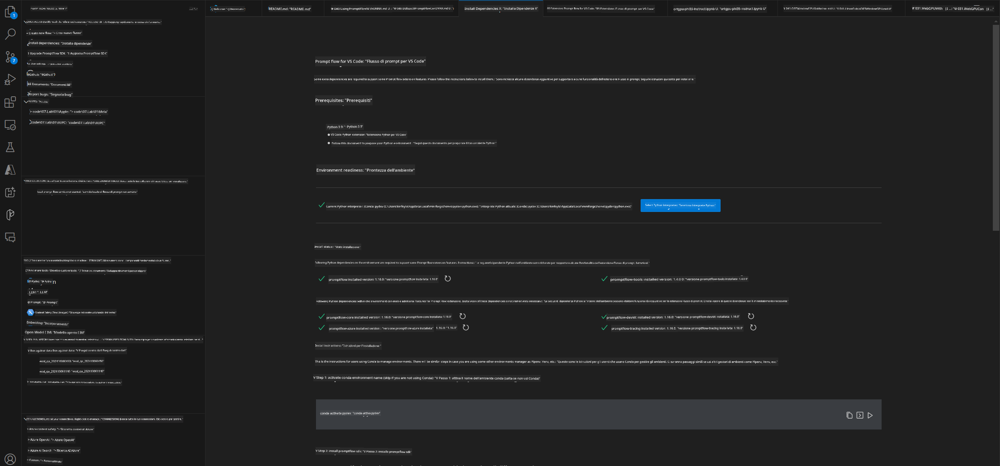
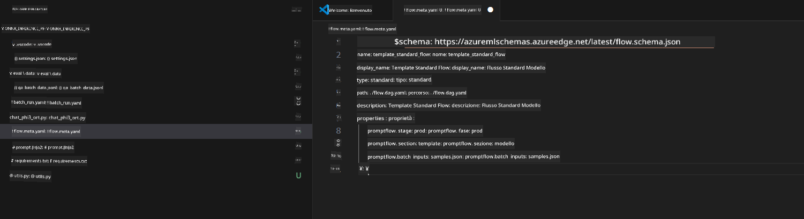
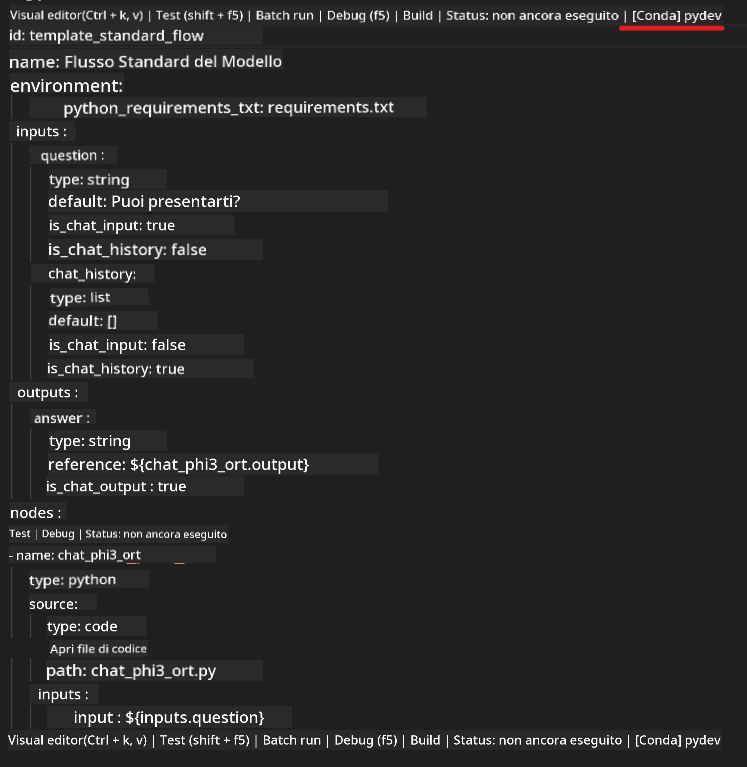
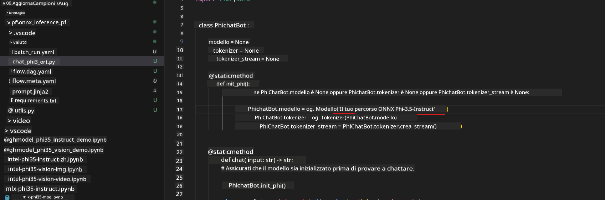
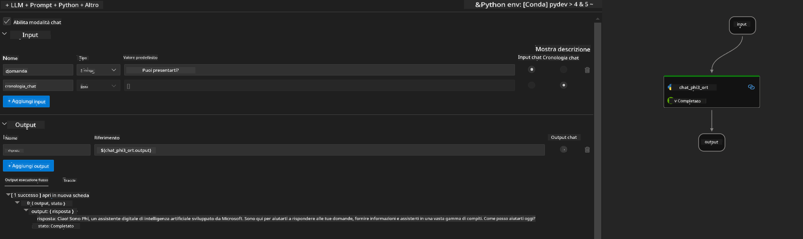
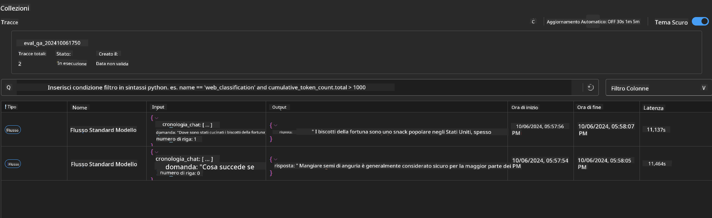

<!--
CO_OP_TRANSLATOR_METADATA:
{
  "original_hash": "92e7dac1e5af0dd7c94170fdaf6860fe",
  "translation_date": "2025-05-09T18:52:26+00:00",
  "source_file": "md/02.Application/01.TextAndChat/Phi3/UsingPromptFlowWithONNX.md",
  "language_code": "it"
}
-->
# Utilizzo della GPU Windows per creare una soluzione Prompt flow con Phi-3.5-Instruct ONNX

Il documento seguente è un esempio di come utilizzare PromptFlow con ONNX (Open Neural Network Exchange) per sviluppare applicazioni AI basate sui modelli Phi-3.

PromptFlow è una suite di strumenti di sviluppo progettata per semplificare il ciclo di sviluppo end-to-end di applicazioni AI basate su LLM (Large Language Model), dalla ideazione e prototipazione fino a test e valutazione.

Integrando PromptFlow con ONNX, gli sviluppatori possono:

- Ottimizzare le prestazioni del modello: sfruttare ONNX per un'inferenza e un deployment efficienti del modello.
- Semplificare lo sviluppo: utilizzare PromptFlow per gestire il flusso di lavoro e automatizzare le attività ripetitive.
- Migliorare la collaborazione: facilitare una migliore collaborazione tra i membri del team offrendo un ambiente di sviluppo unificato.

**Prompt flow** è una suite di strumenti di sviluppo progettata per semplificare l’intero ciclo di sviluppo di applicazioni AI basate su LLM, dall’ideazione, prototipazione, test, valutazione fino al deployment in produzione e monitoraggio. Rende molto più semplice l’ingegneria dei prompt e ti permette di costruire app LLM con qualità da produzione.

Prompt flow può connettersi a OpenAI, Azure OpenAI Service e modelli personalizzabili (Huggingface, LLM/SLM locali). L’obiettivo è distribuire il modello ONNX quantizzato di Phi-3.5 nelle applicazioni locali. Prompt flow può aiutarci a pianificare meglio il nostro business e completare soluzioni locali basate su Phi-3.5. In questo esempio, combineremo ONNX Runtime GenAI Library per realizzare la soluzione Prompt flow basata su GPU Windows.

## **Installazione**

### **ONNX Runtime GenAI per GPU Windows**

Consulta questa guida per configurare ONNX Runtime GenAI per GPU Windows [clicca qui](./ORTWindowGPUGuideline.md)

### **Configurare Prompt flow in VSCode**

1. Installa l’estensione Prompt flow per VS Code


2. Dopo aver installato l’estensione Prompt flow per VS Code, clicca sull’estensione e scegli **Installation dependencies** seguendo questa guida per installare il Prompt flow SDK nel tuo ambiente



3. Scarica il [Codice di esempio](../../../../../../code/09.UpdateSamples/Aug/pf/onnx_inference_pf) e apri questo esempio con VS Code



4. Apri **flow.dag.yaml** per selezionare il tuo ambiente Python



   Apri **chat_phi3_ort.py** per modificare la posizione del modello Phi-3.5-instruct ONNX



5. Esegui il tuo prompt flow per il test

Apri **flow.dag.yaml** e clicca sull’editor visuale


dopo aver cliccato, esegui per testare



1. Puoi eseguire batch nel terminale per verificare ulteriori risultati


```bash

pf run create --file batch_run.yaml --stream --name 'Your eval qa name'    

```

Puoi controllare i risultati nel browser predefinito




**Disclaimer**:  
Questo documento è stato tradotto utilizzando il servizio di traduzione automatica AI [Co-op Translator](https://github.com/Azure/co-op-translator). Pur impegnandoci per l’accuratezza, si prega di notare che le traduzioni automatiche possono contenere errori o inesattezze. Il documento originale nella sua lingua nativa deve essere considerato la fonte autorevole. Per informazioni critiche, si raccomanda una traduzione professionale effettuata da un umano. Non ci assumiamo alcuna responsabilità per eventuali malintesi o interpretazioni errate derivanti dall’uso di questa traduzione.